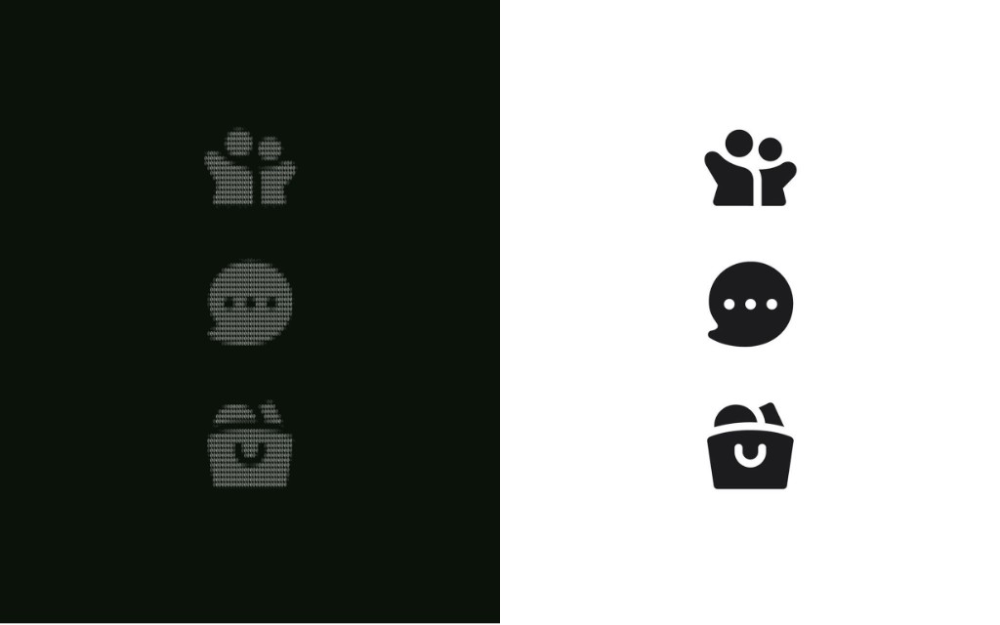

# ASCII Lab

Uma engine modular para converter imagens e animações em ASCII com controle técnico sobre geometria, luminância, caracteres, cor, dithering e estabilidade temporal.

O projeto combina uma biblioteca TypeScript, um Studio visual em Next.js e uma CLI. A arquitetura mantém o processamento desacoplado da interface para que conversores, renderizadores e exportadores possam evoluir de forma independente.

## Antes × depois



> **À direita:** imagem original. **À esquerda:** resultado ASCII, preservando silhueta, proporção e leitura visual.

## Principais recursos

- Conversão de PNG, JPG, WEBP, GIF, SVG, Canvas e conteúdo da área de transferência.
- Preservação de aspect ratio considerando as dimensões reais da célula ASCII.
- Ajustes de brilho, contraste, gamma, exposição, níveis, nitidez e inversão.
- Mapeamento por luminância, densidade, bordas ou modo híbrido.
- Charsets e presets configuráveis.
- Dithering ordered, Bayer e Floyd–Steinberg serpentino.
- Cores RGB, ANSI e paletas reduzidas.
- Preview em tempo real e renderização na resolução ASCII definida.
- Exportação TXT, JSON, HTML, SVG, PNG, ANSI, Markdown, GIF, ZIP e sprite sheet.
- SDK, CLI, sistema de plugins, node graph e ferramentas de benchmark.

## GIFs com coerência temporal

A ASCII Lab não trata uma animação apenas como uma coleção de imagens independentes. A **Temporal ASCII Pipeline** analisa a sequência para reduzir flickering, mudanças desnecessárias de caracteres e o efeito de “chuvisco” causado pelo dithering instável.

O fluxo temporal inclui:

- suavização entre `N-1`, `N` e `N+1`;
- persistência de caracteres por histerese;
- motion map por célula;
- reutilização de regiões estáticas;
- dithering temporal determinístico;
- redução de ruído e sharpen restrito ao movimento;
- adaptive FPS e preparação de keyframes;
- prioridade opcional para regiões de interesse.

Detalhes: [`docs/architecture/TEMPORAL-ASCII-PIPELINE.md`](docs/architecture/TEMPORAL-ASCII-PIPELINE.md).

## Início rápido

Requisitos:

- Node.js compatível com Next.js 15;
- npm.

```bash
git clone git@github.com:GaabDevWeb/ASCII-LAB.git
cd ASCII-LAB
npm install
npm run dev
```

Abra [http://localhost:3000](http://localhost:3000) para acessar o Studio.

Caso o Turbopack apresente incompatibilidade no seu ambiente:

```bash
npm run dev:webpack
```

## Studio

A rota `/` abre o ASCII Engine Studio, que centraliza:

- conversão e refinamento de imagens;
- conversão e preview de GIFs;
- controles da pipeline temporal;
- presets, temas e receitas;
- ferramentas de edição e composição de cena;
- playground, métricas e benchmarks;
- importação e exportação dos resultados.

## SDK

O ponto de entrada público está em `src/features/ascii-engine`:

```ts
import { createAsciiEngine } from "@/features/ascii-engine";

const engine = createAsciiEngine({ themeId: "root-os" });

engine.document;
engine.storage;
engine.editor;
engine.converters;
engine.nodes;
engine.plugins;
engine.exporters;
```

Consulte a referência em [`docs/api/ASCII-ENGINE-SDK.md`](docs/api/ASCII-ENGINE-SDK.md).

## CLI

```bash
npm run ascii-engine -- info
npm run ascii-engine -- benchmark
npm run ascii-engine -- convert <input> -o <output>
```

## Arquitetura

```text
src/
├── app/                          # entrada Next.js e metadados
├── studio/                       # interface do ASCII Engine Studio
├── features/
│   ├── ascii-engine/             # SDK, documentos, cena, CLI e extensões
│   └── ascii-interaction/
│       ├── image-pipeline/       # pipeline para imagens estáticas
│       ├── animation-pipeline/   # GIF, playback, cache e exportação
│       │   └── TemporalPipeline/ # coerência temporal entre frames
│       ├── geometry/             # aspect ratio e dimensões de saída
│       └── grid/                 # representação e operações da matriz
├── hooks/                        # integração reativa
└── types/                        # declarações compartilhadas
```

Princípios:

1. A pipeline de imagem estática não contém estado temporal.
2. Processamento e UI permanecem desacoplados.
3. Módulos comuns são compartilhados sem duplicar regras de conversão.
4. Conversores e exportadores usam contratos extensíveis.
5. Operações custosas devem ser incrementais e evitar bloquear a interface.

## Qualidade e validação

```bash
npm run typecheck
npm run lint
npm test
npm run build
```

Para executar todos os gates:

```bash
npm run validate
```

Benchmark da conversão:

```bash
npm run bench:conversion
```

## Scripts

| Comando | Finalidade |
| --- | --- |
| `npm run dev` | Inicia o Studio com Turbopack |
| `npm run dev:webpack` | Inicia o Studio com Webpack |
| `npm run build` | Gera o build de produção |
| `npm run start` | Serve o build de produção |
| `npm run clean` | Remove o cache `.next` |
| `npm run typecheck` | Valida os tipos TypeScript |
| `npm run lint` | Executa o ESLint |
| `npm test` | Executa os testes com Vitest |
| `npm run validate` | Typecheck, lint, testes e build |
| `npm run bench:conversion` | Executa o benchmark de conversão |
| `npm run ascii-engine -- ...` | Executa a CLI |

## Documentação

- [Arquitetura da plataforma](docs/architecture/ASCII-ENGINE-PLATFORM.md)
- [Auditoria de qualidade da conversão](docs/architecture/ASCII-CONVERSION-AUDIT.md)
- [Pipeline temporal](docs/architecture/TEMPORAL-ASCII-PIPELINE.md)
- [Auditoria de aspect ratio](docs/architecture/ASPECT-RATIO-AUDIT.md)
- [Referência do SDK](docs/api/ASCII-ENGINE-SDK.md)
- [Documentação por módulo](docs/modules)

## Estado dos formatos

Conversores de imagem, GIF, SVG, Canvas e clipboard estão funcionais. Os adapters de vídeo, webcam, captura de tela e PDF existem como pontos de extensão, mas ainda não possuem decoder completo nesta versão.
