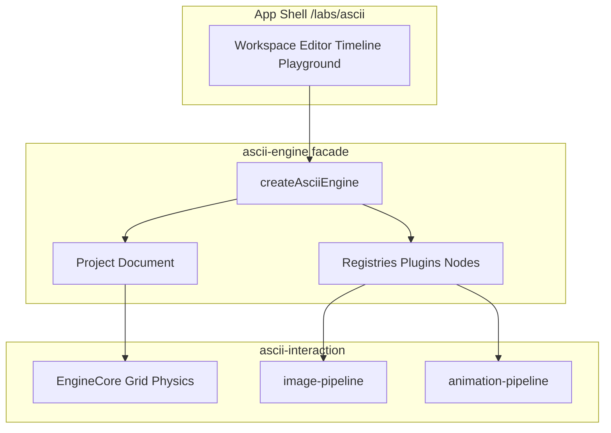
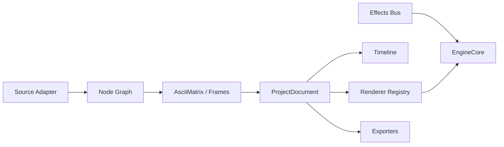

# ASCII Engine Platform — Documento Arquitetural Definitivo (SSOT)

> **Versão do documento:** 3.0.0-platform  
> **Baseline de código:** branch `ascii-engine-next` (commits V2.1 + fachada produto)  
> **Escopo desta missão documental:** arquitetura + prompt de implementação. **Zero código de produto.**  
> **Substitui como SSOT de produto:** estende [`ASCII-ENGINE-NEXT.md`](./ASCII-ENGINE-NEXT.md) e [`ASCII-ENGINE-V2.md`](./ASCII-ENGINE-V2.md); não invalida a interaction engine em [`ASCII-INTERACTION-ENGINE.md`](./ASCII-INTERACTION-ENGINE.md).  
> **Documento companheiro:** [ASCII-ENGINE-PLATFORM-IMPLEMENTATION-PROMPT.md](./ASCII-ENGINE-PLATFORM-IMPLEMENTATION-PROMPT.md) — prompt completo para o agente executor.  
> **Status:** Fonte de verdade (SSOT) do roadmap de produto Platform.

---

## 0. Visão geral

A ASCII Engine deixa de ser um laboratório/conversor e passa a ser uma **plataforma** para:

converter · editar · animar · experimentar · comparar · exportar · automatizar · integrar · partilhar ASCII.

Inspiração de UX (não de clone visual): Photoshop (tools/layers), Aseprite (pixel/timeline), DaVinci (nodes), Figma (canvas/focus), VSCode (extensões), Blender (viewport/outliner).

**Identidade:** terminal/phosphor ROOT OS como tema default; temas pluggable; Core agnóstico de UI.

**Princípio de ouro:** `ascii-interaction` = runtime de render/física; `ascii-engine` = fachada de produto/SDK; shell em `/labs/ascii` = app de referência. Extração futura = monorepo packages sem reescrever pipelines.



---

## 1. Auditoria da implementação atual (Etapa 1)

### 1.1 O que existe e está sólido

| Área | Local | Estado |
|------|-------|--------|
| Runtime influence→physics→Canvas2D | `ascii-interaction/engine`, `grid`, `physics`, `influence` | Produção |
| Image→ASCII | `image-pipeline/` | Produção; main-thread + yield |
| GIF→ASCII + ZIP/GIF/TXT | `animation-pipeline/` | Produção; 1 worker + transferables |
| Workspace zoom/pan/focus/original | `labs/ascii/workspace/` | V2.1 OK |
| Shell tabs Convert/Animate/Playground/Engine/Stats/Studio | `labs/ascii/AsciiLab.tsx` | Next OK |
| Fachada registries/stubs | `src/features/ascii-engine/*` | Esqueleto produto |
| Converters | `ascii-engine/converters` | image, gif, **svg ready**; batch stub; video/webcam/… stubs |
| SDK factory | `sdk/create-ascii-engine.ts` | Mínimo + `plugins` (P9) |
| PluginHost + charset pack | `ascii-engine/plugins/` | P9 same-origin |
| Themes/Presets/Stats/Benchmark | ascii-engine + lab panels | Parcial |
| EditorDocument + tool stubs | `ascii-engine/editor` | Histórico real; tools não pintam |
| Animator ops | duplicate/insert/remove/merge + keyframes/onion (P4) | OK |
| Node graph | `ascii-engine/nodes` NodeGraphRunner + 16 built-ins (P6) | Headless OK; UI = P7 |
| Playground | 10 ready (matrix/ripple/smoke/gravity/fire/wind/particles/explosion/water/noise) + stubs tornado/cloth | Via `emitField` |

### 1.2 Duplicações

- Slider/Toggle/Section ainda em painéis antigos vs `labs/ascii/ui/controls.tsx`
- `downloadBlob` em `animation-pipeline/utilities/zip` e `ascii-engine/browser`
- Dois sistemas de presets (física lab vs `AsciiEnginePreset`)
- Previews legados (`ImagePreviewSplit`, `AnimationPreview`) mortos no path principal

### 1.3 Acoplamentos (bloqueiam extração)

- `@/hooks/use-reduced-motion` (mitigado com prop opcional)
- `next/dynamic` em `AsciiInteractionSurface` (Hero)
- Tokens CSS ROOT OS no shell (mitigado com theme map)
- Alias `@/` em todo o feature
- Exporters acoplados a `document`/`a.click`

### 1.4 Gargalos de performance

1. Image convert no main thread (mesmo com `setTimeout(0)`)
2. `setSource` reconstrói `CharacterGrid` inteiro por frame GIF
3. Worker pool = 1 instância
4. Stats polling rAF sempre ligado no lab
5. GIF encode (`gifenc`) no main com yield

### 1.5 Lacunas vs visão plataforma

Video/webcam/PDF/screen reais · tools de edição que mutam células · node editor UI (P7; runner P6 OK) · plugin runtime (P9 OK) · AI adapters · CLI binário (P10: convert/info/benchmark) · infinite canvas · masks/blend · GPU stats.

### 1.6 Decisão de migração

**Não big-bang.** Evoluir a fachada `ascii-engine` + document model; manter `ascii-interaction` como motor. Cada fase adiciona módulos sem remover APIs públicas existentes.

---

## 2. Arquitetura Engine Platform (Etapa 2)

### 2.1 Camadas

| Camada | Pacote lógico futuro | Responsabilidade |
|--------|----------------------|------------------|
| **Core Runtime** | `@ascii-engine/core` | Grid, influence, physics, render contract, timestep |
| **Pipelines** | `@ascii-engine/core` | image + animation converters (RGBA→matrix) |
| **Document** | `@ascii-engine/core` | Project, layers, timeline, node graph, history |
| **React** | `@ascii-engine/react` | Canvas surface, hooks, reducedMotion prop |
| **Browser** | `@ascii-engine/browser` | download, clipboard, IDB, File System Access |
| **Node/CLI** | `@ascii-engine/cli` | FS adapters, commands |
| **App** | monólito `/labs/ascii` | UI profissional de referência |

### 2.2 Árvore alvo (evolução da fachada)

```
src/features/ascii-engine/
├── core/              # re-exports runtime
├── document/          # ProjectDocument (NOVO — SSOT de sessão)
├── converters/
├── rendering/         # renderer registry (Canvas2D now, WebGL later)
├── editor/
├── animator/
├── effects/           # alias playground + effect bus
├── physics/           # re-export + presets physics packs
├── workspace/
├── playground/
├── exporters/
├── importers/
├── statistics/
├── benchmark/
├── storage/           # IDB + project file format
├── themes/
├── presets/
├── nodes/             # node graph + built-in nodes
├── plugins/           # PluginHost + manifest
├── ai/                # stubs Prompt→ASCII, OCR, etc.
├── sdk/
├── cli/
└── docs/
```

### 2.3 Document model (centro da plataforma)

```ts
// Conceito normativo (não implementar agora)
ProjectDocument {
  version: "3.0"
  meta: { name, createdAt, author }
  themeId
  workspace: WorkspaceState
  layers: Layer[]
  activeLayerId
  timeline?: TimelineDocument  // se animação
  nodeGraph?: NodeGraph        // pipeline visual
  selection?: Selection
  history: HistoryStack
  assets: AssetRef[]           // source image/gif blobs refs
}
```

Tudo o que o utilizador “salva como projeto” serializa este grafo (+ assets). Formato ficheiro: `*.ascii-project.zip` (manifest + assets + optional frames).

### 2.4 Fluxo principal



---

## 3. Módulos — especificação normativa (Etapa 3)

Para cada módulo: objetivo, responsabilidade, deps, API pública, fluxo, componentes, extensibilidade, roadmap.

### 3.1 Converters

**Objetivo:** normalizar qualquer fonte para `FrameProvider` / `AsciiMatrix` / `AsciiAnimation`.

**API pública:**
- `ConverterRegistry.register(adapter)`
- `adapter.canHandle(input)`, `convert(input, options, onProgress)`
- `FrameProvider.getFrame(i)`

**Ready hoje:** image, gif, svg (rasterize → image-pipeline).  
**Stubs → implementar por fase:** video, clipboard (já UI paste), webcam, canvas, pdf, screen, **batch** (lista de ficheiros → pasta/ZIP; stub API/UI em P8).

**Extensibilidade:** plugin `converters[]` no manifest.  
**Roadmap:** ImageBitmap worker → Video decoder (WebCodecs) → Batch CLI / ZIP real.

### 3.2 Rendering

**Objetivo:** desacoplar Canvas2D atual de futuros WebGL/terminal.

**API:** `RendererRegistry`, `AsciiRenderer` (já em types), `requestFullRedraw`.  
**Componentes:** GlyphAtlas (existente), futuro WebGL atlas.  
**Roadmap:** WebGL opcional; terminal renderer para CLI `play`.

### 3.3 Editor

**Objetivo:** mutação profissional da matriz/camadas.

**Responsabilidade:** tools, selection, layers, masks, blend, history.  
**Deps:** Document, Core (opcional preview live).  
**API:** `EditorDocument` + `ToolContext { layer, selection, stroke }`.  
**Tools ready path:** Brush, Eraser, Selection, Move, Fill, Stamp, Text, Rotate, Scale, Mirror, Crop, Character Replace, Region Replace.  
**Layers:** visibility, opacity, blend modes (`normal|multiply|screen|overlay|mask`).  
**History:** command pattern (não só snapshots) para memória.  
**Roadmap F1:** brush/eraser/fill + undo commands; F2: masks/blend; F3: text/transform.

### 3.4 Workspace

**Objetivo:** canvas profissional focado no resultado ASCII.

**Já existe:** zoom presets, pan, focus, split/overlay/peek.  
**Adicionar:** infinite canvas (world coords), fullscreen, inspector/properties dock, comparison mode A/B de presets, fit-to-selection.  
**Deps:** Document, Themes.  
**Não** alterar resolução real no zoom.

### 3.5 Animator / Timeline

**Objetivo:** edição temporal de `AsciiAnimation` + keyframes de propriedades.

**Já existe:** playback, scrub, FPS, loop, duplicate/insert/remove/merge.  
**Adicionar:** keyframes (opacity, offset, charset density), interpolation (`hold|linear`), onion skin, frame cache policy UI, preview scrubber linked to node graph.  
**API:** ops imutáveis + `KeyframeTrack`.  
**Roadmap:** interpolação linear de luminance maps; depois easing.

### 3.6 Playground / Effects

**Objetivo:** efeitos interativos desacoplados da conversão.

**Ready:** matrix, ripple, smoke, gravity, fire, wind, particle-field, explosion, water, noise.  
**Stubs restantes:** tornado, cloth, rain (alias matrix), “ASCII Physics” pack.  
**Contrato:** `PlaygroundEffect.mount(InfluencerSurface) → { stop }`.  
**Bus:** Effects podem ser nodes no graph (`EffectNode`).

### 3.7 Physics

**Objetivo:** packs de física reutilizáveis (já em lab presets).  
**API:** `PhysicsPresetPack` serializável no ProjectDocument.  
**Não** duplicar `PhysicsSystem` — só configuração + influencers.

### 3.8 Presets

**Objetivo:** packs versionados partilháveis.  
**Schema v1 já existe** — evoluir para v2 incluindo `nodeGraph`, `layers`, `effectIds`.  
**Ops:** save, duplicate, export/import JSON, share URL (futuro), semver do schema.  
**Unificar** presets de física do lab no mesmo store.

### 3.9 Themes

**Objetivo:** aparência do shell, não do runtime ASCII (salvo colorMode pipeline).  
**10 temas já definidos** — manter tokens `--ae-*` + map lab.  
**Extensão:** plugins podem registar themes.

### 3.10 Exporters / Importers

**Exporters ready:** TXT, JSON, HTML, SVG, PNG, ANSI, Markdown, ZIP, GIF, TXT sequence.  
**Stubs:** PDF, Sprite Sheet.  
**Importers ready:** ZIP, TXT, JSON.  
**Stubs:** HTML, SVG, GIF-ASCII, **Project**.  
**Regra:** funções puras retornam `Blob`/`string`; download só em browser adapter.

### 3.11 Benchmark / Statistics

**Benchmark:** suite de casos (já); adicionar renderer compare, memory samples, compression ratio (TXT vs ZIP).  
**Statistics:** histogram (já); heatmap overlay; coverage; GPU (quando WebGL); frame stats timeline.  
**Painel Stats** no shell = consumidor único.

### 3.12 Storage

**Objetivo:** persistir projetos e cache.  
**Wire** `animation-storage` IndexedDB; adicionar `ProjectStore`.  
**Formato:** `name.ascii-project.zip` = manifest + `document.json` + `assets/` + optional `preview.png`.

### 3.13 Node Editor

**Objetivo:** pipeline visual DaVinci-like.

**Nodes built-in:** ImageSource, Resize, Brightness, Contrast, Gamma, Exposure, Blur, Sharpen, Edge, Threshold, Invert, Dither, CharsetMap, ColorMode, Effect, Export.  
**Grafo:** DAG; validação de tipos de porta (`ImageBuffer|RgbaFrame[]|AsciiMatrix|AsciiAnimation|Blob`).  
**Serialização:** dentro do ProjectDocument.  
**Execução:** `NodeGraphRunner` reutiliza image-pipeline steps (já desacoplados em processor). **P6:** headless runner + 16 built-ins + DAG validation/memo.  
**UI:** canvas de nodes na tab Studio (P7); headless runner primeiro.

### 3.14 Plugin System

**Manifest:**
```json
{
  "id": "my-plugin",
  "version": "1.0.0",
  "contributes": {
    "converters": [],
    "exporters": [],
    "importers": [],
    "effects": [],
    "nodes": [],
    "renderers": [],
    "charsets": [],
    "themes": []
  }
}
```
**Host:** `PluginHost.load(manifest, module)` — sem alterar Core.  
**Sandbox:** fase 1 same-origin ES modules; fase 2 iframe/worker.

### 3.15 AI Ready (só arquitetura)

**Adapters:** `AiProvider` com métodos stub: `promptToAscii`, `suggestCharset`, `suggestParams`, `enhance`, `reverseAscii`, `ocrAscii`.  
**Nunca** chamar rede no Core; App injeta provider.  
**Nodes:** `AiEnhanceNode` (disabled sem provider).

### 3.16 SDK Ready

```ts
import { createAsciiEngine } from "@/features/ascii-engine";
// futuro: from "ascii-engine"
const engine = createAsciiEngine({ themeId: "crt" });
engine.converters.convert(...);
engine.document = ProjectDocument.create();
```

**Contrato:** zero imports de Next/hooks no SDK path.  
**Exports estáveis** versionados; changelog semântico.

### 3.17 CLI Ready

| Comando | Função |
|---------|--------|
| `convert` | ficheiro → TXT/JSON/ZIP |
| `export` | project/animation → formatos |
| `play` | playback terminal/headless |
| `benchmark` | suite + tabela |
| `analyze` | stats/histogram |
| `info` | versão + plugins |
| `serve` | HTTP mínimo preview (futuro) |

Adapters FS em `@ascii-engine/cli`; reutiliza Core Blob-first.

---

## 4. Estratégias transversais

### 4.1 Migração

1. Congelar APIs `ascii-interaction` (só additive).  
2. Crescer `ascii-engine` + Document.  
3. Migrar shell tab a tab.  
4. Extrair packages quando Document + Node runner estáveis.  
5. Nunca merge forçado para `main` sem checklist.

### 4.2 Testes

- Unit: pipelines, animator ops, node runner, history commands  
- Contract: converter/exporter registries  
- Perf: benchmark fixtures CI  
- Visual: smoke Puppeteer `/labs/ascii` matriz 1440/375  
- Regressão: Image/GIF/ZIP/GIF export/workspace/cursor

### 4.3 Performance

- Image: OffscreenCanvas/ImageBitmap worker  
- GIF: pool N workers; reuse grid buffers quando dims iguais (`patchSource` em vez de rebuild)  
- Virtualizar timeline frames  
- Cancelamento + progress obrigatórios  
- Memoizar node graph outputs por hash

### 4.4 Documentação

```
docs/architecture/ASCII-ENGINE-PLATFORM.md  # ESTE SSOT (a gravar na implementação)
docs/guides/                                # tutoriais
docs/api/                                   # gerado do SDK
src/features/ascii-engine/docs/             # por módulo (já iniciado)
```

### 4.5 Riscos

| Risco | Mitigação |
|-------|-----------|
| Scope creep node editor | Headless runner antes da UI |
| Memória GIFs longos | cache LRU + lazy frames (já) + soft limits UI |
| Quebra Hero | não tocar surface Next; testes isolados |
| Duplicação presets | unificar schema v2 |
| Plugins inseguros | same-origin only até sandbox |

---

## 5. Roadmap de implementação (fases para o executor)

| Fase | Entrega | Critério de done |
|------|---------|------------------|
| **P0** | Branch + gravar este SSOT em `docs/architecture/ASCII-ENGINE-PLATFORM.md` | Doc committed |
| **P1** | `ProjectDocument` + storage IDB + export/import project ZIP | Round-trip projeto |
| **P2** | Editor tools mutantes (brush/eraser/fill/selection) + command history | Undo 20 passos |
| **P3** | Image worker + `patchSource` dims-stable + multi-worker GIF | Sem jank em 120×80 |
| **P4** | Timeline keyframes + linear interpolation + onion skin | Demo 10 frames |
| **P5** | Playground efeitos restantes (mín. +4 ready) | Registry completo status |
| **P6** | Node graph headless + 12 nodes built-in | Graph executa = pipeline |
| **P7** | Node graph UI mínima na Studio | Salvar graph no projeto |
| **P8** | Converters video/webcam/svg stubs→MVP (1 real: svg ou webcam) | 1 fonte nova end-to-end |
| **P9** | PluginHost + 1 plugin exemplo charset | Load sem rebuild core |
| **P10** | CLI bin mínimo `convert|info|benchmark` | Roda em Node |
| **P11** | AI adapter stubs + docs; Stats heatmap | Sem chamadas rede |
| **P12** | Hardening, docs API, relatório final, **não** merge main | tsc/eslint/smoke verdes |

---

## 6. Checklist de implementação (executor)

- [ ] Branch dedicada a partir de `ascii-engine-next` (ex.: `ascii-engine-platform`)  
- [ ] SSOT gravado e referenciado em README do módulo  
- [ ] Nenhuma remoção de exports públicos  
- [ ] Hero/ROOT OS intocado  
- [ ] Cada fase: testes + nota em `docs/architecture/phase-logs/`  
- [ ] Relatório final de extração atualizado  
- [ ] Prompt de implementação cumprido fase a fase  

---

## 7. Prompt de implementação

O texto normativo para o agente executor está em:

**[ASCII-ENGINE-PLATFORM-IMPLEMENTATION-PROMPT.md](./ASCII-ENGINE-PLATFORM-IMPLEMENTATION-PROMPT.md)**

Começar por P0 (este SSOT + branch `ascii-engine-platform`). Não saltar fases. O SSOT é a autoridade arquitetural.
