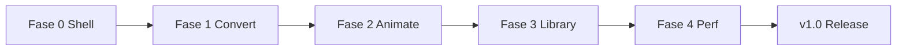

# ASCII Engine v1.0 — Plano Técnico (Converter-First)

**Branch:** `ascii-engine-platform`  
**Data:** 2026-07-19  
**Status:** ✅ Fases 0–4 implementadas no código (aguarda validação manual; sem commit)

---

## 1. Veredicto da auditoria

A branch **já é** um produto converter-first em grande parte:

| Área | Estado actual |
|------|----------------|
| Nav UI | Convert · Animate · Icons · Gallery · Docs |
| Convert | PNG/JPG/WEBP (+ SVG via rasterize); refinement; dither; aspect-ratio engine |
| Animate | GIF decode; TemporalPipeline; workers; export GIF/ZIP/TXT |
| Icons | Biblioteca (~31 ícones) com Copy/PNG/SVG |
| Gallery | Mock featured + remix → Convert |
| Legacy UI | Edit/Playground/Engine/Stats/Studio em `src/legacy/` (fora da nav) |
| Aspect ratio | Corrigido (células 7×12 + SSOT geometry) |
| Deps | `gifenc`, `gifuct-js`, `jszip`, Next 15 — **sem** deps ROOT OS |

### Gaps vs SYSTEM PROMPT v1.0

| Requisito | Gap |
|-----------|-----|
| Nav = Convert · Animate · **Library** | Hoje: Icons + Gallery + Docs separados |
| Charsets listados (`@%#*+=-:.`, `█▓▒░`, `01`, `ROOTOS`, A–Z, Custom frase) | Charsets parciais; sem editor de frase/peso |
| **Character Weight Editor** | **Não existe** |
| Color modes (Original, Mono, Inverted, Palette, CRT Green, Amber, White Terminal) | Há `mono/truecolor/ansi/root-os/gradient` — mapear/renomear + Amber/White |
| Presets Matrix/Manga/IBM/ANSI/Cyberpunk/… | Refinement presets parciais; lista oficial incompleta |
| PNG transparente 1:1 resolução fonte | `transparentBackground` existe; **1:1 pixel source** incompleto |
| Export ZIP (imagem): manifest + ascii.txt + preview.png + metadata | ZIP só sólido em **animação** |
| WEBP animado | Só WEBP estático / GIF |
| Quality tiers: Performance / Balanced / Maximum | **Não existe** |
| Frame interpolation | Só temporal smoothing / adaptive FPS (não inventa frames) |
| Performance SLAs (1080p &lt;100ms, 4K &lt;500ms, 100f &lt;5s) | Workers existem; **não medidos/garantidos** |
| Zoom 25/50/100/Fit/Original | Workspace zoom parcial |
| Remover módulos SDK editor/scene/nodes/ai da fachada | Ainda em `src/features/ascii-engine/*` e `index.ts` |
| Docs tab | Fora do escopo de 3 abas → fundir/remover |

---

## 2. Escopo de produto (v1.0)

### Em escopo

1. **Convert** — imagens estáticas → ASCII → export  
2. **Animate** — GIF (+ WEBP animado) → Temporal ASCII → export  
3. **Library** — Icons + Gallery (um único hub; sem upload obrigatório)

### Fora de escopo (explícito)

- Playground, Edit, Studio, Engine, Stats  
- Paint / brushes / layers / timeline editor / node graph  
- API HTTP, auth, cloud  
- Qualquer página/componente ROOT OS / portfólio  
- Motion blur / interpolação “criativa” de frames (só estabilidade temporal)

### Filosofia (gate)

> Isso melhora conversão, velocidade ou exportação?  
> Se **não** → fora.

---

## 3. Lista de remoções / isolamentoamentos

### A) Remover da UI (já feito parcialmente — completar)

| Item | Acção |
|------|--------|
| Tab Docs | Remover da nav; conteúdo mínimo → Library › Help ou README |
| Tabs Icons + Gallery separadas | Fundir em **Library** (sub-tabs Icons \| Gallery) |
| LabInteractiveCursorToggle / engine demo | Remover do Convert/Animate se não serve conversão |
| Referências copy “Edit/Studio/Playground” | Limpar Docs/Gallery/banner |

### B) Isolar / arquivar código (não expor)

Mover ou deixar de reexportar da fachada `ascii-engine/index.ts`:

```
src/features/ascii-engine/{ai,brush,editor,nodes,playground,plugins,scene,tools,document,storage,stats,benchmark,cli?}
→ src/legacy/sdk/   (ou manter pastas mas NÃO exportar no barrel público)
```

`src/legacy/` actual (UI) permanece. SDK experimental deixa de ser API pública do produto.

### C) Manter e reforçar (coração)

```
src/features/ascii-interaction/image-pipeline/**
src/features/ascii-interaction/animation-pipeline/**  (+ TemporalPipeline)
src/features/ascii-interaction/geometry/aspect-ratio-engine.ts
src/studio/{AsciiLab,ProductNav,image/*,animation/*,workspace/*,icons,gallery}
src/features/ascii-engine/{converters,exporters,importers,icons,gallery,presets,recipes,themes,browser,core}
```

---

## 4. Componentes reutilizáveis (não reinventar)

| Peça | Uso v1.0 |
|------|----------|
| `image-pipeline` + workers | Convert core |
| `aspect-ratio-engine` | Geometria fiel |
| `RefinementPanel` / `useImagePipeline` / histograms | Convert UI (evoluir) |
| `animation-pipeline` + Temporal* | Animate core |
| `AnimationConverterPanel` + temporal toggles | Animate UI |
| `WorkspaceView` + MatrixPreview | Preview (zoom/fullscreen) |
| `SvgAdapter` / rasterize-svg | SVG → ASCII |
| `render-utils` transparent PNG | Export PNG |
| `icons` + `IconsPanel` | Library › Icons |
| `gallery` + `GalleryEmbedded` | Library › Gallery |
| Exporters GIF/ZIP animação | Animate export |

---

## 5. Estrutura final da aplicação

```
ASCII ENGINE
├── Convert          # upload → adjust → preview → export
├── Animate          # GIF/WEBP → temporal → preview → export
└── Library
    ├── Icons        # search/filter/copy/download
    └── Gallery      # Featured / Trending / Recent → open in Convert/Animate
```

### Árvore de pastas alvo (produto)

```
src/
  app/                         # Next shell mínimo (/, /gallery redirect)
  studio/
    AsciiLab.tsx               # shell 3 abas
    ProductNav.tsx
    convert/                   # (hoje image/) painéis Convert
    animate/                   # (hoje animation/)
    library/                   # Icons + Gallery unificados
    workspace/                 # preview/zoom/fullscreen
  features/
    ascii-interaction/
      image-pipeline/          # SSOT still
      animation-pipeline/      # SSOT motion + Temporal
      geometry/
    ascii-engine/
      converters/ exporters/ icons/ gallery/ presets/ themes/ browser/
  legacy/                      # UI + SDK experimental isolados
PRODUCT_DECISIONS.md
docs/architecture/ASCII-ENGINE-V1-PLAN.md   # este documento
```

---

## 6. Plano de migração (fases)

### Fase 0 — Shell & higiene (1 ciclo)

- Nav → **Convert | Animate | Library**  
- Remover Docs da nav; limpar copy experimental  
- Parar reexports de editor/scene/nodes/ai no barrel  
- Actualizar `PRODUCT_DECISIONS.md`  
- Garantir zero imports ROOT OS / portfólio  

**DoD:** produto compreensível em &lt;10s; `tsc` + testes Convert/Animate verdes.

### Fase 1 — Convert v1.0

- Charsets oficiais + **Custom string/frase**  
- **Character Weight Editor** (mapa char → peso 0–100 → LUT densidades)  
- Color modes alinhados ao brief (mapear `root-os` → CRT Green na UI)  
- Presets oficiais (Matrix, ROOT OS, Manga, IBM, …)  
- Background: Transparent / Solid / Original  
- Preview: Before/After, Split, Fullscreen, Zoom 25/50/100/Fit/Original  
- Exports: TXT, PNG (transparent + anti-alias opcional), SVG, JSON, **ZIP pack**  
- SVG input polish (logos/ícones)  
- Opção **export PNG @ source pixel size** (escala células, não “achatar” aspect)

**DoD:** checklist Convert 100%; fixtures PNG/JPG/WEBP/SVG.

### Fase 2 — Animate v1.0

- Manter TemporalPipeline (não regredir)  
- Quality tiers: Performance / Balanced / Maximum Quality  
- WEBP animado (decoder + mesma pipeline temporal)  
- Export GIF + ZIP frames + manifest  
- FPS/resolução/aspect: reforçar testes + UI  
- Workers + cache + progress (já parcialmente)

**DoD:** GIF + WEBP animado; métricas Temporal; ZIP frames.

**Nota:** “Frame interpolation” = **não** inventar frames criativos; = reutilizar Adaptive FPS / temporal continuity. Se quiserem interpolação óptica verdadeira, fica **v1.1+** (fora do coração).

### Fase 3 — Library v1.0

- Unificar Icons + Gallery sob Library  
- Categorias: Linux, Dev, Gaming, Tech, UI, Brands, Animals, Misc  
- Featured / Trending / Recent  
- Copy ASCII, TXT, PNG; Search/Filter  
- CTA “Open in Convert / Animate”

**DoD:** Library usável sem upload.

### Fase 4 — Performance Layer

- Bench harness (já existe `bench:conversion`) → gates CI opcionais  
- Metas (aspiracionais → medir e optimizar):  
  - 1080p &lt; 100ms (still, worker path)  
  - 4K &lt; 500ms  
  - 100-frame GIF &lt; 5s (Balanced)  
- Lazy/virtualized preview lists; debounce; buffer reuse (Temporal já faz parte)

**DoD:** relatório de bench documentado; regressões detectáveis.

---

## 7. Roadmap (visão)



| Fase | Foco | Risco |
|------|------|-------|
| 0 | Nav/Library merge, higiene | Baixo |
| 1 | Weight editor + presets + ZIP still | Médio (LUT pesos) |
| 2 | WEBP animado + quality tiers | Médio |
| 3 | Library UX | Baixo |
| 4 | SLAs perf | Alto (hardware-dependent) |

---

## 8. Decisões de desenho (confirmadas)

1. **Library** = Icons + Gallery — **sim**
2. **Docs** permanece na nav — **sim** (override da recomendação inicial)
3. Remover branding ROOT OS → **CRT Green**
4. Interpolação = só temporal/adaptive — **sim**
5. PNG export @ source pixel size — **sim**
6. SDK experimental: não reexportar da fachada — **sim**

---

## 9. Checklist v1.0 (aceitação) — estado 2026-07-19

### Produto

- [x] Convert · Animate · Library · Docs (Docs mantida por decisão)
- [x] Zero UI Edit/Playground/Studio/Engine/Stats na nav
- [x] Zero dependência/página ROOT OS / portfólio (branding CRT Green)
- [ ] Fluxo Upload → Adjust → Preview → Export &lt; 30s — **validação manual**

### Convert

- [x] PNG JPG JPEG WEBP SVG
- [x] Charsets + Custom frase
- [x] Weight editor
- [x] Color modes do brief
- [x] Presets oficiais (Matrix, Manga, IBM, ANSI, Cyberpunk, CRT, …)
- [x] Aspect + preview zoom/fullscreen/split (25/50/100/200/400/Fit)
- [x] TXT PNG(SVG transparent) SVG JSON ZIP + match source px

### Animate

- [x] GIF + WEBP animado (multi-frame WEBP: Chromium ImageDecoder)
- [x] Temporal pipeline intacta e togglable
- [x] Quality tiers
- [x] Export GIF + ZIP frames + manifest
- [x] Aspect/FPS preservados

### Library

- [x] Icons categorias + search + Open in Convert
- [x] Gallery Featured/Trending/Recent + Convert/Animate/Copy/TXT/PNG
- [x] Copy / TXT / PNG

### Qualidade / Perf

- [x] Bench documentado (`phase-logs/CONVERSION-BENCH.md`)
- [x] Workers activos nos caminhos pesados
- [x] Testes unitários Convert + Temporal verdes

---

## 10. Entregáveis deste documento

| Entregável | Secção |
|------------|--------|
| Plano técnico | §§1–6 |
| Roadmap | §7 |
| Lista de remoções | §3 |
| Estrutura final | §5 |
| Checklist v1.0 | §9 |
| Decisões | §8 |

---

## 11. Próximo passo

**Validação manual do utilizador** no browser (checklist §9, item Upload→Export).  
Commit + push **somente** após OK explícito.
