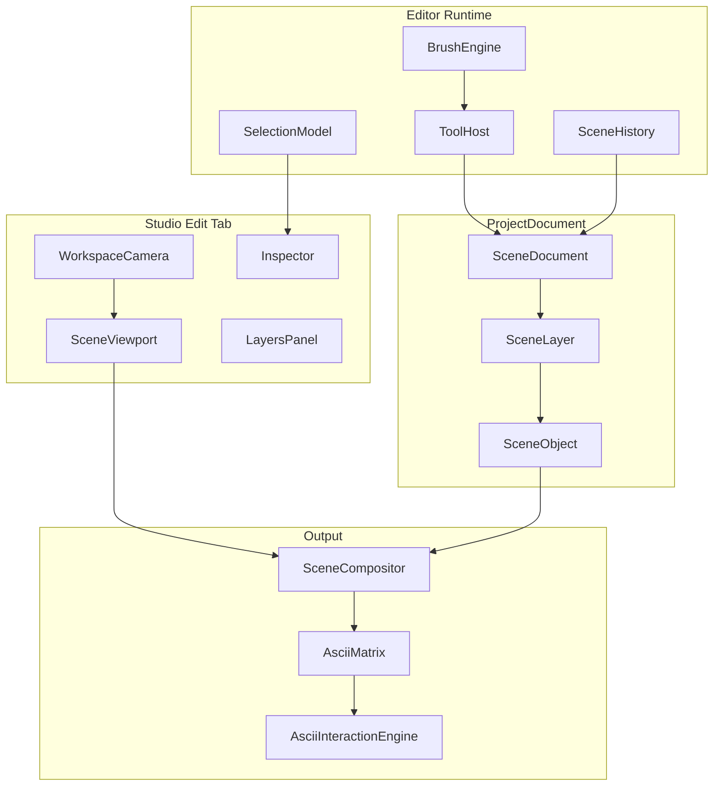

# ASCII Scene Editor — Documento Arquitetural (SSOT)

> **Versão:** 1.0.0-scene  
> **Branch:** `ascii-engine-platform`  
> **Status:** Fonte de verdade do editor de cenas ASCII.  
> **Relação:** Estende PLATFORM; não invalida pipelines Convert/Animate.

---

# ASCII Scene Editor — Fundação de Editor de Cenas

> **Branch:** `ascii-engine-platform` (produto standalone; sem merge `main`)  
> **Ordem:** auditoria (abaixo) → SSOT arquitetural → implementação por waves.  
> **Default:** scene graph passa a ser o SSOT da tab **Edit**; `AsciiMatrix` torna-se **buffer composto** (e buffer interno de objetos raster), não a unidade de edição.

---

## Parte A — Auditoria (estado atual)

### Como o estado é armazenado?

```
createAsciiEngine()
  └─ ProjectDocument          # SSOT ficheiro (ZIP/IDB)
       └─ editor: EditorDocument   # sessão + CommandHistory (max 64)
```

- Serializável: [`ProjectDocumentData`](src/features/ascii-engine/document/types.ts) — meta, workspace, `layers[]`, selection, timeline?, nodeGraph?, assets, animation?.
- Em memória só: tool ativa, clipboard, stroke chars, **stack real de comandos** (JSON só guarda `pastCount`/`futureCount` stub — undo **não** sobrevive a reload).
- Paths: [`project-document.ts`](src/features/ascii-engine/document/project-document.ts), [`editor/document.ts`](src/features/ascii-engine/editor/document.ts).

### Como o preview é renderizado?

```
AsciiMatrix | string
  → CharacterGrid (SoA runtime)
  → CanvasRenderer + GlyphAtlas
  → <canvas> (layoutMode=intrinsic)
  → WorkspaceCanvas (CSS translate+scale)
```

Convert/Animate usam [`WorkspaceView`](src/studio/workspace/WorkspaceView.tsx) + [`LabViewport`](src/studio/LabViewport.tsx). Tab Studio hoje é node graph + `EditorToolsPanel` — **não** partilha o mesmo viewport de edição visual.

### Separação dados / render?

**Sim no core:** `document/`+`editor/` sem DOM; `ascii-interaction` render/physics; `studio/` UI.  
**Não no modelo de edição:** não há scene graph — dados = células na matrix da layer.

### Editor suporta objetos?

**Não.** Tools (brush/text/stamp) escrevem `CellPatch` na `AsciiMatrix`. Text/Stamp são bake imediato, não entidades editáveis.

### Camadas?

[`EditorLayer`](src/features/ascii-engine/editor/types.ts): `id`, `name`, `visible`, `opacity`, `matrix`. Sem blend, sem reorder API rica, sem compositor multi-layer no editor (opacity/visible quase sem efeito visual).

### Undo/Redo?

Command pattern ([`CommandHistory`](src/features/ascii-engine/editor/commands.ts), max 64) + legado snapshot. Undoable: patches de células / selection. Não undoable: tool settings, meta do projeto. Não persistente.

### Gap vs missão

É um **raster ASCII multi-layer**, não um editor de **cena**. Workspace sem world coords, rulers, guides, infinite canvas, scene objects.

---

## Parte B — Arquitetura proposta (SSOT do Editor)

### Princípio

O utilizador edita uma **Scene**. Objetos são entidades; o preview/export consomem um **CompositeFrame** (`AsciiMatrix` + opcional color) produzido por um **SceneCompositor** determinístico.



### Interface comum de objeto

```ts
// Conceito normativo — src/features/ascii-engine/scene/
interface SceneObject {
  id: string
  type: SceneObjectType  // image | text | shape | stroke | group | reference | …
  name: string
  layerId: string
  transform: { x: number; y: number; rotation: number; scaleX: number; scaleY: number }
  bounds: { w: number; h: number }  // em células
  visible: boolean
  locked: boolean
  opacity: number          // simulado na composição
  blendMode: BlendMode
  effects: EffectRef[]     // não destrutivos
  data: DiscriminatedPayload
}
```

Tipos iniciais: `ImageObject` (matriz/conversão), `TextObject`, `ShapeObject`, `StrokeObject` (path de brush serializável), `GroupObject`, `ReferenceObject` (asset library).

### Layers

`SceneLayer`: id, name, visible, locked, opacity, blendMode, mask?, `objectIds[]` (z-order). Ops: rename, duplicate, group, hide, lock, reorder.

### Compositor

`composeScene(scene, options) → AsciiMatrix`  
- Ordena layers → objetos  
- Rasteriza cada objeto em buffer local (células)  
- Aplica opacity simulada (densidade/charset/cor) + effects  
- Flatten para matrix final  
- Cache por hash de objeto/layer; invalidação parcial  

Exportadores existentes consomem o composite (compat TXT/GIF/PNG/…).

### Tools API (desacoplada)

```ts
interface ToolContext {
  scene: SceneDocument
  selection: SelectionModel
  camera: WorkspaceCamera
  brush: BrushEngine
  history: SceneHistory
  pointer: PointerWorld  // world cell coords
}
interface EditorTool {
  id: string
  cursor: string
  onPointerDown/Move/Up(ctx, ev): void
  onKeyDown?(ctx, ev): void
}
```

Nenhuma tool importa outra. `ToolHost` regista e despacha.

### Brush Engine

`BrushPreset` serializável: charset mode, colors, size, density, opacitySim, scatter, spacing, rotation, flow, hardness, blendMode, randomization.  
Tipos (ready ou experimental): pencil, brush, spray, airbrush, calligraphy, noise, fire, smoke, rain, matrix, particle, image, pattern, character, unicode, text.

### Workspace (câmera)

Substituir o modelo “um filho centrado” por:

- World coords em **células** (e sub-célula para handles)
- `WorkspaceCamera { x, y, zoom }` contínuo + presets Fit / Fit Selection
- Infinite canvas (sem bounds rígidos; soft grid)
- Grid opcional, rulers, guides, snapping
- HUD screen-space (handles, rulers) fora do scale do world
- MiniMap: interface `MiniMapSource` + stub UI (arquitetura pronta)

Reutilizar tokens/toolbar de [`src/studio/workspace/`](src/studio/workspace/); redesign de [`WorkspaceCanvas.tsx`](src/studio/workspace/WorkspaceCanvas.tsx).

### Histórico

`SceneCommand` (object-level): Add/Remove/Transform/PatchObject/ReorderLayer/…  
Stack persistível no `ProjectDocument` (opcional: últimos N comandos serializados ou checkpoints).  
Branches futuras: `HistoryBranch` stub no schema.

### Integração com o que já existe

| Existente | Papel novo |
|-----------|------------|
| Convert pipeline | Cria `ImageObject` na layer ativa |
| `EditorDocument` matrix tools | Migrar para operar em `ImageObject` selecionado **ou** deprecated após compositor estável |
| Playground/physics | Overlay na viewport; não misturar com scene graph |
| Gallery remix | Abre cena com `ImageObject` + recipe |
| Project ZIP | `document.json` ganha `scene: SceneDocumentData` |

### Tab Edit

Nova tab **Edit** no Studio (ou promover Studio): Layers + Tools + Inspector + SceneViewport. Convert continua a alimentar a cena.

---

## Parte C — Waves de implementação

### Wave 0 — SSOT documental (sem código de produto)

- Gravar `docs/architecture/ASCII-SCENE-EDITOR.md` com auditoria + arquitetura acima
- Phase-log `STANDALONE-SCENE-W0.md`

### Wave 1 — Scene model + compositor

- `src/features/ascii-engine/scene/` — types, `SceneDocument`, objects mínimos (`ImageObject`, `GroupObject`)
- `SceneCompositor` → `AsciiMatrix`
- Wire `ProjectDocument.scene`; round-trip ZIP
- Testes: add image object → compose → dims corretas
- Commit: `feat(ascii-engine): scene document + compositor (Scene W1)`

### Wave 2 — Workspace câmera + Edit tab shell

- `WorkspaceCamera` world-space; pan/zoom contínuo + fit
- `SceneViewport` renderiza composite via LabViewport/engine
- Grid opcional; stubs rulers/guides/snap APIs
- Tab Edit no [`AsciiLab.tsx`](src/studio/AsciiLab.tsx)
- Commit: `feat(ascii-engine): infinite workspace camera + Edit tab (Scene W2)`

### Wave 3 — ToolHost + BrushEngine + tools base

- `tools/` registry + Brush/Pencil/Eraser/Fill/Move/Hand/Zoom
- `brush/` engine + presets serializáveis (vários tipos, alguns experimental)
- Selection model (objeto + região)
- Histórico scene-level
- Commit: `feat(ascii-engine): tool host + brush engine (Scene W3)`

### Wave 4 — Layers panel + Inspector

- UI layers (rename/dup/hide/lock/reorder)
- Inspector: transform, charset, cor, opacity, effects, layer
- Commit: `feat(ascii-engine): layers panel + inspector (Scene W4)`

### Wave 5 — Shapes + Text + Stamp

- Shape tools (line/rect/ellipse/polygon/arrow) → `ShapeObject`
- Text tool → `TextObject` (FIGlet/fonts: arquitetura + 1 renderer simples; FIGlet full pode ser experimental)
- Stamp: região → asset stamp reutilizável
- Commit: `feat(ascii-engine): shapes text stamp objects (Scene W5)`

### Wave 6 — Libraries + effects

- Asset library (categorias mock) + Shape library procedural (boxes/windows/HUD)
- Effect stack não destrutivo no compositor (glow/shadow/outline/noise/CRT/… — subset ready + stubs)
- Commit: `feat(ascii-engine): asset/shape libraries + object effects (Scene W6)`

### Wave 7 — Clipboard + history persistence + export gate

- Copy/cut/paste/duplicate entre layers
- Persistir histórico mínimo / checkpoints no projeto
- Verificar export composite em TXT/PNG/JSON/Project
- Commit: `feat(ascii-engine): scene clipboard + history persistence (Scene W7)`

### Wave 8 — Docs + revisão arquitetural

- `docs/modules/scene-*.md` por módulo
- Auditoria: acoplamentos, duplicação EditorDocument vs Scene, perf compositor, APIs
- Corrigir achados Blocker/Major antes do fecho
- Phase-log `STANDALONE-SCENE-W8.md` + atualizar EXTRACTION-REPORT

---

## Performance (constraints)

- Compositor: dirty layers/objects; não recompor cena inteira a cada pointer move (stroke buffer → commit no pointer up)
- Não recriar `CharacterGrid` se dims do composite estáveis (`patchSource`)
- Tools não fazem setState React por célula — batch via rAF
- Soft cap de bounds da cena + virtualização futura documentada

---

## Fora de escopo imediato (schema preparado)

- MiniMap UI completa (só interface)
- Charset animado runtime
- History branches UI
- FIGlet completo / todos os brushes experimentais polished
- Physics como objetos de cena

---

## Gates globais

- `tsc` + vitest scene/editor
- Edit tab: criar ImageObject a partir de convert, brush stroke, undo, export composite
- Never-crop mantido no viewport da cena
- Sem regressão Convert/Animate/Gallery
