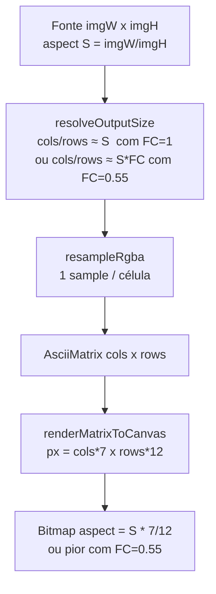

# Aspect Ratio Audit — ASCII Engine

**Branch:** `ascii-engine-platform`  
**Date:** 2026-07-10  
**Status:** Diagnóstico aprovado · **correção implementada** (2026-07-10)  
**Evidence:** imagem fonte `564×778` → export ASCII observado `238×1024`

---

## 1. Veredicto (causa raiz)

A proporção **não se perde no resize tonal, nem no dither, nem no CSS do preview**.

Perde-se **na etapa de dimensionamento da grelha** (`resolveOutputSize` / `resolveOutputSizeFromDimensions`):

1. A pipeline escolhe `cols × rows` como se **cada célula fosse um pixel quadrado** (ou aplica `fontCompensation` na direcção errada).
2. O rasterizer / export desenha cada célula com **`cellW × cellH = 7 × 12`** (não-quadrado).
3. O aspect ratio **visual** final fica:

\[
\frac{W_\text{px}}{H_\text{px}}
= \frac{\text{cols}\cdot\text{cellW}}{\text{rows}\cdot\text{cellH}}
= \underbrace{\frac{\text{cols}}{\text{rows}}}_{\text{aspect da grelha}}
\cdot \underbrace{\frac{\text{cellW}}{\text{cellH}}}_{\approx 7/12 \approx 0.583}
\]

Com defaults actuais (`fontCompensation = 1`), a grelha copia o aspect da imagem (`cols/rows ≈ imgW/imgH`), mas o render multiplica por `7/12` → **estiramento vertical sistemático de `cellH/cellW = 12/7 ≈ 1.714×`**.

Com `fontCompensation = 0.55` (default da animação / valor “de compensação” no slider), o bug **piora** (~`3.11×`), porque o factor entra no sítio errado da fórmula.

### Match com a evidência do utilizador

| | width | height | aspect (w/h) |
|--|------:|-------:|-------------:|
| Original | 564 | 778 | **0.7249** |
| ASCII export observado | 238 | 1024 | **0.2324** |
| Estiramento vertical `(h/w)_out / (h/w)_src` | | | **≈ 3.12×** |

Simulação com a fórmula actual e células `7×12`:

| Config | cols | rows | px | aspect | stretch |
|--------|-----:|-----:|----|-------:|--------:|
| `FC=1` | 120 | 166 | 840×1992 | 0.422 | **1.72×** |
| `FC=0.55` | 120 | 301 | 840×3612 | 0.233 | **3.12×** |
| `FC=0.55`, cols=34 | **34** | **85** | **238×1020** | **0.233** | **3.11×** |

`34×85` células × `7×12` px ≈ **238×1020** — coincide com o PNG ASCII anexado (238×1024, 4 px de arredondamento/UI).

**Conclusão:** o caso reportado corresponde a grelha dimensionada com **`fontCompensation ≈ 0.55`** + render `7×12`. Não é um bug só de CSS; a matriz já tem demasiadas linhas.

---

## 2. Pipeline auditada (etapa a etapa)

### 2.1 Entrada

| Campo | Valor (evidência) |
|-------|-------------------|
| width | 564 |
| height | 778 |
| aspect (w/h) | 0.7249 |
| character cols/rows | n/a |
| Nota | Retrato (~1:1.38), não “quadrado perfeito”; o olho circular torna o stretch óbvio |

### 2.2 Leitura / Canvas de sample

| Campo | Valor |
|-------|-------|
| Código | `sampleImagePixels` / `sampleImage` |
| width × height | = naturalWidth × naturalHeight (564×778) |
| aspect | preservado |
| pixel ratio | 1:1 com a fonte |
| **Distorção?** | **Não** |

### 2.3 Resize / Downsampling (`resampleRgba`)

| Campo | Valor |
|-------|-------|
| Método | area-average (box) no downscale |
| Entrada | dims da fonte |
| Saída | `outW × outH` **já decididos** por `resolveOutputSize*` |
| **Distorção?** | **Não cria** a distorção; **aplica** a grelha já errada (amostra 1 valor por célula) |

### 2.4 Cálculo da grelha — **PONTO DE FALHA**

Ficheiros:

- `image-processor.ts` → `resolveOutputSize`
- `rgba-processor.ts` → `resolveOutputSizeFromDimensions` (duplicado, mesma fórmula)
- Chamado por `runImagePipeline` / `runRgbaPipeline` (imagem + GIF worker)

```ts
const aspect = (imgWidth / imgHeight) * options.pixelAspect * options.fontCompensation;
outH = round(outW / aspect);  // quando height==0 || lockAspectRatio
```

Defaults imagem (`DEFAULT_IMAGE_PIPELINE_OPTIONS`):

| option | default |
|--------|---------|
| width | 120 |
| height | 0 (auto) |
| lockAspectRatio | true |
| pixelAspect | 1 |
| fontCompensation | **1** |

Defaults animação:

| option | default |
|--------|---------|
| fontCompensation | **0.55** |

| Campo | Com FC=1, src 564×778, width=120 |
|-------|----------------------------------|
| cols | 120 |
| rows | 166 |
| aspect grelha (cols/rows) | 0.723 ≈ aspect fonte |
| **Erro** | Trata célula como amostra **quadrada**; ignora `glyphCellWidth/Height` |

`pipeline.ts` injeta `glyphCellWidth/Height` via stub `AspectRatioEngine`, mas **`resolveOutputSize` não os lê**. O comentário em `types.ts` diz que `fontCompensation` é ignorado pelo AspectRatioEngine — porém o motor real **ainda não existe** (`geometry/aspect-ratio-engine.ts` em falta; só há `geometry/index.ts` a re-exportar um módulo inexistente).

### 2.5 Matriz ASCII (`generateAsciiMatrix`)

| Campo | Valor |
|-------|-------|
| cols × rows | = buffer width × height (saída do passo 2.4) |
| Conteúdo | 1 char por célula; fidelidade tonal OK |
| **Distorção geométrica adicional?** | **Não** (herda grelha) |

### 2.6 Preview (`MatrixPreview` → `renderMatrixToCanvas`)

| Campo | Valor |
|-------|-------|
| cellW × cellH | **7 × 12** (`DEFAULT_MATRIX_CELL_*`) |
| font | `"Courier New", monospace` no canvas de export/preview de conversão |
| UI app | IBM Plex Mono nos tokens CSS (não é o que o rasterizer de conversão usa) |
| px | `cols*7` × `rows*12` |
| **Distorção?** | **Aplica** o aspect da célula; correcto *se* a grelha já compensasse |

### 2.7 Export PNG / SVG / HTML

| Formato | Geometria |
|--------|-----------|
| PNG | mesmo `renderMatrixToCanvas` (7×12) |
| SVG/HTML | mesmos defaults 7×12 (salvo `matchSourceResolution`) |
| TXT | só chars; aspect depende do terminal/viewer (célula do font do viewer) |
| GIF | mesmo rasterizer + cell 7×12 |

Preview Convert/Animate e PNG/GIF partilham o rasterizer → **mesma geometria errada**, não um desvio preview-only.

### 2.8 CSS / zoom / DPR

| Hipótese | Resultado |
|----------|-----------|
| line-height / letter-spacing no export canvas | N/A (fillText em grelha fixa) |
| devicePixelRatio | não entra no cálculo cols/rows |
| Workspace fit/zoom | escala uniforme (never-crop); **não** explica ovalização do olho no bitmap exportado |

---

## 3. Hipóteses — resultado da investigação

| # | Hipótese | Veredicto |
|---|----------|-----------|
| H1 | Fonte monospace (IBM Plex / JetBrains / …) mal medida | **Parcial.** Conversão usa célula fixa 7×12 + Courier New no canvas; app UI usa IBM Plex Mono. O problema principal não é “qual font”, é **não acoplar aspect da célula ao cálculo de rows**. |
| H2 | Célula tratada como pixel quadrado | **CONFIRMADO** — causa raiz. |
| H3 | Resize nearest/bilinear errado | **Rejeitado** como causa; area-average é fiel à grelha pedida. |
| H4 | Só o preview distorce | **Rejeitado** — PNG evidencia a mesma proporção. |
| H5 | Export PNG/GIF com lógica diferente | **Rejeitado** para o path default (mesmo `render-utils`). |
| H6 | CSS line-height | **Rejeitado** para o PNG anexado (bitmap rasterizado). |
| H7 | `fontCompensation: 0.55` “compensa” | **Falso.** Na fórmula actual **aumenta** `rows` e agrava o stretch (~3.1×). O slider UI (0.3–1.2) **nem permite** o valor correcto ≈ `12/7 ≈ 1.71`. |

---

## 4. Fundamento matemático (sem constantes mágicas)

Objectivo: o bitmap renderizado deve ter o mesmo aspect da imagem fonte.

\[
\frac{\text{cols}\cdot\text{cellW}}{\text{rows}\cdot\text{cellH}}
= \frac{\text{imgW}}{\text{imgH}}
\]

Com `cols` fixo (= `options.width`):

\[
\text{rows}
= \text{cols}\cdot\frac{\text{imgH}}{\text{imgW}}\cdot\frac{\text{cellW}}{\text{cellH}}
\]

Equivalente:

\[
\text{rows}
= \frac{\text{cols}}{
  (\text{imgW}/\text{imgH})\cdot(\text{cellH}/\text{cellW})\cdot\text{pixelAspect}
}
\]

onde `pixelAspect` só modela pixels de fonte não-quadrados (ex.: anamórfico), **não** a célula tipográfica.

### Relação com `fontCompensation` legado

Na fórmula **actual**:

\[
\text{rows} = \frac{\text{cols}}{(\text{imgW}/\text{imgH})\cdot\text{pixelAspect}\cdot\text{FC}}
\]

Para coincidir com a equação correcta, seria necessário:

\[
\text{FC} = \frac{\text{cellH}}{\text{cellW}}
\quad(= 12/7 \approx 1.714 \text{ com defaults})
\]

Isto **não** é um factor mágico: é a razão geométrica da célula.  
O valor `0.55 ≈ cellW/cellH` é o **inverso** do que a fórmula actual precisa — daí o agravamento.

**Recomendação:** deixar de expor `fontCompensation` como dial de geometria. Derivar rows de `glyphCellWidth/Height` (ou métricas medidas da font).

---

## 5. Fonte e célula — estado actual

| Camada | Font / célula |
|--------|----------------|
| App shell CSS | IBM Plex Mono (`--font-mono`) |
| Raster conversão (`render-utils`) | `"Courier New", monospace`, cell **7×12**, fontSize ≈ `0.85 * cellH` |
| Engine interactiva (GlyphAtlas) | `config.cellWidth/Height` default **7×12** |
| Stub geometry | `AspectRatioEngine` referenciado mas **ficheiro em falta** |

Aspect real da célula de conversão:

\[
\frac{\text{cellW}}{\text{cellH}} = \frac{7}{12} \approx 0.5833
\]

---

## 6. Exemplo numérico completo (quadrado 1000×1000, width=120)

### Actual (FC=1)

| Etapa | w | h | aspect |
|-------|--:|--:|-------:|
| Fonte | 1000 | 1000 | 1.000 |
| Grelha | 120 | 120 | 1.000 |
| Render 7×12 | 840 | 1440 | **0.583** |
| Stretch | | | **1.714× vertical** |

### Correcto (rows = cols × (cellW/cellH))

| Etapa | w | h | aspect |
|-------|--:|--:|-------:|
| Fonte | 1000 | 1000 | 1.000 |
| Grelha | 120 | **70** | 1.714 |
| Render 7×12 | 840 | 840 | **1.000** |
| Stretch | | | **1.000** |

### Actual com FC=0.55 (pior)

| Grelha | 120 × 218 |
| Render | 840 × 2616 (aspect 0.321, stretch **3.11×**) |

---

## 7. GIF

Mesma função `resolveOutputSizeFromDimensions` no path RGBA/worker → **mesmo bug**.  
Export GIF usa o mesmo `renderMatrixToCanvas` (7×12). Auditar/corrigir uma vez cobre imagem e GIF.

---

## 8. Correção implementada

### Princípios aplicados

1. **Uma** função SSOT: `resolveGridSize` em `geometry/aspect-ratio-engine.ts`.
2. `rows` derivado de `cellW/cellH` — `fontCompensation` é no-op na geometria.
3. Preview e exports continuam com as mesmas cell metrics (7×12).
4. Slider “Font compensation” removido da UI de conversão.
5. Default animação: `fontCompensation: 1` (legado inerte).

### Verificação pós-fix (width=120, cell 7×12)

| Fixture | src aspect | render aspect | erro relativo |
|---------|------------|---------------|---------------|
| 1000×1000 | 1.000 | **1.000** | 0 |
| 800×1600 | 0.500 | **0.500** | 0 |
| 1600×800 | 2.000 | **2.000** | 0 |
| 564×778 (olho) | 0.725 | **0.722** | 0.45% |

### O que **não** foi feito

- Factores mágicos (`height *= 0.55`, etc.)
- Corrigir só CSS do preview

---

## 9. Diagrama do bug



A fidelidade tonal (luminância → char) opera **depois** da grelha e por isso permanece excelente enquanto a geometria falha.

---

## 10. Critério de sucesso (pós-fix)

- Quadrado → render aspect ≈ 1  
- Horizontal / vertical / GIF → mesmo aspect que a fonte (dentro de ε de quantização)  
- Preview ≡ PNG ≡ GIF (mesma grelha + mesmas cell metrics)  
- Zero factores mágicos; única fonte de verdade = métricas de célula  
- Slider `fontCompensation` não altera geometria (ou removido da UI de conversão)

---

**Aguarda aprovação explícita deste diagnóstico antes de qualquer patch de código.**
