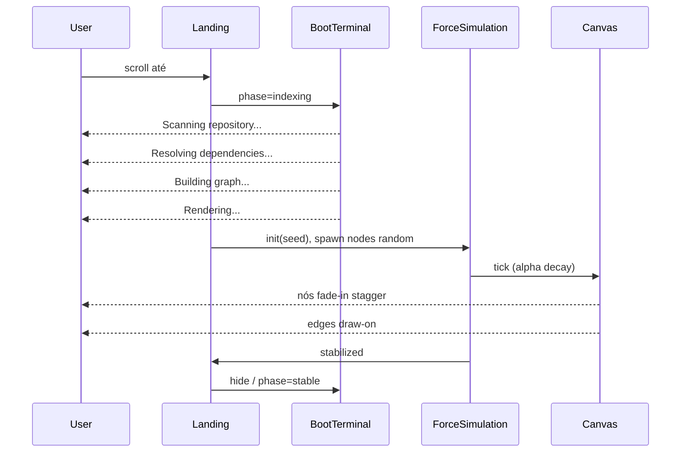

# ROOT OS — Knowledge Graph Section
## Especificação Técnica v1.0.0

**Status:** Planejamento  
**Substitui:** Seção S05 `Skills` (`#skills`, `MOD-SKILLS`, `skills.json` como visualização primária)  
**Inspiração conceitual:** Graph View do Obsidian (grafo vivo, física, subgrafo em hover)  
**Identidade:** ROOT OS — terminal, módulos industriais, phosphor palette, narrativa diegética  

> Este documento é **especificação**, não implementação. Nenhum código aqui é prescritivo de sintaxe; descreve arquitetura, UX, dados, performance e roadmap.

---

## 1. Visão e princípios

### 1.1 O que é

A seção **Knowledge Graph** é um **mapa de conhecimento interativo** — não uma lista de skills, não um chart genérico, não um diagrama estático.

O visitante deve perceber:
- como conhecimentos **se conectam** entre si;
- como um **projeto emerge** da combinação de tecnologias, ferramentas e competências;
- **profundidade técnica** e **organização mental** do autor;
- capacidade de operar o conhecimento como **sistema**, não como inventário.

### 1.2 O que não é

| Não é | Por quê |
|-------|---------|
| Cópia do Obsidian | Apenas a *ideia* de grafo vivo com física |
| Lista de skills com barras | Substituído integralmente |
| Infográfico estático | Layout force-directed orgânico |
| Sankey / mind map rígido | Sem posições fixas em grid |
| Widget isolado | Integrado ao Terminal, HUD, WM e sync |

### 1.3 Princípios de design ROOT OS

1. **Diegese primeiro** — o grafo é um subsistema do OS (`index --knowledge`), não um embed genérico.
2. **Conteúdo real** — nós e arestas derivam de `content/` e projetos; zero dados decorativos.
3. **Orgânico, nunca grid** — force-directed com seed pseudoaleatório; resultado único por sessão mas estável após estabilização.
4. **Física responsiva** — arrastar um nó perturba o sistema; os demais reagem (molas, repulsão, amortecimento).
5. **Foco por subgrafo** — hover isola a vizinhança semântica; o resto recua visualmente.
6. **Uma interface por entidade** — projeto abre `Project.app` existente; não duplicar UI.
7. **Performance como requisito** — centenas de nós; canvas/WebGL; virtualização lógica.
8. **Acessibilidade paralela** — grafo visual + visão alternativa navegável (lista/árvore).

---

## 2. Posicionamento na landing

### 2.1 Ordem das seções (atualizada)

| ID | Secção | Âncora | Notas |
|----|--------|--------|-------|
| S01 | Hero | `#hero` | Telemetria atualiza readout |
| S02 | Manifesto | `#manifesto` | — |
| S03 | Projetos | `#projects` | Nós `project` no grafo |
| S04 | Processo | `#process` | Nós `concept` opcionais |
| **S05** | **Knowledge Graph** | **`#knowledge`** | **Substitui Skills** |
| S06 | Timeline | `#timeline` | — |
| S07 | Contacto | `#contact` | — |
| S08 | Footer | `#footer` | — |

**Breaking change controlado:** `skills` → `knowledge` em `SectionId`, HUD, `goto`, hash, terminal echo. Manter alias `skills` / `goto skills` redirecionando para `#knowledge` por compatibilidade de comandos legados.

### 2.2 ModulePanel diegético

```
┌─ MOD-KNOWLEDGE ─────────────────── index --knowledge ─┐
│  [terminal boot strip — opcional, 4 linhas]            │
│  ┌──────────────────────────────────────────────────┐  │
│  │           CANVAS GRAFO (full bleed)               │  │
│  │     ○───○                                         │  │
│  │    /     \                                        │  │
│  │   ○       ○───○                                   │  │
│  └──────────────────────────────────────────────────┘  │
│  [controls: zoom · reset · filter types · stats HUD]   │
└────────────────────────────────────────────────────────┘
```

- **code:** `MOD-KNOWLEDGE`
- **title:** `index --knowledge`
- Canvas ocupa ≥70% da área útil do painel em desktop; mobile ≥60%.

### 2.3 Hero telemetry

Substituir readout `Skills: N` por métrica alinhada ao grafo, por exemplo:
- `NODES` — total de nós no grafo publicado, ou
- `EDGES` — total de conexões, ou
- `GRAPH` — densidade / versão do índice (`v0.3`)

Valor derivado de `knowledge-graph.json` metadata — nunca hardcoded.

---

## 3. Modelo de dados

### 3.1 Fonte de verdade

Novo artefato central:

```
content/knowledge-graph.json
```

Opcionalmente gerado em build a partir de fontes existentes (como `music/manifest.json`), mas **editável** como catálogo canônico.

Fontes de derivação (não duplicar manualmente o que já existe):

| Fonte | Extrai |
|-------|--------|
| `content/projects/index.json` + READMEs | nós `project`, arestas `uses` → tech/framework/tool |
| `content/skills.json` (legado) | nós `skill` com `level`, `years` |
| `content/process.json` | nós `concept` (Discover, Build, …) |
| `content/timeline.json` | metadados temporais em nós |
| `content/profile.json` | nó âncora `author` / `gaab` (opcional, 1 nó) |

### 3.2 Schema — Nó (`KGNode`)

| Campo | Tipo | Obrigatório | Descrição |
|-------|------|-------------|-----------|
| `id` | `string` | sim | Estável, único (`project:root-os`, `skill:typescript`) |
| `type` | `KGNodeType` | sim | Ver §3.3 |
| `label` | `string` | sim | Texto curto no grafo |
| `summary` | `string` | não | 1–2 frases para inspector |
| `level` | `0–100` | não | Domínio / proficiência |
| `years` | `number` | não | Anos de uso |
| `category` | `string` | não | Agrupamento visual (frontend, motion, …) |
| `tags` | `string[]` | não | Filtros e busca |
| `links` | `{ demo?, repo?, docs? }` | não | URLs externas |
| `refs` | `object` | não | Ponteiros (`projectSlug`, `skillKey`, …) |
| `visual` | `object` | não | Override cor, tamanho, pinned |
| `meta` | `object` | não | Extensível |

### 3.3 Tipos de nó (`KGNodeType`)

```
project | skill | technology | tool | concept | language | framework
```

**Regras de tipagem:**

| Tipo | Critério | Exemplo |
|------|----------|---------|
| `project` | Entrada em `projects/index.json` | ROOT OS Portfolio |
| `skill` | Competência humana agregadora | Motion Design, System Thinking |
| `technology` | Stack / runtime / lib | TypeScript, WebGL, xterm.js |
| `framework` | Framework sobre linguagem | Next.js, React, GSAP |
| `language` | Linguagem de programação | TypeScript, GLSL |
| `tool` | Ferramenta / CLI / produto | Figma, Vercel, Blender |
| `concept` | Ideia transversal | Scroll storytelling, Diegetic UI |

Um item pode ter tipo primário + tags secundárias (ex.: GSAP = `framework` + tag `animation`).

### 3.4 Schema — Aresta (`KGEdge`)

| Campo | Tipo | Obrigatório | Descrição |
|-------|------|-------------|-----------|
| `id` | `string` | sim | `edge:source->target:kind` |
| `source` | `nodeId` | sim | — |
| `target` | `nodeId` | sim | — |
| `kind` | `KGEdgeKind` | sim | Semântica |
| `weight` | `0–1` | não | Força da mola / espessura visual |
| `bidirectional` | `boolean` | não | Default false |
| `label` | `string` | não | Rótulo on-hover avançado |

### 3.5 Tipos de conexão (`KGEdgeKind`)

```
uses | requires | extends | related | applies | built_with | influences | depends_on
```

Mapeamento semântico recomendado:

| Relação | source → target | Exemplo |
|---------|-------------------|---------|
| Projeto usa tecnologia | `project` → `technology` | ROOT OS → Next.js |
| Projeto usa framework | `project` → `framework` | ROOT OS → GSAP |
| Projeto demonstra skill | `project` → `skill` | ROOT OS → Creative Dev |
| Framework estende linguagem | `framework` → `language` | React → JavaScript |
| Skill relacionada | `skill` → `skill` | Motion ↔ Creative Dev |
| Tecnologia relacionada | `technology` → `technology` | R3F ↔ Three.js |
| Conceito aplica-se a projeto | `concept` → `project` | Diegetic UI → ROOT OS |
| Ferramenta usada em projeto | `tool` → `project` | Figma → Design System |
| Dependência técnica | `technology` → `technology` | xterm.js → parser |

### 3.6 Metadata do grafo

```json
{
  "version": "1.0.0",
  "generatedAt": "ISO-8601",
  "nodeCount": 0,
  "edgeCount": 0,
  "layout": { "seed": 42, "algorithm": "force-directed-v1" }
}
```

### 3.7 Índices em memória (runtime)

Após load, construir estruturas derivadas (não persistidas):

- `nodesById: Map<string, KGNode>`
- `adjacency: Map<string, Set<string>>` — vizinhos para hover O(1)
- `edgesByNode: Map<string, KGEdge[]>`
- `nodesByType: Map<KGNodeType, KGNode[]>`
- `projectSlugToNodeId` — para click → `openProject(slug)`

---

## 4. Arquitetura de software

### 4.1 Camadas

```
┌─────────────────────────────────────────────────────────┐
│  Landing UI                                              │
│  KnowledgeGraphSection · InspectorPanel · Controls       │
└───────────────────────────┬─────────────────────────────┘
                            │
┌───────────────────────────▼─────────────────────────────┐
│  Presentation / Interaction                              │
│  GraphCanvas (Canvas/WebGL) · GraphGestures · GraphHUD    │
└───────────────────────────┬─────────────────────────────┘
                            │
┌───────────────────────────▼─────────────────────────────┐
│  Simulation Engine                                       │
│  ForceSimulation · DragForces · StabilizationDetector      │
└───────────────────────────┬─────────────────────────────┘
                            │
┌───────────────────────────▼─────────────────────────────┐
│  Graph Store (Zustand)                                   │
│  phase · selection · hover · filters · camera · sim      │
└───────────────────────────┬─────────────────────────────┘
                            │
┌───────────────────────────▼─────────────────────────────┐
│  Content                                                 │
│  loadKnowledgeGraph() · validators · build script        │
└─────────────────────────────────────────────────────────┘
```

**Independência:** Knowledge Graph **não depende** de ROOT Media nem ASCII Engine. Pode emitir eventos para Terminal via sync bus apenas.

### 4.2 Módulos propostos (`src/features/knowledge-graph/`)

| Módulo | Responsabilidade |
|--------|------------------|
| `types.ts` | `KGNode`, `KGEdge`, enums, fases |
| `lib/load-graph.ts` | Fetch/parse JSON, validação Zod, índices |
| `lib/build-graph.ts` | (build-time) merge projects/skills → graph |
| `engine/force-simulation.ts` | Wrapper d3-force; tick loop; parâmetros |
| `engine/layout.ts` | Seeds, bounds, stabilization, reheat |
| `engine/hit-test.ts` | Spatial index para pick hover/click |
| `render/canvas-renderer.ts` | Desenho nós, arestas, labels, estados |
| `render/styles.ts` | Cores por tipo, opacidades, tokens ROOT OS |
| `hooks/use-graph-simulation.ts` | rAF loop, pause on hidden |
| `hooks/use-graph-gestures.ts` | pan, zoom, drag, pinch |
| `hooks/use-graph-boot.ts` | Sequência narrativa pré-render |
| `store/graph-store.ts` | Estado global da secção |
| `components/knowledge-graph-section.tsx` | Shell ModulePanel |
| `components/graph-canvas.tsx` | `<canvas>` + resize observer |
| `components/graph-controls.tsx` | Zoom, reset, filtros tipo |
| `components/graph-inspector.tsx` | Painel lateral / drawer |
| `components/graph-boot-terminal.tsx` | Strip de boot diegético |
| `components/graph-fallback-list.tsx` | A11y / reduced motion |

### 4.3 Integrações ROOT OS

| Sistema | Integração |
|---------|------------|
| **Section map** | `knowledge` substitui `skills`; labels HUD "Graph" ou "Knowledge" |
| **Sync bus** | `section.enter` → `$ index --knowledge`; `project.open` ao clicar nó project |
| **WM** | `openProject(slug)` reutilizado; inspector pode ser painel fixo ou `Knowledge.app` leve |
| **Terminal** | Comandos `index`, `graph`, `knowledge`; deprecar `skills` como alias |
| **Hero telemetry** | Contagem de nós/edges |
| **Lenis** | `data-lenis-prevent` no canvas durante interação; não roubar scroll da landing |
| **ScrollTrigger** | Boot sequence on enter viewport; não pin pesado |

### 4.4 Inspector vs janela WM

**Desktop (≥1024px):** painel inspector **acoplado à direita** do ModulePanel (split 65/35), não modal.

**Tablet/mobile:** inspector como **drawer** bottom ou sheet (40–55vh), mesmo padrão mobile shell.

**Nó `project`:** click → **não abre inspector genérico**; dispara `openProject(slug)` direto (comportamento idêntico a Projects section).

**Outros nós:** inspector com:
- descrição / summary
- tipo + nível + anos
- projetos relacionados (links clicáveis → abre Project.app)
- tecnologias relacionadas (lista vizinhos `uses`)
- links externos
- botão "Focus subgraph" (fixa hover até deselect)

---

## 5. UX e fluxos de interação

### 5.1 Fluxo principal — primeira visita



### 5.2 Gestos e controles

| Input | Desktop | Mobile |
|-------|---------|--------|
| Pan | drag background (botão esquerdo em área vazia) | 1 dedo drag |
| Zoom | wheel (centrado no cursor) | pinch |
| Selecionar nó | click | tap |
| Hover subgrafo | mousemove | long-press ou tap + "focus" |
| Arrastar nó | drag nó | drag nó |
| Reset view | botão `fit` / double-click background | botão |
| Filtrar tipos | toggle chips no control bar | sheet filtros |

**Regra Lenis:** quando pointer está sobre canvas e gesto é zoom/pan/drag, `preventDefault` + `data-lenis-prevent` para não mover a landing.

### 5.3 Comportamento físico ao arrastar nó

1. Ao `pointerdown` no nó: `simulation.alphaTarget(0.3).restart()` — reaquece levemente.
2. Fixar posição do nó (`fx`, `fy`) no pointer até `pointerup`.
3. Outros nós: continuam sob forças link + charge + center + collision.
4. Ao `pointerup`: liberar `fx/fy`; `alphaTarget(0)`; amortecimento retorna.
5. Limites: bounding box elástico (force de contenção) para nós não escaparem do canvas.

Parâmetros force-directed iniciais (tuning):

| Force | Função | Nota |
|-------|--------|------|
| `link` | distância por `weight` | distância maior entre tipos diferentes |
| `charge` | repulsão global | negativa; mais fraca em nós `project` (maior massa) |
| `center` | weak centering | evita drift infinito |
| `collision` | raio = f(degree, type) | evita sobreposição de labels |
| `x/y` | opcional | bias suave por categoria (projects cluster) |

### 5.4 Hover — subgrafo destacado

**Algoritmo:**

1. Hit-test → `hoveredNodeId`
2. BFS depth 1 (apenas vizinhos diretos) ou depth 2 (configurável; default **1**)
3. Conjunto `highlightNodes`, `highlightEdges`
4. Render:
   - Nós highlight: opacidade 1, glow phosphor, label legível
   - Arestas highlight: opacidade 1, espessura +
   - Restante: opacidade 0.08–0.15 nós, 0.05 arestas
5. Cursor: `pointer` em nós clicáveis

**Performance:** recalcular conjunto highlight apenas quando `hoveredNodeId` muda — não a cada frame da simulação.

### 5.5 Click — inspector

| Tipo nó | Ação primary click |
|---------|-------------------|
| `project` | `openProject(slug)` + sync |
| outros | abrir inspector + `selectedNodeId` |
| background | limpar seleção, fechar inspector |

Shift+click (power user): fixar subgrafo highlight sem segurar hover.

### 5.6 Estados da secção (`GraphPhase`)

```
idle → booting → simulating → stable → interacting → (error)
```

| Estado | UI |
|--------|-----|
| `idle` | Placeholder mínimo até enter viewport |
| `booting` | Terminal strip animado; canvas oculto ou vazio |
| `simulating` | Canvas visível; alpha > threshold; controls parciais |
| `stable` | Sim pausada ou alpha mínimo; controles completos |
| `interacting` | Drag/zoom ativo; sim pode reheat |
| `error` | Mensagem stderr-style; fallback list |

---

## 6. Visual e identidade ROOT OS

### 6.1 Linguagem visual (não Obsidian)

| Elemento | ROOT OS | Evitar (Obsidian clone) |
|----------|---------|-------------------------|
| Fundo | `--bg-void` / grid subtil | roxo escuro genérico |
| Nós | hexágono/círculo 1px border, phosphor | bolhas coloridas saturadas |
| Arestas | linhas 1px, `--phosphor-dim` | curvas grossas cinza claro |
| Labels | IBM Plex Mono 10–11px | Inter/system sans |
| Panel | ModulePanel header `MOD-KNOWLEDGE` | toolbar flutuante glass |
| Boot | terminal lines verdes | spinner web |

### 6.2 Codificação por tipo (cor de borda / núcleo)

| Tipo | Cor token | Forma |
|------|-----------|-------|
| `project` | `--phosphor-primary` | hexágono |
| `skill` | `--accent-data` | círculo |
| `technology` | `--ui-text` | quadrado |
| `framework` | `--phosphor-dim` → hover primary | losango |
| `language` | `--amber-led` | círculo pequeno |
| `tool` | `--ui-text-dim` | retângulo |
| `concept` | `--accent-link` | triângulo |

Tamanho do nó ∝ `sqrt(degree)` com clamp — projetos maiores, ferramentas menores.

### 6.3 Grid e profundidade

- Fundo: grid existente `--grid-line` com parallax **zero** (performance).
- Vignette subtil nas bordas do canvas para foco central.
- Sem bloom pesado; glow via `shadowBlur` leve só no nó hovered.

---

## 7. Animações e narrativa

### 7.1 Sequência de boot (obrigatória)

Ordem fixa, timings totais ~2.4–3.2s (reduced motion: 0ms, skip para `stable`):

| Step | Output terminal | Duração | Canvas |
|------|-----------------|---------|--------|
| 1 | `index --knowledge` | — | hidden |
| 2 | `Scanning repository...` | 400ms | hidden |
| 3 | `Resolving dependencies...` | 500ms | hidden |
| 4 | `Building graph...` | 600ms | hidden |
| 5 | `Rendering...` | 300ms | fade in |
| 6 | — | 800–1200ms | nodes stagger + edges draw |

Implementação recomendada: **GSAP timeline** para terminal + opacities; **simulation alpha** independente para física.

### 7.2 Entrada dos nós

- Nós aparecem com `opacity: 0 → 1` e `scale: 0.6 → 1` (transform apenas no primeiro frame de render, não no simulation position).
- Stagger por ordem: `project` → `framework` → `technology` → `skill` → resto.
- Arestas: `stroke-dashoffset` animate ou opacity 0→1 após nós adjacentes visíveis.

### 7.3 Scroll entrance

- Secção inteira: `data-reveal` padrão landing (opacity + y).
- Boot sequence dispara quando `ScrollTrigger` `start: "top 75%"` — alinhado a outras secções.
- **Não** reiniciar simulação completa a cada re-enter; guardar snapshot `stable` em store session.

### 7.4 Reduced motion (`prefers-reduced-motion`)

- Skip boot terminal delays (mostrar linhas instantâneas ou uma só: `Knowledge graph ready.`).
- Simulação: 0 ticks; layout estático pré-calculado (ver §9.3).
- Sem stagger; fade único 150ms.
- Inspector e click mantidos.

---

## 8. Performance

### 8.1 Metas

| Métrica | Alvo desktop | Alvo mobile |
|---------|--------------|-------------|
| Nós suportados | 500+ | 150 renderizados (LOD) |
| FPS interação | ≥55 | ≥30 |
| Tempo até `stable` | <2s após boot | <3s |
| Memória extra | <30MB além da página | <20MB |

### 8.2 Estratégia de renderização

**Recomendação primária:** Canvas 2D único (não DOM por nó).

| Abordagem | Prós | Contras |
|-----------|------|---------|
| **Canvas 2D + d3-force** | Controle total, identidade custom, bom até ~400 nós | Labels exigem cuidado |
| **WebGL (sigma.js / regl)** | Milhares de nós | Visual mais genérico; curva aprendizado |
| **SVG** | Fácil a11y | Ruim >150 nós |

**Decisão:** Canvas 2D + d3-force para v1; abstração `GraphRenderer` permite swap WebGL v2 se `nodeCount > 400`.

### 8.3 Otimizações

1. **Simulation offscreen quando tab hidden** — `document.visibilitychange`
2. **Pause simulation quando `stable` e sem interação** — retomar on drag/hover
3. **Spatial hash / quadtree** para hit-test O(log n)
4. **Level of Detail:**
   - zoom < 0.6: sem labels, nós menores
   - zoom < 0.4: agregar nós `tool` em cluster "Tools (N)"
5. **Virtualização lógica:** nós fora do viewport + margem não recebem labels; simulation continua global (ou subgráfos desconectados pausados)
6. **Worker opcional (v2):** d3-force em Web Worker; postMessage positions buffer `Float32Array`
7. **Throttle hover** — 32ms se necessário em mobile
8. **devicePixelRatio cap** — `Math.min(dpr, 2)`

### 8.4 Mobile

- Altura mínima canvas: `min(60vh, 480px)`.
- Inspector em drawer; grafo full width.
- Pinch zoom only; pan com 1 dedo.
- Long-press 400ms = hover equivalent.
- Reduzir `charge` strength para menos jitter em touch.
- Opcional: modo "Focus" lista os 12 nós mais conectados + CTA "Explore graph".

---

## 9. Acessibilidade

### 9.1 Requisitos WCAG

| Critério | Implementação |
|----------|---------------|
| Contraste labels | ≥4.5:1 sobre `--bg-void` quando visíveis |
| Focus visible | inspector e controls com ring phosphor |
| Keyboard | ver §9.2 |
| Motion | `prefers-reduced-motion` path completo |
| Screen reader | boot `aria-live="polite"`; anúncio de seleção |

### 9.2 Navegação por teclado

Grafo puro não é acessível — **visão paralela obrigatória:**

- Link "Open accessible graph index" → expande `GraphFallbackList`
- Lista agrupada por tipo; `role="tree"` ou `role="list"`
- Arrow keys navegam itens; Enter abre inspector / project
- Atalho `?` dentro da secção mostra shortcuts

### 9.3 Fallback reduced motion

Layout estático pré-computado:
- 1 pass simulation com 300 ticks offline, ou
- posições salvas em `knowledge-graph.json` → `layout.positions: Record<id, {x,y}>`

---

## 10. Terminal e sync

### 10.1 Comandos novos / migrados

| Comando | Comportamento |
|---------|---------------|
| `index --knowledge` | `goto knowledge` + writeln boot lines |
| `knowledge` | alias → scroll + echo stats |
| `graph` | alias → idem |
| `graph focus <id>` | programmatic select node + scroll section |
| `skills` | **alias legado** → redireciona com stderr hint `deprecated, use knowledge` |

### 10.2 Sync bus

| Evento | Origem | Efeito no grafo |
|--------|--------|-----------------|
| `section.goto` `knowledge` | terminal/HUD | scroll Lenis |
| `section.enter` `knowledge` | landing scroll | terminal writeln |
| `project.open` | click nó project | highlight nó brevemente se visível |

### 10.3 Man pages

Atualizar `man index`, `man knowledge`; deprecar `man skills` com redirect text.

---

## 11. Bibliotecas recomendadas

| Biblioteca | Papel | Nota |
|------------|-------|------|
| **d3-force** | Simulação física | Padrão ouro; ~30KB gzip |
| **d3-zoom** (opcional) | Pan/zoom transform | ou implementação manual 2D |
| **GSAP** | Boot terminal, staggers, inspector | já no projeto |
| **ScrollTrigger** | Enter viewport | já no projeto |
| **Zod** | Validar JSON | já no projeto |
| **zustand** | graph-store | já no projeto |

**Não recomendado v1:** react-force-graph (menos controle visual), vis.js (visual genérico), Cytoscape (peso).

**v2 candidata:** sigma.js se escala >500 nós; Web Worker para simulation.

---

## 12. Migração de conteúdo

### 12.1 De `skills.json` para grafo

1. Cada skill vira nó `type: skill`.
2. Criar arestas `related` entre skills da mesma categoria.
3. Criar arestas `applies` skill → project quando stack do projeto implica skill (mapping manual curado em JSON).
4. Tecnologias do `stack[]` dos projetos viram nós `technology`/`framework` com arestas `uses`.

### 12.2 Script build (futuro)

`scripts/build-knowledge-graph.mjs`:
- Lê projects, skills legado, process
- Emite `content/knowledge-graph.json`
- Validação: sem nós órfãos críticos; projects sempre conectados

### 12.3 Conteúdo inicial estimado

| Tipo | Qtd inicial (portfolio atual) |
|------|----------------------------|
| project | 2 |
| technology/framework | ~15–25 |
| skill | 6–12 |
| concept | 4–6 (process steps) |
| tool | 3–8 |

Total inicial ~35–50 nós — arquitetura pronta para 500+.

---

## 13. Componentes — contratos de props / estado

### 13.1 `KnowledgeGraphSection`

- Monta ModulePanel, BootTerminal, GraphCanvas, Controls, Inspector/Drawer.
- Subscribe `useScrollSpy` / `section.enter`.
- `data-lenis-prevent` no wrapper do canvas.

### 13.2 `GraphCanvas`

Props: `graph`, `phase`, `highlight`, `camera`, callbacks `onNodeClick`, `onNodeHover`, `onBackgroundClick`.

Emite: dimensões para simulation bounds.

### 13.3 `GraphInspector`

Props: `node | null`, `neighbors`, `onOpenProject`, `onClose`.

Se `node.type === 'project'` → não montar (redirect).

### 13.4 `graph-store` (Zustand)

| Campo | Tipo | Descrição |
|-------|------|-----------|
| `phase` | `GraphPhase` | — |
| `hoveredId` | `string \| null` | — |
| `selectedId` | `string \| null` | — |
| `pinnedHighlight` | `boolean` | shift-click |
| `camera` | `{ x, y, k }` | pan + zoom |
| `filters` | `Set<KGNodeType>` | tipos visíveis |
| `simRunning` | `boolean` | — |
| `positions` | `Map<id, {x,y}>` | espelho simulation |

---

## 14. Roadmap de implementação

### Fase 0 — Fundação (1–2 dias)
- [ ] Schema `knowledge-graph.json` + conteúdo inicial
- [ ] `loadKnowledgeGraph()` + Zod
- [ ] Atualizar `SectionId`, section-map, aliases
- [ ] Remover `SkillsSection` da landing (manter `skills.json` como fonte legado)

### Fase 1 — Simulation + Canvas estático (2–3 dias)
- [ ] d3-force wrapper + Canvas renderer básico
- [ ] Spawn random + stabilize
- [ ] Pan/zoom + resize
- [ ] Drag nó com reheat

### Fase 2 — Interação semântica (2 dias)
- [ ] Hover subgrafo
- [ ] Click inspector
- [ ] Click project → `openProject`
- [ ] Controls + filtros por tipo

### Fase 3 — Narrativa e polish (1–2 dias)
- [ ] Boot terminal sequence
- [ ] GSAP node/edge entrance
- [ ] Reduced motion + fallback list
- [ ] Terminal commands + sync

### Fase 4 — Performance e mobile (2 dias)
- [ ] LOD labels, DPR cap, pause hidden tab
- [ ] Mobile drawer + touch gestures
- [ ] Benchmark 200 nós sintéticos

### Fase 5 — Escala e tooling (opcional)
- [ ] `build-knowledge-graph.mjs`
- [ ] Worker simulation
- [ ] WebGL renderer se necessário

---

## 15. Riscos e mitigações

| Risco | Impacto | Mitigação |
|-------|---------|-----------|
| Jank com Lenis + wheel zoom | Alto | `preventDefault` + lenis-prevent no canvas |
| Simulação infinita (nunca stabiliza) | Médio | `alphaMin`; max ticks; force layout cache |
| Mobile hover inexistente | Médio | long-press; lista acessível |
| Duplicação UI projeto | Alto | click project → só WM |
| Grafo parece "demo genérica" | Alto | identidade ROOT OS strict; ModulePanel; terminal boot |
| Conteúdo sparse (2 projetos) | Médio | enriquecer com concepts, tools, related tech |
| SEO perde "skills" | Baixo | manter keyword em copy `summary` / meta, não no título HUD |

---

## 16. Critérios de aceite (Definition of Done)

1. Seção `#knowledge` visível na landing; `#skills` removido ou redirect.
2. Grafo force-directed orgânico; **nunca** grid fixo.
3. Boot terminal com 4 linhas antes do render.
4. Drag, pan, zoom funcionais desktop + mobile.
5. Hover destaca subgrafo; resto desatura.
6. Click project abre `Project.app` existente.
7. Click outros nós abre inspector com dados reais.
8. `prefers-reduced-motion` funcional.
9. Lista acessível alternativa navegável por teclado.
10. 60fps em desktop com ≥50 nós reais.
11. Terminal `index --knowledge` e `goto knowledge` integrados.
12. Hero telemetry atualizada.
13. Zero dados hardcoded fora de `content/knowledge-graph.json` (+ derivação build).

---

## 17. Referências internas

- [ROOT-OS-MASTERPLAN.md](./ROOT-OS-MASTERPLAN.md) — §5 Landing, §9 Terminal, tokens
- `content/skills.json` — legado a migrar
- `content/projects/index.json` — nós project
- `src/features/sync/section-map.ts` — integração secções
- Skill GSAP — timelines, reduced motion, useGSAP cleanup
- Skill frontend-pro — a11y, touch targets, anti-slop

---

*Documento gerado para planejamento ROOT OS — Knowledge Graph v1.0.0. Sem código de produção.*
