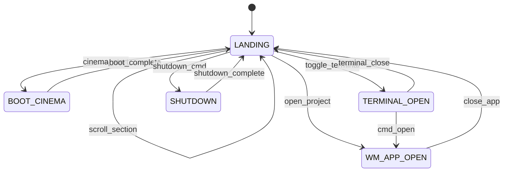

# ROOT OS — Documento Arquitetural Mestre v2

> **Premissa revista:** O visitante entra num **sistema operacional** que se comporta como software profissional — navegável por qualquer pessoa, explorável por quem quiser ir mais fundo.  
> A **landing page** é a interface principal. O **terminal** é uma ferramenta do sistema, não uma barreira.  
> Este documento **substitui integralmente** o ROOT-OS-MASTERPLAN v1.0.0.

---

## Índice

1. [Sumário executivo](#1-sumário-executivo)
2. [Decisão arquitetural — o pivot](#2-decisão-arquitetural--o-pivot)
3. [Nome e identidade v2](#3-nome-e-identidade-v2)
4. [Direção criativa e linguagem visual](#4-direção-criativa-e-linguagem-visual)
5. [Arquitetura de duas camadas](#5-arquitetura-de-duas-camadas)
6. [Narrativa e arco dramático](#6-narrativa-e-arco-dramático)
7. [Storyboard e jornada](#7-storyboard-e-jornada)
8. [Mapa emocional](#8-mapa-emocional)
9. [Landing Page — especificação](#9-landing-page--especificação)
10. [Terminal — especificação](#10-terminal--especificação)
11. [Sincronização bidirecional](#11-sincronização-bidirecional)
12. [Window Manager e aplicações](#12-window-manager-e-aplicações)
13. [Boot cinema (opcional)](#13-boot-cinema-opcional)
14. [Máquina de estados](#14-máquina-de-estados)
15. [Motion Design Bible](#15-motion-design-bible)
16. [Arquitetura de componentes](#16-arquitetura-de-componentes)
17. [Design System v2](#17-design-system-v2)
18. [Estratégia 3D e CRT](#18-estratégia-3d-e-crt)
19. [Experiência mobile](#19-experiência-mobile)
20. [Acessibilidade](#20-acessibilidade)
21. [Performance e budgets](#21-performance-e-budgets)
22. [Stack técnica](#22-stack-técnica)
23. [Modelo de conteúdo](#23-modelo-de-conteúdo)
24. [Roadmap de implementação](#24-roadmap-de-implementação)
25. [Critérios de aceitação global](#25-critérios-de-aceitação-global)
26. [Glossário](#26-glossário)
27. [ADRs](#27-adrs)

---

## 1. Sumário executivo

### O que estamos a construir

Um portfólio **mono-page application** (Next.js App Router) que simula um **sistema operacional profissional** com duas camadas independentes e sincronizadas:

| Camada | Papel | Obrigatória? |
|--------|-------|--------------|
| **Landing Page** | Interface principal — scroll, cards, secções, animações | ✅ Sim |
| **Terminal** | Ferramenta do sistema — comandos, easter eggs, power user | ❌ Não |

O visitante pode:

1. **Entrar e navegar imediatamente** — scroll, cliques, âncoras, hover (recrutadores, designers, gestores)
2. **Explorar como power user** — abrir terminal, comandos Unix, sincronização com a landing
3. **Abrir projetos como aplicações** — janelas do sistema com chrome, estado e transições
4. **Opcionalmente** viver o boot cinema e o arco `shutdown` (delight, não gate)

### Problema que v2 resolve

| Problema v1 | Solução v2 |
|-------------|------------|
| Terminal como interface principal | Landing como centro; terminal opcional |
| Barreira para não-técnicos | Navegação convencional + polimento extremo |
| WOW técnico sacrifica usabilidade | WOW técnico **complementa** usabilidade |
| Projetos como páginas/modais genéricos | Projetos como **aplicações** do WM |
| Narrativa só via CLI | Narrativa via scroll **e** CLI, sincronizadas |

### Diferenciação vs. concorrentes

| Padrão do mercado (evitar) | ROOT OS v2 (fazer) |
|----------------------------|---------------------|
| OS clone decorativo sem conteúdo | Landing substancial + terminal real |
| Terminal fake com 10 comandos | Parser real, 80+ comandos, easter eggs |
| Portfolio scroll genérico Awwwards | Brutalismo digital + painéis industriais + HUD |
| Cyberpunk / neon / gamer | Engenharia, Unix, dashboards profissionais |
| Modal para case studies | Janelas de sistema com chrome e estado |
| Terminal OU website | **Ambos**, sincronizados bidireccionalmente |

### Objectivos mensuráveis

| Objectivo | Indicador |
|-----------|-----------|
| Acessibilidade imediata | ≥80% visitantes chegam a Projetos sem terminal |
| Memorabilidade | "Parece um OS, mas qualquer um navega" |
| Domínio técnico | Terminal funcional, sync bidireccional, WM |
| Exploração power user | ≥15% abrem terminal espontaneamente |
| Tempo na experiência | Mediana ≥3 min (landing) / ≥6 min (com terminal) |
| Conversão | Taxa contacto ≥ baseline portfolio scroll |

---

## 2. Decisão arquitetural — o pivot

### ADR-010 — Landing-first

**Contexto:** Após implementação v1, o terminal tornou-se gate obrigatório. Recrutadores e não-devs abandonam antes de ver conteúdo.

**Decisão:** A landing page passa a ser a **fonte de verdade de navegação**. O terminal reflecte e amplifica acções da landing — nunca bloqueia.

**Consequências:**
- Boot cinema torna-se **opcional** (intro cinematográfica, não login screen)
- Secções mapeiam 1:1 a comandos e apps
- Deep links via hash (`/#projects`) funcionam sem terminal
- Analytics separa `nav_landing_*` vs `cmd_*`

### ADR-011 — Terminal como aplicação do sistema

**Contexto:** Em SO reais, o terminal é uma app — não o ambiente inteiro.

**Decisão:** Terminal comporta-se como **VS Code Integrated Terminal**:
- Minimizável, maximizável, redimensionável, movível
- Nunca ocupa ecrã inteiro automaticamente
- Pode permanecer aberto durante navegação na landing
- Histórico e sessão persistem independentemente do scroll

**Consequências:**
- Remover layout "terminal 70% + apps acima" como default
- Terminal default: **fechado** ou **dock inferior 240px** (user preference)
- `Terminal.app` na taskbar / launcher

### ADR-012 — Projetos como aplicações

**Contexto:** Case studies em modais ou páginas simples não reforçam metáfora OS.

**Decisão:** Cada projeto abre como **janela de aplicação** com title bar, controlos, estado próprio, animações de open/close/focus.

**Consequências:**
- WM reutilizado e reforçado
- Conteúdo de projeto vive dentro de `Window` — nunca `<dialog>` genérico
- Terminal emite `Launching {ProjectName}.app...` / `Application closed.`

---

## 3. Nome e identidade v2

### Naming (mantido)

**Nome oficial:** ROOT OS  
**Tagline:** `ROOT OS 0.2.0 — personal kernel space`  
**Hostname:** `devbox.local`  
**Prompt default:** `guest@devbox:~$`

### Personalidade revista

| Dimensão | v1 | v2 |
|----------|----|----|
| Tom | Terminal diegético exclusivo | Profissional, denso, legível |
| Voz landing | — (inexistente) | Labels de engenharia, métricas, módulos |
| Voz terminal | Man page + dry humor | Mantida — complemento |
| Primeira impressão | "Ligue um computador" | "Sistema profissional que respira" |

### Signature elements

1. **LED de power** — indicador de sistema vivo (canto, discreto); pulso no boot opcional
2. **Grid exposto** — linhas 1px, módulos alinhados a grelha 4/8px
3. **HUD readouts** — indicadores de estado (uptime, section, build) sem sci-fi cliché
4. **Chrome de janela** — controlos `[ _ □ X ]` estilo tiling WM / ferramenta profissional

### Anti-patterns (lista negativa reforçada)

- ❌ Aparência gamer (RGB, glitch decorativo, "LEVEL UP")
- ❌ Sci-fi genérico (hologramas, hex grids neon, interfaces de filme)
- ❌ Cyberpunk cliché (rosa/ciano, chuva, kanji decorativo)
- ❌ Glassmorphism / neumorphism
- ❌ Scroll hijacking como única forma de navegar
- ❌ Terminal fullscreen como estado inicial
- ❌ Emoji como ícones
- ❌ Copy layout da imagem de referência

---

## 4. Direção criativa e linguagem visual

### Matriz de influências

Extrair **linguagem visual** da referência anexada — **nunca** layout, composição ou componentes específicos.

```
Brutalismo digital
        ↓
Sistemas Unix (prompt, paths, man pages)
        ↓
Painéis industriais (bezel, parafusos visuais, labels stamped)
        ↓
Interfaces de engenharia (scopes, readouts, scales)
        ↓
Dashboards (métricas, sparklines, status pills)
        ↓
Window Managers (i3, dwm, tiling — square chrome)
        ↓
CRT (scanlines subtis, phosphor, curvatura localizada)
        ↓
Software profissional (CAD, DAW, IDE, oscilloscope UI)
```

### O que extrair da referência visual

| Dimensão | Extrair | Não copiar |
|----------|---------|------------|
| Densidade visual | Informação por px², painéis compactos | Posição exacta dos blocos |
| Brutalismo digital | Bordas duras, grid visível, sem sombras soft | Composição da imagem |
| HUDs | Indicadores, labels monospace, unidades | Widgets específicos |
| Grids | Grelha 8px, colunas modulares | Número de colunas da ref. |
| Tipografia | Hierarquia display/data/label | Fonte exacta se diferente |
| Painéis | Módulos com header + corpo + footer | Arranjo dos painéis |
| Cartões | Borda 1px, metadata em canto | Card design pixel-perfect |
| Hierarquia | Primary readout > secondary > tertiary | Ordem das secções |

### Pilares estéticos v2

| Pilar | Manifestação na landing | Manifestação no terminal/WM |
|-------|-------------------------|----------------------------|
| Brutalismo digital | Secções em módulos 1px border | Title bars, zero radius |
| Unix | Breadcrumbs `~/section`, paths em labels | Prompt, VFS, man pages |
| Painéis industriais | Headers com código de módulo `MOD-04` | Window chrome stamped |
| Engenharia | Gráficos de processo, timelines técnicas | `top`, `git log` output |
| Dashboards | Skills como métricas, status pills | Monitor.app |
| Window Manager | — | Drag, resize, focus stack |
| CRT | Scanline overlay **local** no hero (opcional) | Boot cinema, shader boot |
| Software profissional | Densidade, sem decoração gratuita | Apps com toolbar interna |

### Paleta (OKLCH, dark-first — evoluída)

| Token | Valor | Uso |
|-------|-------|-----|
| `--bg-void` | oklch(0.07 0.01 260) | Fundo base, hero |
| `--bg-panel` | oklch(0.11 0.015 260) | Módulos landing, cards |
| `--bg-terminal` | oklch(0.12 0.02 145) | Terminal emulator |
| `--phosphor-primary` | oklch(0.78 0.18 145) | Terminal text, accents técnicos |
| `--phosphor-dim` | oklch(0.55 0.10 145) | Labels secundários |
| `--amber-led` | oklch(0.75 0.16 75) | LED, warnings, HUD highlights |
| `--amber-warm` | oklch(0.70 0.12 65) | CRT glow, warm indicators |
| `--stderr` | oklch(0.65 0.20 25) | Erros |
| `--ui-chrome` | oklch(0.16 0.01 260) | Title bars, taskbar |
| `--ui-border` | oklch(0.32 0.02 260) | Bordas brutalistas 1px |
| `--ui-text` | oklch(0.88 0.01 260) | Body landing |
| `--ui-text-dim` | oklch(0.62 0.01 260) | Captions, metadata |
| `--accent-data` | oklch(0.72 0.08 230) | Links, dados destacados (único azul) |
| `--grid-line` | oklch(0.22 0.01 260 / 0.6) | Grelha exposta |

**Regras:** máximo 1 acento além do phosphor. Sem gradientes rainbow. Sem glassmorphism. Scanlines com opacidade ≤8%.

### Tipografia

| Role | Fonte | Uso |
|------|-------|-----|
| Terminal / code / HUD data | **IBM Plex Mono** | Terminal, readouts, metadata técnica |
| UI / landing body | **IBM Plex Sans** | Prosa, labels, navegação |
| Display / hero | **IBM Plex Sans** weight 600 | Headlines — **não** serif genérico |
| Boot POST only | **Space Mono** | Sequência boot opcional |

Tamanhos: body 16px; terminal 14px (16px mobile); HUD labels 11px uppercase tracking-wide.

---

## 5. Arquitetura de duas camadas

### Diagrama conceptual

```
┌─────────────────────────────────────────────────────────────────────┐
│ L0 — BOOT CINEMA (opcional, R3F + CRT)              scroll-to-enter │
├─────────────────────────────────────────────────────────────────────┤
│ L1 — LANDING PAGE (interface principal)              always mounted │
│   Hero │ Manifesto │ Projetos │ Processo │ Skills │ Timeline │ ... │
├─────────────────────────────────────────────────────────────────────┤
│ L2 — SYSTEM CHROME (taskbar, HUD, LED, launcher)     persistent     │
├─────────────────────────────────────────────────────────────────────┤
│ L3 — WINDOW MANAGER (aplicações / projetos)          on demand      │
├─────────────────────────────────────────────────────────────────────┤
│ L4 — TERMINAL.APP (xterm + parser)                   optional       │
│   minimizable │ resizable │ dockable │ closable                     │
├─────────────────────────────────────────────────────────────────────┤
│ L5 — SYNC BUS (landing ↔ terminal ↔ WM)              always on      │
└─────────────────────────────────────────────────────────────────────┘
```

### Z-index stack

| Z | Layer | pointer-events | Notas |
|---|-------|----------------|-------|
| 0 | Landing scroll content | auto | Lenis smooth scroll |
| 5 | Grid overlay decorativo | none | Opcional, baixa opacidade |
| 10 | Landing fixed chrome (nav HUD) | auto | Sticky header |
| 20 | GUI windows (WM) | auto | Acima da landing quando focadas |
| 25 | Terminal.app | auto | Docked ou floating |
| 30 | Taskbar / system HUD | auto | Sempre visível |
| 40 | Command palette / modais sistema | auto | man, help overlay |
| 50 | Boot cinema overlay | auto durante intro | Dismissível |
| 60 | CRT transition (shutdown) | none | Opcional |

### Princípio de independência

- Landing **funciona sem terminal** — 100% do conteúdo acessível
- Terminal **funciona sem scroll** — comandos `goto` movem landing programaticamente
- WM **independente** — janelas podem abrir por clique na landing ou `open` no terminal
- Sync bus **eventual consistency** — nunca loop infinito; toda acção tem `source: landing | terminal | wm`

---

## 6. Narrativa e arco dramático

### Estrutura revista — 2 eixos paralelos

```
EIXO A — LANDING (universal)     Scroll → Descoberta → Projetos → Contacto
EIXO B — TERMINAL (opcional)     Abrir shell → Comandos → Easter eggs → Shutdown
```

Os eixos **convergem** no sync bus — acções num reflectem no outro.

### Arco em 4 fases (não bloqueantes)

| Fase | Nome | Trigger | Função emocional | Obrigatória |
|------|------|---------|------------------|-------------|
| 0 | **Boot** (opcional) | Primeira visita / `?cinema=1` | Antecipação, craft | ❌ |
| 1 | **Surface** | Load landing | Confiança, clareza | ✅ |
| 2 | **Depth** | Scroll / projetos / terminal | Competência, curiosidade | ✅ parcial |
| 3 | **Handshake** | Contacto / `contact` | Conversão | Opcional |
| 4 | **Closure** (opcional) | `shutdown` | Gratificação, filme | ❌ |

### Linha narrativa

**Landing:** voz de sistema profissional — módulos, métricas, paths como labels decorativos (`~/projects`, `MOD-SKILLS`). Não quebra quarta parede excepto easter eggs.

**Terminal:** mantém voz diegética v1 — man pages, dry humor, `[system]` messages.

**Coerência:** ambas as vozes são "engenharia honesta" — sem marketing fluff.

### Progressão

| Modo | Comportamento |
|------|---------------|
| **Visitante casual** | Landing only; nunca vê terminal se não quiser |
| **Visitante curioso** | Clica "Terminal" na taskbar; sync mostra relação |
| **Power user** | Terminal aberto persistente; navega via CLI |
| **Return visitor** | `localStorage` restaura terminal dock + última secção |

---

## 7. Storyboard e jornada

### 7.1 Storyboard — Entrada (0:00–0:30)

| Frame | Visual | Interacção | Terminal |
|-------|--------|------------|----------|
| 0.0 | Landing hero visível — nome, role, HUD status | Scroll imediato | Fechado ou minimizado |
| 0.1 | Nav HUD sticky: secções + ícone Terminal | Hover estados | — |
| 0.2 | Hero anima: stagger lines, LED pulse 1× | — | — |
| 0.3 | (Opcional) Hint discreto: "⌘` terminal" | Click abre Terminal.app | Slide up dock |

**Regra:** em **0.0** o visitante já vê conteúdo útil — zero blackout obrigatório.

### 7.2 Storyboard — Boot opcional (cinema)

| Frame | Visual | Interacção |
|-------|--------|------------|
| B.0 | Overlay escuro + silhueta gabinete | Scroll ou "Enter system" |
| B.1 | LED âmbar ON | Click power |
| B.2 | CRT flicker → POST lines | Esc skip |
| B.3 | Dissolve para landing hero | Auto |

Boot **não** inclui login obrigatório. POST termina com landing visível.

### 7.3 Storyboard — Navegação landing

| Secção | Acção utilizador | Resposta visual | Sync terminal (se aberto) |
|--------|------------------|-----------------|---------------------------|
| Hero | Scroll | Parallax subtil módulos HUD | — |
| Manifesto | Click "Read" ou scroll | Text reveal stagger | `cat manifesto.md` echo |
| Projetos | Click card | Scroll + highlight grid | `$ cd projects` |
| Processo | Scroll into view | Timeline horizontal scrub | `goto process` |
| Skills | Hover métricas | Bars animate | `skills` output |
| Timeline | Scroll | Commit graph draw | `git log --oneline` |
| Contacto | Focus form | Field glow | `contact` |
| Footer | Click link | External / mailto | — |

### 7.4 Storyboard — Abrir projeto

| Frame | Visual | Terminal | WM |
|-------|--------|----------|-----|
| P.0 | Click project card | `Launching KernelBot.app...` | — |
| P.1 | Window chrome anima scaleY 0→1 | `PID: 4412 [running]` | Window open |
| P.2 | Conteúdo case study | — | App state |
| P.3 | Close window | `Application closed.` | scaleY →0 |

### 7.5 Jornada por persona

```
RECRUTADOR (90s)
  Entrada → Hero (5s) → Projetos (60s) → Contacto (25s)
  Terminal: nunca abre

DESIGNER / GESTOR (2min)
  Entrada → Hero → Manifesto → Projetos (1 janela) → Contacto
  Terminal: opcional, descobre sync

DEV CURIOSO (8min)
  Hero → Abre terminal → help → projects → easter eggs → shutdown

RETURN VISITOR
  fastboot landing → última secção → terminal dock restaurado
```

### Caminhos críticos

1. **Conversão rápida:** `/#contact` → form usable em <3s
2. **Prova técnica:** Hero → Terminal → `projects` → open app → `stack`
3. **Delight:** Boot cinema → explorar → `shutdown` completo

---

## 8. Mapa emocional

### Curva de intensidade

```
Intensidade
    ▲
    │     Boot*        Project open      Shutdown*
    │       ╱╲              ╱╲              ╱╲
    │      ╱  ╲            ╱  ╲            ╱  ╲
    │─────╱────╲──────────╱────╲──────────╱────╲────► Tempo
    │   Hero   Manifesto  Skills  Contact
    │   confiança        competência      conversão
    │
    * picos opcionais — não bloqueiam curva base
```

### Emoções por secção

| Secção | Emoção alvo | Risco se mal executado | Mitigação |
|--------|-------------|------------------------|-----------|
| Hero | Confiança, curiosidade técnica | Confusão "o que faço?" | CTA claro + scroll hint |
| Manifesto | Identidade, filosofia | Texto longo demais | Máx 120 palavras visíveis |
| Projetos | Competência, desejo | Modal genérico | Window.app com polish |
| Processo | Método, profissionalismo | Stock process fluff | Steps reais do autor |
| Skills | Densidade técnica | Gráfico vazio | Dados de `skills.json` |
| Timeline | Evolução, narrativa | Lista sem grafo | Git graph animado |
| Contacto | Facilidade, handshake | Form intimidante | 3 campos máx |
| Terminal | Poder, exploração | Barreira | Opcional, dock pequeno |
| Shutdown | Closure, memorável | Forçado | Só via comando |

### Micro-momentos de delight (sem bloquear)

- LED morse ao 5× click
- Sync terminal ao scroll (se terminal aberto)
- `Launching *.app...` ao abrir projeto
- Konami → phosphor invert 2s
- Idle terminal 5min → screensaver phosphor

---

## 9. Landing Page — especificação

### Secções (ordem fixa)

| ID | Secção | Âncora | Conteúdo fonte |
|----|--------|--------|----------------|
| S01 | **Hero** | `#hero` | `profile.json` |
| S02 | **Manifesto** | `#manifesto` | `manifesto.md` |
| S03 | **Projetos** | `#projects` | `projects/index.json` + MD |
| S04 | **Processo** | `#process` | `process.json` (novo) |
| S05 | **Skills** | `#skills` | `skills.json` |
| S06 | **Timeline** | `#timeline` | `timeline.json` |
| S07 | **Contacto** | `#contact` | `contact.json` |
| S08 | **Footer** | `#footer` | `site.json`, links |

### Hero — requisitos

- Nome, role, one-liner, links primários (GitHub, LinkedIn, CV)
- HUD strip: `uptime`, `build`, `locale` (dados reais ou plausíveis)
- LED power + status `ONLINE`
- Scroll indicator animado (não bloqueante)
- **Sem** exigir interacção para ver conteúdo

### Manifesto — requisitos

- Texto curto; tipografia sans legível (não só monospace)
- Painel com header `MOD-MANIFESTO` ou `~/manifesto.md`
- Expand opcional para texto completo
- Animação: line stagger on scroll (GSAP ScrollTrigger)

### Projetos — requisitos

- Grid de cards módulo (borda 1px, metadata corner)
- Cada card: title, year, stack pills, summary 1 linha
- Click → abre **Project.app** no WM (não navega para rota)
- Hover: highlight bar 2px left + quick metrics (GSAP quickTo)
- Featured projects maior densidade visual

### Processo — requisitos (novo)

- 4–6 steps do workflow real do autor
- Layout: horizontal scroll ou vertical numbered modules
- Cada step: código `STEP-01`, título, 1 frase
- Evitar ícones stock; usar labels monospace

### Skills — requisitos

- Visualização tipo dashboard: barras, sparklines, ou process list estático
- Dados de `skills.json` — nunca hardcoded fake
- Categorias: frontend, motion, tooling, etc.
- Hover: valor exacto + última utilização (plausível)

### Timeline — requisitos

- Git-style graph (commits de `timeline.json`)
- Animação draw-on-scroll
- Click commit → expand message (inline, não modal)

### Contacto — requisitos

- Form: nome, email, mensagem (RHF + Zod)
- Estilo Mail.app / industrial form (labels acima, borders 1px)
- Submit → toast stderr-style success + terminal echo se aberto
- Fallback `mailto:` se webhook indisponível

### Footer — requisitos

- Copyright, versão ROOT OS, links legais
- Toggle tema (phosphor / amber / paper)
- Link "Shutdown" → easter egg (não destaque)

### Navegação

| Elemento | Comportamento |
|----------|---------------|
| HUD nav sticky | Scroll spy; click → smooth scroll Lenis |
| Keyboard | `1-8` jump sections (power user) |
| Skip link | "Skip to projects" focusable |
| Mobile | Bottom nav ou hamburger → sheet |

### Animações landing (obrigatório polido)

- Cada secção: entrance on scroll (stagger children)
- Hover em todos os clicáveis (hover-effects skill)
- Parallax **subtil** apenas em hero (máx 8% translate)
- `prefers-reduced-motion`: opacity-only 150ms
- Lenis smooth scroll global na landing

---

## 10. Terminal — especificação

### Comportamento VS Code-like

| Capacidade | Especificação |
|------------|---------------|
| **Abrir** | Taskbar icon, shortcut `` ` `` ou `Ctrl+`` ` ``, launcher |
| **Fechar** | `[ X ]` ou `exit` (hint, não fecha site) |
| **Minimizar** | `[ _ ]` → taskbar ghost |
| **Maximizar** | `[ □ ]` → 80% viewport max; **nunca** 100% auto |
| **Redimensionar** | Handle 4px canto inferior direito |
| **Mover** | Drag title bar |
| **Dock** | Bottom default 240px; snap left/right opcional |
| **Persistência** | Posição, tamanho, dock state em localStorage |
| **Histórico** | Ring buffer 500, persist |
| **Coexistência** | Landing scrollável com terminal docked |

### Layout default por estado

| Estado | Terminal | Landing |
|--------|----------|---------|
| First visit | Fechado | Full viewport |
| User opens | Dock bottom 240px | Scroll acima |
| User maximizes | 80% height | Parcialmente visível |
| User floats | Draggable window | Full interaction |
| Mobile | Sheet bottom 40% | 60% landing |

### Stack (mantida de v1)

| Peça | Tecnologia |
|------|------------|
| Emulator | xterm.js 6 + FitAddon + WebLinksAddon |
| Parser | Custom TypeScript |
| Autocomplete | Trie + Tab cycles |
| Man pages | MD → terminal formatter |

### Comandos novos / revistos v2

| Comando | Acção landing |
|---------|---------------|
| `goto <section>` | Scroll para `#section` |
| `goto contact` | Scroll + focus primeiro campo |
| `goto projects` | Scroll + pulse grid |
| `about` | Scroll hero + highlight |
| `skills` | Scroll skills |
| `open <project>` | Abre Project.app |
| `close` | Fecha app focada |
| `terminal` | Toggle terminal visibility |
| `dock` | Cycle dock positions |
| `help` | Lista + secções landing |

Comandos v1 mantidos: `ls`, `cd`, `cat`, `whoami`, `projects`, `contact`, `git log`, `top`, `shutdown`, easter eggs.

### Output diegético para sync

```
guest@devbox:~$ cd projects
[system] navigated → #projects
guest@devbox:~/projects$ 

guest@devbox:~/projects$ open kernelbot
Launching KernelBot.app...
[system] PID 4412 — window focused
```

---

## 11. Sincronização bidirecional

### Sync Bus — arquitectura conceptual

```
┌──────────────┐     events      ┌──────────────┐
│   Landing    │◄───────────────►│  Sync Store  │
│  (scroll UI) │                 │   (Zustand)  │
└──────────────┘                 └──────┬───────┘
                                        │
┌──────────────┐                        │
│  Terminal    │◄───────────────────────┤
│  (parser)    │                        │
└──────────────┘                        │
                                        │
┌──────────────┐                        │
│     WM       │◄───────────────────────┘
│  (windows)   │
└──────────────┘
```

### Eventos canónicos

| Evento | Source | Landing | Terminal | WM |
|--------|--------|---------|----------|-----|
| `section.enter` | landing scroll | highlight nav | writeln path | — |
| `section.goto` | terminal/cmd | scrollTo | update cwd | — |
| `project.open` | landing click | — | launch msg | open window |
| `project.close` | wm | — | closed msg | destroy |
| `terminal.toggle` | taskbar | — | open/close | resize reflow |
| `app.focus` | wm | optional breadcrumb | `fg %n` | focus stack |

### Regras anti-loop

1. Todo evento inclui `origin` — handlers ignoram echo (`origin === self`)
2. Scroll spy debounced 100ms — não spam terminal
3. Terminal writeln sync max 1 linha por acção utilizador
4. Comandos `goto` não disparam se já na secção (silent success)

### Matriz de exemplos

| Acção utilizador | Terminal (se aberto) | Landing |
|------------------|----------------------|---------|
| Click "Projetos" nav | `$ cd projects` | scroll #projects |
| Scroll para Skills | `[system] section skills` | — |
| `goto contact` | — | scroll + focus form |
| Click project card | `Launching X.app...` | — |
| Close project window | `Application closed.` | — |
| `help` | command list | pulse nav HUD |

---

## 12. Window Manager e aplicações

### Princípios

- Janelas são **aplicações** — nunca modais genéricos
- Cada janela: title bar, controlos, conteúdo scrollável, estado
- Projetos = apps dinâmicas registadas em runtime
- Apps sistema = Profile, Monitor, Mail, Terminal (meta)

### Apps sistema

| AppId | Título | Abre via | Conteúdo |
|-------|--------|----------|----------|
| `terminal` | Terminal.app | taskbar, `` ` `` | xterm embed |
| `project-{slug}` | `{Name}.app` | card click, `open` | Case study |
| `mail` | Mail.app | contact CTA, `contact` | Form (pode mirror secção) |
| `monitor` | Monitor.app | `top`, `skills` | Skills live |
| `timeline` | Timeline.app | `git log` | Graph (pode mirror secção) |
| `editor` | Editor.app | `cat manifesto.md` | Split md/raw |
| `man` | Man.app | `man <cmd>` | Man page browser |

### Window chrome spec

```
┌─[■]─ {AppName}.app ──────────────────── [ _ ][ □ ][ X ]─┐
│ optional toolbar: breadcrumbs · actions                  │
├────────────────────────────────────────────────────────┤
│                                                        │
│  content area (scroll)                                 │
│                                                        │
└────────────────────────────────────────────────────────┘
```

- Controlos: `[ _ ]` minimize, `[ □ ]` maximize, `[ X ]` close
- Borda focused: `--phosphor-primary` 1px; unfocused: `--ui-border`
- Animação open: scaleY 0→1, 400ms power2.out (GSAP)
- Animação close: scaleY →0, 300ms
- Drag: title bar; resize: handle 4px brutalist
- **Nunca** backdrop escuro fullscreen tipo modal

### Project.app — conteúdo

- Header: role, year, stack
- Body: MD/MDX render do README
- Sidebar opcional: links demo/repo, screenshots
- Footer toolbar: `open demo`, `view repo`
- Estado: scroll position persist por sessão

---

## 13. Boot cinema (opcional)

### Quando activar

| Condição | Comportamento |
|----------|---------------|
| Primeira visita desktop | Overlay "Scroll to boot" ou auto após 2s idle |
| `?cinema=1` | Força boot |
| `?fastboot=1` | Skip boot |
| Return + `fastboot` localStorage | Skip |
| Mobile coarse pointer | Text boot 5 linhas max, sem 3D |
| `prefers-reduced-motion` | POST text instant |

### Fluxo revisto

Boot → dissolve → **landing hero** (não login, não terminal fullscreen)

### 3D (mantido scope v1)

- R3F + CRT shader + dust particles — **só** boot
- Teardown canvas após boot complete
- Login chapter **removido** como gate

---

## 14. Máquina de estados

### Estados top-level



### Session store (conceptual)

| Key | Type | Persist |
|-----|------|---------|
| `activeSection` | SectionId | session |
| `terminal` | `{ visible, dock, bounds, minimized }` | local |
| `user` | `guest` | local |
| `cwd` | string path | session |
| `history[]` | string[] | local |
| `openApps[]` | AppId[] | session |
| `focusStack[]` | z-order | session |
| `flags.easterEggs` | Set | local |
| `flags.cinemaSeen` | boolean | local |
| `fastboot` | boolean | local |
| `syncOrigin` | nullable | ephemeral |

### Fase `phase` enum (revisto)

```
intro_optional | landing | terminal_docked | wm_focus | shutdown
```

Removido: `login`, `shell` como gates obrigatórios.

---

## 15. Motion Design Bible

> **Regra:** nenhuma animação sem entrada nesta tabela. Landing animations são **prioridade v2**.

### Landing — scroll animations

| ID | Objetivo | Gatilho | Duração | Lib | Secção |
|----|----------|---------|---------|-----|--------|
| L-001 | Hero entrance | load | 800ms stagger | GSAP | S01 |
| L-002 | HUD strip fade | load +200ms | 400ms | GSAP | S01 |
| L-003 | Scroll indicator | loop | 1500ms yoyo | Motion | S01 |
| L-004 | Section reveal | inView | 600ms stagger | GSAP ST | all |
| L-005 | Card grid stagger | inView | 50ms/card | GSAP | S03 |
| L-006 | Skills bars | inView | 800ms | GSAP | S05 |
| L-007 | Timeline draw | inView | 1000ms | GSAP drawSVG | S06 |
| L-008 | Form focus glow | focus | 200ms | Motion | S07 |
| L-009 | Nav scroll spy | scroll | instant | JS | nav |
| L-010 | Parallax hero | scroll | scrub 0-300px | GSAP ST | S01 |

### Terminal / WM

| ID | Objetivo | Gatilho | Duração | Lib |
|----|----------|---------|---------|-----|
| T-001 | Terminal dock slide | open | 350ms | GSAP |
| T-002 | Terminal minimize | click _ | 250ms | GSAP |
| T-003 | Window open | project click | 400ms | GSAP |
| T-004 | Window close | X | 300ms | GSAP |
| T-005 | Sync writeln | sync event | typewriter 40ms/char | xterm |
| T-006 | Launch message | open app | 600ms sequence | GSAP + writeln |

### Boot (opcional)

| ID | Objetivo | Gatilho | Duração | Lib |
|----|----------|---------|---------|-----|
| M-001–M-008 | Mantidos de v1 | cinema | — | GSAP/R3F |

### Microinterações (hover-effects)

| ID | Elemento | Stack |
|----|----------|-------|
| H-01 | Nav HUD items | Tailwind + underline slide |
| H-02 | Project cards | GSAP quickTo left bar |
| H-03 | Window title bar | brightness |
| H-04 | Terminal tab | phosphor underline |
| H-05 | Form submit | Motion whileTap 0.98 |
| H-06 | Skill metric | value count-up |

### prefers-reduced-motion

| Contexto | Fallback |
|----------|----------|
| Landing scroll reveals | opacity 150ms |
| Lenis | disabled, native scroll |
| Boot 3D | static + text POST |
| Window animations | opacity only |
| Parallax | disabled |

---

## 16. Arquitetura de componentes

### Árvore React (conceptual v2)

```
<RootOSProvider>
  <BootCinema />              // optional overlay
  <LandingPage>               // PRIMARY
    <SystemHud />             // sticky nav + LED + terminal toggle
    <HeroSection />
    <ManifestoSection />
    <ProjectsSection />       // cards → WM
    <ProcessSection />
    <SkillsSection />
    <TimelineSection />
    <ContactSection />
    <FooterSection />
  </LandingPage>
  <WindowManager>             // floating above
    <ProjectApp slug="..." />
    ...
  </WindowManager>
  <TerminalApp />             // dockable, optional
  <SystemTaskbar />
  <SyncBusListener />         // invisible orchestrator
  <ShutdownOverlay />         // optional easter
</RootOSProvider>
```

### Módulos

| Módulo | Responsabilidade |
|--------|------------------|
| `landing/*` | Secções, scroll, Lenis |
| `sync/sync-bus` | Eventos bidireccionais |
| `sync/scroll-spy` | Section detection |
| `terminal/*` | Parser, xterm (v1 mantido) |
| `wm/*` | Window manager (v1 evoluído) |
| `apps/project/*` | Project.app shell |
| `session-store` | Estado global |
| `boot/*` | Cinema opcional |
| `content/*` | Loaders |

### Fronteiras

- Landing **não** importa xterm directamente
- Terminal **não** manipula DOM da landing — só via sync store
- WM recebe `openApp` de landing ou terminal indistintamente

---

## 17. Design System v2

### Tokens (adições a v1)

```css
--space-unit: 4px;
--grid-gap: 8px;
--border-width: 1px;
--radius-sm: 2px;
--radius-none: 0;
--titlebar-height: 28px;
--taskbar-height: 36px;
--hud-height: 48px;
--terminal-min-height: 180px;
--terminal-default-height: 240px;
--terminal-max-height: 80vh;
--section-padding-y: clamp(4rem, 12vh, 8rem);
--scanline-opacity: 0.06;
--window-shadow: none;
```

### Componentes novos

| Component | Uso |
|-----------|-----|
| `HudNav` | Sticky section nav |
| `ModulePanel` | Container brutalist landing |
| `HudReadout` | Label + value monospace |
| `ProjectCard` | Grid item → opens app |
| `MetricBar` | Skills visualization |
| `TerminalApp` | Dockable terminal shell |
| `WindowChrome` | `[ _ □ X ]` |
| `SyncIndicator` | Optional debug badge |

### Componentes mantidos

`Button`, `Input`, `ScrollArea`, `Tabs`, `Toast` — evoluídos para densidade v2.

### Themes (3)

1. **phosphor** (default)
2. **amber** (DEC/industrial)
3. **paper** (light a11y)

---

## 18. Estratégia 3D e CRT

| Contexto | R3F | Shaders | Particles |
|----------|-----|---------|-----------|
| Boot cinema opcional | ✅ | CRT | dust ≤30 |
| Hero CRT accent | ❌ CSS only | scanline overlay | ❌ |
| Landing | ❌ | ❌ | ❌ |
| WM / apps | ❌ | ❌ | ❌ |
| Terminal | ❌ | ❌ | ❌ |

**Hero CRT accent:** pseudo-element `repeating-linear-gradient` scanlines, opacidade ≤6% — sem WebGL.

---

## 19. Experiência mobile

### Princípio

Mobile = **landing first** com terminal em sheet — nunca terminal fullscreen default.

### Layout

```
┌─────────────────────┐
│ HUD nav compact     │
├─────────────────────┤
│                     │
│   Landing sections  │  scroll vertical
│                     │
├─────────────────────┤
│ [Projects][Term][≡] │  bottom bar
└─────────────────────┘
```

### Adaptações

| Desktop | Mobile |
|---------|--------|
| Terminal dock | Bottom sheet 40% |
| Hover | `:active` + touch feedback |
| Project windows | Fullscreen minus taskbar (único caso fullscreen) |
| Boot 3D | Text boot 5 linhas |
| Lenis | Opcional, touch-native scroll preferred |

Touch targets ≥44px (P2 frontend-pro).

---

## 20. Acessibilidade

### Prioridades v2

| Área | Requisito |
|------|-----------|
| Navegação sem terminal | 100% conteúdo via scroll + nav |
| Contraste | ≥4.5:1 todos os themes |
| Teclado | Tab order: skip → nav → content → terminal |
| Screen reader | Landmarks por secção `<main>`, `<section aria-labelledby>` |
| Focus | Visible 2px phosphor ring |
| Reduced motion | §15 fallbacks |
| Terminal | `aria-live="polite"` para sync writes |
| Forms | Labels, inline errors |

### Skip links

1. Skip to content
2. Skip to projects
3. Skip boot (se cinema activo)

---

## 21. Performance e budgets

| Métrica | Target v2 |
|---------|-----------|
| LCP (landing first) | < 2.0s |
| LCP (com cinema) | < 3.5s |
| JS initial (sem R3F) | < 200kb gzip |
| R3F chunk | lazy, < 250kb gzip |
| CLS | < 0.08 |
| Lenis | < 1ms/frame overhead |

### Estratégias

- Landing SSR/SSG para hero + projects metadata
- xterm dynamic import só ao abrir terminal
- Boot cinema dynamic import
- Images AVIF
- ScrollTrigger refresh debounced

---

## 22. Stack técnica

| Layer | Tech |
|-------|------|
| Framework | Next.js 15+, React 19, TypeScript |
| Styling | Tailwind CSS v4 |
| Scroll | **Lenis** (landing) — activado v2 |
| Terminal | xterm.js 6 |
| State | Zustand (session + sync) |
| Content | MD/JSON `/content` |
| 3D | R3F boot only |
| Animation | GSAP + ScrollTrigger; Motion |
| Forms | RHF + Zod |
| Deploy | Vercel |

### Mapa skill → uso v2

| Skill | Onde |
|-------|------|
| **gsap** | Landing scroll, WM, boot |
| **framer-motion** | Micro UI, layout apps |
| **lenis** | Landing smooth scroll |
| **hover-effects** | Cards, nav, buttons |
| **r3f-shaders** | Boot cinema only |
| **particles** | Boot dust only |

---

## 23. Modelo de conteúdo

### Estrutura `/content` (evoluída)

```
content/
├── profile.json
├── site.json
├── manifesto.md
├── process.json          # NOVO
├── projects/
│   └── {slug}/README.md + meta.json
├── timeline.json
├── skills.json
├── contact.json
├── motd.txt
├── os-release
└── easter-eggs.json
```

### Schema `process.json` (novo)

```json
{
  "steps": [
    { "id": "STEP-01", "title": "Discover", "description": "..." },
    { "id": "STEP-02", "title": "Design", "description": "..." }
  ]
}
```

### Secção → ficheiro mapping

| Secção | Fonte |
|--------|-------|
| Hero | `profile.json` |
| Manifesto | `manifesto.md` |
| Projetos | `projects/index.json` |
| Processo | `process.json` |
| Skills | `skills.json` |
| Timeline | `timeline.json` |
| Contacto | `contact.json` |

---

## 24. Roadmap de implementação

### Fase A — Pivot estrutural (Semana 1–2)

- [ ] Landing page scaffold com 8 secções (conteúdo estático)
- [ ] Lenis + scroll spy + HudNav
- [ ] Sync store foundation
- [ ] Terminal.app refactor (dockable, não fullscreen)
- [ ] Remover gate terminal-first do flow

**DoD:** Visitante navega landing completa sem terminal; terminal abre/fecha como app.

### Fase B — Sync bidireccional (Semana 2–3)

- [ ] `section.enter` → terminal writeln
- [ ] `goto` commands → scroll
- [ ] Project card click → WM + launch message
- [ ] Nav click → terminal echo
- [ ] Anti-loop guards

**DoD:** Matriz §11 exemplos funcionais.

### Fase C — WM + Project.apps (Semana 3–4)

- [ ] Project.app template
- [ ] Window chrome polish
- [ ] Apps open from landing e terminal
- [ ] Focus stack + taskbar

**DoD:** Projetos abrem como janelas; nunca modal genérico.

### Fase D — Motion polish (Semana 4–5)

- [ ] Landing animations L-001–L-010
- [ ] Hover micro H-01–H-06
- [ ] Terminal/WM transitions T-001–T-006
- [ ] `prefers-reduced-motion` complete

**DoD:** Review frontend-pro com screenshots matriz 375/768/1440.

### Fase E — Boot opcional + mobile (Semana 5)

- [ ] Boot cinema como overlay opcional
- [ ] Mobile sheet terminal + bottom nav
- [ ] fastboot / cinema query params

**DoD:** Mobile usable; boot skippable.

### Fase F — Easter eggs + shutdown + QA (Semana 6)

- [ ] Easter eggs v1 portados
- [ ] Shutdown opcional
- [ ] a11y audit
- [ ] Performance pass

**DoD:** Lighthouse a11y ≥90; LCP <2.5s landing.

### Migração desde v1 implementado

| Componente v1 | Acção v2 |
|---------------|----------|
| `desktop.tsx` terminal-first | Refactor → `LandingPage` + `TerminalApp` |
| `root-os-intro.tsx` | Boot opcional overlay |
| `use-intro-controller` | Simplificar; sem login gate |
| WM existente | Reutilizar + Project apps |
| Terminal parser | Manter + `goto` commands |
| Mobile shell | Adaptar para landing-first |

---

## 25. Critérios de aceitação global

### Bloqueantes (release)

- [ ] Landing 100% navegável sem terminal
- [ ] 8 secções implementadas com conteúdo real
- [ ] Terminal opcional: open/close/min/max/resize/move
- [ ] Sync bidireccional: ≥6 cenários da matriz §11
- [ ] Projetos abrem em janelas WM
- [ ] Mobile landing funcional
- [ ] `prefers-reduced-motion` respeitado
- [ ] Contraste WCAG AA
- [ ] LCP < 2.5s landing path

### Major (deve ter)

- [ ] Lenis smooth scroll
- [ ] Scroll animations todas secções
- [ ] Boot cinema opcional
- [ ] Terminal histórico persist
- [ ] 40+ comandos funcionais

### Minor (polish)

- [ ] Easter eggs v1 portados
- [ ] Shutdown cinema
- [ ] HUD readouts dinâmicos
- [ ] Themes amber/paper

---

## 26. Glossário

| Termo | Definição |
|-------|-----------|
| **Landing** | Interface principal scrollável — centro da experiência v2 |
| **Terminal.app** | Aplicação dockable do sistema — xterm + parser |
| **Sync Bus** | Camada de eventos bidireccionais landing ↔ terminal ↔ WM |
| **Project.app** | Janela WM para case study individual |
| **HUD** | Elementos de leitura tipo dashboard (status, métricas) |
| **Module Panel** | Container brutalist com header/corpo |
| **Boot cinema** | Intro 3D opcional — não gate |
| **WM** | Window Manager — focus stack, drag, resize |
| **VFS** | Virtual filesystem — conteúdo `/content` |
| **fastboot** | Skip boot cinema |

---

## 27. ADRs

| ID | Decisão | Razão |
|----|---------|-------|
| ADR-010 | Landing-first | Acessibilidade não-técnica |
| ADR-011 | Terminal como app | Paridade SO real; VS Code model |
| ADR-012 | Projetos como apps | Reforço metáfora OS |
| ADR-013 | Lenis activado v2 | Landing scroll polish |
| ADR-014 | Boot opcional | Remover gate; manter delight |
| ADR-015 | Login chapter removido | Fricção desnecessária |
| ADR-016 | Referência visual: linguagem only | Evitar cópia; extrair densidade/HUD |

---

## Apêndice A — Comparação v1 → v2

| Aspecto | v1 | v2 |
|---------|----|----|
| Interface principal | Terminal | Landing |
| Primeiro ecrã | Blackout/boot | Hero landing |
| Login guest | Obrigatório | Removido |
| Navegação | Comandos | Scroll + nav + comandos |
| Terminal default | Fullscreen 70% | Fechado / dock 240px |
| Projetos | Projects.app via CLI | Cards + Project.app |
| Lenis | Off | On (landing) |
| Capítulos 0–10 | Linear obrigatório | Fases opcionais |
| Recrutador path | Precisa CLI | Scroll only |
| Shutdown | Arco final | Easter egg opcional |

---

## Apêndice B — Validação visual (implementação)

Quando a implementação UI iniciar:

1. Revalidar tokens contra imagem de referência (densidade, HUD, grid)
2. Executar frontend-pro Review com screenshots 375/768/1440
3. Checklist anti-slop e anti-cyberpunk
4. Confirmar: zero cópia de layout da referência

---

*Documento v2.0.0 — SSOT oficial ROOT OS. Substitui integralmente v1.0.0. Qualquer agente implementador deve seguir este plano. Decisões criativas adicionais requerem ADR novo aprovado pelo utilizador.*
