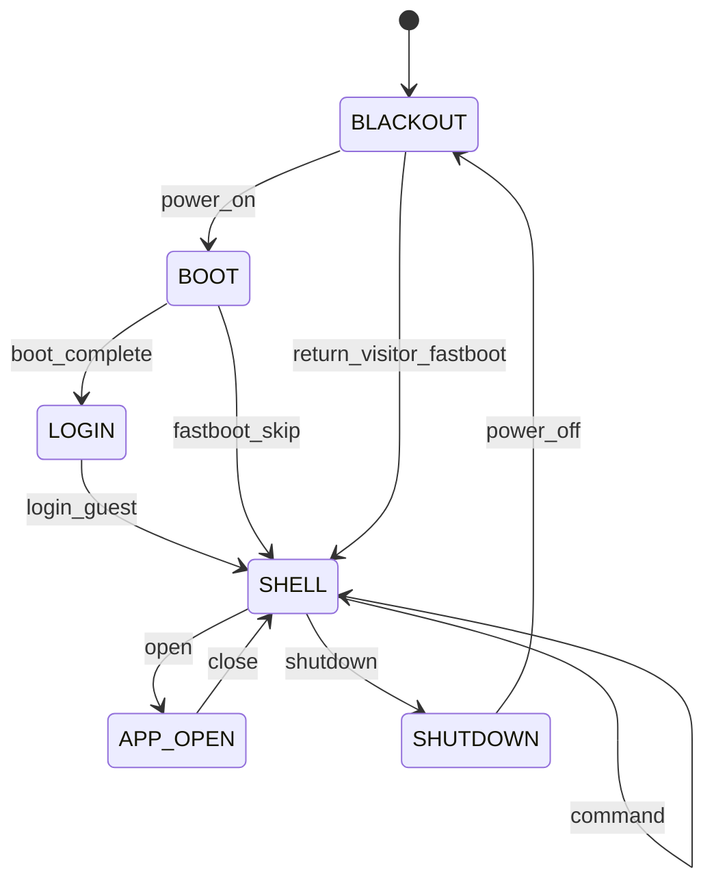
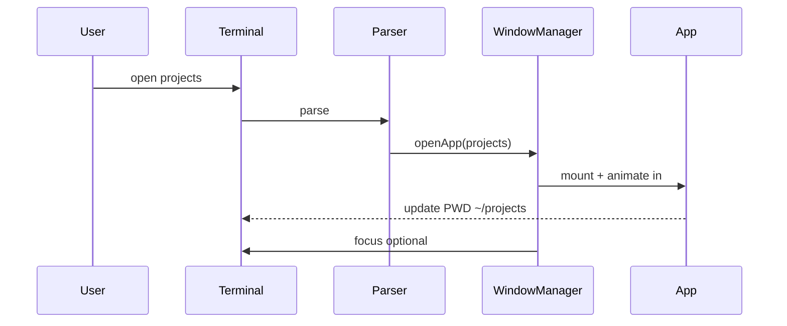

# ROOT OS — Documento Arquitetural Mestre

> **Premissa:** O visitante não entra num website. **Liga um computador.**  
> Toda a experiência é um sistema operacional fictício narrado por terminal.  
> Este documento substitui integralmente qualquer direção criativa anterior (incl. FLUX Lab).

---

## Índice

1. [Sumário executivo](#1-sumário-executivo)
2. [Nome e identidade](#2-nome-e-identidade)
3. [Direção criativa](#3-direção-criativa)
4. [Pesquisa e referências (padrões extraídos)](#4-pesquisa-e-referências-padrões-extraídos)
5. [Narrativa e arco dramático](#5-narrativa-e-arco-dramático)
6. [Storyboard frame-a-frame](#6-storyboard-frame-a-frame)
7. [Jornada do visitante](#7-jornada-do-visitante)
8. [Arquitetura de experiência (camadas)](#8-arquitetura-de-experiência-camadas)
9. [Máquina de estados narrativa](#9-máquina-de-estados-narrativa)
10. [Arquitetura de páginas e rotas](#10-arquitetura-de-páginas-e-rotas)
11. [Arquitetura do terminal](#11-arquitetura-do-terminal)
12. [Registo de comandos](#12-registo-de-comandos)
13. [Easter eggs](#13-easter-eggs)
14. [Mapa de transições terminal ↔ GUI](#14-mapa-de-transições-terminal--gui)
15. [Motion Design Bible](#15-motion-design-bible)
16. [Estratégia 3D](#16-estratégia-3d)
17. [Arquitetura de componentes](#17-arquitetura-de-componentes)
18. [Design system](#18-design-system)
19. [Experiência mobile](#19-experiência-mobile)
20. [Acessibilidade](#20-acessibilidade)
21. [Performance e budgets](#21-performance-e-budgets)
22. [Stack técnica e fronteiras entre skills](#22-stack-técnica-e-fronteiras-entre-skills)
23. [Modelo de conteúdo](#23-modelo-de-conteúdo)
24. [Roadmap de implementação](#24-roadmap-de-implementação)
25. [Critérios de aceitação global](#25-critérios-de-aceitação-global)
26. [Glossário](#26-glossário)

---

## 1. Sumário executivo

### O que estamos a construir

Um portfólio **mono-page application** (Next.js App Router) que simula um **computador físico** com boot cinematográfico, terminal funcional e ambiente gráfico tipo IDE/engineering tool. O visitante:

1. Liga o PC (Capítulo 0)
2. Observa POST/boot (Capítulo 1)
3. Entra como `guest` (Capítulo 2)
4. Descobre identidade via `whoami` (Capítulo 3)
5. Explora filesystem mapeado ao portfólio (Capítulos 4–9)
6. Encerra com `shutdown` (Capítulo 10)

### Diferenciação vs. concorrentes genéricos

| Padrão do mercado (evitar) | ROOT OS (fazer) |
|----------------------------|-----------------|
| OS clone macOS/Windows decorativo | Terminal Unix + IDE + brutalismo digital |
| Boot só na 1ª visita, depois skip | Boot sempre disponível; 2ª visita = `fastboot` |
| Janelas draggable sem propósito | Cada app = secção real do portfólio |
| Terminal com 10 comandos fake | Parser real, 80+ comandos, easter eggs discretos |
| Neon/cyberpunk/sci-fi | Phosphor verde-âmbar, monospace, scanlines subtis |
| WebGL em todo o site | WebGL **só** Cap. 0 + travessia; resto DOM |
| Animações gratuitas | Cada motion tem função narrativa documentada |

### Objetivos mensuráveis

| Objetivo | Indicador |
|----------|-----------|
| Memorabilidade | Visitante descreve "liguei um computador" (teste qualitativo) |
| Domínio técnico | Terminal funcional, parser, WM, a11y, performance budgets |
| Domínio motion | ≥40 motions catalogados com justificativa |
| Exploração | ≥3 comandos descobertos espontaneamente (analytics) |
| Tempo na experiência | Mediana ≥4 min (não forçar retenção artificial) |

---

## 2. Nome e identidade

### Decisão de naming

**Nome oficial recomendado: ROOT OS** (substitui FLUX OS).

| Opção | Prós | Contras | Veredicto |
|-------|------|---------|-----------|
| FLUX OS | Já mencionado no brief | Associa direção FLUX Lab descartada; soa sci-fi | ❌ Rejeitar |
| ROOT OS | Metáfora Unix (`/`, `root`, `whoami`); boot/init; sem neon | Comum em naming técnico | ✅ **Adoptar** |
| INIT OS | Narrativa systemd/init perfeita | Menos memorável visualmente | Alternativa |
| $HOME | Poético | Confuso em URLs/branding | Descartar |

**Tagline do sistema (boot banner):**
```
ROOT OS 0.1.0 — personal kernel space
(c) 2026 [NOME]. All bugs reserved.
```

**Hostname default:** `devbox.local`  
**Prompt default:** `guest@devbox:~$`

### Personalidade

- **Tom:** engenharia honesta, curiosidade técnica, zero arrogância
- **Voz do terminal:** conciso, dry humor ocasional (estilo man page + `$ fortune`)
- **Voz das apps GUI:** labels utilitários (como VS Code / iTerm status bar)
- **Anti-slop (frontend-pro):** evitar cream+serif, near-black+acid-green default, broadsheet genérico

### Signature element (único)

**O LED de power do gabinete** — ponto físico de luz âmbar que pulsa uma vez no Cap. 0 e reaparece discretamente no canto durante ROOT OS (indicador de "sistema vivo"). Nada mais compete com ele.

---

## 3. Direção criativa

### Pilares estéticos

| Pilar | Manifestação concreta |
|-------|----------------------|
| Terminal Unix/Linux | Prompt, man pages, stderr vermelho, exit codes, `man`, `apropos` |
| Ferramentas de engenharia | Status bar, tabs, file tree, diff viewer, build logs |
| Interfaces IDE | Split panes, monospace, line numbers, breadcrumbs `~/projects/...` |
| Brutalismo digital | Bordas 1px, zero radius ou 2px max, grid exposto, sem sombras soft |
| Motion contemporâneo | GSAP timelines precisas; Motion para micro UI; nada "bouncy" genérico |
| Microinterações | Hover com propósito (feedback de comando, focus de janela) |
| 3D atmosférico | CRT + sala escura Cap. 0; poeira de sala via particles **só** no boot |

### Paleta (OKLCH, dark-first)

| Token | Valor | Uso |
|-------|-------|-----|
| `--bg-void` | oklch(0.08 0.01 260) | Cap. 0, shutdown |
| `--bg-terminal` | oklch(0.12 0.02 145) | Fundo terminal (verde profundo, não preto puro) |
| `--phosphor-primary` | oklch(0.78 0.18 145) | Texto terminal, cursor |
| `--phosphor-dim` | oklch(0.55 0.10 145) | Output secundário, comentários |
| `--amber-led` | oklch(0.75 0.16 75) | LED power, warnings |
| `--stderr` | oklch(0.65 0.20 25) | Erros, `command not found` |
| `--ui-chrome` | oklch(0.18 0.01 260) | Title bars, taskbar |
| `--ui-border` | oklch(0.35 0.02 260) | Bordas 1px brutalistas |
| `--ui-text` | oklch(0.88 0.01 260) | GUI labels |
| `--accent-link` | oklch(0.72 0.12 230) | Links clicáveis (único azul) |

**Regra:** máximo **1 cor de acento** além do phosphor. Sem gradientes rainbow. Sem glassmorphism.

### Tipografia

| Role | Fonte | Fallback | Justificativa |
|------|-------|----------|---------------|
| Terminal / code | **IBM Plex Mono** | ui-monospace | Legibilidade, engineering, não "hacker font" |
| UI chrome | **IBM Plex Sans** | system-ui | Pares com Mono; IDE-like |
| Display (boot only) | **Space Mono** | monospace | POST/BIOS aesthetic, só Cap. 0–1 |

Tamanho mínimo terminal: **14px** (16px mobile). Line-height: 1.5.

### O que evitar (lista negativa)

- Sci-fi holograms, hex grids, HUD futurista
- Neon rosa/ciano
- Glassmorphism / backdrop-blur em cards
- Partículas fullscreen permanentes
- Matrix rain como wallpaper default (só easter egg `matrix`)
- Mac traffic lights como único language (usar **square brackets** `[ _ X ]` estilo tiling WM)
- Scroll hijacking pós-login (Lenis **desactivado** dentro do terminal; opcional em apps GUI longas)

---

## 4. Pesquisa e referências (padrões extraídos)

> **Regra:** nunca copiar layouts. Extrair **padrões comportamentais** e **decisões técnicas**.

### Padrões extraídos

| Fonte / categoria | Padrão útil | Como aplicamos | O que NÃO copiamos |
|-------------------|-------------|----------------|---------------------|
| OS portfolios (Viram Choksi, OSFOLIO, tfish) | Boot → login → desktop → apps | Arco Cap. 0–2 + WM | 13 apps + 6 jogos genéricos |
| macOS clones (Jatin Sharma, tanayvasishtha) | Z-index depth buffer, WindowWrapper HOC | `WindowManager` com `focusStack` | Estética macOS |
| Terminal portfolios (xterm.js, SouleymaneSy7) | Tab complete, history persist, `man` pages | Parser completo | 46 comandos utilitários irrelevantes (weather, crypto) |
| CRT + WebGL (MatthewNader2, blackgolyb) | CSS3D terminal inside CRT mesh; clip-path | Cap. 0 híbrido R3F + DOM | Firebase realtime |
| Codrops / Awwwards | Motion com propósito; typography-led | Motion Bible | Layouts award-winning |
| Unix/BSD man pages | Estrutura `NAME/SYNOPSIS/DESCRIPTION` | `man <cmd>` in-app | — |
| IDE (VS Code, Neovim) | Activity bar, tabs, command palette | GUI apps | Clone pixel-perfect |
| Windows Terminal CRT shader | Scanlines, curvature, chromatic aberration | Post-process Cap. 0 only | Shader em todo o site |

### Insight competitivo

A maioria dos OS portfolios **morre após o wow inicial** porque apps são shells vazios. ROOT OS diferencia-se porque **cada módulo de boot corresponde a subsistema real** e **cada comando abre conteúdo substancial**.

---

## 5. Narrativa e arco dramático

### Estrutura em 3 actos

```
ACT I — POWER        Cap. 0–2   (Ligar → Boot → Login)
ACT II — EXPLORATION Cap. 3–9   (whoami → contact)
ACT III — CLOSURE    Cap. 10    (shutdown)
```

### Tabela de capítulos

| Cap. | Comando / trigger | Título narrativo | Função emocional | Unlock |
|------|-------------------|------------------|------------------|--------|
| 0 | Load site | **Blackout** | Anticipação, silêncio | Automático |
| 1 | Power on complete | **POST** | Tensão técnica | Automático |
| 2 | `login guest` | **Session** | Entrada no sistema | Input utilizador |
| 3 | `whoami` | **Identity** | Quem é este dev? | Comando |
| 4 | `ls` | **Filesystem** | Orientação | Comando |
| 5 | `cd projects` | **Work** | Prova de competência | Comando |
| 6 | `cat manifesto.md` | **Belief** | Filosofia | Comando |
| 7 | `git log` | **History** | Evolução temporal | Comando |
| 8 | `top` | **Skills** | Stack ao vivo | Comando |
| 9 | `contact` | **Handshake** | Conversão | Comando |
| 10 | `shutdown` | **Poweroff** | Closure, gratificação | Comando |

### Linha narrativa do terminal (voice)

O terminal **nunca quebra a quarta parede** excepto em easter eggs explícitos (`meta`, `fourth-wall`). Comentários do sistema são diegéticos:

- ✅ `[system] module projects loaded (4 packages)`
- ❌ `Welcome to my portfolio website!`

### Progressão vs. liberdade

- **Modo Guided (1ª visita):** hints subtis no prompt após idle 30s (`tip: try 'help'`)
- **Modo Free (após Cap. 3):** todos os comandos disponíveis; hints desligam
- **Modo Return (`fastboot` cookie):** skip Cap. 0–1 se `localStorage.rootos_fastboot=true`

---

## 6. Storyboard frame-a-frame

### Capítulo 0 — Blackout (0:00–0:45)

| Frame | Visual | Audio | Interacção |
|-------|--------|-------|------------|
| 0.0 | `#000` fullscreen | Silêncio (ou room tone -40dB) | Nenhuma 2s |
| 0.1 | Fade in silhueta gabinete 3D | Click relay soft | Cursor: power button glow |
| 0.2 | LED âmbar ON (1 pulse) | Fan spin up (subtle) | Click ou Enter = power |
| 0.3 | Monitor CRT off → standby | Hum 60Hz faint | — |
| 0.4 | CRT flicker 3x | Static burst | — |
| 0.5 | Phosphor glow expand | — | Cut to Cap. 1 |

### Capítulo 1 — POST (0:45–1:30)

| Frame | Visual | Audio | Interacção |
|-------|--------|-------|------------|
| 1.0 | POST text typewriter | Keyboard ticks | Skip disponível após 3s (Esc) |
| 1.1 | Memory check lines | — | — |
| 1.2 | Module load (ver §6.1) | Soft beep per line | — |
| 1.3 | `ROOT OS v0.1.0 ready` | Login beep | Auto → Cap. 2 |

#### 6.1 Módulos de boot (mapeamento real)

Cada linha **deve** reflectir subsistema implementado:

```
[ ok ] Loading Renderer............... Next.js App Router
[ ok ] Loading Animation Engine....... GSAP + Motion
[ ok ] Loading Window Manager......... WM + focus stack
[ ok ] Loading Terminal............... xterm + parser
[ ok ] Loading Shader Pipeline........ R3F (boot only)
[ ok ] Loading Projects............... /content/projects
[ ok ] Loading Filesystem............. VFS layer
[ ok ] Loading Experience............. session store
```

### Capítulo 2 — Login (1:30–2:00)

| Frame | Visual | Interacção |
|-------|--------|------------|
| 2.0 | `devbox login:` | Type username |
| 2.1 | Hint: `guest` (placeholder blink) | Enter |
| 2.2 | `Last login: [date] on tty1` | — |
| 2.3 | Prompt `guest@devbox:~$` + cursor | **Terminal activo** |

**Nota:** password omitido intencionalmente (guest access). Easter egg: `sudo` pede password fake.

### Capítulo 3 — whoami (Hero)

| Frame | Visual | Interacção |
|-------|--------|------------|
| 3.0 | `whoami` output ASCII + nome | Comando |
| 3.1 | `open Profile.app` suggestion | Opcional GUI |
| 3.2 | App **Profile** abre (hero GUI) | `open profile` ou click |

**Conteúdo hero:** nome, role, one-liner, links mínimos. Sem parallax scroll — **painel IDE**.

### Capítulos 4–9 — Resumo visual

| Cap. | Terminal output | GUI App | Layout GUI |
|------|-----------------|---------|------------|
| 4 `ls` | tree colorido | — | — |
| 5 `cd projects` | path change | **Projects.app** | Master-detail: lista + case study |
| 6 `cat manifesto.md` | markdown render | **Editor.app** | Split: raw md + preview |
| 7 `git log` | fake git graph | **Timeline.app** | Graph + commits |
| 8 `top` | process list | **Monitor.app** | Skills como processos CPU |
| 9 `contact` | curl-style | **Mail.app** | Form minimal |

### Capítulo 10 — Shutdown (2:00+)

| Frame | Visual | Interacção |
|-------|--------|------------|
| 10.0 | `shutdown -h now` | Comando |
| 10.1 | Processes stop (top animation) | — |
| 10.2 | `Syncing filesystems...` | — |
| 10.3 | CRT collapse to line | — |
| 10.4 | LED off | — |
| 10.5 | `#000` + `insert coin` easter egg (1 frame, 2s) | — |

---

## 7. Jornada do visitante

### Personas

| Persona | Objectivo | Path provável | Risco |
|---------|-----------|---------------|-------|
| Recrutador | Avaliar skills + projectos | `whoami` → `projects` → `resume` | Impaciência no boot |
| Dev curioso | Explorar terminal | `help` → easter eggs | Perder-se |
| Mobile casual | Contacto rápido | Skip boot → `contact` | Teclado virtual |

### Mapa de jornada

```
ENTRADA → Cap.0 Power → Cap.1 Boot → Cap.2 Login
    ↓
DESCOBERTA → help / ls / whoami
    ↓
EXPLORAÇÃO → projects, manifesto, git log, top
    ↓
CONVERSÃO → contact, resume --pdf
    ↓
SAÍDA → shutdown (ou abandono com session persist)
```

### Caminhos críticos (happy paths)

1. **Recrutador 90s:** `fastboot` → `whoami` → `projects` → `open ProjectX` → `contact`
2. **Explorador 8min:** boot completo → todos os comandos → 2+ easter eggs → `shutdown`
3. **Mobile 60s:** boot reduzido → touch FAB `apps` → Projects → contact form

### Métricas por capítulo (analytics)

| Evento | Nome | Uso |
|--------|------|-----|
| `boot_complete` | Cap. 1 fim | Funnel |
| `login_guest` | Cap. 2 | — |
| `cmd_*` | Por comando | Popularidade |
| `app_open_*` | Por app GUI | — |
| `easter_egg_*` | Descoberta | Delight |
| `shutdown_complete` | Cap. 10 | Completion rate |

---

## 8. Arquitetura de experiência (camadas)

```
┌─────────────────────────────────────────────────────────┐
│ L0 — BOOT CINEMA (R3F + post-process CRT)    Cap. 0–1  │
├─────────────────────────────────────────────────────────┤
│ L1 — TERMINAL SHELL (xterm.js + parser)      Always on  │
├─────────────────────────────────────────────────────────┤
│ L2 — WINDOW MANAGER (GUI apps)               On demand  │
├─────────────────────────────────────────────────────────┤
│ L3 — SYSTEM CHROME (taskbar, status, LED)    Persistent │
└─────────────────────────────────────────────────────────┘
```

### Z-index stack

| Z | Layer | pointer-events |
|---|-------|----------------|
| 0 | Boot canvas (when active) | auto during Cap.0–1 |
| 10 | Desktop background (solid) | none |
| 20 | GUI windows | auto |
| 30 | Terminal (docked or floating) | auto |
| 40 | Taskbar / status bar | auto |
| 50 | Modals / command palette | auto |
| 60 | Boot overlay (skip hint) | auto |
| 100 | CRT transition overlay | none (visual only) |

### Coexistência terminal + GUI

- Terminal **nunca** é destruído ao abrir app — minimiza ou dock bottom (default **70% height terminal**, apps acima)
- `open <app>` → app abre, terminal mantém foco opcional (`--focus app` flag)
- `close` / `Ctrl+W` → fecha app focada, terminal recebe foco
- Terminal prompt reflecte `$PWD` virtual; abrir Projects muda path para `~/projects`

---

## 9. Máquina de estados narrativa

### Estados top-level



### Session store (conceptual)

| Key | Type | Persist |
|-----|------|---------|
| `phase` | enum | session |
| `user` | `guest` \| string | local |
| `cwd` | string path | session |
| `history[]` | string[] | local |
| `openApps[]` | AppId[] | session |
| `focusStack[]` | z-order | session |
| `flags.easterEggs` | Set<string> | local |
| `flags.chaptersComplete` | Set<number> | local |
| `fastboot` | boolean | local |

### Regras de transição narrativa

1. Capítulos 3–9 **marcam complete** na 1ª execução do comando canonical
2. Repetir comando **não** repete cinematic longa — output instant + GUI focus
3. `shutdown` requer ≥1 capítulo complete (senão: `shutdown: waiting for session activity`)
4. `reboot` → Cap. 1 fast (2s), mantém session

---

## 10. Arquitetura de páginas e rotas

### Modelo: SPA única + deep links

**Rota física:** `/` (single page)  
**Deep links via hash ou query** (para partilha):

| URL | Equivalente terminal | Comportamento |
|-----|---------------------|---------------|
| `/` | boot normal | Cap. 0 |
| `/?fastboot=1` | `fastboot` | Skip Cap. 0–1 |
| `/#/projects` | `cd ~/projects` | Auto-open Projects.app |
| `/#/contact` | `contact` | Auto-open Mail.app |
| `/?cmd=whoami` | exec once | Para links externos |

**Implementação:** Next.js App Router com **uma** `page.tsx`; routing lógico via session store + optional URL sync.

### Apps GUI (Window Manager)

| AppId | Título bar | Comando(s) | Conteúdo |
|-------|------------|------------|----------|
| `profile` | Profile.app | `open profile`, Cap.3 | Hero / whoami |
| `projects` | Projects.app | `projects`, `cd projects` | Case studies |
| `editor` | Editor.app | `cat manifesto.md`, `vim manifesto.md` | Manifesto |
| `timeline` | Timeline.app | `git log`, `timeline` | Histórico |
| `monitor` | Monitor.app | `top`, `skills` | Skills live |
| `mail` | Mail.app | `contact`, `mail` | Form contacto |
| `finder` | Finder.app | `open .`, `ls` + click | File browser |
| `resume` | Resume.app | `resume`, `resume --pdf` | CV viewer |
| `architecture` | Arch.app | `architecture`, `stack` | Diagrama stack |
| `help` | Man.app | `man`, `help --gui` | Man pages browser |

### Filesystem virtual (VFS)

```
/
├── home/
│   └── guest/
│       ├── about.txt
│       ├── manifesto.md
│       ├── projects/
│       │   ├── project-a/
│       │   │   ├── README.md
│       │   │   └── meta.json
│       │   └── project-b/
│       ├── skills.json
│       └── contact.sh
├── usr/
│   └── share/
│       └── docs/
└── etc/
    ├── motd
    └── os-release
```

Conteúdo servido de `/content/**` (MDX/JSON), mapeado pelo VFS adapter.

---

## 11. Arquitetura do terminal

### Stack terminal

| Peça | Tecnologia | Notas |
|------|------------|-------|
| Emulator | **xterm.js** + FitAddon + WebLinksAddon | Canvas renderer |
| Parser | Custom TypeScript | AST → CommandResult |
| Autocomplete | Trie + context | Tab cycles |
| History | Ring buffer 500 | Persist localStorage |
| Man pages | MD → terminal formatter | `man ls` |

### Pipeline de input

```
keydown → xterm.onData → line buffer → Enter
    → tokenize(argv) → resolve command → validate args
    → execute handler → TerminalOutput | OpenApp | SideEffect
    → render stdout/stderr → update cwd/session
```

### Prompt dinâmico

| Estado | Prompt |
|--------|--------|
| Normal | `guest@devbox:~/path$` |
| Root (easter) | `root@devbox:~/path#` |
| Git dir | `guest@devbox:~/projects/main$` (branch cyan) |
| Error prev | `[exit 127] guest@devbox:~$` (flash 1s) |

### Cursor

- Block cursor `_` blink 530ms
- `prefers-reduced-motion`: steady underline
- Mouse click posiciona (xterm default)

### Feedback visual

| Evento | Feedback |
|--------|----------|
| Command not found | stderr vermelho + `[exit 127]` |
| Success | stdout phosphor |
| Long running | spinner braille `⠋⠙⠹` (skill pattern) |
| Tab complete | flash sublinhado match |
| Bell | `\x07` visual flash (sem audio default) |

### Autocomplete

- **Tab:** completa comando ou path; double-tab lista opções em colunas
- **↑/↓:** history
- **Ctrl+R:** reverse search (overlay minimal)
- **Ctrl+L:** clear
- **Ctrl+C:** cancel line
- **Ctrl+D:** EOF → `logout` hint (não fecha site)

### Parser — gramática

```
command ::= pipeline | empty
pipeline ::= command_name [args...] [redirects]
args ::= string | flag | path
redirects ::= ">" file | ">>" file | "2>" file
```

Suportar: pipes simples (`ls | grep x`), flags `--help`, strings quoted.

### Error states

| Código | Mensagem | Causa |
|--------|----------|-------|
| 0 | — | success |
| 1 | general error | handler error |
| 2 | misuse | args inválidos |
| 127 | command not found | unknown cmd |
| 130 | interrupted | Ctrl+C |

---

## 12. Registo de comandos

> **Convenção:** cada comando tem `handler`, `man page`, `opensApp?`, `chapter?`, `easter?`

### 12.1 Navegação

| Comando | Sintaxe | Output / acção | App | Cap. |
|---------|---------|----------------|-----|------|
| `help` | `help [cmd]` | Lista categorias ou ajuda cmd | — | 2 |
| `ls` | `ls [-la] [path]` | Lista VFS colorido | — | 4 |
| `pwd` | `pwd` | Print cwd | — | — |
| `tree` | `tree [-L n] [path]` | Árvore unicode | — | — |
| `cd` | `cd <path>` | Muda cwd; erro se inválido | — | 5 |
| `cat` | `cat <file>` | Conteúdo file; md render inline | Editor se .md | 6 |
| `open` | `open <app\|file>` | Abre app ou file no editor | * | — |
| `close` | `close [app]` | Fecha app focada ou especificada | — | — |
| `clear` | `clear` / Ctrl+L | Limpa terminal | — | — |
| `history` | `history [-c]` | Lista ou clear history | — | — |
| `less` | `less <file>` | Paginador | — | — |
| `head` | `head -n N file` | Primeiras N linhas | — | — |
| `tail` | `tail -n N file` | Últimas N linhas | — | — |
| `grep` | `grep pattern file` | Search | — | — |
| `find` | `find path -name pat` | Find files | — | — |
| `which` | `which cmd` | Path do comando | — | — |
| `alias` | `alias [name=val]` | Lista/define aliases | — | — |
| `export` | `export VAR=val` | Session vars (fun) | — | — |

### 12.2 Sistema

| Comando | Sintaxe | Output / acção | App | Cap. |
|---------|---------|----------------|-----|------|
| `neofetch` | `neofetch` | ASCII logo + system info | — | — |
| `top` | `top [-b]` | Process list animado | Monitor | 8 |
| `htop` | `htop` | Easter: top colorido | Monitor | egg |
| `uptime` | `uptime` | Tempo sessão + load fake | — | — |
| `date` | `date [-R]` | Data/hora | — | — |
| `echo` | `echo args...` | Print args | — | — |
| `whoami` | `whoami` | Identity + hint | Profile | 3 |
| `hostname` | `hostname` | `devbox.local` | — | — |
| `uname` | `uname [-a]` | ROOT OS info | — | — |
| `id` | `id` | uid/gid guest | — | — |
| `env` | `env` | Session vars | — | — |
| `ps` | `ps aux` | Snapshot processes | — | — |
| `kill` | `kill <pid>` | Mata processo fake | — | egg |
| `reboot` | `reboot` | Fast boot sequence | — | — |
| `shutdown` | `shutdown [-h now]` | Cap. 10 | — | 10 |
| `poweroff` | alias shutdown | — | — | 10 |
| `fastboot` | `fastboot [on\|off]` | Toggle skip boot | — | — |
| `df` | `df -h` | Disco fake | — | — |
| `free` | `free -m` | RAM fake | — | — |
| `wc` | `wc file` | Word count | — | — |
| `man` | `man <cmd>` | Man page | Man.app | — |
| `apropos` | `apropos keyword` | Search man | — | — |
| `tldr` | `tldr cmd` | Short examples | — | — |
| `cal` | `cal` | Calendar | — | — |
| `bc` | `bc` | Calculator REPL | — | egg |
| `watch` | `watch -n 1 cmd` | Repeat cmd | — | — |

### 12.3 Portfólio

| Comando | Sintaxe | Output / acção | App | Cap. |
|---------|---------|----------------|-----|------|
| `projects` | `projects [filter]` | Lista + open | Projects | 5 |
| `skills` | `skills [--json]` | Skills tree | Monitor | 8 |
| `timeline` | `timeline` | Git-style log | Timeline | 7 |
| `git` | `git log`, `git status` | Subcommands limitados | Timeline | 7 |
| `contact` | `contact` | Abre form | Mail | 9 |
| `mail` | alias contact | — | Mail | 9 |
| `resume` | `resume [--pdf]` | CV | Resume | — |
| `stack` | `stack` | Tech stack diagram | Arch | — |
| `architecture` | `architecture` | System arch | Arch | — |
| `blog` | `blog [slug]` | Posts (se existirem) | Editor | — |
| `lab` | `lab` | Experimentos/WIP | Finder | — |
| `cv` | alias resume | — | — | — |
| `about` | `about` | Short bio | Profile | — |
| `social` | `social` | Links | — | — |
| `curl` | `curl url` | Fake HTTP headers fun | — | egg |

### 12.4 Easter eggs (comandos secretos)

| Comando | Comportamento | Discreto? |
|---------|---------------|-----------|
| `matrix` | Matrix rain 8s overlay terminal | ✅ |
| `pipes` | Pipe screensaver em janela | ✅ |
| `cowsay` | ASCII cow + msg | ✅ |
| `fortune` | Quote aleatória | ✅ |
| `sudo` | Password prompt → `guest` joke | ✅ |
| `vim` | `vim file` → fake vim modal `:wq` | ✅ |
| `emacs` | "Alt+F4 recommended" joke | ✅ |
| `nano` | Editor real minimal | ✅ |
| `ascii` | Random ASCII art | ✅ |
| `banner` | FIGlet style name | ✅ |
| `credits` | Roll credits devs/libs | ✅ |
| `hack` | Fake progress bar → "access denied" | ✅ |
| `rm -rf /` | Simulação safe, nada apaga | ✅ |
| `telnet` | Fake MUD 3 rooms | ✅ |
| `ssh` | "Connection refused" joke | ✅ |
| `ping` | Real ping count to domain | ✅ |
| `sl` | Steam locomotive ASCII | ✅ |
| `yes` | Spam until Ctrl+C | ✅ |
| `exit` | "Use shutdown" hint | ✅ |
| `logout` | idem | ✅ |
| `make` | Fake Makefile output | ✅ |
| `docker` | `docker ps` fake containers | ✅ |
| `kubectl` | joke | ✅ |
| `npm` | `npm install` infinite spinner egg | ✅ |
| `yarn` | idem | ✅ |
| `bun` | fast joke | ✅ |
| `node` | REPL fake 1 line | ✅ |
| `python` | REPL fake | ✅ |
| `clear` x3 rapid | glitch 200ms | ✅ hidden |
| `sudo su` | root prompt cosmetic | ✅ |
| Konami | ↑↑↓↓←→←→BA | phosphor invert 2s | ✅ |
| `fourth-wall` | meta comment | ✅ rare |
| `theme` | cycle themes (3 max) | ✅ |
| `volume` | no-op joke | ✅ |
| `mute` | disable blips | ✅ |
| `xeyes` | SVG eyes follow cursor | ✅ |
| `yes` | — | — |
| `seq` | — | — |
| `rev` | reverse string | ✅ |
| `factor` | factorize number | ✅ |
| `primes` | list primes | ✅ |
| `starwars` | telnet towel.blinkenlights.nl optional | ⚠️ external |
| `tea` | "404: tea not found" British joke | ✅ |

**Total comandos implementáveis v1:** ~85 (42 core + 43 eggs)

### 12.5 Aliases default

```
ll = ls -la
.. = cd ..
~ = cd ~
cls = clear
? = help
h = history
```

---

## 13. Easter eggs

### Filosofia

- **Discretos:** nunca bloqueiam happy path
- **Recompensa exploração:** sem badges ou achievements popup
- **Diegéticos:** parecem comand Unix reais
- **Safe:** `rm -rf` não apaga nada; `sudo` não escala privilégios reais

### Categorias de descoberta

| Tier | Descoberta | Exemplo |
|------|------------|---------|
| T1 | `help` ou tab complete | `cowsay` |
| T2 | Dev curiosity | `vim`, `matrix` |
| T3 | Referência cultural | Konami, `sl` |
| T4 | Sequências | `clear`×3, `sudo make sandwich` |
| T5 | Meta | `fourth-wall`, `.hidden/` via find |

### Easter eggs ambientais (não-comando)

| Trigger | Efeito |
|---------|--------|
| Click LED 5× | Amber pulse morse "HI" |
| Idle 5min terminal | Screensaver phosphor burn-in fake |
| Date Dec 28 | `date` easter |
| `guest` → rename | prompt muda session |
| Projects.app konami | unlock wallpaper |
| Mail.app subject "sudo" | auto-reply joke |

### Registo (implementação)

Manter `content/easter-eggs.json` com `{ id, trigger, handler, discoveredByDefault: false }`.

---

## 14. Mapa de transições terminal ↔ GUI

### Fluxo `open`



### Animações de transição (summary)

| Transição | Visual | Lib |
|-----------|--------|-----|
| Terminal → App | App **scaleY 0→1** from top + terminal dock shrink | GSAP |
| App → Terminal | App scaleY →0; terminal expand | GSAP |
| App → App | Cross-fade content; title bar blink | Motion |
| CLI output → GUI | Lines morph to rows (FLIP) | GSAP Flip |
| Shutdown | Apps close LIFO; terminal last | GSAP timeline |

### Focus rules

- Click window → `focusStack` push
- `Alt+Tab` cycle apps (a11y)
- Terminal hotkey `` ` `` toggle expand/collapse
- `Esc` close palette/modals only

---

## 15. Motion Design Bible

> **Regra:** nenhuma animação sem entrada nesta tabela.

### Capítulo 0–1 — Boot

| ID | Objetivo | Justificativa | Gatilho | Duração | Lib | Narrativa |
|----|----------|---------------|---------|---------|-----|-----------|
| M-001 | Antecipação | Silêncio antes power | page load | 2000ms hold | GSAP | "Computador morto" |
| M-002 | Power LED on | Confirma acção física | click/Enter | 400ms | GSAP + r3f-shaders emissive | Ligação eléctrica |
| M-003 | CRT flicker | Autenticidade monitor | pós-LED | 800ms | GSAP + shader flicker | Tubo aquece |
| M-004 | Camera push | Aproximar ao monitor | flicker end | 2200ms | GSAP + R3F camera | Entrar no ecrã |
| M-005 | POST type | Boot real | auto | 1200ms | GSAP TextPlugin ou custom | Sistema arranca |
| M-006 | Module lines | Mapear subsistemas | sequential | 50ms/line | GSAP stagger | Cada peça importa |
| M-007 | Scanline pass | CRT aesthetic | contínuo boot | loop | r3f-shaders | Atmosfera retro |
| M-008 | Skip fade | Respeitar impaciência | Esc | 300ms | GSAP | Controlo utilizador |

### Capítulo 2–3 — Shell

| ID | Objetivo | Justificativa | Gatilho | Duração | Lib | Narrativa |
|----|----------|---------------|---------|---------|-----|-----------|
| M-010 | Cursor blink | Terminal vivo | login | 530ms loop | CSS/xterm | Prompt ready |
| M-011 | whoami reveal | Identidade | cmd | 600ms stagger | GSAP SplitText optional | "Quem és?" |
| M-012 | Profile.app open | Hero GUI | open | 450ms | GSAP + Motion | Segunda camada |

### Capítulo 4–9 — Apps

| ID | Objetivo | Justificativa | Gatilho | Duração | Lib | Narrativa |
|----|----------|---------------|---------|---------|-----|-----------|
| M-020 | ls color pop | Hierarquia dirs | ls | 300ms | GSAP stagger | Filesystem |
| M-021 | Window open | App surge | open | 400ms ease power2.out | GSAP | OS funcional |
| M-022 | Project select | Foco case study | click | 250ms | Motion layout | Profundidade |
| M-023 | git graph draw | Timeline | git log | 800ms | GSAP drawSVG ou stroke | História |
| M-024 | top CPU bars | Skills metaphor | top | loop 1s | GSAP yoyo | Sistema vivo |
| M-025 | Form focus | Contact ready | contact | 200ms | Motion | Handshake |

### Capítulo 10 — Shutdown

| ID | Objetivo | Justificativa | Gatilho | Duração | Lib | Narrativa |
|----|----------|---------------|---------|---------|-----|-----------|
| M-030 | Process kill | Encerrar apps | shutdown | 100ms each | GSAP | Ordem inversa boot |
| M-031 | CRT off | Fim filme | final | 600ms | shader + GSAP scaleY 1→0.01 | Desligar |
| M-032 | LED off | Closure | end | 200ms | GSAP opacity | Morte |

### Microinterações (hover-effects skill)

| ID | Elemento | Stack | Notas |
|----|----------|-------|-------|
| H-01 | Title bar buttons `[ _ X ]` | Tailwind + hover-effects | brightness, não scale |
| H-02 | Terminal tab | Tailwind | underline phosphor |
| H-03 | Project row | GSAP quickTo | highlight 2px left bar |
| H-04 | Dock/taskbar icon | Motion whileHover | y: -2px only |
| H-05 | Submit contact | Motion tap | scale 0.98 |

### prefers-reduced-motion

| Motion | Fallback |
|--------|----------|
| Boot Cap. 0–1 | Static frame + POST text instant |
| CRT effects | Disabled; solid border |
| Window animations | opacity only 150ms |
| matrix egg | `fortune` text only |
| particles boot | off |

---

## 16. Estratégia 3D

### Onde usar WebGL (exhaustivo)

| Cena | R3F | Shaders | Particles | Duração |
|------|-----|---------|-----------|---------|
| Cap. 0 gabinete + CRT | ✅ | ✅ CRT post | ✅ dust motes | ~45s then destroy canvas |
| Cap. 0→1 travessia câmara | ✅ | ✅ | optional | 2.2s |
| Cap. 1 POST on CRT screen | ✅ CSS3D or render target | ✅ | ❌ | boot only |
| ROOT OS desktop | ❌ | ❌ | ❌ | — |
| Apps GUI | ❌ | ❌ | ❌ | — |
| Easter `pipes` | optional mini canvas | ❌ | ❌ | — |

### Pipeline Cap. 0 (r3f-shaders + particles skills)

1. **Scene:** desk dark, CRT mesh (low poly), keyboard silhuette optional
2. **CRT shader:** barrel distortion, scanlines, chromatic aberration **subtle**, vignette
3. **Particles:** `<Sparkles count={30} scale={4} />` dust — **narrativa: poeira de sala**
4. **DOM terminal:** mapped via `@react-three/drei/Html` or CSS3DRenderer pattern
5. **Teardown:** `Canvas` unmount após Cap. 1 → libertar WebGL context

### O que NÃO fazer em 3D

- Orbit controls pós-boot
- 3D project cards
- Partículas fullscreen no desktop
- Shaders em janelas GUI

---

## 17. Arquitetura de componentes

### Árvore React (conceptual)

```
<RootOSProvider>
  <BootCinema />          // conditional Cap. 0–1
  <Desktop>
    <SystemChrome />      // taskbar, LED, clock
    <WindowManager>
      <Window app="projects" />
      ...
    </WindowManager>
    <TerminalShell />     // always mounted
    <CommandPalette />    // Ctrl+Shift+P optional
  </Desktop>
  <CRTTransition />       // overlay Cap. 10
</RootOSProvider>
```

### Módulos principais

| Módulo | Responsabilidade |
|--------|------------------|
| `session-store` | Zustand — phase, cwd, apps, flags |
| `vfs` | Virtual filesystem adapter |
| `terminal/parser` | Tokenize + dispatch |
| `terminal/commands/*` | Handlers por categoria |
| `terminal/man` | Man page renderer |
| `wm/WindowManager` | z-index, drag, resize |
| `wm/Window` | chrome + content slot |
| `apps/*` | Profile, Projects, etc. |
| `boot/BootCinema` | R3F scene |
| `content/*` | MDX/JSON loaders |

### Window Manager specs

- Drag: GSAP Draggable ou @dnd-kit (decisão implementador: GSAP se já presente)
- Resize: handles 4px brutalist corners
- Minimize: taskbar icon ghost
- Maximize: fullscreen minus taskbar 32px
- Close: `close` cmd sync

---

## 18. Design system

### Tokens (CSS variables)

Ver paleta §3. Adicionar:

```css
--space-unit: 4px;
--border-width: 1px;
--radius-sm: 2px;
--titlebar-height: 28px;
--taskbar-height: 32px;
--terminal-font-size: 14px;
--window-shadow: none; /* brutalism */
```

### Componentes UI

| Component | Variants |
|-----------|----------|
| `Button` | primary (phosphor bg), ghost, danger |
| `Input` | terminal-style, form |
| `WindowChrome` | focused (border bright), unfocused |
| `TitleBar` | `[ _ X ]` controls |
| `Taskbar` | icons + clock |
| `Tabs` | IDE-style |
| `ScrollArea` | minimal 4px thumb |
| `Dialog` | man page modal |
| `Toast` | stderr style errors |

### Iconografia

- **Lucide** stroke 1.5px — file types, app icons
- Sem emoji como ícones (frontend-pro rule)

### Themes (max 3)

1. **phosphor** (default) — green terminal
2. **amber** — DEC VT220
3. **paper** — light mode (acessibilidade)

Toggle: `theme` command ou Settings.app minimal.

---

## 19. Experiência mobile

### Princípio

Mobile **não** simula gabinete 3D — **fastboot textual** automático se `(pointer: coarse)`.

### Layout mobile

```
┌─────────────────────┐
│ [ROOT OS]  [apps ≡] │  status bar
├─────────────────────┤
│                     │
│   Terminal (full)   │  60% height
│                     │
├─────────────────────┤
│  App sheet (drawer) │  40% when open
└─────────────────────┘
```

### Adaptações

| Desktop | Mobile |
|---------|--------|
| Drag windows | Bottom sheet apps |
| Hover effects | `:active` states |
| Keyboard shortcuts | FAB toolbar (`help`, `ls`, `projects`, `contact`) |
| Boot 3D | Boot text-only 5 linhas |
| xterm | xterm + font-size 16px + tap for cursor |

### Touch targets

≥44px para FABs e title bar controls (frontend-pro P2).

---

## 20. Acessibilidade

### WCAG 2.2 AA target

| Área | Requisito |
|------|-----------|
| Contraste | phosphor on bg ≥ 4.5:1 (verificar amber theme) |
| Teclado | Tab order lógico; terminal sempre focusable |
| Screen reader | `role="application"` terminal; live regions stdout |
| Focus visible | 2px outline phosphor |
| Reduced motion | §15 fallbacks |
| Skip link | "Skip boot" visible on focus Esc |
| Forms | labels, errors inline contact |

### Terminal a11y

- Anunciar output longo em `aria-live="polite"`
- Comandos disponíveis via `help` screen reader friendly
- `alt` text para ASCII art decorativo = skip (`aria-hidden`)

### Não depender só de cor

Erros: cor + prefix `[error]` + exit code.

---

## 21. Performance e budgets

### Budgets

| Métrica | Target |
|---------|--------|
| LCP (fastboot) | < 2.5s |
| LCP (full boot) | < 4.5s (com consent) |
| JS initial (excl. R3F) | < 180kb gzip |
| R3F chunk | lazy, < 250kb gzip |
| Boot canvas teardown | WebGL context released |
| xterm | FitAddon debounced resize |
| CLS | < 0.1 |

### Estratégias

- Dynamic import `BootCinema` + `dynamic(..., { ssr: false })`
- xterm apenas client
- Content MDX static generation
- Images next/image AVIF
- `prefetch` não usar em boot
- Lenis **off** globally (sem scroll pages longas v1)

### Monitoring

- Vercel Analytics + Web Vitals
- Custom `boot_duration_ms` event

---

## 22. Stack técnica e fronteiras entre skills

### Stack recomendada

| Layer | Tech |
|-------|------|
| Framework | Next.js 15+ App Router, React 19, TypeScript |
| Styling | Tailwind CSS v4 |
| Terminal | xterm.js 6 |
| State | Zustand |
| Content | MDX + JSON em `/content` |
| 3D | @react-three/fiber, drei (boot only) |
| Animation | GSAP + @gsap/react; motion/react |
| Deploy | Vercel |

### Mapa skill → uso

| Skill | Onde usar | Não usar |
|-------|-----------|----------|
| **gsap** | Boot timeline, window open/close, FLIP ls→GUI, SplitText whoami | Drag básico CSS |
| **framer-motion** | App internal transitions, AnimatePresence apps, layoutId tabs | Boot pin/scrub |
| **lenis** | — (v1 off) | Terminal scroll |
| **hover-effects** | Title bar, rows, buttons — **uma stack por componente** | Animações scroll |
| **r3f-shaders** | CRT shader Cap. 0, LED emissive | GUI windows |
| **particles** | Dust Sparkles Cap. 0 only (~30) | Desktop background |

### Pacotes explícitos a instalar (implementação)

`gsap`, `@gsap/react`, `motion`, `xterm`, `@xterm/addon-fit`, `@xterm/addon-web-links`, `zustand`, `three`, `@react-three/fiber`, `@react-three/drei` (boot chunk only)

---

## 23. Modelo de conteúdo

### Estrutura `/content`

```
content/
├── profile.json          # whoami, hero
├── manifesto.md
├── projects/
│   └── *.mdx + meta.json
├── timeline.json         # git log data
├── skills.json           # top processes
├── stack.json            # architecture diagram
├── contact.json          # form config
├── resume.pdf            # static asset
├── motd.txt
├── easter-eggs.json
└── man/                  # man pages source
    └── *.md
```

### Schema `projects/meta.json`

```json
{
  "slug": "string",
  "title": "string",
  "year": "number",
  "role": "string",
  "stack": ["string"],
  "summary": "string",
  "cover": "string",
  "featured": "boolean"
}
```

### Placeholders

Implementador usa `[NOME]`, `[EMAIL]`, `[GITHUB]` até conteúdo real.

---

## 24. Roadmap de implementação

### Fase 0 — Fundação (Semana 1)

- [ ] Scaffold Next.js + Tailwind tokens
- [ ] `RootOSProvider` + session store
- [ ] VFS + content loaders
- [ ] Terminal xterm mount + input loop
- [ ] Parser v1 (10 cmds: help, ls, cd, cat, clear, whoami, open, close, exit hint, shutdown stub)

**DoD:** Terminal funcional sem boot; `whoami` + `ls` operacionais.

### Fase 1 — Boot Cinema (Semana 2)

- [ ] R3F BootCinema scene
- [ ] CRT shader (r3f-shaders skill)
- [ ] Dust particles (particles skill)
- [ ] POST sequence + module lines
- [ ] Login flow
- [ ] fastboot + reduced motion

**DoD:** Cap. 0–2 completos; canvas teardown; Esc skip.

### Fase 2 — Window Manager + Apps core (Semana 3–4)

- [ ] WM drag/focus/min/max
- [ ] Profile, Projects, Editor, Mail apps
- [ ] Transitions terminal ↔ GUI (GSAP)
- [ ] Comandos navegação + portfólio

**DoD:** Cap. 3–6 + 9 funcionais.

### Fase 3 — Timeline + Monitor + Polish (Semana 5)

- [ ] Timeline.app + git commands
- [ ] Monitor.app + top/skills
- [ ] Shutdown Cap. 10
- [ ] Man pages
- [ ] Autocomplete + history persist

**DoD:** Cap. 7–10; arc completo.

### Fase 4 — Easter eggs + Mobile + A11y (Semana 6)

- [ ] 30+ easter eggs
- [ ] Mobile layout + FAB
- [ ] a11y audit (frontend-pro Review mode)
- [ ] Performance pass

**DoD:** Lighthouse a11y ≥90; mobile usable.

### Fase 5 — Content + Launch (Semana 7)

- [ ] Conteúdo real projetos
- [ ] Analytics events
- [ ] OG meta (static image — não boot)
- [ ] Deploy production

---

## 25. Critérios de aceitação global

### Experiência

- [ ] Visitante completa boot → login → whoami → shutdown sem bugs
- [ ] Terminal aceita 42+ comandos core com exit codes correctos
- [ ] ≥30 easter eggs activáveis
- [ ] GUI apps sincronizam com terminal (`open`/`close`/`cd`)
- [ ] 2ª visita `fastboot` funciona

### Técnico

- [ ] WebGL só Cap. 0–1; context released after
- [ ] `prefers-reduced-motion` respeitado
- [ ] Keyboard navigable
- [ ] Sem Lenis no terminal
- [ ] Content driven by `/content` sem hardcode

### Qualidade

- [ ] Nenhuma animação fora do Motion Bible
- [ ] Paleta dentro dos tokens (sem neon)
- [ ] frontend-pro anti-slop checklist pass
- [ ] Todas as skills respeitam fronteiras dos dossiês

---

## 26. Glossário

| Termo | Definição |
|-------|-----------|
| **ROOT OS** | Sistema operativo fictício do portfólio |
| **VFS** | Virtual filesystem — paths Unix mapeados a content |
| **WM** | Window Manager — gestor janelas GUI |
| **Phosphor** | Cor verde-âmbar terminal CRT |
| **Cap.** | Capítulo narrativo 0–10 |
| **fastboot** | Skip boot cinematográfico |
| **Guest** | Utilizador default da sessão |
| **App** | Janela GUI (Projects.app, etc.) |
| **Diegetic** | Elemento que existe "dentro" do mundo OS |

---

## Apêndice A — Comandos `man` structure template

```
NAME
    command - one line description

SYNOPSIS
    command [OPTIONS] [ARGS]

DESCRIPTION
    Paragraph.

EXAMPLES
    $ command arg

SEE ALSO
    related(1)
```

---

## Apêndice B — Analytics event catalog

| Event | Payload |
|-------|---------|
| `boot_start` | `{ reduced_motion }` |
| `boot_skip` | `{ at_ms }` |
| `boot_complete` | `{ duration_ms }` |
| `login` | `{ user }` |
| `cmd` | `{ name, exit_code, chapter? }` |
| `app_open` | `{ appId }` |
| `app_close` | `{ appId }` |
| `egg` | `{ id }` |
| `shutdown` | `{ chapters_complete[] }` |
| `contact_submit` | `{ success }` |

---

## Apêndice C — Decisões registadas (ADR summary)

| ID | Decisão | Razão |
|----|---------|-------|
| ADR-001 | Renomear FLUX OS → ROOT OS | Evitar associação FLUX Lab |
| ADR-002 | xterm.js vs custom | Battle-tested; a11y extensions |
| ADR-003 | SPA única vs multi-route | Coerência OS; deep links via hash |
| ADR-004 | R3F só boot | Performance + narrativa |
| ADR-005 | Lenis off v1 | Sem scroll hijack; terminal-first |
| ADR-006 | Zustand vs Context | WM perf + devtools |
| ADR-007 | IBM Plex stack | Engineering aesthetic, legível |
| ADR-008 | Guest-only login | Reduz fricção; sudo é egg |

---

*Documento gerado como SSOT para implementação ROOT OS. Qualquer agente implementador deve seguir este plano sem decisões criativas adicionais salvo ADR novo aprovado pelo utilizador.*
