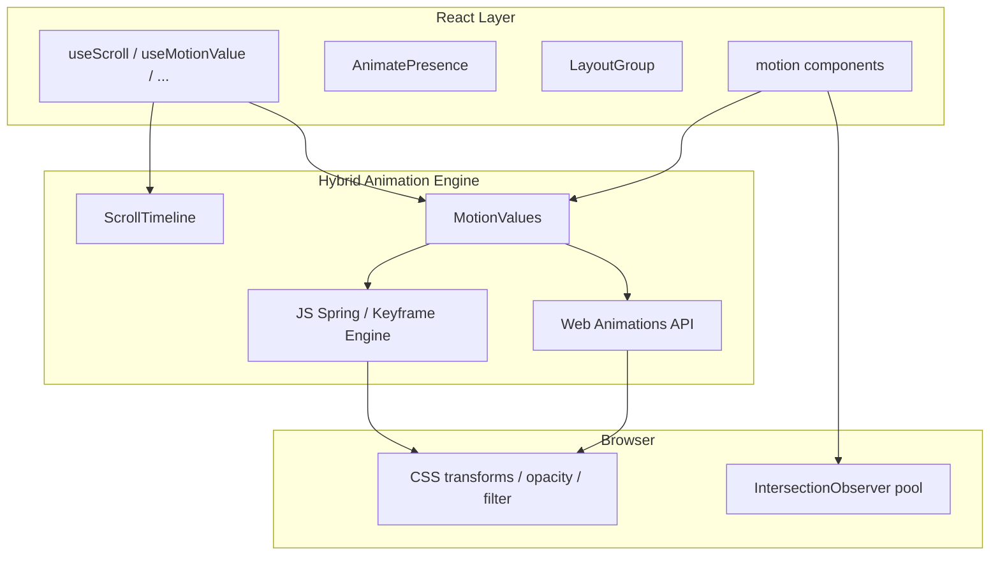
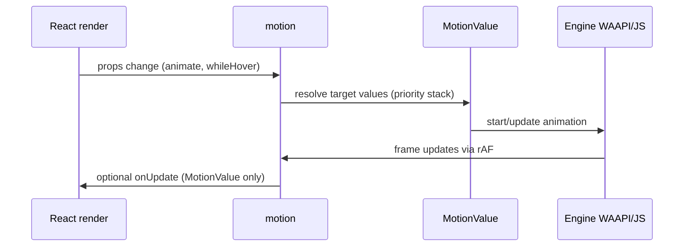
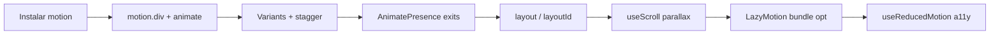

# Dossiê Técnico — Framer Motion (Motion for React)

> Documento de referência permanente. Não é tutorial introdutório.  
> **Nota de nomenclatura:** desde v12, o pacote npm é `motion` e o import React é `"motion/react"`. **Framer Motion** é o nome histórico; a marca actual é **Motion**.

---

## 1. Visão Geral

### O que é

**Motion for React** (anteriormente **Framer Motion**) é uma biblioteca de animação **declarativa** para React. Expõe componentes `motion.*` e hooks que ligam animações directamente a props, estado e gestos — sem API imperativa separada para a maioria dos casos.

Fonte: [motion.dev/docs/react](https://motion.dev/docs/react)

### Problema que resolve

- Orquestrar animações complexas em React sem gerir manualmente refs, timelines imperativas e cleanup
- Exit animations quando componentes saem do DOM (`AnimatePresence`)
- Layout animations e shared element transitions (`layout`, `layoutId`)
- Gestos cross-device (hover, tap, drag, pan) fiáveis em touch
- Scroll-triggered e scroll-linked animations com APIs React-native

### História e origem

| Marco | Detalhe |
|-------|---------|
| ~2018 | Framer Motion criado por **Matt Perry** (GreenSock alumni) dentro do ecossistema Framer |
| Evolução | Tornou-se a lib de animação React mais usada no npm |
| 2024–2025 | Rebrand para **Motion**; pacote unificado `motion` com React, JS e Vue |
| Actual | Usado por **Framer**, **Figma**, **Cursor** e milhões de downloads/mês |

Fonte: [README GitHub](https://github.com/motiondivision/motion), [motion.dev](https://motion.dev/docs/react)

### Filosofia

- **Declarativo primeiro** — animações como props React
- **Hybrid engine** — Web Animations API + ScrollTimeline quando possível; fallback JS para springs, keyframes interruptíveis, gestos
- **Production-ready** — TypeScript, test suite extensa, tree-shaking
- **Progressive complexity** — props simples → variants → layout → scroll

### Casos de uso

- Micro-interacções UI (hover, tap, modais)
- Page transitions e route animations
- Listas reordenáveis com layout animation
- Parallax e progress bars (`useScroll`)
- Design systems React (Chakra, shadcn combos frequentes)
- Sites Framer exportados / creative dev portfolios

### Público-alvo

- Desenvolvedores **React** (18.2+)
- Equipas que preferem JSX declarativo vs timelines imperativas
- Produtos onde bundle MIT e DX importam

### Ecossistema

```
motion (npm)
├── motion/react      → React (Framer Motion)
├── motion/react-m    → Componente m (lazy)
├── motion/react-client → Next.js RSC-friendly
├── motion-v          → Vue
└── motion (core)     → animate() vanilla JS

Motion+ (premium, one-time)
├── AnimateNumber, Cursor, Ticker, Typewriter
├── 400+ examples, MotionScore AI audit
└── Transition editor IDE
```

---

## 2. Arquitetura

### Visão geral



### Componentes internos

| Componente | Função |
|------------|--------|
| **motion** | Wrapper HTML/SVG com props de animação |
| **MotionValue** | Valor reactivo subscribable (não causa re-render) |
| **VisualElement** | Abstracção DOM/SVG; aplica estilos |
| **Projection** | Layout animation via transform scale/translate |
| **Feature packages** | `domAnimation`, `domMax` carregados via LazyMotion |

### Ciclo de vida (motion component)



**Prioridade de estados** (v3+): `animate` < `while-*` < `exit` — valores removidos de um estado caem para o próximo.

Fonte: [Upgrade guide v3](https://motion.dev/docs/react-upgrade-guide)

---

## 3. Como funciona internamente

### Hybrid engine

1. **Propriedades GPU-friendly** (`opacity`, `transform`, `filter`, `clipPath`): tentativa de correr via **WAAPI** hardware-accelerated
2. **Springs / physics**: fallback JavaScript com integração spring
3. **Scroll-linked**: `ScrollTimeline` nativo quando suportado; senão JS + `useScroll`
4. **Scroll-triggered**: pool partilhado de **IntersectionObserver** (`whileInView`, `useInView`)

Fonte: [Scroll animations](https://motion.dev/docs/react-scroll-animations)

### Layout animations (Projection)

1. Mede layout antes/depois do re-render
2. Aplica `transform: translate + scale` (não width/height directamente)
3. **Scale correction** automática para `borderRadius`, `boxShadow`
4. Shared elements: `layoutId` correlaciona nós entre componentes

Fonte: [Layout animations](https://motion.dev/docs/react-layout-animations)

### Gestão de memória

- `AnimatePresence` mantém nós no DOM até exit animation completar
- `LazyMotion` carrega features on-demand
- MotionValues persistem independentemente de re-renders React

### Deferred keyframe resolution

Medições batchadas numa única operação de layout/style para animar de `auto`, CSS variables, etc. — reduz layout thrashing vs medição por propriedade.

Fonte: [GSAP vs Motion](https://motion.dev/docs/gsap-vs-motion)

---

## 4. Instalação

### npm

```bash
npm install motion
```

### pnpm / yarn / bun

```bash
pnpm add motion
yarn add motion
bun add motion
```

### Migração de framer-motion

```bash
npm uninstall framer-motion
npm install motion
```

```javascript
// Antes
import { motion } from "framer-motion";
// Depois
import { motion } from "motion/react";
```

Fonte: [Upgrade guide v12](https://motion.dev/docs/react-upgrade-guide)

### CDN (jsDelivr)

```html
<script type="module">
  import motion from "https://cdn.jsdelivr.net/npm/motion@12.42.2/react/+esm"
</script>
```

Fixar versão — evitar `@latest` em produção.

Fonte: [Installation](https://motion.dev/docs/react-installation)

### Pré-requisitos

- **React ≥ 18.2**

### Monorepo

Centralizar re-exports:

```typescript
// packages/ui/src/motion.ts
export { motion, AnimatePresence, LayoutGroup } from "motion/react";
```

---

## 5. Configuração

### MotionConfig

```jsx
import { MotionConfig } from "motion/react";

<MotionConfig transition={{ duration: 0.3 }} reducedMotion="user">
  {children}
</MotionConfig>
```

| Prop | Descrição |
|------|-----------|
| `transition` | Default global de transição |
| `reducedMotion` | `"user"` \| `"always"` \| `"never"` — respeita `prefers-reduced-motion` |

### LazyMotion + feature bundles

| Bundle | Tamanho aprox. | Inclui |
|--------|----------------|--------|
| `domAnimation` | +15kb | animate, variants, exit, tap/hover/focus |
| `domMax` | +25kb | + pan/drag, layout |

```jsx
import { LazyMotion, domAnimation } from "motion/react";
import * as m from "motion/react-m";

<LazyMotion features={domAnimation} strict>
  <m.div animate={{ opacity: 1 }} />
</LazyMotion>
```

### Next.js App Router

```jsx
"use client";
import { motion } from "motion/react";
// ou, para menos JS no client bundle:
import * as motion from "motion/react-client";
```

Fonte: [Reduce bundle size](https://motion.dev/docs/react-reduce-bundle-size), [Installation](https://motion.dev/docs/react-installation)

---

## 6. Estrutura recomendada de projeto

```
src/
├── lib/
│   └── motion.ts              # re-exports + LazyMotion provider
├── components/
│   └── motion/
│       ├── FadeIn.tsx
│       ├── PageTransition.tsx
│       └── RevealOnScroll.tsx
├── animations/
│   ├── variants.ts            # variant objects partilhados
│   └── transitions.ts         # spring/tween presets
└── providers/
    └── MotionProvider.tsx     # MotionConfig + LazyMotion
```

### Boas práticas

- Provider `LazyMotion` no root se bundle crítico
- Variants nomeados reutilizáveis
- `layoutId` namespaced via `LayoutGroup id="..."`
- Separar animações de layout (style/className) de animações visuais (animate)

---

## 7. API completa

### Componentes principais

| Componente | Descrição |
|------------|-----------|
| `motion.div`, `motion.*` | Qualquer tag HTML/SVG animável |
| `AnimatePresence` | Exit animations; modes: sync, wait, popLayout |
| `LayoutGroup` | Sincroniza layout measurements |
| `LazyMotion` | Carrega features sob demanda |
| `m.*` | motion lite (requer LazyMotion) |
| `Reorder.Group` / `Reorder.Item` | Listas drag-to-reorder |
| `MotionConfig` | Defaults globais |

### Props de animação (motion)

| Prop | Descrição |
|------|-----------|
| `initial` | Estado inicial; `false` desactiva mount animation |
| `animate` | Estado alvo; reactivo a mudanças |
| `exit` | Estado ao sair (com AnimatePresence) |
| `transition` | `{ type, duration, ease, delay, repeat, ... }` |
| `variants` | Object de estados nomeados |
| `whileHover` / `whileTap` / `whileFocus` / `whileDrag` / `whileInView` | Gestos temporários |
| `layout` | Auto layout animation; `"position"` só posição |
| `layoutId` | Shared element transition |
| `layoutScroll` | Correcção scroll em container |
| `layoutRoot` | Root para fixed containers |
| `drag` | `"x"` \| `"y"` \| `true` |
| `dragConstraints` | ref ou object |
| `onAnimationComplete` | Callback |

Fonte: [Motion component](https://motion.dev/docs/react-motion-component), [React animation](https://motion.dev/docs/react-animation)

### Hooks

| Hook | Retorno / Uso |
|------|---------------|
| `useScroll(options?)` | `{ scrollX, scrollY, scrollXProgress, scrollYProgress }` |
| `useInView(ref, options?)` | `boolean` viewport visibility |
| `useMotionValue(initial)` | `MotionValue` |
| `useTransform(mv, input, output)` | Mapped MotionValue |
| `useSpring(mv, config?)` | Smoothed MotionValue |
| `useMotionValueEvent(mv, event, fn)` | Subscribe change/animationComplete |
| `useAnimate()` | `[scopeRef, animate]` — imperative mini/hybrid |
| `useReducedMotion()` | `boolean` prefers-reduced-motion |
| `useDragControls()` | Manual drag start |
| `usePresence()` | `[isPresent, safeToRemove]` |
| `useIsPresent()` | boolean inside AnimatePresence |
| `usePresenceData()` | custom prop from AnimatePresence |

Fonte: [useScroll](https://motion.dev/docs/react-use-scroll), [Scroll animations](https://motion.dev/docs/react-scroll-animations)

### AnimatePresence props

| Prop | Default | Descrição |
|------|---------|-----------|
| `mode` | `"sync"` | `"sync"` \| `"wait"` \| `"popLayout"` |
| `initial` | — | `false` desactiva initial em filhos |
| `custom` | — | Dados para exit via variants |
| `onExitComplete` | — | Todos exits terminaram |
| `propagate` | `false` | Propaga exits a filhos nested |

Fonte: [AnimatePresence](https://motion.dev/docs/react-animate-presence)

### Vanilla JS (motion core)

```javascript
import { animate, scroll, stagger, timeline } from "motion";

animate("h1", { opacity: [0, 1] });
scroll(animate(element, { opacity: [0, 1] }));
```

---

## 8. Conceitos fundamentais

### MotionValue

Valor animável **fora do ciclo React**. Ligado a `style={{ x: motionValue }}` — updates não causam re-render. Base de scroll-linked animations.

### Variants

Object com estados nomeados; fluem down the tree via `variants` prop:

```javascript
const variants = {
  hidden: { opacity: 0, y: 20 },
  visible: { opacity: 1, y: 0, transition: { staggerChildren: 0.1 } },
};
```

### Transition types

| type | Uso |
|------|-----|
| `"tween"` | duration + ease (default visual props) |
| `"spring"` | stiffness, damping (default x/y/scale) |
| `"inertia"` | Deceleration after drag |

### whileInView vs useScroll

| Tipo | API | Mecanismo |
|------|-----|-----------|
| Scroll-triggered | `whileInView` | IntersectionObserver |
| Scroll-linked | `useScroll` + `style` | ScrollTimeline / JS |

### layout vs layoutId

- `layout`: anima mudanças de tamanho/posição do **mesmo** elemento
- `layoutId`: **shared element** entre componentes diferentes (modal, underline, tabs)

### AnimatePresence + key

Filhos directos precisam `key` **estável e único** (id, não index).

---

## 9. Fluxo de desenvolvimento



1. Prototipar animação isolada
2. Extrair variants
3. Adicionar exit com AnimatePresence
4. Optimizar bundle (LazyMotion se necessário)
5. Testar reduced motion + mobile gestures

---

## 10. Recursos avançados

| Recurso | Descrição |
|---------|-----------|
| `layout="position"` | Só anima posição, size snap |
| `layoutAnchor` | Ponto de ancoragem 0–1 |
| `transition.layout.path: arc()` | Curva de movimento layout |
| `Reorder` | Drag-to-reorder nativo |
| `scroll()` + `animate()` | Scroll-linked WAAPI (JS) |
| `useAnimate` mini (2.3kb) | WAAPI-only imperative |
| Motion+ `AnimateNumber` | Tickers numéricos |
| Motion+ `Cursor` | Custom cursor |
| `motion()` custom components | wrap non-DOM components |
| `propagate` tap | Stop gesture bubbling |

---

## 11. Performance

### Optimizações nativas

- WAAPI hardware-acceleration (animações continuam com JS bloqueado)
- ScrollTimeline para scroll-linked (sync perfeito com scroll GPU)
- Layout via `transform` (evita layout/paint)
- Deferred keyframe resolution (menos forced layouts)
- IntersectionObserver pooled

### Bundle sizes (gzip, oficial)

| API | Tamanho |
|-----|---------|
| `useAnimate` mini | ~2.3kb |
| `useAnimate` hybrid | ~17kb |
| `animate()` mini | ~2.6kb |
| `animate()` full | ~18kb |
| `motion` full | ~34kb |
| `m` + LazyMotion initial | ~4.6kb |

Fonte: [Reduce bundle size](https://motion.dev/docs/react-reduce-bundle-size), [GSAP vs Motion](https://motion.dev/docs/gsap-vs-motion)

### Gargalos

- `motion` completo sem LazyMotion em apps leves
- Muitos `layout` simultâneos
- Animar width/height sem layout (força layout)
- `AnimatePresence mode="sync"` com overlap layout
- Re-renders excessivos ligados a MotionValues (usar hooks correctamente)

---

## 12. Escalabilidade

- **LazyMotion** + code splitting por rota
- **LayoutGroup** com namespaces (`id`) em apps grandes
- **Variants** partilhados entre design system
- Framer sites: milhões de páginas servidas com Motion engine
- Motion+ MotionScore para auditoria perf em CI/agent

---

## 13. Integrações

| Stack | Integração |
|-------|------------|
| **React 18+** | Nativo |
| **Next.js** | `"use client"` ou `motion/react-client` |
| **Vite** | Zero config |
| **Remix** | Client-only motion components |
| **TypeScript** | Types incluídos |
| **Tailwind** | Combinar classes + motion props |
| **shadcn/ui** | Wrappers motion comuns |
| **Three.js** | `@react-three/fiber` + motion values (legacy framer-motion-3d) |
| **GSAP** | Coexistência possível; evitar mesmas props |
| **Radix UI** | AnimatePresence em portals |
| **Vue** | `motion-v` pacote separado |
| **View Transitions API** | Complementar; Motion doc compara trade-offs |

Fonte: [Installation](https://motion.dev/docs/react-installation), [Layout vs View Transitions](https://motion.dev/docs/react-layout-animations)

---

## 14. TypeScript

- Pacote `motion` ship types nativos
- `motion()` generic para custom components com `forwardRef`
- Variants tipáveis via const assertions
- `Transition` types para spring/tween discriminated unions

```typescript
import { motion, type Variants } from "motion/react";

const fade: Variants = {
  hidden: { opacity: 0 },
  visible: { opacity: 1 },
};
```

---

## 15. Customização

- **Custom components**: `motion(Component, { forwardMotionProps: true })`
- **Easing**: cubic-bezier, steps, spring physics, custom functions
- **CSS variables**: animáveis como targets
- **MotionConfig**: defaults globais
- **transition per-prop**: `{ opacity: { duration: 0.2 }, x: { type: "spring" } }`
- **Motion+**: transition editor IDE plugin

---

## 16. Plugins / Extensões

Motion não usa modelo de plugins como GSAP. Extensões:

| Extensão | Tipo |
|----------|------|
| `domAnimation` / `domMax` | Feature bundles |
| Motion+ APIs | Premium (AnimateNumber, Cursor, Ticker) |
| `motion` vanilla | Framework-agnostic core |
| Community wrappers | shadcn motion presets |

---

## 17. Ecossistema

| Recurso | URL |
|---------|-----|
| Docs | motion.dev/docs |
| Examples (330+) | motion.dev/examples |
| Tutorials (100+) | motion.dev/tutorials |
| GitHub | github.com/motiondivision/motion |
| Motion+ | motion.dev/plus |
| AI Kit / MCP | motion.dev (Motion+) |
| Discord | Motion+ private |

---

## 18. Casos reais

- **Framer** — engine de animação de todos os sites Framer
- **Figma** — sponsor; animações em produto
- **Cursor** — homepage animations + AI kit partnership
- **30M+ downloads/mês** npm (dado oficial docs)
- Showcases Awwwards, portfolios creative dev

Fonte: [motion.dev/docs/react](https://motion.dev/docs/react), [README](https://github.com/motiondivision/motion)

---

## 19. Exemplos completos

### Hello World

```jsx
import { motion } from "motion/react";

export function Box() {
  return (
    <motion.div
      initial={{ opacity: 0, y: 20 }}
      animate={{ opacity: 1, y: 0 }}
    />
  );
}
```

### Básico — Gestos

```jsx
<motion.button
  whileHover={{ scale: 1.05 }}
  whileTap={{ scale: 0.95 }}
  transition={{ type: "spring", stiffness: 400 }}
>
  Click
</motion.button>
```

### Intermediário — AnimatePresence modal

```jsx
import { AnimatePresence, motion } from "motion/react";

export function Modal({ open, onClose }) {
  return (
    <AnimatePresence>
      {open && (
        <motion.div
          key="backdrop"
          initial={{ opacity: 0 }}
          animate={{ opacity: 1 }}
          exit={{ opacity: 0 }}
          onClick={onClose}
        >
          <motion.dialog
            key="dialog"
            layoutId="modal"
            initial={{ scale: 0.9, opacity: 0 }}
            animate={{ scale: 1, opacity: 1 }}
            exit={{ scale: 0.9, opacity: 0 }}
          />
        </motion.div>
      )}
    </AnimatePresence>
  );
}
```

### Avançado — Scroll parallax

```jsx
import { motion, useScroll, useTransform } from "motion/react";

export function ParallaxHero() {
  const { scrollYProgress } = useScroll();
  const y = useTransform(scrollYProgress, [0, 1], ["0%", "50%"]);
  const opacity = useTransform(scrollYProgress, [0, 0.5], [1, 0]);

  return (
    <motion.div style={{ y, opacity }}>
      <h1>Hero</h1>
    </motion.div>
  );
}
```

### Arquitectura profissional — LazyMotion app shell

```jsx
// providers/MotionProvider.tsx
"use client";
import { LazyMotion, domMax, MotionConfig } from "motion/react";

const loadFeatures = () => import("./features").then((m) => m.default);

export function MotionProvider({ children }) {
  return (
    <MotionConfig reducedMotion="user">
      <LazyMotion features={loadFeatures} strict>
        {children}
      </LazyMotion>
    </MotionConfig>
  );
}

// features.ts
import { domMax } from "motion/react";
export default domMax;
```

---

## 20. Erros comuns

| Erro | Causa | Solução |
|------|-------|---------|
| Exit animation não corre | AnimatePresence unmounta consigo | Condicional **dentro** de AP |
| Exit não corre | `key={index}` instável | Usar `key={item.id}` |
| Layout animation falha | `display: inline` | Usar block/flex |
| Layout em scroll container | Falta `layoutScroll` | Adicionar prop |
| Distortion em filhos | Scale sem layout filho | `layout` nos children |
| Bundle enorme | `motion` everywhere | LazyMotion + `m` |
| Testes falham pós v11 | Render async microtask | `await nextFrame()` |
| Drag + tap conflito | Movimento >3px | Comportamento esperado |
| popLayout posição errada | Parent `position: static` | `position: relative` |
| SVG layout broken | SVG não suportado | Animar attrs (`cx`, `pathLength`) |

Fonte: [AnimatePresence troubleshooting](https://motion.dev/docs/react-animate-presence), [Layout troubleshooting](https://motion.dev/docs/react-layout-animations)

---

## 21. Limitações

| Limitação | Detalhe |
|-----------|---------|
| React-centric | API principal é React (Vue via motion-v) |
| SVG layout | Sem layout animations em SVG |
| Timeline mutável mid-playback | Não suportado (vs GSAP) |
| Scroll complex pinning | Sem equivalente ScrollTrigger pin/snap |
| Framework lock-in | Menos ideal fora React |
| Motion+ paywall | APIs premium (AnimateNumber, etc.) |
| Horizontal resize | Layout animations blocked durante resize horizontal |

### Quando NÃO usar

- Sites sem React
- Sequências timeline mutáveis complexas (considerar GSAP)
- Scroll storytelling com pin/scrub pesado
- Animações CSS-only triviais (hover color)

---

## 22. Comparação

| Critério | Motion (Framer Motion) | GSAP | CSS + WAAPI | View Transitions API |
|----------|------------------------|------|-------------|---------------------|
| Paradigma | Declarativo React | Imperativo | Declarativo CSS | Browser-native |
| Exit animations | AnimatePresence | Manual | Limitado | Sim |
| Layout / shared | layoutId (projection) | Flip plugin | Não | Crossfade snapshot |
| Scroll pin/scrub | Básico (useScroll) | ScrollTrigger avançado | scroll-driven CSS | Não |
| Spring physics | Nativo | Sem spring nativo | Não | Não |
| Bundle (React) | 4.6kb–34kb | 23kb+ plugins | 0 | 0 |
| Licença | MIT | Standard (restrições Webflow) | N/A | N/A |
| Non-React | motion JS core | Excelente | Sim | Sim |
| Interruptible | Sim | Sim | Limitado | Não |

Fonte: [GSAP vs Motion](https://motion.dev/docs/gsap-vs-motion)

**Escolher Motion:** apps React, DX declarativa, layout/shared elements, bundle MIT.  
**Escolher GSAP:** scroll complexo, timelines mutáveis, multi-framework imperativo.

---

## 23. Roadmap

Informação pública limitada; direcções inferidas:

- Consolidação marca **Motion** (React + Vue + JS)
- **View Transitions API** — possível API futura (mencionado em docs layout)
- **Motion+** — expansão AI Kit, MotionScore, IDE tools
- Feature bundles mais granulares (roadmap LazyMotion docs)
- Integração profunda Framer ↔ Motion

Sem RFC público formal.

---

## 24. Breaking Changes

| Versão | Mudança |
|--------|---------|
| **12.0** | Rebrand: `framer-motion` → `motion`; import `motion/react` |
| **11.0** | Velocity MotionValue sync blocks; render scheduling microtask |
| **10.0** | Remove IO fallback; `exitBeforeEnter` → `mode="wait"` |
| **9.0** | Tap keyboard a11y; `whileFocus` → `:focus-visible` |
| **8.0** | Remove pointer events polyfill |
| **7.0** | React 18 minimum |
| **5.0** | Remove AnimateSharedLayout → LayoutGroup |
| **4.0** | MotionConfig features → LazyMotion |
| **3.0** | Animation state priority centralization |
| **2.0** | `layoutTransition` → `layout` |

Fonte: [Upgrade guide](https://motion.dev/docs/react-upgrade-guide)

---

## 25. Changelog resumido

| Era | Marco |
|-----|-------|
| v1–2 | Framer Motion; layoutTransition → layout |
| v4–5 | LazyMotion; LayoutGroup |
| v7–9 | React 18; a11y gestures |
| v11 | MotionValue velocity fix |
| v12 | Rebrand Motion; pacote unificado |
| 12.x | ScrollTimeline, performance docs, AI Kit |

---

## 26. Melhores práticas

1. Importar de `"motion/react"` (não `framer-motion` em projectos novos)
2. `LazyMotion` + `m` para performance-critical apps
3. Keys estáveis em listas com AnimatePresence
4. `layout` changes via style/className, não animate
5. `useReducedMotion()` ou MotionConfig
6. MotionValues para scroll-linked (evitar useState por frame)
7. `viewport={{ once: true }}` para reveal one-shot
8. `LayoutGroup` para accordions/listas relacionadas
9. `layoutId` namespaced em apps multi-feature
10. Preferir transform props (`x`, `scale`) over raw CSS transform strings

---

## 27. Anti-patterns

| Anti-pattern | Problema |
|--------------|----------|
| `AnimatePresence` condicional outside | Exits nunca correm |
| Index como key | Exit/layout bugs |
| Animar layout via `animate` width | Conflito com `layout` |
| useState + scroll listener | Re-renders; usar useScroll |
| `motion` inside LazyMotion strict | Throw — usar `m` |
| CSS transition + motion mesma prop | Jank |
| layout em SVG | Não suportado |
| Ignorar reduced motion | A11y failure |

---

## 28. Segurança

- MIT license — uso comercial livre
- Client-side only; sem network por defeito
- Motion+ account — dados de billing separados
- CDN: fixar versão; considerar SRI
- Sem secrets na lib; supply chain via npm oficial `motion`

Fonte: [README License](https://github.com/motiondivision/motion)

---

## 29. SEO

**Aplicável com ressalvas.**

- Conteúdo animado deve existir no HTML SSR para crawlers
- `initial={{ opacity: 0 }}` — garantir conteúdo indexável (SSR ou noscript)
- Exit animations removem DOM após delay — não afecta SEO se conteúdo principal permanece
- Core Web Vitals: LazyMotion melhora LCP/INP vs bundle full
- Scroll animations não lazy-load content por si — SEO depende de HTML source

---

## 30. Acessibilidade

**Altamente aplicável.**

```jsx
import { MotionConfig, useReducedMotion } from "motion/react";

const shouldReduce = useReducedMotion();

<motion.div
  animate={shouldReduce ? { opacity: 1 } : { opacity: 1, y: 0 }}
  initial={shouldReduce ? false : { opacity: 0, y: 20 }}
/>
```

- `MotionConfig reducedMotion="user"` — desactiva/simplifica animações
- Tap: keyboard accessible (`tabindex`, Enter trigger)
- `whileFocus` usa `:focus-visible`
- Evitar animações vestibulares sem reduced motion fallback
- Respeitar `prefers-reduced-motion` em parallax/scroll

Fonte: [Gestures a11y](https://motion.dev/docs/react-gestures), [Upgrade v9](https://motion.dev/docs/react-upgrade-guide)

---

## 31. Testes

| Ferramenta | Abordagem |
|------------|-----------|
| **Jest/Vitest + RTL** | `await nextFrame()` pós v11 render scheduling |
| **Playwright** | Visual regression após animação |
| **Cypress** | `cy.wait` + assert computed styles |
| **Testing Library** | Test behaviour, not implementation |

Helper oficial pós-v11:

```javascript
import { frame } from "motion/react";

export async function nextFrame() {
  return new Promise((resolve) => frame.postRender(() => resolve()));
}
```

Fonte: [Upgrade guide v11](https://motion.dev/docs/react-upgrade-guide)

---

## 32. Debug

- React DevTools — inspect props animate/variants
- `onUpdate` / `useMotionValueEvent` — log values
- Browser Performance panel — compositing layers
- Motion+ MotionScore — audit S–F grades
- Desactivar WAAPI: forçar springs JS para isolar issues
- `layout` issues: temporariamente remover layout props

---

## 33. DevTools

| Ferramenta | Descrição |
|------------|-----------|
| Motion+ Transition Editor | VS Code / Cursor plugin |
| MotionScore AI Kit | Performance audit via agent |
| Browser DevTools | Layers, Animations panel (WAAPI) |
| React DevTools | Component tree com motion props |

---

## 34. FAQ

**Framer Motion ainda existe?**  
Sim como nome histórico. Pacote actual: `motion`, import: `motion/react`.

**Preciso de React 19?**  
Não. Mínimo **React 18.2**.

**AnimatePresence não funciona?**  
Verificar key único e AP fora do conditional unmount.

**Como reduzir bundle?**  
LazyMotion + `m` + `domAnimation`/`domMax`.

**Funciona com Server Components?**  
Motion components são client-only. Usar `motion/react-client` ou `"use client"`.

**Motion vs framer-motion npm?**  
`framer-motion` deprecated path; migrar para `motion`.

**Scroll animations são GPU?**  
Scroll-linked usa ScrollTimeline (GPU) quando suportado.

---

## 35. Glossário

| Termo | Definição |
|-------|-----------|
| **motion component** | HTML/SVG wrapper animável |
| **MotionValue** | Valor animável subscribable |
| **Variant** | Estado de animação nomeado |
| **AnimatePresence** | Orquestrador exit animations |
| **layout** | Prop auto layout animation |
| **layoutId** | Shared element identifier |
| **Projection** | Sistema interno layout via transform |
| **whileInView** | Scroll-triggered animation prop |
| **useScroll** | Hook scroll-linked motion values |
| **LazyMotion** | Feature loading on-demand |
| **domAnimation/domMax** | Feature bundles |
| **Hybrid engine** | WAAPI + JS fallback |
| **popLayout** | AnimatePresence mode com absolute exit |

---

## 36. Cheatsheet

```jsx
import {
  motion,
  AnimatePresence,
  LayoutGroup,
  useScroll,
  useTransform,
  useSpring,
  useInView,
  useReducedMotion,
} from "motion/react";

// Básico
<motion.div initial={{ opacity: 0 }} animate={{ opacity: 1 }} />

// Variants
const v = { hidden: { opacity: 0 }, show: { opacity: 1 } };
<motion.ul variants={v} initial="hidden" animate="show" />

// Exit
<AnimatePresence mode="wait">
  {show && <motion.div key="a" exit={{ opacity: 0 }} />}
</AnimatePresence>

// Layout
<motion.div layout layoutId="shared" />

// Scroll reveal
<motion.div initial={{ opacity: 0 }} whileInView={{ opacity: 1 }} viewport={{ once: true }} />

// Parallax
const { scrollYProgress } = useScroll();
const scaleX = useSpring(scrollYProgress);

// Gestures
<motion.button whileHover={{ scale: 1.1 }} whileTap={{ scale: 0.9 }} />

// Drag
<motion.div drag dragConstraints={{ left: 0, right: 300 }} />

// Reduced motion
const reduce = useReducedMotion();
<motion.div animate={reduce ? {} : { x: 100 }} />
```

---

## 37. Guia de aprendizado

| Fase | Tópicos | Recursos |
|------|---------|----------|
| 1 | motion + animate/initial | docs/react |
| 2 | transition, spring vs tween | React animation guide |
| 3 | variants, stagger | Examples basics |
| 4 | gestures while* | docs/react-gestures |
| 5 | AnimatePresence | docs/react-animate-presence |
| 6 | layout + layoutId | docs/react-layout-animations |
| 7 | useScroll, parallax | docs/react-scroll-animations |
| 8 | LazyMotion, bundle | docs/react-reduce-bundle-size |
| 9 | a11y, testing | upgrade guide v9/v11 |
| 10 | Motion+ / production | motion.dev/plus |

---

## 38. Referências

### Documentação

1. https://motion.dev/docs/react — Get started (2026-07-05)
2. https://motion.dev/docs/react-installation — Installation
3. https://motion.dev/docs/react-animation — React animation
4. https://motion.dev/docs/react-motion-component — Motion component API
5. https://motion.dev/docs/react-animate-presence — AnimatePresence
6. https://motion.dev/docs/react-layout-animations — Layout animations
7. https://motion.dev/docs/react-scroll-animations — Scroll animations
8. https://motion.dev/docs/react-gestures — Gestures
9. https://motion.dev/docs/react-reduce-bundle-size — Bundle size
10. https://motion.dev/docs/react-upgrade-guide — Upgrade / breaking changes
11. https://motion.dev/docs/react-use-scroll — useScroll
12. https://motion.dev/docs/gsap-vs-motion — Comparação GSAP

### GitHub

13. https://github.com/motiondivision/motion — Repositório oficial README

### Artigos / Blog

14. Comparação oficial GSAP vs Motion (motion.dev)

### Vídeos

15. https://www.youtube.com/@motiondotdev — Canal Motion

### Benchmarks

16. Bundle sizes e deferred keyframes — gsap-vs-motion, reduce-bundle-size

### Screenshots (MCP Puppeteer)

17. docs/dossiers/assets/framer-motion/motion-docs-react.png (capturado 2026-07-05)

### Ferramentas de pesquisa

- **MCP Puppeteer**: navegação + screenshot motion.dev/docs/react
- **agent-browser**: GitHub motiondivision/motion (2026-07-05)
- **Context7**: `/websites/motion_dev` — LazyMotion, bundle patterns
- **WebFetch**: páginas oficiais motion.dev
- **Firecrawl**: indisponível (auth) nesta sessão

---

## Lacunas documentais

| Tópico | Estado |
|--------|--------|
| Arquitectura interna VisualElement/projection (source-level) | Parcialmente documentado; detalhes em talks/blog |
| Roadmap público datado | Não formalizado |
| Angular/Svelte adapters oficiais | Inexistentes |
| Benchmarks independentes third-party 2025+ | Limitados; claims mostly official |

---

*Gerado via `/library-dossier` — skill technical-library-dossier v1.0.0*
