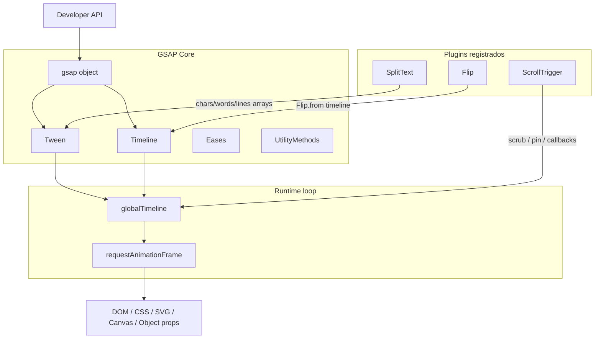
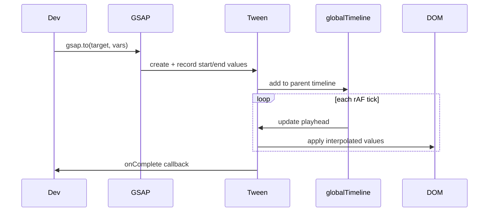
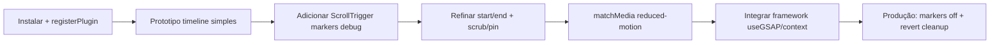

# Dossiê Técnico — GSAP (Core + ScrollTrigger + Flip + SplitText)

> Documento de referência permanente. Não é tutorial introdutório.  
> Escopo: **GSAP Core v3**, **ScrollTrigger**, **Flip** e **SplitText** (opcional, mas documentado).

---

## 1. Visão Geral

### O que é

**GSAP** (GreenSock Animation Platform) é uma biblioteca JavaScript **framework-agnostic** para animação de alta performance. O core manipula propriedades ao longo do tempo com precisão sub-frame; plugins estendem capacidades (scroll, layout FLIP, texto, SVG, drag, etc.).

Fonte: [GSAP README](https://github.com/greensock/GSAP), [docs v3](https://gsap.com/docs/v3/)

### Problema que resolve

- Sequenciamento complexo de animações sem gerir manualmente `delay` encadeados
- Inconsistências entre browsers em transforms, timing e scroll
- Animações scroll-driven com pinning, scrub e snap
- Transições de layout (FLIP) quando o DOM muda estruturalmente
- Split de texto para stagger sem quebrar acessibilidade

### História e origem

- Criado por **Jack Doyle** e equipa **GreenSock** (desde ~2008)
- Adquirido pela **Webflow** (outono 2024)
- Desde **30 abril 2025**: GSAP + todos os plugins (incl. SplitText, MorphSVG) são **100% gratuitos**, inclusive uso comercial

Fonte: [Webflow — GSAP becomes free](https://webflow.com/blog/gsap-becomes-free)

### Filosofia

| Princípio | Descrição |
|-----------|-----------|
| Performance first | Engine otimizada; cache de transforms; debounce/throttle em scroll |
| Modularidade | Core pequeno; plugins à la carte |
| Controlo total | Timelines, scrub, callbacks, utilitários |
| Compatibilidade | Workarounds para bugs/limitações de browsers |
| Zero dependências | Sem peer deps obrigatórias |

### Casos de uso

- Landing pages com scroll storytelling (ScrollTrigger)
- Transições de UI / reorder de listas (Flip)
- Hero text reveals (SplitText + stagger)
- Dashboards, e-commerce, portfolios, Webflow sites
- Integração React/Vue/Angular via hooks/context

### Público-alvo

- Frontend engineers, creative developers, designers que codificam
- Equipas Webflow e agências de motion web
- Projetos que exigem controlo fino além de CSS-only

### Ecossistema

```
GSAP Core (Tween, Timeline, Eases, Utils)
    ├── Plugins Scroll: ScrollTrigger, ScrollTo, ScrollSmoother
    ├── Plugins UI: Flip, Draggable, Inertia, Observer
    ├── Plugins Text: SplitText, ScrambleText, Text
    ├── Plugins SVG: DrawSVG, MorphSVG, MotionPath
    ├── Eases premium: CustomEase, CustomBounce, CustomWiggle
    └── React: @gsap/react (useGSAP)
```

Fonte: [docsHome](https://gsap.com/docs/v3/)

---

## 2. Arquitetura

### Componentes principais



### Abstrações

| Abstração | Papel |
|-----------|-------|
| **Tween** | Anima propriedades de targets entre valores iniciais/finais |
| **Timeline** | Container sequencial; coordena playheads de filhos |
| **Animation** | Classe base (Tween/Timeline partilham control methods) |
| **Plugin** | Registado via `gsap.registerPlugin()`; estende parsing/effects |
| **Context** | Agrupa animações para revert/kill em batch |
| **MatchMedia** | Setup responsivo com revert automático |

### Ciclo de vida de um Tween



Fonte: [GSAP Overview](https://gsap.com/docs/v3/GSAP/)

---

## 3. Como funciona internamente

### Por baixo dos panos

1. **Registo de propriedades**: GSAP captura valores iniciais (inline ou computed) e normaliza unidades
2. **Plugins de parsing**: CSSPlugin, TransformPlugin, etc. convertem `x`, `rotation`, `opacity` em valores aplicáveis
3. **Tick loop**: `globalTimeline` avança via `requestAnimationFrame`; filhos herdam timeScale
4. **Lazy rendering**: `.to()` tweens não renderizam no frame 0 até o playhead mover (vs `.from()` com `immediateRender: true` por defeito)
5. **ScrollTrigger**: escuta scroll (debounced), calcula `progress` entre `start`/`end`, liga a tween/timeline ou callbacks

### Gestão de estado

- Estado vive nos objetos Tween/Timeline (não num store global reativo)
- `gsap.context()` e `gsap.matchMedia()` mantêm referências para cleanup
- ScrollTrigger pré-calcula posições em `refresh()` — não recalcula continuamente por performance

### Memória

- `kill()` / `revert()` libertam listeners e revertem inline styles
- ScrollTrigger `once: true` auto-kill após end
- SplitText `revert()` restaura `innerHTML` original

Fonte: [gsap.context()](https://gsap.com/docs/v3/GSAP/gsap.context/), [ScrollTrigger](https://gsap.com/docs/v3/Plugins/ScrollTrigger/)

---

## 4. Instalação

### npm

```bash
npm install gsap
npm install @gsap/react   # opcional, React
```

### pnpm / yarn / bun

```bash
pnpm add gsap @gsap/react
yarn add gsap @gsap/react
bun add gsap @gsap/react
```

### CDN

```html
<script src="https://cdn.jsdelivr.net/npm/gsap@3.15/dist/gsap.min.js"></script>
<script src="https://cdn.jsdelivr.net/npm/gsap@3.15/dist/ScrollTrigger.min.js"></script>
<script src="https://cdn.jsdelivr.net/npm/gsap@3.15/dist/Flip.min.js"></script>
<script src="https://cdn.jsdelivr.net/npm/gsap@3.15/dist/SplitText.min.js"></script>
```

Fonte: [Installation](https://gsap.com/docs/v3/Installation), [README](https://github.com/greensock/GSAP)

### ESM (recomendado)

```javascript
import gsap from "gsap";
import ScrollTrigger from "gsap/ScrollTrigger";
import Flip from "gsap/Flip";
import SplitText from "gsap/SplitText";

gsap.registerPlugin(ScrollTrigger, Flip, SplitText);
```

### UMD (build tools legados)

```javascript
import { gsap } from "gsap/dist/gsap";
import { ScrollTrigger } from "gsap/dist/ScrollTrigger";
```

### Monorepo / workspace

Criar módulo central `gsap.js`:

```javascript
export * from "gsap";
export * from "gsap/ScrollTrigger";
export * from "gsap/Flip";
export * from "gsap/SplitText";
import { gsap } from "gsap";
import { ScrollTrigger } from "gsap/ScrollTrigger";
import { Flip } from "gsap/Flip";
import { SplitText } from "gsap/SplitText";
gsap.registerPlugin(ScrollTrigger, Flip, SplitText);
```

**Nota**: repositório privado `npm.greensock.com` **descontinuado** — usar npm público ≥ 3.13.

---

## 5. Configuração

### Registo de plugins

```javascript
gsap.registerPlugin(ScrollTrigger, Flip, SplitText);
```

Obrigatório em bundlers com tree-shaking; idempotente (registar múltiplas vezes não prejudica).

### Defaults globais

```javascript
gsap.defaults({ ease: "power2.out", duration: 1 });
ScrollTrigger.defaults({ markers: false, toggleActions: "play none none reverse" });
```

### ScrollTrigger.config()

```javascript
ScrollTrigger.config({ limitCallbacks: true }); // reduz callbacks quando off-screen
```

### gsap.config()

Opções globais do core (ex.: `nullTargetWarn`, `trialWarn`).

### TypeScript

Definições oficiais em `node_modules/gsap/types/index.d.ts`. Pode incluir explicitamente no `tsconfig.json`:

```json
{
  "files": ["node_modules/gsap/types/index.d.ts"]
}
```

### matchMedia / reduced motion

```javascript
let mm = gsap.matchMedia();
mm.add("(prefers-reduced-motion: reduce)", () => {
  gsap.globalTimeline.timeScale(0); // ou animações estáticas
});
```

Fonte: [Installation FAQs](https://gsap.com/docs/v3/Installation), [gsap.matchMedia()](https://gsap.com/docs/v3/GSAP/gsap.matchMedia()/)

---

## 6. Estrutura recomendada de projeto

```
src/
├── lib/
│   └── gsap.ts              # registerPlugin centralizado
├── animations/
│   ├── hero.ts              # timelines nomeadas
│   ├── scroll-sections.ts   # ScrollTrigger setups
│   └── flips/
│       └── gallery.ts       # Flip.getState / Flip.from
├── components/
│   └── SplitHeading.tsx     # SplitText + onSplit
└── hooks/
    └── useScrollAnimations.ts
```

### Boas práticas

- **Um ponto de registo** de plugins
- **Funções puras** que recebem scope/ref e retornam context ou timeline
- **ScrollTriggers top-to-bottom** na ordem DOM (ou `refreshPriority`)
- **Separar** setup (create) de control (play/pause) quando possível
- **revert/kill** em unmount (React: `useGSAP`)

---

## 7. API completa

### GSAP Core — métodos principais

| Método | Parâmetros | Retorno | Comportamento |
|--------|------------|---------|---------------|
| `gsap.to(targets, vars)` | targets, vars (duration, ease, props) | Tween | Anima **para** valores |
| `gsap.from(targets, vars)` | idem | Tween | Anima **desde** valores; `immediateRender: true` default |
| `gsap.fromTo(targets, fromVars, toVars)` | 3 args | Tween | Valores explícitos início/fim |
| `gsap.set(targets, vars)` | instantâneo | Tween | duration 0 |
| `gsap.timeline(vars)` | vars opcionais | Timeline | Container sequencial |
| `gsap.delayedCall(d, fn, params, scope)` | delay, callback | Tween | Timer utilitário |
| `gsap.getProperty(target, prop)` | element, string | any | Lê valor animável |
| `gsap.setProperty(target, prop, value)` | | void | Setter direto |
| `gsap.killTweensOf(targets, props?)` | | void | Mata tweens activos |
| `gsap.context(fn, scope?)` | function, element/ref | Context | Agrupa + scope selectors |
| `gsap.matchMedia(scope?)` | ref opcional | MatchMedia | Media queries + revert |
| `gsap.quickTo(target, prop, vars)` | | Function | Tween otimizado para updates frequentes |
| `gsap.registerPlugin(...plugins)` | plugins | void | Regista plugins |

### Timeline — métodos de instância

| Método | Descrição |
|--------|-----------|
| `.to/.from/.fromTo(target, vars, position?)` | Adiciona tween na posição indicada |
| `.add(child, position?)` | Adiciona tween/timeline/callback |
| `.addLabel(name, position?)` | Marca ponto nomeado |
| `.call(fn, params, position?)` | Callback |
| `.pause/.play/.reverse/.restart/.seek/.progress/.timeScale` | Control methods |
| `.kill()` | Remove timeline e filhos |

**Position parameter**: `3`, `"+=1"`, `"-=1"`, `"label"`, `"<"`, `">"`, `"<1"`, `">-2"`

Fonte: [Timeline](https://gsap.com/docs/v3/GSAP/Timeline/)

### ScrollTrigger — API essencial

#### Criação

```javascript
// Shorthand em tween/timeline
gsap.to(".box", {
  x: 500,
  scrollTrigger: ".box" // ou object config
});

// Standalone
ScrollTrigger.create({
  trigger: "#section",
  start: "top center",
  end: "bottom top",
  onEnter: (self) => {},
});
```

#### Config object (propriedades críticas)

| Propriedade | Tipo | Descrição |
|-------------|------|-----------|
| `trigger` | Element/string | Elemento de referência para start |
| `start` / `end` | string/number/function | Posições scroll (`"top bottom"`, `"+=500"`, `clamp()`) |
| `scrub` | boolean/number | Liga progress à scrollbar; number = suavização (s) |
| `pin` | boolean/string/Element | Fixa elemento durante intervalo |
| `pinSpacing` | boolean/"margin" | Espaçador automático (default true; false em flex container) |
| `markers` | boolean/object | Debug visual |
| `toggleActions` | string | `"onEnter onLeave onEnterBack onLeaveBack"` |
| `animation` | Tween/Timeline | Animação controlada |
| `snap` | number/array/object/"labels" | Snap por velocidade |
| `once` | boolean | Kill após primeiro end |
| `horizontal` | boolean | Scroll horizontal |
| `scroller` | Element | Container scroll custom |
| `invalidateOnRefresh` | boolean | invalidate() animation on resize |

#### Métodos estáticos

| Método | Descrição |
|--------|-----------|
| `ScrollTrigger.create(vars)` | Instância standalone |
| `ScrollTrigger.batch(triggers, vars)` | Batch callbacks com stagger |
| `ScrollTrigger.refresh()` | Recalcula todas posições |
| `ScrollTrigger.update()` | Sync após DOM changes |
| `ScrollTrigger.getAll()` | Lista instâncias |
| `ScrollTrigger.getById(id)` | Por id |
| `ScrollTrigger.scrollerProxy(el, vars)` | Integração smooth-scroll 3rd party |
| `ScrollTrigger.matchMedia()` | Deprecated → usar `gsap.matchMedia()` |

#### Instância

`.disable()`, `.enable()`, `.kill()`, `.refresh()`, `.scroll(n)`, `.getVelocity()`, `.progress`, `.isActive`, `.direction`

Fonte: [ScrollTrigger](https://gsap.com/docs/v3/Plugins/ScrollTrigger/)

### Flip — API

| Método | Assinatura | Retorno | Descrição |
|--------|------------|---------|-----------|
| `Flip.getState(targets, vars?)` | targets, `{props}` | FlipState | Captura posição/tamanho/rotação/skew |
| `Flip.from(state, vars?)` | state, tween vars + flip options | Timeline | Anima do estado gravado → actual |
| `Flip.to(state, vars?)` | | Timeline | Inverso de from |
| `Flip.fit(el, dest, vars?)` | | void | Redimensiona/repositiona para coincidir |
| `Flip.batch(id)` | string | FlipBatch | Coordena múltiplos Flips (React) |
| `Flip.killFlipsOf(targets, complete?)` | | void | Interrompe flips activos |
| `Flip.isFlipping(target)` | | boolean | Estado activo |

#### Flip.from() options (selecção)

| Opção | Descrição |
|-------|-----------|
| `absolute: true` / selector | `position: absolute` durante flip (flex/grid) |
| `scale: true` | Usa scaleX/Y em vez de width/height |
| `fade: true` | Crossfade quando `data-flip-id` troca de elemento |
| `nested: true` | Compensa offsets em filhos nested |
| `onEnter/onLeave` | Callbacks para elementos que entram/saem do DOM |
| `targets` | Subset ou novos elementos (crítico em React) |
| `toggleClass` | Classe durante animação |
| `simple: true` | Skip cálculos rotation/scale/skew (perf) |

**Fluxo FLIP**: `getState()` → mutar DOM/CSS → `Flip.from(state, vars)`

Fonte: [Flip](https://gsap.com/docs/v3/Plugins/Flip/)

### SplitText — API

| Método | Descrição |
|--------|-----------|
| `SplitText.create(target, config?)` | Factory principal (v3.13+) |
| Instância `.revert()` | Restaura innerHTML |
| `.split()` | Re-split manual |
| `.chars` / `.words` / `.lines` | Arrays de elementos |
| `.masks` | Elementos mask quando `mask` activo |

#### Config object (selecção)

| Propriedade | Default | Descrição |
|-------------|---------|-----------|
| `type` | `"chars,words,lines"` | Tipos a dividir |
| `mask` | undefined | `"lines"` \| `"words"` \| `"chars"` — clip reveal |
| `autoSplit` | false | Re-split on resize/font load |
| `onSplit(self)` | — | Callback; return tween → sync automático |
| `aria` | `"auto"` | `"auto"` \| `"hidden"` \| `"none"` |
| `deepSlice` | true | Nested elements multi-linha |
| `charsClass/wordsClass/linesClass` | — | Classes; `"++"` auto-increment |
| `tag` | `"div"` | Tag wrapper |
| `smartWrap` | false | Agrupa chars em nowrap |
| `ignore` | — | Selectors a não dividir |
| `prepareText(text, el)` | — | Pré-processamento por bloco |

Fonte: [SplitText](https://gsap.com/docs/v3/Plugins/SplitText/)

---

## 8. Conceitos fundamentais

### Tween

Unidade atómica de animação. Interpola propriedades ao longo de `duration` com `ease`. Targets: selector, Element, array, object genérico.

### Timeline

Sequenciador. **Não** define propriedades nos targets — agrupa tweens. Playhead único cascata para filhos.

### Easing

String syntax: `"power2"`, `"power3.inOut"`, `"elastic.out(1, 0.3)"`. CustomEase para curvas SVG.

### ScrollTrigger progress

`progress` 0→1 entre `start` e `end` scroll positions. Com `scrub`, mapeia para `animation.progress()`.

### Pinning

Elemento `position: fixed` ou transform durante scroll; `pinSpacing` adiciona padding para evitar overlap. **Não animar** o elemento pinned directamente.

### FLIP technique

**F**irst → **L**ast → **I**nvert → **P**lay. GSAP calcula deltas e anima remoção dos offsets.

### data-flip-id

Correlaciona elementos entre estados DOM diferentes para swap/crossfade.

### Split + stagger

Dividir texto em arrays animáveis; `stagger` nos chars/words/lines.

### Context / MatchMedia

Padrão moderno de **scope + cleanup** em SPAs e animações responsivas.

---

## 9. Fluxo de desenvolvimento



1. Animar offline (sem scroll) até timing correcto
2. Encapsular em timeline única por secção
3. Adicionar `scrollTrigger: { markers: true }` em dev
4. Testar resize, mobile, font load (SplitText: `autoSplit`)
5. Cleanup em route change / unmount

---

## 10. Recursos avançados

| Recurso | Descrição |
|---------|-----------|
| `gsap.quickTo()` | Mousemove / frequent updates |
| `ScrollTrigger.batch()` | Stagger onEnter para listas |
| `containerAnimation` | Scroll vertical controla secção horizontal |
| `Flip.batch()` | Múltiplos componentes React |
| `SplitText` mask + autoSplit | Reveals + responsive lines |
| `gsap.utils.pipe/clamp/snap` | Composição funcional |
| `ScrollTrigger.scrollerProxy()` | Lenis/Locomotive/etc. |
| `gsap.effects` | Registar efeitos reutilizáveis |
| `timeline.tweenTo()` / `recent()` | Navegação intra-timeline |
| `repeatRefresh` | Loops com valores dinâmicos |

---

## 11. Performance

### Otimizações GSAP

- Cache de transforms (usar GSAP para setar transforms, não só CSS)
- `will-change` usado com parcimónia
- `quickTo` vs centenas de `gsap.to()` em mousemove
- SplitText: dividir só o necessário (`type: "words,lines"` sem chars se possível)
- Flip: `scale: true` (transform) vs width/height; `simple: true` quando aplicável
- ScrollTrigger: `limitCallbacks: true`; evitar centenas de STs desnecessários

### Gargalos

- Milhares de nós SplitText no DOM
- Pinning + animar o próprio pinned element
- CSS transitions no mesma propriedade que GSAP
- Recriar animações em cada scroll event
- `refresh()` em excesso

### Benchmark

README afirma até **20× mais rápido que jQuery** em property setting; uso em **12M+ sites**. Benchmarks formais variam por caso — priorizar perf real com DevTools Performance.

Fonte: [README](https://github.com/greensock/GSAP)

---

## 12. Escalabilidade

- **Design systems**: timelines como funções exportadas; tokens de duration/ease
- **Code splitting**: import dinâmico de plugins por rota
- **ScrollTrigger.sort()** / ordem DOM para refresh correcto em páginas longas
- **Flip.batch** em apps React com múltiplos componentes
- **gsap.context** por página/secção para teardown
- Grandes sites (Awwwards, agências) usam GSAP + ScrollTrigger como stack standard de motion web

---

## 13. Integrações

| Stack | Abordagem |
|-------|-----------|
| **React** | `@gsap/react` + `useGSAP({ scope })` |
| **Next.js** | Client Components (`"use client"`); SSR-safe hook |
| **Vue** | `onMounted` + `gsap.context`; `@gsap/shockingly` inexistente — usar core |
| **Angular** | ElementRef como scope |
| **Vite/Webpack** | ESM + `registerPlugin`; cuidado tree-shaking |
| **TypeScript** | Types incluídos |
| **Three.js/WebGL** | Animar object props; MotionPath plugin |
| **Tailwind** | Classes + GSAP para transforms; evitar conflito transition |
| **Framer Motion** | Coexistência possível; evitar mesmas props simultâneas |
| **Webflow** | GSAP core + plugins nativos no Site Settings |

Fonte: [React & GSAP](https://gsap.com/resources/React/)

---

## 14. TypeScript

- Pacote `gsap` inclui `types/`
- Plugins exportam types após registo
- ScrollTrigger vars extendem `Animation` callbacks
- SplitText instance types para `chars`, `words`, `lines`
- Usar refs tipados `useRef<HTMLDivElement>(null)` com scope

```typescript
import gsap from "gsap";
import ScrollTrigger from "gsap/ScrollTrigger";

gsap.registerPlugin(ScrollTrigger);

const tl = gsap.timeline({
  scrollTrigger: {
    trigger: ".section",
    start: "top top",
    scrub: true,
  },
});
```

---

## 15. Customização

- **Eases**: CustomEase (SVG path), CustomWiggle, CustomBounce
- **ScrollTrigger markers**: cores, indent, fontSize
- **SplitText**: classes incrementadas, `prepareText`, `wordDelimiter` RegExp
- **Flip**: props extra (`backgroundColor,color`), spin function
- **gsap.registerEffect()**: efeitos nomeados reutilizáveis
- **Modificadores** (via plugins): snap, wrap, clamp em valores

---

## 16. Plugins (foco + relacionados)

| Plugin | Quando usar |
|--------|-------------|
| **ScrollTrigger** | Qualquer animação ligada a scroll |
| **Flip** | Reorder, filter, layout shift, shared element transitions |
| **SplitText** | Text reveals, stagger tipográfico |
| ScrollSmoother | Smooth scroll nativo (requer ST) |
| ScrollTo | Scroll animado para âncoras |
| Draggable + Inertia | Drag UI |
| Observer | Normalizar pointer/touch/wheel |
| DrawSVG / MorphSVG | SVG avançado |

Todos os plugins listados estão **gratuitos** desde v3.13+ / Abril 2025.

---

## 17. Ecossistema

| Ferramenta | URL / Notas |
|------------|-------------|
| Demos oficiais | demos.gsap.com |
| CodePen GreenSock | codepen.io/GreenSock |
| GSAP Cheat Sheet | gsap.com/cheatsheet |
| Ease Visualizer | gsap.com/docs/v3/Eases |
| GSDevTools | Plugin debug timeline |
| Fóruns | gsap.com/community |
| YouTube GreenSockLearning | Tutoriais oficiais |
| @gsap/react | Hook useGSAP |

---

## 18. Casos reais

- **12M+ sites** (dado oficial README)
- **Webflow** — integração nativa pós-aquisição
- **Grandes ad networks** excluem GSAP do bundle size (DoubleClick, etc.)
- Showcases: gsap.com/showcase (Awwwards, campanhas de marca)
- Comunidade Codrops, agencies creative dev

---

## 19. Exemplos completos

### Hello World

```javascript
import gsap from "gsap";

gsap.to(".box", { x: 200, duration: 1, ease: "power2.out" });
```

### Básico — Timeline + ScrollTrigger

```javascript
import gsap from "gsap";
import ScrollTrigger from "gsap/ScrollTrigger";
gsap.registerPlugin(ScrollTrigger);

const tl = gsap.timeline({
  scrollTrigger: {
    trigger: ".section",
    start: "top 80%",
    end: "bottom 20%",
    toggleActions: "play none none reverse",
  },
});

tl.from(".section h2", { y: 50, opacity: 0 })
  .from(".section p", { y: 30, opacity: 0 }, "-=0.5");
```

### Intermediário — Flip grid

```javascript
import gsap from "gsap";
import Flip from "gsap/Flip";
gsap.registerPlugin(Flip);

function toggleLayout() {
  const state = Flip.getState(".item");
  document.querySelector(".grid").classList.toggle("expanded");
  Flip.from(state, {
    duration: 0.7,
    ease: "power1.inOut",
    absolute: true,
  });
}
```

### Avançado — SplitText + Scroll scrub

```javascript
import gsap from "gsap";
import ScrollTrigger from "gsap/ScrollTrigger";
import SplitText from "gsap/SplitText";
gsap.registerPlugin(ScrollTrigger, SplitText);

SplitText.create(".hero", {
  type: "words,lines",
  mask: "lines",
  autoSplit: true,
  onSplit(self) {
    return gsap.from(self.lines, {
      yPercent: 100,
      stagger: 0.05,
      scrollTrigger: {
        trigger: ".hero",
        start: "top 70%",
        end: "bottom 30%",
        scrub: 1,
      },
    });
  },
});
```

### Arquitetura profissional — React

```javascript
"use client";
import { useRef } from "react";
import gsap from "gsap";
import ScrollTrigger from "gsap/ScrollTrigger";
import { useGSAP } from "@gsap/react";

gsap.registerPlugin(ScrollTrigger, useGSAP);

export function Hero() {
  const ref = useRef(null);

  useGSAP(() => {
    gsap.from(".hero-title", {
      y: 80,
      opacity: 0,
      scrollTrigger: { trigger: ref.current, start: "top 85%" },
    });
  }, { scope: ref });

  return (
    <section ref={ref}>
      <h1 className="hero-title">Title</h1>
    </section>
  );
}
```

---

## 20. Erros comuns

| Erro | Causa | Solução |
|------|-------|---------|
| Animação não corre após build | Tree-shaking remove plugins | `gsap.registerPlugin(...)` |
| `.from()` múltiplos cliques | `immediateRender` + opacity actual | `.fromTo()` ou reset |
| Pinning salta | `transform`/`will-change` em ancestor | `pinReparent: true` ou remover transform |
| ScrollTrigger posição errada | Ordem refresh / DOM async | STs top-to-bottom; `ScrollTrigger.refresh()` após load |
| Flip em React não anima | Novos elementos DOM | `targets: ".class"` + `data-flip-id` |
| SplitText linhas partidas | Fonts não carregadas | `autoSplit: true` + `onSplit` |
| FOUC em transforms | CSS inicial vs GSAP cache | Setar transforms via GSAP ou flash prevention |
| CSS transition + GSAP | Conflito por frame | Remover transitions nas props animadas |
| Timeline `.to()` após complete | Tween não corre | Usar control methods ou nova timeline |
| scrub + onUpdate ST | Delay do scrub | `onUpdate` no tween, não no ST |

Fonte: [Common mistakes](https://gsap.com/resources/mistakes/)

---

## 21. Limitações

| Limitação | Detalhe |
|-----------|---------|
| Flip 3D | Sem `rotationX/Y/Z` ou z |
| SplitText + SVG | Não funciona com `<text>` SVG |
| ScrollTrigger + pin animado | Não animar elemento pinned |
| SplitText SEO | H1 split requer meta/aria correctos |
| Licença | Proibido builders visuais que competem com Webflow |
| Bundle size | Plugins aumentam payload (SplitText rewrite −50% v3.13) |
| Nested pin ST | Não suportado |

### Quando NÃO usar

- Animações simples `:hover` (CSS suficiente)
- Layout-only (CSS `@keyframes` + `view-timeline` emergente)
- Apps sem JS no critical path
- Builder visual concorrente Webflow (restrição licença)

---

## 22. Comparação

| Critério | GSAP | Framer Motion | CSS + WAAPI | Lenis + CSS |
|----------|------|---------------|-------------|-------------|
| Sequenciamento | Excelente (Timeline) | Bom (variants) | Limitado | N/A |
| ScrollTrigger-level | Nativo | Via hooks/3rd party | scroll-driven CSS (parcial) | Só smooth scroll |
| FLIP layout | Flip plugin | layout prop | Manual | N/A |
| Text split | SplitText | Não built-in | Não | Não |
| Bundle | Moderado + plugins | Moderado (React) | Zero | Pequeno |
| Framework lock-in | Nenhum | React-focused | Nenhum | Nenhum |
| Curva aprendizagem | Média-alta | Média | Baixa | Baixa |
| Licença comercial | Grátis (2025+) | MIT | N/A | MIT |

**Escolher GSAP quando**: scroll complexo, timelines precisas, Flip, SplitText, multi-framework.  
**Escolher Framer Motion quando**: React-only, gestures declarativos, MVVM motion.  
**Escolher CSS quando**: micro-interacções, progressive enhancement, zero JS.

---

## 23. Roadmap

Informação pública (Webflow + GSAP, 2025):

- Expansão **Webflow Interactions** com features GSAP nativas
- Timeline horizontal para Interactions
- Reutilização de Interactions cross-site
- Replataformar Interactions Webflow em GSAP
- GSAP 4 (futuro distante): syntax Lite/Max removida

Sem RFC público formal; seguir [blog Webflow](https://webflow.com/blog) e releases GitHub.

---

## 24. Breaking Changes

| Versão | Mudança |
|--------|---------|
| **3.0** | API `gsap.to()` vars object; remove TweenLite/TimelineMax |
| **3.11** | `gsap.context()`, `gsap.matchMedia()` |
| **3.12** | `clamp()` em start/end ScrollTrigger |
| **3.13** | SplitText rewrite; plugins Club grátis npm; deprecate private npm |
| **Abr 2025** | Licença comercial grátis; todos plugins no npm público |
| **4.0** (planeado) | Remover syntax GSAP 2 (Lite/Max) |

Fonte: [Installation migration](https://gsap.com/docs/v3/Installation), [Webflow blog](https://webflow.com/blog/gsap-becomes-free)

---

## 25. Changelog resumido

| Era | Marco |
|-----|-------|
| 2008–2017 | GSAP 1–2, dominância Flash→HTML5 |
| 2019 | GSAP 3 — API unificada |
| 2020–2023 | ScrollTrigger mature; matchMedia |
| 2024 | Aquisição Webflow |
| 2025 | Free for all; SplitText v3.13 rewrite (14 features, −50% size) |
| 2026 | v3.15.x maintenance + docs AI Skills |

---

## 26. Melhores práticas

1. `registerPlugin` num único módulo
2. Preferir `.to()`/`.from()` sobre `.fromTo()` quando possível
3. Setar transforms via GSAP (accuracy + perf)
4. Usar `xPercent`/`yPercent` para percentagens
5. Criar animações antecipadamente; control com `play/reverse`
6. ScrollTriggers na ordem DOM
7. `markers: true` só em dev
8. `gsap.context` / `useGSAP` sempre em SPAs
9. `prefers-reduced-motion` via matchMedia
10. SplitText: `revert()` após animação se muitos nós
11. Flip: `box-sizing: border-box`; `absolute: true` em flex/grid
12. Evitar CSS transitions nas mesmas props

---

## 27. Anti-patterns

| Anti-pattern | Porquê evitar |
|--------------|---------------|
| `gsap.to(document.querySelectorAll(...))` | Usar selector string directamente |
| Dezenas de ST sem batch/limitCallbacks | Scroll jank |
| Recriar timeline em cada resize | Use refresh/matchMedia |
| Animar width/height pesado | Preferir scale ou Flip `scale: true` |
| Split all chars em parágrafos longos | DOM explosion |
| Ignorar cleanup React Strict Mode | Duplicate animations |
| `scroll-jacking` total | ST não faz jack; mas UX poor se abusar pin |
| Import `{ gsap } from "gsap/all"` indiscriminado | Bundle inflado |

---

## 28. Segurança

- Biblioteca client-side; sem auth/network por defeito
- Não executar `innerHTML` user-controlled com SplitText targets
- CDN: preferir SRI/subresource integrity em produção
- Licença proíbe reverse engineering para produtos competitivos Webflow
- Supply chain: instalar de npm oficial ou cdn.jsdelivr.net/npm/gsap
- Sem CVEs críticos recorrentes conhecidos — manter versão actualizada

---

## 29. SEO

**Aplicável com ressalvas** (SplitText / motion).

- Conteúdo principal deve existir no HTML antes do split
- Com `aria: "auto"`, heading split mantém `aria-label` legível
- Evitar split do único `<h1>` sem meta title/description adequados
- Conteúdo oculto (`opacity: 0`) antes de animar: garantir que crawlers veem texto (SSR/hydration)
- Scroll-driven content: conteúdo deve estar no DOM (ST não lazy-load por si)

---

## 30. Acessibilidade

**Altamente aplicável.**

```javascript
gsap.matchMedia().add("(prefers-reduced-motion: reduce)", () => {
  ScrollTrigger.getAll().forEach(st => st.disable());
  // ou animações estáticas / duration: 0
});
```

- SplitText `aria: "auto"` (default) — screen readers leem `aria-label`
- Links nested: usar `aria: "none"` + duplicate screen-reader-only copy
- Evitar animações vestibulares agressivas (spin, parallax extremo)
- Pinning prolongado pode desorientar — testar com teclado scroll
- Focus management não é automático — gerir tabindex em modais FLIP

Fonte: [gsap.matchMedia()](https://gsap.com/docs/v3/GSAP/gsap.matchMedia/), [SplitText a11y](https://gsap.com/docs/v3/Plugins/SplitText/)

---

## 31. Testes

| Abordagem | Como |
|-----------|------|
| **Unit** | Mock `gsap` methods; testar lógica de setup |
| **Vitest/Jest** | `gsap.context().revert()` in `afterEach` |
| **Playwright/Cypress** | Assert opacity/transform após `animation` event ou timeout |
| **ScrollTrigger** | `ScrollTrigger.refresh()` + scroll programático |
| **Visual regression** | Percy/Chromatic após animação complete |

GSAP não ship test utils oficiais; testar comportamento observável no DOM.

---

## 32. Debug

- `markers: true` no ScrollTrigger
- **GSDevTools** plugin — scrub timeline global
- `console.log(ScrollTrigger.getAll())`
- `gsap.globalTimeline.pause()` freeze
- DevTools → Performance → frame long tasks
- `Flip.getState` + log bounds antes/depois

---

## 33. DevTools

| Ferramenta | Uso |
|------------|-----|
| GSDevTools | Timeline scrubbing oficial |
| ScrollTrigger markers | start/end/trigger visual |
| Ease Visualizer | Curvas easing |
| Browser DevTools | Layers, compositing, FPS |

---

## 34. FAQ

**GSAP é grátis para produção comercial?**  
Sim, desde Abril 2025, incluindo SplitText e ex-Club plugins. [Licença standard](https://gsap.com/standard-license)

**Preciso de `registerPlugin`?**  
Sim, com bundlers/modern build (tree-shaking).

**ScrollTrigger funciona com smooth scroll?**  
Sim — ScrollSmoother (oficial) ou `scrollerProxy()`.

**SplitText funciona sem GSAP core?**  
Sim — único plugin standalone; animação requer GSAP.

**React Strict Mode duplica animações?**  
Usar `useGSAP` com cleanup automático.

**Posso usar com Three.js?**  
Sim — animar propriedades de Object3D.

**Qual versão documentada?**  
v3.15.x (npm + docs site).

---

## 35. Glossário

| Termo | Definição |
|-------|-----------|
| **Tween** | Animação single-property-set |
| **Timeline** | Sequenciador de tweens |
| **Ease** | Curva de interpolação temporal |
| **Scrub** | Liga animation progress ao scroll |
| **Pin** | Fixa elemento durante scroll range |
| **FLIP** | First-Last-Invert-Play layout animation |
| **Stagger** | Offset temporal entre múltiplos targets |
| **Context** | Scope + cleanup container |
| **MatchMedia** | Responsive animation setups |
| **SplitText** | Divisão chars/words/lines |
| **immediateRender** | Render frame 0 antes do playhead |
| **globalTimeline** | Root timeline GSAP |
| **data-flip-id** | Correlação entre estados Flip |

---

## 36. Cheatsheet

```javascript
// Setup
import gsap from "gsap";
import ScrollTrigger from "gsap/ScrollTrigger";
import Flip from "gsap/Flip";
import SplitText from "gsap/SplitText";
gsap.registerPlugin(ScrollTrigger, Flip, SplitText);

// Tween
gsap.to(".el", { x: 100, duration: 1, ease: "power2.out" });

// Timeline
const tl = gsap.timeline({ defaults: { ease: "none" } });
tl.to(a, { x: 100 }).to(b, { y: 50 }, "<0.2");

// ScrollTrigger shorthand
gsap.to(".el", { x: 500, scrollTrigger: { trigger: ".el", start: "top center", scrub: 1 } });

// ScrollTrigger standalone
ScrollTrigger.create({ trigger: "#id", start: "top top", end: "+=500", pin: true });

// Flip
const state = Flip.getState(".items");
// ... DOM changes ...
Flip.from(state, { duration: 0.8, absolute: true });

// SplitText
const split = SplitText.create(".text", { type: "words", onSplit: (s) => gsap.from(s.words, { opacity: 0, stagger: 0.05 }) });
split.revert();

// Context cleanup
const ctx = gsap.context(() => { /* ... */ }, scopeEl);
ctx.revert();

// matchMedia
const mm = gsap.matchMedia();
mm.add("(min-width: 800px)", () => { /* desktop ST */ });

// Control
tl.pause(); tl.play(); tl.reverse(); tl.progress(0.5); tl.timeScale(2);

// Refresh scroll
ScrollTrigger.refresh();
```

---

## 37. Guia de aprendizado

| Fase | Tópicos | Recursos |
|------|---------|----------|
| 1 — Fundamentos | Tween, ease, timeline básica | gsap.com/docs/v3/GSAP |
| 2 — Sequenciamento | position parameter, labels | Timeline docs + Snorkl.tv |
| 3 — Scroll | ScrollTrigger start/end, scrub, toggleActions | ScrollTrigger express course |
| 4 — Layout | Flip getState/from, data-flip-id | Flip demos CodePen |
| 5 — Texto | SplitText type, mask, autoSplit, aria | SplitText v3.13 docs |
| 6 — Produção | context, matchMedia, useGSAP, perf | React guide + mistakes |
| 7 — Avançado | batch, scrollerProxy, Flip.batch, containerAnimation | demos.gsap.com |

---

## 38. Referências

### Documentação

1. https://gsap.com/docs/v3/ — docsHome (consultado 2026-07-05)
2. https://gsap.com/docs/v3/GSAP/ — Core overview
3. https://gsap.com/docs/v3/GSAP/Timeline/ — Timeline API
4. https://gsap.com/docs/v3/GSAP/gsap.context()/ — Context
5. https://gsap.com/docs/v3/GSAP/gsap.matchMedia()/ — MatchMedia
6. https://gsap.com/docs/v3/GSAP/gsap.quickTo()/ — quickTo
7. https://gsap.com/docs/v3/Installation — Instalação
8. https://gsap.com/docs/v3/Plugins/ScrollTrigger/ — ScrollTrigger
9. https://gsap.com/docs/v3/Plugins/ScrollTrigger/static.create() — ST.create
10. https://gsap.com/docs/v3/Plugins/Flip/ — Flip
11. https://gsap.com/docs/v3/Plugins/SplitText/ — SplitText
12. https://gsap.com/resources/React/ — React & useGSAP
13. https://gsap.com/resources/mistakes/ — Erros comuns
14. https://gsap.com/standard-license — Licença

### GitHub

15. https://github.com/greensock/GSAP — Repositório oficial README

### Artigos / Blog

16. https://webflow.com/blog/gsap-becomes-free — GSAP 100% free (Abr 2025)

### Vídeos

17. https://www.youtube.com/@GreenSockLearning — Canal oficial

### Issues / Community

18. https://gsap.com/community/ — Fóruns GreenSock

### Benchmarks / Estudos

19. README GSAP — claim 20× vs jQuery; 12M+ sites

### Screenshots (MCP Puppeteer)

20. docs/dossiers/assets/gsap/ — gsap-docs-home, gsap-scrolltrigger-create (capturados 2026-07-05)

### Ferramentas de pesquisa utilizadas

- **MCP Puppeteer**: navegação + screenshots (gsap.com/docs/v3/)
- **WebFetch**: scraping docs oficiais
- **agent-browser**: tentativa instalação — Chrome download falhou (DNS); CLI instalado sem browser
- **Firecrawl / Context7**: indisponíveis (auth/network) nesta sessão

---

## Lacunas documentais

| Tópico | Estado |
|--------|--------|
| Roadmap GSAP 4 detalhado | Não publicado |
| Benchmarks independentes 2025+ | Limitados |
| ScrollSmoother API profunda | Fora de scope; requer ST |
| GSAP + Vue 3 guide oficial dedicado | Inferido de padrões core |

---

*Gerado via `/library-dossier` — skill technical-library-dossier v1.0.0*
