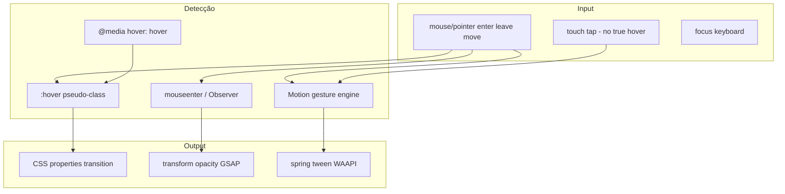
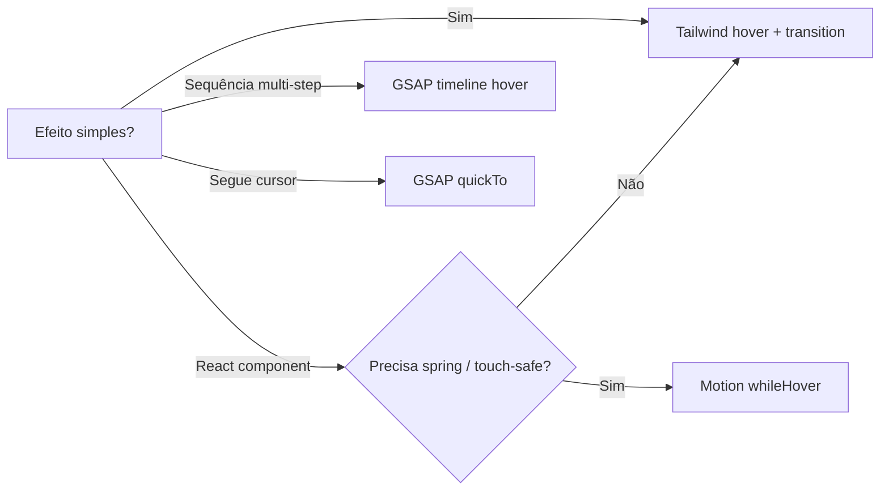

# Dossiê Técnico — Hover Effects (Tailwind CSS + GSAP + Motion)

> Documento de referência permanente. Não é tutorial introdutório.  
> **Escopo transversal:** padrões de **hover** em **Tailwind CSS v4**, **GSAP 3** e **Motion for React** (Framer Motion). Quando usar cada um e como combinar sem conflitos.

---

## 1. Visão Geral

### O que são hover effects

**Hover effects** são mudanças visuais ou comportamentais activadas quando o cursor (ou input primário) entra/sai de um elemento `:hover`. Incluem cor, escala, sombra, reveal de conteúdo, magnetic buttons, image tilt e timelines complexas.

### Problema que resolvem

| Desafio | Solução típica |
|---------|----------------|
| Feedback visual em UI | Tailwind `hover:` + `transition` |
| Cards com filhos animados | `group-hover:` |
| Touch “sticky hover” | Motion `whileHover` ou `@media (hover: hover)` |
| Sequências complexas no hover | GSAP timeline `play()` / `reverse()` |
| Cursor follower / magnetic | GSAP `quickTo` + `mousemove` |
| Múltiplos elementos | GSAP loop + `mouseenter` scoped |

### Três stacks comparadas (uma linha)

| Stack | Modelo | Melhor para |
|-------|--------|-------------|
| **Tailwind CSS** | Declarativo CSS `:hover` | 80% UI: botões, links, cards |
| **GSAP** | Imperativo eventos + tweens | Hover rico, sequências, DOM não-React |
| **Motion** | Declarativo React `whileHover` | Componentes React, springs, touch-safe |

### História / contexto

- **CSS `:hover`** — desde CSS1; problemático em touch (estado emulado persistente)
- **Media Queries Level 4** — `@media (hover: hover)` distingue dispositivos
- **Tailwind v3+** — variantes `hover:`, `group-hover:`, `motion-reduce:`
- **GSAP** — padrão `mouseenter`/`mouseleave` + timelines pausadas (docs mistakes)
- **Framer Motion → Motion** — `whileHover` filtra eventos touch emulados

Fontes: [Tailwind states](https://tailwindcss.com/docs/hover-focus-and-other-states), [Motion hover guide](https://motion.dev/docs/react-hover-animation), [GSAP mistakes](https://gsap.com/resources/mistakes/)

### Público-alvo

- Devs de portfolios e marketing sites (stack do projecto: GSAP scroll + potencial Tailwind/Motion)
- Equipas que precisam decidir **CSS vs JS** por componente

---

## 2. Arquitetura

### Camadas de implementação



### Fluxo recomendado por complexidade



---

## 3. Como funciona internamente

### CSS `:hover`

Browser aplica pseudo-classe quando pointer está sobre elemento hit-testable. **Sem JavaScript.** Transitions interpolam via compositor quando propriedades são `transform`/`opacity`.

### Tailwind variants

Classe `hover:bg-sky-700` compila para `.hover\:bg-sky-700:hover { ... }` — estado separado do default.

Tailwind v4 mapeia `hover` variant para:

```css
@media (hover: hover) { &:hover { ... } }
```

Fonte: [Tailwind pseudo-class reference table](https://tailwindcss.com/docs/hover-focus-and-other-states)

### Motion `whileHover`

Engine de gestos detecta pointer enter/leave **real** (exclui touch emulado). Anima para target props; ao sair, reverte ao estado anterior (`animate` / variant).

Fonte: [Motion hover animation](https://motion.dev/docs/react-hover-animation)

### GSAP hover pattern

1. Criar timeline **paused: true** no `mouseenter`
2. `mouseleave` → `reverse()` ou tween inverso
3. Evitar recriar tween a cada evento (performance)
4. **Nunca** misturar CSS `transition` na mesma propriedade

Fonte: [GSAP mistakes — loops + CSS transitions](https://gsap.com/resources/mistakes/)

---

## 4. Instalação

### Tailwind CSS v4

```bash
npm install tailwindcss @tailwindcss/vite
```

```css
@import "tailwindcss";
```

### GSAP (projecto actual)

```bash
npm install gsap
```

```typescript
import { gsap } from "gsap";
```

Ver `src/lib/gsap.ts` no portfólio.

### Motion for React

```bash
npm install motion
```

```tsx
import { motion } from "motion/react";
```

---

## 5. Configuração

### Tailwind — transitions default

| Utility | Efeito |
|---------|--------|
| `transition` | color, opacity, transform, shadow, etc. |
| `transition-colors` | só cores |
| `transition-transform` | transform only |
| `duration-300` | 300ms |
| `ease-out` | timing function |
| `motion-reduce:transition-none` | a11y |
| `motion-safe:hover:scale-110` | só se motion OK |

Fonte: [transition-property](https://tailwindcss.com/docs/transition-property)

### Tailwind — group / peer

```html
<a class="group hover:bg-black">
  <span class="group-hover:text-white">Title</span>
</a>
```

```html
<input class="peer" />
<p class="peer-invalid:visible invisible">Error</p>
```

### GSAP hover config

```javascript
const tl = gsap.timeline({ paused: true, defaults: { duration: 0.4, ease: "power2.out" } });
tl.to(".child", { y: 0, opacity: 1, stagger: 0.05 });

element.addEventListener("mouseenter", () => tl.play());
element.addEventListener("mouseleave", () => tl.reverse());
```

### Motion hover config

```tsx
<motion.div
  whileHover={{ scale: 1.05, transition: { duration: 0.15 } }}
  transition={{ duration: 0.4 }} // exit
/>
```

---

## 6. Estrutura recomendada de projecto

```
src/
├── components/
│   ├── ui/
│   │   ├── Button.tsx          # Tailwind ou motion.button
│   │   └── ProjectCard.tsx     # group-hover pattern
│   └── effects/
│       └── MagneticButton.tsx  # GSAP quickTo
├── animations/
│   ├── hover-cards.ts          # GSAP timelines export
│   └── scroll-sections.ts      # scroll (separado de hover)
└── styles/
    └── globals.css             # @import tailwindcss
```

**Regra:** um componente = **uma** estratégia dominante (não Tailwind transition + GSAP na mesma prop).

---

## 7. API completa

### Tailwind — variantes hover-related

| Variant | Selector / condição | Exemplo |
|---------|---------------------|---------|
| `hover:` | `:hover` (+ hover media v4) | `hover:bg-blue-600` |
| `group-hover:` | parent `.group:hover` | `group-hover:translate-x-1` |
| `group-hover/{name}:` | named group | `group-hover/card:opacity-100` |
| `peer-hover:` | sibling `.peer:hover ~ *` | raro; usar `peer-*` docs |
| `focus:` / `focus-visible:` | keyboard a11y | combinar com hover |
| `active:` | pressed | `active:scale-95` |
| `motion-safe:` | `prefers-reduced-motion: no-preference` | |
| `motion-reduce:` | reduced motion | desactivar hover motion |
| `max-md:hover:` | responsive + hover | hover só desktop breakpoint |

**Stacking:** `dark:md:hover:bg-fuchsia-600`

Fonte: [Tailwind states](https://tailwindcss.com/docs/hover-focus-and-other-states)

### GSAP — APIs hover-relevantes

| API | Uso hover |
|-----|-----------|
| `gsap.to/from/fromTo` | tween on enter/leave |
| `gsap.timeline({ paused })` | sequência hover |
| `.play() / .reverse() / .restart()` | control methods |
| `gsap.quickTo(target, prop, vars)` | mousemove follower |
| `gsap.utils.toArray()` | per-card hover |
| `Observer.create({ onHover, onMove })` | unified pointer |
| `gsap.context()` | cleanup React/Vue |

### Motion — APIs hover

| API | Descrição |
|-----|-----------|
| `whileHover={{ ... }}` | Animação durante hover |
| `whileTap={{ ... }}` | Press (pares hover) |
| `onHoverStart` / `onHoverEnd` | Callbacks touch-safe |
| `hover(ref, fn)` | <1kb standalone (`motion` package) |
| `variants` + `whileHover="hover"` | Orquestração filhos |
| `transition` separado | enter vs exit timing |

Fonte: [Motion gestures](https://motion.dev/docs/react-gestures), [hover animation](https://motion.dev/docs/react-hover-animation)

---

## 8. Conceitos fundamentais

### `:hover` vs true hover devices

MDN `@media (hover: hover)` — primary input **can** hover. Mobile often `hover: none` — `:hover` may stick after tap.

**Pattern CSS:**

```css
@media (hover: hover) {
  a:hover { background: black; }
}
```

Tailwind v4 aplica isto automaticamente na variant `hover:`.

### group vs peer

| Pattern | Relação | Caso |
|---------|---------|------|
| **group** | pai → filhos | Card hover muda ícone + título |
| **peer** | irmão anterior → seguinte | Input invalid → mensagem erro |

### Sticky hover (touch)

iOS/Android emulam `:hover` após tap — botões ficam “presos” highlighted. Soluções:

1. Motion `whileHover` (filtra touch)
2. `@media (hover: hover)` wrapper
3. `:active` only on touch via JS detection (raro)

### GSAP vs CSS no hover

GSAP wins: stagger, timelines, physics, morph, SplitText.  
CSS/Tailwind wins: zero JS, GPU transitions, maintainability.

**Conflito fatal:** CSS `transition` + GSAP mesma property → double interpolation, jank.

---

## 9. Fluxo de desenvolvimento

1. **Sketch** efeito (estático Figma)
2. Tentar **Tailwind** first (`hover:` + `transition-transform`)
3. Se React + spring/touch → **Motion** `whileHover`
4. Se stagger/sequência/reveal complexo → **GSAP** timeline
5. Testar **mobile** (sticky hover) + **keyboard** focus
6. `prefers-reduced-motion` branch
7. Performance audit (evitar layout thrashing — prefer `transform`/`opacity`)

---

## 10. Recursos avançados

| Técnica | Stack |
|---------|-------|
| **Magnetic button** | GSAP `quickTo` + mousemove |
| **3D card tilt** | GSAP rotateX/Y from pointer position |
| **Image reveal clip-path** | GSAP timeline hover |
| **Nested group/edit** | Tailwind `group/item` + `group-hover/item:` |
| **SVG stroke draw** | GSAP drawSVG plugin hover |
| **Layout hover** | Motion `layout` + `whileHover` (cuidado perf) |
| **Custom cursor** | Motion+ Cursor / GSAP quickTo |
| **Observer onMove** | GSAP parallax hover em container |

---

## 11. Performance

### Tailwind/CSS

- Animar **`transform` e `opacity`** (compositor)
- Evitar `width`, `height`, `top`, `left` em hover frequente
- `will-change: transform` só quando necessário

### GSAP

- Timelines **pré-criadas**, paused
- `quickTo` vs centenas de `gsap.to` em mousemove
- `gsap.set` transforms — não só CSS matrix ambíguo
- Observer debounced default (rAF batch)

### Motion

- `whileHover` usa engine híbrida — prefer transform/opacity
- Evitar layout props em hover (`width`) — use scale

---

## 12. Escalabilidade

- **Design tokens** Tailwind `@theme` — hover colors consistentes
- **Variants file** Motion partilhado (`buttonVariants`)
- **GSAP effects** registerEffect para hover cards reutilizável
- **Documentar** por componente qual stack usa (evitar mix)
- Storybook: states default / hover / focus / reduced-motion

---

## 13. Integrações

| Combo | Pattern |
|-------|---------|
| Tailwind + Motion | `className` + `motion.div whileHover` — OK se props diferentes |
| Tailwind + GSAP | classes para estilo estático; GSAP só transform hover |
| GSAP + ScrollTrigger | hover independente de scroll |
| Next.js | `"use client"` para Motion/GSAP hover |
| Lenis | hover não conflita; magnetic usa mousemove |
| shadcn/ui | `Button` + Tailwind `hover:` ou wrap `motion` |

### Portfólio actual

- GSAP instalado (`src/lib/gsap.ts`, `scroll-sections.ts`)
- Hover cards de projectos: candidato ideal **GSAP batch timeline** ou **Tailwind group-hover** se só CSS

---

## 14. TypeScript

### Motion

```tsx
import { motion, type Variants } from "motion/react";

const cardVariants: Variants = {
  rest: { scale: 1 },
  hover: { scale: 1.03, transition: { duration: 0.2 } },
};

<motion.article initial="rest" whileHover="hover" variants={cardVariants} />
```

### GSAP

```typescript
import type { Timeline } from "gsap";

let tl: gsap.core.Timeline;
```

### Tailwind

IntelliSense autocomplete `hover:`, `group-hover:` — zero types runtime.

---

## 15. Customização

### Tailwind `@custom-variant`

```css
@custom-variant hover-capable {
  @media (hover: hover) { &:hover { @slot; } }
}
```

### GSAP custom ease hover

```javascript
tl.to(el, { y: -8, ease: "back.out(1.4)" });
```

### Motion spring hover

```tsx
whileHover={{ scale: 1.1, transition: { type: "spring", stiffness: 400, damping: 15 } }}
```

---

## 16. Plugins / helpers

| Plugin | Hover use |
|--------|-----------|
| `@tailwindcss/typography` | `prose-a:hover` |
| GSAP **Observer** | onHover, onMove |
| GSAP **DrawSVG** | stroke hover |
| Motion+ **Cursor** | custom hover cursor |
| **tailwindcss-animate** | enter animations (não hover-specific) |

---

## 17. Ecossistema

| Recurso | URL |
|---------|-----|
| Tailwind states | tailwindcss.com/docs/hover-focus-and-other-states |
| Tailwind transitions | tailwindcss.com/docs/transition-property |
| Motion hover guide | motion.dev/docs/react-hover-animation |
| Motion gestures | motion.dev/docs/react-gestures |
| GSAP mistakes | gsap.com/resources/mistakes |
| GSAP quickTo | gsap.com/docs/v3/GSAP/gsap.quickTo() |
| MDN hover media | developer.mozilla.org/docs/Web/CSS/@media/hover |
| Hover on touch (CSS-Tricks) | css-tricks.com — citado por Motion |

---

## 18. Casos reais

- **Cards Awwwards** — group-hover Tailwind ou GSAP stagger reveal
- **Stripe/Linear** — subtle scale + shadow (Tailwind)
- **Apple product pages** — GSAP tilt + depth
- **React design systems** — Motion whileHover em Button/Card
- **Portfolios creative** — mix: nav CSS, hero GSAP, modals Motion

---

## 19. Exemplos completos

### Hello World — Tailwind

```html
<button
  class="rounded-lg bg-violet-500 px-4 py-2 text-white transition duration-300 hover:-translate-y-0.5 hover:bg-violet-600 hover:shadow-lg active:scale-95 motion-reduce:transition-none motion-reduce:hover:transform-none"
>
  Ver projecto
</button>
```

### Básico — Tailwind group card

```html
<a href="/projeto" class="group block rounded-xl border p-6 transition hover:border-violet-500 hover:shadow-md">
  
  <h3 class="mt-4 font-semibold group-hover:text-violet-600">Projecto X</h3>
  <p class="text-gray-500 opacity-0 transition group-hover:opacity-100">Ver detalhes →</p>
</a>
```

### Intermediário — GSAP card hover

```typescript
import { gsap } from "gsap";

export function initProjectCardHover(scope: Element | Document = document) {
  gsap.utils.toArray<HTMLElement>(".project-card", scope).forEach((card) => {
    const image = card.querySelector(".project-card__img");
    const meta = card.querySelector(".project-card__meta");

    const tl = gsap.timeline({ paused: true, defaults: { ease: "power2.out", duration: 0.35 } });
    tl.to(image, { scale: 1.05, transformOrigin: "center center" }, 0)
      .to(meta, { y: 0, autoAlpha: 1 }, 0);

    gsap.set(meta, { y: 12, autoAlpha: 0 });

    card.addEventListener("mouseenter", () => tl.play());
    card.addEventListener("mouseleave", () => tl.reverse());
  });
}
```

Fonte: padrão oficial [GSAP mistakes — loops](https://gsap.com/resources/mistakes/)

### Avançado — Motion + variants (React)

```tsx
"use client";
import { motion } from "motion/react";

const variants = {
  rest: { scale: 1, boxShadow: "0 0 0 rgba(0,0,0,0)" },
  hover: {
    scale: 1.02,
    boxShadow: "0 20px 40px rgba(0,0,0,0.12)",
    transition: { type: "spring", stiffness: 400, damping: 25 },
  },
};

export function ProjectCard({ title }: { title: string }) {
  return (
    <motion.article
      className="rounded-xl border p-6"
      initial="rest"
      animate="rest"
      whileHover="hover"
      variants={variants}
    >
      <h3>{title}</h3>
    </motion.article>
  );
}
```

### Arquitectura profissional — GSAP magnetic + Tailwind base

```tsx
// Tailwind: estilo estático
// GSAP: só transform follow
"use client";
import { useRef, useEffect } from "react";
import gsap from "gsap";

export function MagneticButton({ children }: { children: React.ReactNode }) {
  const ref = useRef<HTMLButtonElement>(null);

  useEffect(() => {
    const el = ref.current;
    if (!el) return;

    const xTo = gsap.quickTo(el, "x", { duration: 0.4, ease: "power3" });
    const yTo = gsap.quickTo(el, "y", { duration: 0.4, ease: "power3" });

    const onMove = (e: MouseEvent) => {
      const { left, top, width, height } = el.getBoundingClientRect();
      xTo((e.clientX - left - width / 2) * 0.3);
      yTo((e.clientY - top - height / 2) * 0.3);
    };
    const onLeave = () => { xTo(0); yTo(0); };

    el.addEventListener("mousemove", onMove);
    el.addEventListener("mouseleave", onLeave);
    return () => {
      el.removeEventListener("mousemove", onMove);
      el.removeEventListener("mouseleave", onLeave);
    };
  }, []);

  return (
    <button
      ref={ref}
      className="rounded-full bg-black px-6 py-3 text-white transition-colors hover:bg-violet-600"
    >
      {children}
    </button>
  );
}
```

Fonte: [gsap.quickTo](https://gsap.com/docs/v3/GSAP/gsap.quickTo/)

---

## 20. Erros comuns

| Erro | Causa | Solução |
|------|-------|---------|
| Hover preso mobile | `:hover` em touch | `@media (hover:hover)` / Motion |
| Jank duplo | CSS transition + GSAP mesma prop | Escolher um |
| GSAP hover não reverte | `.from()` opacity bug multi-click | `.fromTo()` ou timeline reverse |
| `group-hover` não funciona | Falta `group` no pai | Adicionar `class="group"` |
| `peer-*` não funciona | peer depois do target | peer só em **previous** sibling |
| Timeline GSAP não corre | tween added after complete | play() timeline existente |
| whileHover em touch sticky | CSS fallback conflito | Remover `:hover` CSS no mesmo el |
| Animar width no hover | Layout thrashing | `scale` ou `max-height` trick |
| focus invisible | só `:hover` | `:focus-visible` Tailwind |
| reduced motion ignorado | | `motion-reduce:` / MotionConfig |

---

## 21. Limitações

| Limitação | Detalhe |
|-----------|---------|
| Touch sem hover real | Design fallback (tap = active) |
| `:hover` em keyboard-only | Usar `:focus-visible` |
| GSAP bundle | Overkill para cor simples |
| Motion bundle | Overkill para links CSS |
| Tailwind | Sequências temporais limitadas |
| SVG `:hover` fragments | Motion: animate parent variants |
| iframe | hover não propaga |

### Quando NÃO usar JS hover

- Mudança cor/sombra simples → Tailwind
- Links navegação → CSS
- Preferência utilizador reduced motion sem fallback

---

## 22. Comparação

| Critério | Tailwind CSS | GSAP | Motion (Framer) |
|----------|--------------|------|-----------------|
| DX | Excelente utility | Imperative | Declarativo React |
| Bundle | CSS only | ~23kb+ | ~15kb+ React |
| Touch-safe | Com `hover:` media v4 | Manual | Built-in |
| Sequencing | Limitado | Excelente | Variants OK |
| Spring physics | Não | Plugin/custom | Nativo |
| Stagger children | `delay-*` manual | `stagger` | `staggerChildren` |
| Magnetic/cursor | Difícil | quickTo ideal | Possível |
| SSR | Sim | Client | Client |
| Learning curve | Baixa | Média | Média |
| SEO/a11y focus | CSS native | Manual | whileFocus |

**Decisão rápida:**

```
Cor/sombra/translate simples     → Tailwind
Componente React com spring      → Motion whileHover
Card reveal stagger / timeline   → GSAP
Cursor magnetic / tilt 3D        → GSAP quickTo
```

---

## 23. Roadmap

- **Tailwind v4** — `@theme`, variantes custom, CSS-first config
- **Motion** — `hover()` function standalone; Motion+ Cursor
- **GSAP 4** — syntax cleanup (futuro distante)
- **CSS `:has()`** — hover contextual sem `group` em browsers modernos
- **View Transitions API** — hover→navigate morph (emergente)

---

## 24. Breaking Changes

| Stack | Mudança |
|-------|---------|
| Tailwind v3→v4 | `@import "tailwindcss"`; hover wraps `@media (hover:hover)` |
| Framer→Motion | `framer-motion` → `motion/react` |
| GSAP 3 | TweenLite removed; event patterns unchanged |
| Motion v9+ | extend factory; hover API stable |

---

## 25. Changelog resumido

| Era | Marco |
|-----|-------|
| CSS2 | `:hover` pseudo-class |
| MQ L4 | `(hover: hover)` feature query |
| Tailwind 2–3 | `group-hover`, `peer-*` |
| Framer Motion | `whileHover` touch filtering |
| Tailwind 4 | CSS-native config, hover media default |
| GSAP free 2025 | Observer included ScrollTrigger |

---

## 26. Melhores práticas

1. **Tailwind first** para 80% casos
2. **`transform` + `opacity`** para performance
3. **`@media (hover: hover)`** ou Tailwind v4 default
4. **`focus-visible`** alongside hover
5. **`motion-reduce:`** desactivar translate/scale hover
6. GSAP: timeline **paused**, play/reverse
7. GSAP: **never** CSS transition same property
8. Motion: enter/exit `transition` separados
9. Scoped hover: `toArray().forEach` não selector global click
10. Documentar stack por componente no design system

---

## 27. Anti-patterns

| Anti-pattern | Porquê |
|--------------|--------|
| `hover:scale` + GSAP scale same element | Conflito |
| Recriar gsap.to every mouseenter | GC + jank |
| `:hover` only em mobile-first | Sticky states |
| `group-hover` sem transition | Abrupt flash |
| Hover-only info (sem focus) | a11y fail |
| `transition-all` everywhere | Perf + unintended anims |
| Magnetic effect on every link | Motion sickness |
| Inline JS hover em 50 componentes | Use GSAP effect ou Tailwind |

---

## 28. Segurança

- Hover effects sem impacto segurança directo
- `onMouseEnter` fetch data — evitar (hover shouldn't trigger network)
- CSS injection via user content in className — sanitize

---

## 29. SEO

**Impacto mínimo.** Hover não afecta crawl (CSS).  
Conteúdo **só visível em hover** pode ser ignorado por utilizadores e alguns contextos — não esconder info crítica só em `:hover`.

---

## 30. Acessibilidade

### Requisitos WCAG

| Requisito | Acção |
|-----------|-------|
| Keyboard access | `:focus-visible` mirrors hover |
| Reduced motion | `motion-reduce:` / `MotionConfig reducedMotion="user"` |
| Contrast | hover state mantém ratio 4.5:1 |
| Touch | não depender de hover para acções |
| Screen readers | hover irrelevante; conteúdo no DOM |

```html
<a class="underline focus-visible:ring-2 hover:text-violet-600 focus-visible:text-violet-600">
  Projecto
</a>
```

Motion tap: keyboard Enter triggers `whileTap` — documentado em gestures.

Fonte: [Motion gestures a11y](https://motion.dev/docs/react-gestures)

---

## 31. Testes

| Tipo | Como |
|------|------|
| Manual | Desktop hover + mobile tap + keyboard Tab |
| Playwright | `hover()` + screenshot |
| Reduced motion | emulate `prefers-reduced-motion` |
| Visual regression | Chromatic states |
| GSAP | assert timeline progress após mouseenter simulado |

---

## 32. Debug

- **DevTools :hov** — force `:hover` state
- **Tailwind** — inspect compiled `@media (hover:hover)`
- **GSAP** — `gsap.globalTimeline.pause()` freeze
- **Motion** — log `onHoverStart`
- Sticky hover — test real device not just emulator

---

## 33. DevTools

- Chrome Elements → `:hov` checkbox
- Firefox Rules → `:hover` toggle
- Motion DevTools (React components props)
- GSAP DevTools plugin (timeline scrub)

---

## 34. FAQ

**Tailwind ou GSAP para card hover?**  
Só visual CSS → Tailwind. Stagger/reveal complexo → GSAP.

**Framer Motion substitui Tailwind hover?**  
Não — complementa React components com springs e touch-safe.

**Porque hover fica preso no iPhone?**  
`:hover` emulado após tap — use Motion ou `@media (hover:hover)`.

**Posso usar GSAP e Tailwind no mesmo botão?**  
Sim: Tailwind cores, GSAP `x/y` transform — **nunca** mesma propriedade.

**group-hover vs JS?**  
group-hover para filhos sync; JS quando timing complexo.

---

## 35. Glossário

| Termo | Definição |
|-------|-----------|
| **:hover** | CSS pseudo-class pointer over element |
| **group-hover** | Tailwind parent-hover variant |
| **peer** | Tailwind sibling state pattern |
| **whileHover** | Motion animation prop on hover |
| **sticky hover** | Emulated hover persists on touch |
| **hover media query** | `(hover: hover)` capability detection |
| **quickTo** | GSAP optimized property setter |
| **play/reverse** | GSAP timeline hover pattern |
| **focus-visible** | Keyboard focus ring pseudo-class |
| **compositor props** | transform, opacity (GPU-friendly) |

---

## 36. Cheatsheet

```html
<!-- Tailwind -->
<button class="transition hover:scale-105 hover:bg-black active:scale-95 motion-reduce:hover:scale-100">
<div class="group hover:shadow-lg">
  <span class="group-hover:translate-x-1">→</span>
</div>
```

```tsx
// Motion
<motion.button whileHover={{ scale: 1.05 }} whileTap={{ scale: 0.95 }} />
```

```javascript
// GSAP
const tl = gsap.timeline({ paused: true });
tl.to(".el", { y: 0, opacity: 1 });
el.addEventListener("mouseenter", () => tl.play());
el.addEventListener("mouseleave", () => tl.reverse());
```

```css
/* CSS fallback */
@media (hover: hover) {
  .card:hover { transform: translateY(-4px); }
}
```

---

## 37. Guia de aprendizado

| Fase | Tópico | Recursos |
|------|--------|----------|
| 1 | CSS :hover + transitions | MDN |
| 2 | Tailwind hover/group | Tailwind states doc |
| 3 | `(hover: hover)` touch | MDN media feature |
| 4 | Motion whileHover | motion.dev hover guide |
| 5 | GSAP paused timelines | GSAP mistakes |
| 6 | quickTo magnetic | GSAP quickTo doc |
| 7 | a11y focus + reduced motion | Tailwind motion-reduce |
| 8 | Escolher stack por componente | Este dossiê §22 |

---

## 38. Referências

### Tailwind CSS

1. https://tailwindcss.com/docs/hover-focus-and-other-states — Hover, focus, group, peer (2026-07-05)
2. https://tailwindcss.com/docs/transition-property — Transitions & motion-safe

### Motion / Framer Motion

3. https://motion.dev/docs/react-hover-animation — Hover animation guide
4. https://motion.dev/docs/react-gestures — whileHover, onHoverStart/End

### GSAP

5. https://gsap.com/resources/mistakes/ — loops mouseenter, CSS+GSAP conflict
6. https://gsap.com/docs/v3/GSAP/gsap.quickTo() — mousemove hover
7. https://gsap.com/docs/v3/Plugins/Observer/ — onHover, onMove

### Web platform

8. https://developer.mozilla.org/en-US/docs/Web/CSS/@media/hover — hover media feature

### Dossiers relacionados (projecto)

9. `docs/dossiers/gsap.md` — GSAP core
10. `docs/dossiers/framer-motion.md` — Motion gestures
11. `docs/dossiers/lenis.md` — scroll (orthogonal a hover)

### Ferramentas pesquisa

12. MCP Puppeteer — screenshot tailwindcss.com/docs/hover-focus-and-other-states
13. agent-browser — tailwindcss.com/docs/transition-property
14. Context7 `/websites/motion_dev` — whileHover

### npm versions

15. tailwindcss@4.3.2
16. gsap@3.15.x (portfólio)
17. motion@12.42.x

---

## Lacunas documentais

| Tópico | Estado |
|--------|--------|
| Benchmark formal CSS vs WAAPI hover | Claims qualitativos |
| `:has()` hover patterns vs group | Emergente; Tailwind partial |
| Unified design token hover across 3 stacks | Project-specific |

---

*Gerado via `/library-dossier` — skill technical-library-dossier v1.0.0*
