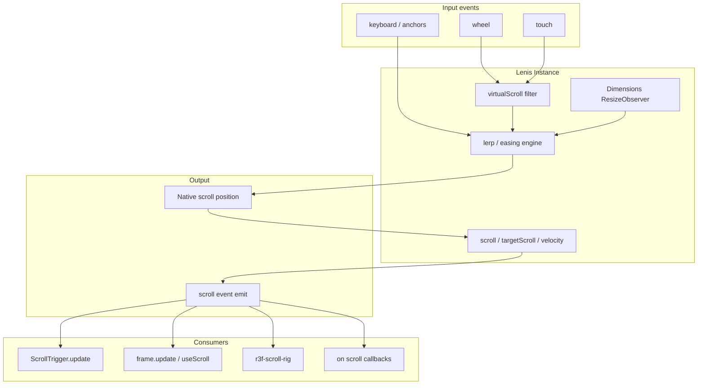
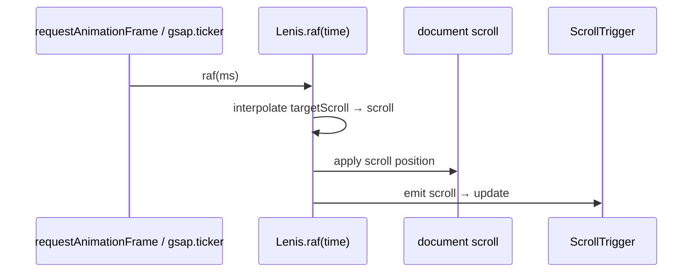
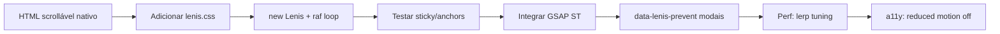

# Dossiê Técnico — Scroll (Lenis + ecossistema)

> Documento de referência permanente. Não é tutorial introdutório.  
> **Escopo:** smooth scroll com **Lenis** como núcleo; integrações **GSAP ScrollTrigger**, **Motion**, **WebGL**; comparação com alternativas de scroll.

---

## 1. Visão Geral

### O que é Lenis

**Lenis** (“smooth” em latim) é uma biblioteca JavaScript **leve, sem dependências**, de **smooth scrolling** que interpola (lerp) a posição de scroll nativa do browser. Mantém scroll real no DOM — `position: sticky`, anchor links e acessibilidade base preservados.

Fonte: [README Lenis](https://github.com/darkroomengineering/lenis)

### Problema que resolve

| Problema | Como Lenis aborda |
|----------|-------------------|
| Scroll nativo “áspero” em sites premium | Interpolação suave (lerp/easing) |
| Dessincronia WebGL ↔ DOM scroll | Loop único controlável (`raf`) |
| GSAP ScrollTrigger com smooth scroll | Integração oficial via `gsap.ticker` |
| Modais / nested scroll | `data-lenis-prevent`, `prevent()` |
| CSS scroll-snap incompatível | Plugin `lenis/snap` |

**Origem real (Manifesto):** Lenis nasceu para **sincronizar WebGL e DOM** durante scroll; o smooth scroll tornou-se o caso de uso dominante “por acidente feliz”.

Fonte: [MANIFESTO.md](https://github.com/darkroomengineering/lenis/blob/main/MANIFESTO.md)

### Criadores e ecossistema

- **darkroom.engineering** — design/dev studio (Clément Roche et al.)
- Pacotes: `lenis`, `lenis/react`, `lenis/vue`, `lenis/snap`, `lenis/framer`
- Legado: `@studio-freight/lenis` **deprecated** → usar `lenis`

### Filosofia

- **Native scroll first** — não substitui o scroll por transform fake na página inteira (vs scroll-jacking clássico)
- **Performance** — bundle ~few KB; zero deps
- **Sync hub** — um loop para Lenis + GSAP + Three.js
- **Progressive enhancement** — CSS recomendado + opt-out granular

### Casos de uso

- Portfolios creative dev / Awwwards
- Landing pages com parallax + ScrollTrigger
- WebGL / R3F scroll rig
- Framer sites exportados
- Horizontal + nested scroll sections

### Público-alvo

- Frontend engineers em sites scroll-heavy
- Creative developers com GSAP/Motion/Three.js
- Equipas que rejeitam scroll-jacking total

---

## 2. Arquitetura



### Ciclo de frame



Fonte: [README Setup](https://github.com/darkroomengineering/lenis)

---

## 3. Como funciona internamente

### Interpolação

1. Eventos wheel/touch alteram `targetScroll`
2. Cada frame, `lerp` (default `0.1`) ou `duration`+`easing` aproxima `animatedScroll` do target
3. Posição aplicada ao scroll **nativo** (`actualScroll` vs `animatedScroll` expostos)

### Dimensions

- `ResizeObserver` quando `autoResize: true`
- Calcula `limit` (max scroll), progress 0–1

### virtualScroll

Hook para modificar/cancelar eventos antes do smooth (`deltaY /= 2`, shift key, etc.)

### Diferença vs scroll-jacking

Lenis **não** fixa o body e move um wrapper com transform (padrão Locomotive Scroll v3 antigo). Mantém scroll nativo — sticky e SEO-friendly behavior preserved.

Fonte: [Features README](https://github.com/darkroomengineering/lenis)

---

## 4. Instalação

### npm / pnpm / yarn / bun

```bash
npm install lenis
pnpm add lenis
yarn add lenis
bun add lenis
```

### Import

```javascript
import Lenis from 'lenis';
import 'lenis/dist/lenis.css';
```

### CDN

```html
<link rel="stylesheet" href="https://unpkg.com/lenis@1.3.25/dist/lenis.css">
<script src="https://unpkg.com/lenis@1.3.25/dist/lenis.min.js"></script>
```

### React

```bash
npm install lenis
# React adapter incluído no mesmo pacote
import { ReactLenis, useLenis } from 'lenis/react';
```

### Monorepo

```typescript
// packages/shared/lenis.ts
export { default as Lenis } from "lenis";
export { ReactLenis, useLenis } from "lenis/react";
```

**Versão npm actual:** `1.3.25` (consultado 2026-07-05)

---

## 5. Configuração

### Opções principais (Instance Settings)

| Opção | Default | Descrição |
|-------|---------|-----------|
| `lerp` | `0.1` | Intensidade interpolação 0–1 (prioridade sobre duration) |
| `duration` | `1.2` | Duração animação scroll (s); ignorado se lerp activo |
| `easing` | custom exp | Função easing se duration mode |
| `orientation` | `vertical` | `vertical` \| `horizontal` |
| `gestureOrientation` | `vertical` | `vertical` \| `horizontal` \| `both` |
| `smoothWheel` | `true` | Suavizar wheel |
| `wheelMultiplier` | `1` | Multiplicador wheel |
| `touchMultiplier` | `1` | Multiplicador touch |
| `syncTouch` | `false` | Touch com sync (instável iOS<16) |
| `infinite` | `false` | Scroll infinito |
| `autoRaf` | `false` | Loop rAF automático |
| `autoResize` | `true` | ResizeObserver |
| `autoToggle` | `false` | Start/stop por overflow wrapper |
| `allowNestedScroll` | `false` | Detect nested scrollables (perf cost) |
| `prevent` | — | `(node) => boolean` skip smooth |
| `anchors` | `false` | Smooth anchor links |
| `overscroll` | `true` | Comportamento overscroll |
| `wrapper` | `window` | Container scroll |
| `content` | `documentElement` | Filho directo com conteúdo |

Fonte: [README Settings](https://github.com/darkroomengineering/lenis)

### CSS recomendado (`lenis.css`)

```css
html.lenis, html.lenis body { height: auto; }
.lenis:not(.lenis-autoToggle).lenis-stopped { overflow: clip; }
.lenis [data-lenis-prevent] { overscroll-behavior: contain; }
.lenis.lenis-smooth iframe { pointer-events: none; }
```

Fonte: [lenis.css](https://github.com/darkroomengineering/lenis/blob/main/packages/core/lenis.css)

### GSAP ScrollTrigger (padrão oficial)

```javascript
import Lenis from 'lenis';
import gsap from 'gsap';
import ScrollTrigger from 'gsap/ScrollTrigger';

gsap.registerPlugin(ScrollTrigger);

const lenis = new Lenis({ autoRaf: false });

lenis.on('scroll', ScrollTrigger.update);

gsap.ticker.add((time) => {
  lenis.raf(time * 1000);
});

gsap.ticker.lagSmoothing(0);
```

**Nota:** `time * 1000` porque GSAP ticker usa segundos; Lenis `raf` espera ms.

Fonte: [README GSAP section](https://github.com/darkroomengineering/lenis)

---

## 6. Estrutura recomendada de projeto

```
src/
├── lib/
│   └── lenis.ts              # factory + GSAP sync
├── providers/
│   └── LenisProvider.tsx     # ReactLenis root
├── animations/
│   ├── scroll-sections.ts    # ScrollTrigger batch (sem Lenis)
│   └── lenis-gsap.ts         # wiring Lenis + ST
└── styles/
    └── lenis.css             # ou import from package
```

### Padrão portfólio (GSAP existente)

O projecto actual usa `ScrollTrigger.batch` em `scroll-sections.ts`. Com Lenis:

1. Inicializar Lenis **antes** dos ScrollTriggers
2. `lenis.on('scroll', ScrollTrigger.update)` em cada frame
3. Manter `setupReducedMotion()` — chamar `lenis.destroy()` ou `lenis.stop()` no branch reduce

---

## 7. API completa

### Constructor

```javascript
const lenis = new Lenis(options?: LenisOptions);
```

### Propriedades (getters / state)

| Prop | Tipo | Descrição |
|------|------|-----------|
| `scroll` | number | Posição actual (infinite-aware) |
| `actualScroll` | number | Valor registado pelo browser |
| `animatedScroll` | number | Valor interpolado |
| `targetScroll` | number | Destino |
| `progress` | number | 0–1 |
| `velocity` | number | Velocidade actual |
| `lastVelocity` | number | Última velocidade |
| `direction` | number | `1` up / `-1` down |
| `limit` | number | Max scroll |
| `isScrolling` | boolean/string | `smooth`, `native`, `false` |
| `isStopped` | boolean | Scroll pausado |
| `dimensions` | object | Dimensões internas |

### Métodos

| Método | Args | Descrição |
|--------|------|-----------|
| `raf(time)` | ms | **Obrigatório** cada frame se `autoRaf: false` |
| `scrollTo(target, options?)` | number, selector, element, keywords | Scroll animado |
| `on(event, fn)` | `scroll`, `virtual-scroll` | Subscribe |
| `start()` | — | Resume |
| `stop()` | — | Pause input |
| `resize()` | — | Recalcular dims |
| `destroy()` | — | Cleanup total |

### scrollTo options

`offset`, `lerp`, `duration`, `easing`, `immediate`, `lock`, `force`, `onComplete`, `userData`

### Eventos

| Evento | Payload |
|--------|---------|
| `scroll` | Instância Lenis |
| `virtual-scroll` | `{ deltaX, deltaY, event }` |

### React API

| Export | Descrição |
|--------|-----------|
| `ReactLenis` | Provider + instance |
| `useLenis(callback?, deps?, priority?)` | Hook global se `root` |
| `LenisRef` | Type ref com `.lenis` |

Props: `options`, `root` (`true` | `'asChild'`), `ref`

Fonte: [lenis/react README](https://github.com/darkroomengineering/lenis/blob/main/packages/react/README.md)

### lenis/snap API

| Método | Descrição |
|--------|-----------|
| `new Snap(lenis, options?)` | Constructor |
| `add(pixels)` | Snap point absoluto |
| `addElement(el, { align })` | Snap a elemento |
| `addElements(els, opts)` | Batch |
| `next()` / `previous()` / `goTo(i)` | Navegação |
| `start()` / `stop()` / `resize()` | Controlo |

Snap options: `type` (`proximity`|`mandatory`|`lock`), `distanceThreshold`, `debounce`, `onSnapStart`, `onSnapComplete`

Fonte: [lenis/snap README](https://github.com/darkroomengineering/lenis/blob/main/packages/snap/README.md)

---

## 8. Conceitos fundamentais

### Smooth scroll vs scroll animations

| Camada | Responsabilidade | Lib típica |
|--------|------------------|------------|
| **Smooth scroll** | Como a página desliza | Lenis |
| **Scroll-triggered** | Anima quando entra viewport | GSAP ST, Motion whileInView |
| **Scroll-linked** | Valor ligado à posição | GSAP scrub, Motion useScroll |

Lenis trata só a **primeira camada**; não substitui ScrollTrigger.

### lerp vs duration

- **lerp** (default): feel contínuo, nunca “termina” exactamente — ideal scroll livre
- **duration + easing**: scroll programático (`scrollTo`) previsível

### actualScroll vs animatedScroll

Útil debug: lag entre browser e valor suavizado indica stress perf ou lerp baixo.

### data-lenis-prevent

Opt-out declarativo para modais, drawers, mapas, tabelas scrolláveis.

### scrollerProxy vs Lenis+ST

GSAP `ScrollTrigger.scrollerProxy()` é alternativa genérica para smooth libraries. Lenis documenta integração via **ticker** (preferida pela equipa Lenis).

---

## 9. Fluxo de desenvolvimento



1. Validar scroll **sem** Lenis
2. Adicionar Lenis isolado
3. Wiring GSAP
4. Adicionar animações scroll-sections
5. Testar mobile + nested scroll
6. Desactivar Lenis em `prefers-reduced-motion`

---

## 10. Recursos avançados

| Recurso | Descrição |
|---------|-----------|
| `infinite: true` | Scroll infinito (+ syncTouch mobile) |
| `virtualScroll` | Filtrar/modificar deltas |
| `horizontal` orientation | Scroll horizontal smooth |
| `lenis/snap` | Snap sections substitute CSS scroll-snap |
| `autoToggle` | Auto disable quando overflow hidden |
| `userData` em scrollTo | Forward via scroll events |
| `lock: true` em scrollTo | Bloquear input até destino |
| Framer `frame.update` sync | Integração Motion |
| `naiveDimensions` | Cálculo dims alternativo (perf hit) |

---

## 11. Performance

### Pontos fortes

- Zero dependencies; bundle minúsculo (badge Bundlephobia no README)
- Um único rAF loop partilhável com GSAP ticker
- Native scroll — GPU scroll compositing do browser

### Gargalos

- `allowNestedScroll: true` — traverse DOM cada scroll event
- `naiveDimensions: true` — layout reads extra
- Safari capped **60fps**; low power **30fps** (limitação WebKit)
- iframes: wheel events não propagam — smooth para sobre iframe
- Muitos listeners no evento `scroll` sem throttle próprio

### Tuning

- Aumentar `lerp` (ex. 0.15–0.2) = mais responsivo, menos smooth
- `wheelMultiplier` < 1 para sites longos
- Preferir `prevent`/`data-lenis-prevent` vs `allowNestedScroll` global

Fonte: [Limitations](https://github.com/darkroomengineering/lenis)

---

## 12. Escalabilidade

- **SPA/Next.js:** `ReactLenis root` + cleanup `destroy()` on route change
- **Multi-page:** re-init Lenis per page; `stopInertiaOnNavigate: true`
- **WebGL:** r3f-scroll-rig plugin community
- **Design systems:** wrapper provider único com options preset
- Sites showcase: lenis.dev/showcase (Awwwards tier)

---

## 13. Integrações

| Stack | Integração |
|-------|------------|
| **GSAP ScrollTrigger** | `lenis.on('scroll', ST.update)` + `gsap.ticker` |
| **GSAP ScrollSmoother** | Alternativa all-in-one GSAP; **não combinar** com Lenis |
| **Motion / Framer Motion** | `frame.update(update, true)` + `ReactLenis` |
| **React** | `lenis/react` — `ReactLenis`, `useLenis` |
| **Vue** | `lenis/vue` — `VueLenis` |
| **Next.js** | Client component provider; `autoRaf: false` + ticker |
| **Three.js / R3F** | r3f-scroll-rig |
| **Locomotive Scroll** | Listado como plugin relacionado (mesmo studio ecosystem) |
| **CSS scroll-snap** | **Não suportado** — usar `lenis/snap` |
| **TypeScript** | Types incluídos no pacote |

### Exemplo React + GSAP (production)

```tsx
"use client";
import { useEffect, useRef } from "react";
import { ReactLenis } from "lenis/react";
import type { LenisRef } from "lenis/react";
import gsap from "gsap";
import { ScrollTrigger } from "gsap/ScrollTrigger";
import "lenis/dist/lenis.css";

gsap.registerPlugin(ScrollTrigger);

export function SmoothScrollProvider({ children }: { children: React.ReactNode }) {
  const lenisRef = useRef<LenisRef>(null);

  useEffect(() => {
    const lenis = lenisRef.current?.lenis;
    if (!lenis) return;

    lenis.on("scroll", ScrollTrigger.update);

    const update = (time: number) => lenis.raf(time * 1000);
    gsap.ticker.add(update);
    gsap.ticker.lagSmoothing(0);

    return () => {
      gsap.ticker.remove(update);
      lenis.off("scroll", ScrollTrigger.update);
    };
  }, []);

  return (
    <ReactLenis root options={{ autoRaf: false }} ref={lenisRef}>
      {children}
    </ReactLenis>
  );
}
```

Fonte: [lenis/react](https://github.com/darkroomengineering/lenis/blob/main/packages/react/README.md)

---

## 14. TypeScript

- Lenis export default com types incluídos
- `LenisRef` para refs React
- Options tipadas por setting table
- `scrollTo` target: `number | string | HTMLElement`

---

## 15. Customização

- **easing** custom em constructor ou scrollTo
- **lerp** per scrollTo call
- **className** getter — classes `lenis`, `lenis-smooth`, `lenis-stopped`
- **virtualScroll** — lógica custom wheel
- **prevent** — rules engine por nó DOM
- Snap plugin: `type: 'lock'` para slideshow fullscreen

---

## 16. Plugins

| Plugin | Quando usar |
|--------|-------------|
| **lenis/snap** | Section snapping (substitui CSS scroll-snap) |
| **r3f-scroll-rig** | React Three Fiber scroll sync |
| **locomotive-scroll** | Alternativa ecosystem (Locomotive) — ver comparação |

Lenis core não usa sistema plugins extensível — snap é pacote separado import.

---

## 17. Ecossistema

| Recurso | URL |
|---------|-----|
| Site / demo | lenis.darkroom.engineering |
| Showcase | lenis.dev/showcase |
| GitHub | github.com/darkroomengineering/lenis |
| npm | npmjs.com/package/lenis |
| Framer plugin | lenis.framer.website |
| Tutorials | Edoardo Lunardi 2025, Matt Rothenberg grid |
| Sponsors | github.com/sponsors/darkroomengineering |

---

## 18. Casos reais

- Sites Awwwards / creative agencies (showcase oficial)
- Integração **Framer** (plugin Lenis)
- Starters **@darkroom.engineering/satus**
- Comunidade GSAP + Lenis como stack standard 2024–2026
- Projecto local: portfólio com `ScrollTrigger.batch` pronto para wiring Lenis

---

## 19. Exemplos completos

### Hello World

```javascript
import Lenis from 'lenis';
import 'lenis/dist/lenis.css';

const lenis = new Lenis({ autoRaf: true });

lenis.on('scroll', ({ scroll, progress }) => {
  console.log(scroll, progress);
});
```

### Básico — custom rAF

```javascript
const lenis = new Lenis();

function raf(time) {
  lenis.raf(time);
  requestAnimationFrame(raf);
}
requestAnimationFrame(raf);
```

### Intermediário — GSAP + scroll reveal batch

```javascript
import Lenis from 'lenis';
import gsap from 'gsap';
import ScrollTrigger from 'gsap/ScrollTrigger';

gsap.registerPlugin(ScrollTrigger);

const lenis = new Lenis({ autoRaf: false });
lenis.on('scroll', ScrollTrigger.update);
gsap.ticker.add((t) => lenis.raf(t * 1000));
gsap.ticker.lagSmoothing(0);

// Reveal grid (padrão portfólio)
ScrollTrigger.batch('[data-reveal]', {
  start: 'top 85%',
  once: true,
  onEnter: (batch) => gsap.to(batch, { autoAlpha: 1, y: 0, stagger: 0.1 }),
});
```

### Avançado — snap slideshow

```javascript
import Lenis from 'lenis';
import Snap from 'lenis/snap';

const lenis = new Lenis({ autoRaf: true });
const snap = new Snap(lenis, {
  type: 'lock',
  distanceThreshold: '100%',
  debounce: 0,
});

document.querySelectorAll('.section').forEach((el) => {
  snap.addElement(el, { align: 'center' });
});
```

### Arquitectura profissional — reduced motion

```javascript
const lenis = new Lenis({ autoRaf: true });
const mq = window.matchMedia('(prefers-reduced-motion: reduce)');

function applyMotionPreference() {
  if (mq.matches) {
    lenis.destroy();
    // ScrollTrigger estático — ver setupReducedMotion()
  }
}
mq.addEventListener('change', applyMotionPreference);
applyMotionPreference();
```

---

## 20. Erros comuns

| Erro | Causa | Solução |
|------|-------|---------|
| ScrollTrigger desincronizado | Falta `ScrollTrigger.update` | `lenis.on('scroll', ST.update)` |
| Animações atrasadas | GSAP lag smoothing | `gsap.ticker.lagSmoothing(0)` |
| Lenis não move | Falta rAF | `autoRaf: true` ou manual `raf` |
| Modal scroll broken | Lenis captura wheel | `data-lenis-prevent` |
| Anchor links não funcionam | Default blocks during scroll | `anchors: true` |
| Sticky broken | CSS missing | Import `lenis.css` |
| Página não scrolla | `lenis-stopped` stuck | `lenis.start()` |
| ScrollSmoother + Lenis | Duplo smooth | Escolher um |
| time units wrong | GSAP ticker seconds | `lenis.raf(time * 1000)` |
| iOS touch weird | syncTouch | Evitar iOS<16 ou syncTouch false |

Fonte: [Troubleshooting README](https://github.com/darkroomengineering/lenis)

---

## 21. Limitações

| Limitação | Detalhe |
|-----------|---------|
| CSS scroll-snap | Não suportado — usar lenis/snap |
| Safari fps | Cap 60fps; 30fps low power |
| iframes | Sem smooth over iframe |
| position:fixed lag | Safari pre-M1 macOS |
| syncTouch iOS | Instável iOS < 16 |
| nested scroll | Requer config explícita |
| Não é anim library | Só scroll; parallax = ST/Motion |

### Quando NÃO usar

- `prefers-reduced-motion: reduce` — respeitar e desactivar
- Apps/dashboards densos (overhead desnecessário)
- Documentação longa / wiki (UX friction)
- Quando ScrollSmoother GSAP basta (ecossistema GSAP-only)
- SEO-critical content-only sites sem motion

---

## 22. Comparação

| Critério | Lenis | GSAP ScrollSmoother | Locomotive Scroll v5 | Native scroll | Motion useScroll |
|----------|-------|---------------------|----------------------|---------------|------------------|
| Smooth scroll | Sim | Sim | Sim | Não | Não (smooth values only) |
| Native scroll base | Sim | Parcial | Sim (v5) | Sim | Sim |
| Deps | Zero | GSAP + ST | Próprio | 0 | Motion |
| GSAP ST sync | Oficial | Nativo | Manual | N/A | N/A |
| React adapter | First-class | useGSAP | useLocomotiveScroll | N/A | Nativo |
| Scroll snap CSS | Não (snap plugin) | Limitado | Varies | Sim | N/A |
| Licença | MIT | GSAP free | MIT | — | MIT |
| Bundle | ~few KB | +ScrollSmoother | Maior | 0 | Hook only |
| WebGL sync origin | Sim (design goal) | Sim | Sim | Manual | Manual |

**Escolher Lenis:** MIT, leve, GSAP+React, native scroll, WebGL sync.  
**Escolher ScrollSmoother:** stack 100% GSAP, effects integrados.  
**Escolher native:** a11y máxima, zero JS.

Fonte: [GSAP scrollerProxy](https://gsap.com/docs/v3/Plugins/ScrollTrigger/static.scrollerProxy/), docs Lenis

---

## 23. Roadmap

Sem roadmap público formal. Direcções observadas:

- `autoToggle` + `transition-behavior` (browsers modernos)
- Pacote snap evoluindo (`type: lock` slideshow)
- Integração Framer / darkroom starters
- Community plugins (r3f-scroll-rig)

Seguir releases: github.com/darkroomengineering/lenis/releases

---

## 24. Breaking Changes

| Mudança | Detalhe |
|---------|---------|
| `@studio-freight/lenis` → `lenis` | Rebrand Studio Freight → darkroom.engineering |
| API `Lenis` class modernizada | v1.x unified packages react/vue/snap |
| GSAP integration pattern | ticker-based (substitui hacks antigos scrollerProxy-only) |

Consultar CHANGELOG GitHub por versão minor.

---

## 25. Changelog resumido

| Era | Marco |
|-----|-------|
| Studio Freight | Primeira versão `@studio-freight/lenis` |
| darkroom.engineering | Rebrand, monorepo packages |
| 1.3.x | autoRaf, autoToggle, anchors, snap plugin mature |
| 2024–2025 | Stack default creative dev com GSAP 3 free |

---

## 26. Melhores práticas

1. Importar **lenis.css** sempre
2. Um único instance por página (`root` React)
3. Partilhar rAF com GSAP ticker (não double rAF)
4. `ScrollTrigger.update` no evento scroll Lenis
5. `lagSmoothing(0)` com GSAP
6. `data-lenis-prevent` em modais/drawers/maps
7. Desactivar Lenis em reduced motion
8. Testar sticky e anchor links após init
9. Evitar Lenis + ScrollSmoother simultâneos
10. `destroy()` on unmount SPA

---

## 27. Anti-patterns

| Anti-pattern | Porquê |
|--------------|--------|
| Double smooth (Lenis + ScrollSmoother) | Conflito scroll |
| Sem lenis.css | Sticky/overflow broken |
| allowNestedScroll everywhere | Perf DOM walks |
| Ignorar reduced motion | A11y violation |
| scrollTo spam | Motion sickness |
| Lenis em content site wiki | UX degradation |
| scrollerProxy + ticker duplicado | Double update jitter |
| iframe scroll expect smooth | Impossível |

---

## 28. Segurança

- MIT license — uso comercial livre
- Client-side only; sem network
- CDN unpkg — fixar versão; SRI recomendado
- virtualScroll/prevent — validar inputs se expostos a user content (raro)
- Sem CVEs críticos conhecidos — manter npm updated

---

## 29. SEO

**Aplicável — cuidado moderado.**

- Lenis usa **scroll nativo** — crawlers indexam conteúdo normalmente (vs transform-jack)
- Não lazy-load content via scroll position alone
- Core Web Vitals: smooth scroll pode afectar INP se main thread bloqueada — partilhar ticker GSAP
- Anchor links: activar `anchors: true` para deep links funcionarem

---

## 30. Acessibilidade

**Altamente aplicável — Lenis requer cuidado explícito.**

| Requisito | Acção |
|-----------|-------|
| `prefers-reduced-motion` | **Destroy** Lenis ou `stop()`; scroll nativo |
| Keyboard scroll | Funciona (native); smooth pode confundir — desactivar |
| Screen readers | Native scroll preserve navigation |
| Vestibular disorders | Smooth scroll é trigger — opt-out obrigatório |
| Focus management | Modais com `data-lenis-prevent` |

WCAG: smooth scroll não é intrinsecamente forbidden, mas **best practice 2025+** é respeitar reduced motion e evitar scroll hijacking.

Integrar com padrão existente no portfólio:

```typescript
// setupReducedMotion() + lenis.destroy() quando reduce active
```

---

## 31. Testes

| Abordagem | Como |
|-----------|------|
| **Manual** | Sticky, anchors, modal scroll |
| **Playwright** | `page.mouse.wheel` + assert scroll position lag |
| **Unit** | Mock Lenis instance methods |
| **Visual** | Percy após scroll settle |
| **GSAP** | ScrollTrigger progress após N frames |

Lenis não ship test utils; testar integração observável (ST progress, element visibility).

---

## 32. Debug

- Log `lenis.actualScroll` vs `lenis.animatedScroll`
- `lenis.velocity` / `direction` em scroll handler
- Desactivar Lenis — isolates ST bugs
- GSAP `ScrollTrigger.refresh()` após resize
- Chrome Performance — rAF timing
- Verificar classes `html.lenis` aplicadas

---

## 33. DevTools

- Browser DevTools → scroll position monitor
- GSAP ScrollTrigger markers (dev only)
- Lenis props expostas no evento `scroll`
- React DevTools → ReactLenis ref `.lenis`

---

## 34. FAQ

**Lenis substitui ScrollTrigger?**  
Não. Lenis = smooth scroll; ScrollTrigger = animações ligadas ao scroll.

**Funciona com ScrollTrigger.batch do meu portfólio?**  
Sim, com wiring GSAP ticker documentado.

**Framer Motion useScroll funciona?**  
Sim, mas valores podem lag behind Lenis smooth — sync via spring ou Lenis scroll event.

**CSS scroll-snap?**  
Não nativamente — use `lenis/snap`.

**@studio-freight/lenis ainda funciona?**  
Deprecated; migrar para `lenis`.

**autoRaf true ou false?**  
`true` para simple sites; `false` quando integrar GSAP/Motion ticker.

---

## 35. Glossário

| Termo | Definição |
|-------|-----------|
| **Lenis** | Smooth scroll library darkroom.engineering |
| **lerp** | Linear interpolation entre scroll actual e target |
| **targetScroll** | Destino de scroll calculado |
| **actualScroll** | Posição browser non-interpolada |
| **smooth scroll** | Interpolação artificial da velocidade scroll |
| **scroll-jacking** | Remover controlo scroll nativo do user |
| **ScrollTrigger** | Plugin GSAP scroll animations |
| **scrollerProxy** | GSAP adapter smooth scroll containers |
| **snap (lenis/snap)** | Section snapping plugin |
| **data-lenis-prevent** | Opt-out DOM attribute |
| **scroll-linked** | Animation ∝ scroll position |
| **scroll-triggered** | Animation on viewport enter |

---

## 36. Cheatsheet

```javascript
import Lenis from 'lenis';
import Snap from 'lenis/snap';
import 'lenis/dist/lenis.css';

// Init
const lenis = new Lenis({ lerp: 0.1, smoothWheel: true, autoRaf: true });

// GSAP
lenis.on('scroll', ScrollTrigger.update);
gsap.ticker.add((t) => lenis.raf(t * 1000));
gsap.ticker.lagSmoothing(0);

// Scroll to
lenis.scrollTo('#section', { offset: -80, duration: 1.2 });
lenis.scrollTo(0, { immediate: true });

// Control
lenis.stop();
lenis.start();
lenis.destroy();

// Prevent modal scroll
// <div data-lenis-prevent>...</div>

// React
import { ReactLenis, useLenis } from 'lenis/react';
<ReactLenis root options={{ autoRaf: false }} ref={ref} />

// Snap
const snap = new Snap(lenis);
snap.addElement(document.querySelector('.panel'), { align: 'center' });
```

---

## 37. Guia de aprendizado

| Fase | Tópicos | Recursos |
|------|---------|----------|
| 1 | Native scroll + CSS | MDN scroll-behavior |
| 2 | Lenis básico + css | README Setup |
| 3 | rAF loop / autoRaf | README |
| 4 | GSAP ScrollTrigger sync | README GSAP section |
| 5 | ReactLenis provider | packages/react |
| 6 | Nested scroll / prevent | Considerations |
| 7 | lenis/snap | packages/snap |
| 8 | WebGL sync | MANIFESTO + r3f-scroll-rig |
| 9 | a11y reduced motion | WCAG + portfolio pattern |
| 10 | Showcase study | lenis.dev/showcase |

---

## 38. Referências

### Documentação

1. https://github.com/darkroomengineering/lenis — README principal (2026-07-05)
2. https://github.com/darkroomengineering/lenis/blob/main/MANIFESTO.md — Origem WebGL sync
3. https://github.com/darkroomengineering/lenis/blob/main/packages/react/README.md — React adapter
4. https://github.com/darkroomengineering/lenis/blob/main/packages/snap/README.md — Snap plugin
5. https://github.com/darkroomengineering/lenis/blob/main/packages/core/lenis.css — CSS oficial
6. https://lenis.darkroom.engineering/ — Demo site
7. https://www.lenis.dev/showcase — Showcase

### GitHub

8. https://github.com/darkroomengineering/lenis — Repositório

### Artigos

9. [Building Smooth Scroll in 2025 with Lenis](https://www.edoardolunardi.dev/blog/building-smooth-scroll-in-2025-with-lenis) — Edoardo Lunardi
10. [Infinite Scrolling Grid](https://tympanus.net/Development/ScrollAnimationsGrid/) — Matt Rothenberg / Codrops

### Integrações

11. https://gsap.com/docs/v3/Plugins/ScrollTrigger/static.scrollerProxy() — GSAP scrollerProxy
12. https://motion.dev/docs/react-scroll-animations — Motion scroll (comparação)

### npm

13. `lenis@1.3.25` — versão consultada
14. `@studio-freight/lenis@1.0.42` — legacy deprecated

### Screenshots / Ferramentas

15. MCP Puppeteer — lenis.darkroom.engineering (2026-07-05)
16. agent-browser — github.com/darkroomengineering/lenis (2026-07-05)
17. Context7 — `/darkroomengineering/lenis`

### Projecto local

18. `src/animations/scroll-sections.ts` — ScrollTrigger.batch + reduced motion (Portifolio)

---

## Lacunas documentais

| Tópico | Estado |
|--------|--------|
| API Reference typedoc auto-generated | README tables são source of truth |
| Benchmarks independentes vs ScrollSmoother | Claims mostly author/community |
| Lenis + View Transitions API | Não documentado |
| SSR Next.js App Router edge cases | Parcial (client-only) |

---

*Gerado via `/library-dossier` — skill technical-library-dossier v1.0.0*
