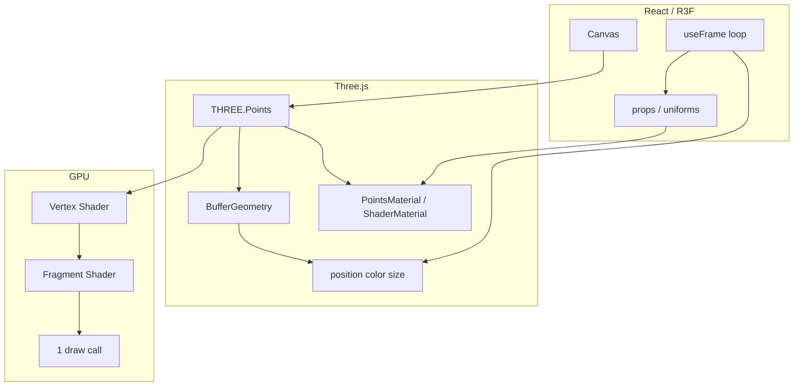

# Dossiê Técnico — Partículas (React Three Fiber + tsParticles)

> Documento de referência permanente. Não é tutorial introdutório.  
> **Escopo transversal:** sistemas de **partículas 3D** via **React Three Fiber (R3F)** + **Three.js** + **drei**, e **partículas 2D** opcionais via **tsParticles**. Quando usar cada stack, padrões GPU, performance e integração com portfolios React.

---

## 1. Visão Geral

### O que são partículas em web

**Partículas** são muitos elementos visuais pequenos (pontos, sprites, meshes) animados em conjunto para simular fogo, poeira, estrelas, confetti, redes de ligações ou ambientes imersivos. Na web existem dois modelos dominantes:

| Modelo | Runtime | Render |
|--------|---------|--------|
| **2D Canvas** | CPU + Canvas 2D | tsParticles, particles.js (legado) |
| **3D WebGL** | GPU + Three.js | `THREE.Points`, `InstancedMesh`, shaders |

### Problema que resolvem

- Hero backgrounds dinâmicos sem vídeo pesado
- Ambiente espacial (estrelas, sparkles, neblina)
- Feedback visual (confetti, explosões)
- Interacção cursor (repulse, hover por ponto)
- Integração com cenas 3D (modelos GLTF, câmara, luz)

### História / ecossistema

- **Three.js** — `Points` + `BufferGeometry` desde WebGL early days
- **particles.js** (2015) — popularizou backgrounds 2D; mantido por **tsParticles** (Matteo Bruni)
- **tsParticles v3→v4** — monorepo modular `@tsparticles/*`, bundles `basic/slim/full/all`
- **R3F (pmndrs)** — JSX declarativo sobre Three.js
- **drei** — `Sparkles`, `Stars`, `Cloud`, `Points` — abstrações prontas para partículas 3D

Fontes: [R3F GitHub](https://github.com/pmndrs/react-three-fiber), [tsParticles README](https://github.com/tsparticles/tsparticles), [drei Sparkles](https://pmndrs.github.io/drei/staging/sparkles)

### Filosofia de escolha (este dossiê)

| Caso | Stack recomendada |
|------|-------------------|
| Background 2D links/repulse, confetti rápido | **tsParticles** |
| Sparkles 3D, profundidade, cena WebGL | **R3F + drei** |
| Milhões de pontos custom GLSL | **R3F + ShaderMaterial** |
| Milhares de meshes 3D iguais | **InstancedMesh** |

### Público-alvo

- Devs React a construir portfolios creative (hero WebGL)
- Equipas que já usam R3F/shaders (ver `docs/dossiers/shaders-glsl-r3f.md`)
- Quem quer efeito 2D rápido **sem** WebGL

### Contexto do projecto Portifolio

Stack actual: **GSAP + ScrollTrigger** (DOM). Sem R3F/tsParticles instalados. Este dossiê serve adopção futura de hero particles ou confetti em milestones.

---

## 2. Arquitetura

### Pipeline 3D (R3F)



### Pipeline 2D (tsParticles)

```mermaid
flowchart LR
    Init[loadSlim / loadFull] --> Engine[@tsparticles/engine]
    Engine --> Container[Container instance]
    Options[ISourceOptions JSON] --> Container
    Container --> Updater[Particle updater CPU]
    Updater --> Canvas[Canvas 2D render]
    Events[onHover / onClick] --> Updater
```

### Abstrações drei para partículas

| Componente | Base Three.js | Uso |
|------------|---------------|-----|
| **Sparkles** | `Points` + custom shader | Partículas brilhantes flutuantes |
| **Stars** | `Points` | Campo estelar fundo |
| **Cloud** | Volumetric billboards | Neblina/nuvens |
| **Points** | `Points` instanced ou buffer | API flexível com `<Point />` filhos |

Fonte: [drei README](https://github.com/pmndrs/drei), [drei Points](https://pmndrs.github.io/drei/performances/points)

---

## 3. Como funciona internamente

### THREE.Points (3D)

1. **BufferGeometry** armazena N vértices em `Float32Array` (position, optional color, size)
2. **Vertex shader** projecta cada ponto; `gl_PointSize` define diâmetro em screen space
3. **Fragment shader** desenha disco/textura por pixel dentro do point sprite (`gl_PointCoord`)
4. **Um draw call** para N partículas (vs N meshes)

Actualização: mutar arrays + `attribute.needsUpdate = true` + `DynamicDrawUsage` para buffers frequentes.

Fonte: [R3F Pointcloud demo](https://github.com/pmndrs/react-three-fiber/blob/master/react-three-fiber/example/src/demos/Pointcloud.tsx)

### drei Sparkles

- Gera buffers aleatórios (position, size, speed, opacity, noise, color)
- `SparklesImplMaterial` — shader custom com `sin/cos(time * speed)` por vértice
- `useFrame` actualiza uniform `time` a cada frame
- `pixelRatio` uniform para tamanho consistente em retina

Fonte: [drei Sparkles.tsx](https://github.com/pmndrs/drei/blob/master/src/core/Sparkles.tsx)

### drei Points (instâncias React)

- Filhos `<Point />` são `PositionPoint` (Group) com raycast custom
- `useFrame` copia world position de cada filho para buffer central
- Permite **montar/desmontar** pontos React condicionalmente com interacção por ponto

Fonte: [drei Points.tsx](https://github.com/pmndrs/drei/blob/master/src/core/Points.tsx)

### tsParticles engine

1. `loadSlim(engine)` regista plugins mínimos no `@tsparticles/engine`
2. `tsParticles.load({ id, options })` cria **Container**
3. Loop interno actualiza posição, opacity, links, emitters (CPU)
4. Desenha círculos/lines/shapes em `<canvas>`
5. `interactivity` liga pointer events a modes (repulse, push, bubble)

Fonte: [tsParticles bundles guide](https://github.com/tsparticles/tsparticles/blob/main/websites/website/docs/guide/bundles.md)

### InstancedMesh (partículas 3D “sólidas”)

Cada instância = matrix 4×4. Ideal para milhares de cubos/esferas iguais. **Não** é `Points`, mas pattern comum para “particle systems” 3D com geometria.

Fonte: [R3F scaling-performance — Instancing](https://github.com/pmndrs/react-three-fiber/blob/master/docs/advanced/scaling-performance.mdx)

---

## 4. Instalação

### R3F + Three.js + drei (3D)

```bash
npm install three @react-three/fiber @react-three/drei
# opcional post-processing, physics, etc.
```

```bash
pnpm add three @react-three/fiber @react-three/drei
yarn add three @react-three/fiber @react-three/drei
bun add three @react-three/fiber @react-three/drei
```

**Peers:** React 18+ (drei suporta React 19). Three.js alinhado com R3F (0.185.x).

### tsParticles (2D — React)

```bash
npm install @tsparticles/react @tsparticles/slim @tsparticles/engine
```

Variantes de bundle:

| Package | Quando |
|---------|--------|
| `@tsparticles/basic` | Mínimo absoluto |
| `@tsparticles/slim` | **Recomendado** maioria sites |
| `tsparticles` + `loadFull` | Feature set amplo |
| `@tsparticles/all` | Protótipos / playground |
| `@tsparticles/confetti` | Só confetti |

Fonte: [tsParticles installation](https://github.com/tsparticles/tsparticles/blob/main/websites/website/docs/guide/installation.md)

### CDN (tsParticles)

Bundle browser `tsparticles.engine.min.js` disponível no repo — útil HTML estático, não ideal React SPA.

---

## 5. Configuração

### R3F Canvas (partículas)

| Prop | Efeito partículas |
|------|-------------------|
| `dpr={[1, 2]}` | Cap retina — menos fill rate |
| `frameloop="demand"` | Só renderiza quando `invalidate()` — partículas estáticas |
| `frameloop="always"` | Default — animação contínua |
| `gl={{ antialias: true }}` | Point sprites mais suaves |
| `raycaster={{ params: { Points: { threshold: 0.2 } } }}` | Hit area pontos |

Fonte: [R3F performance](https://github.com/pmndrs/react-three-fiber/blob/master/docs/advanced/scaling-performance.mdx)

### Sparkles props

| Prop | Default | Descrição |
|------|---------|-----------|
| `count` | 100 | Número partículas |
| `speed` | 1 | Velocidade oscilação |
| `opacity` | 1 | Opacidade |
| `color` | white | Cor ou Float32Array |
| `size` | random 0–1 | Tamanho por ponto |
| `scale` | 1 | Volume distribuição |
| `noise` | 1 | Factor movimento sin/cos |

Fonte: [drei Sparkles docs](https://pmndrs.github.io/drei/staging/sparkles)

### tsParticles options (estrutura)

| Secção | Chaves principais |
|--------|-------------------|
| `particles.number` | `value`, `density.enable` |
| `particles.move` | `enable`, `speed`, `direction`, `outModes` |
| `particles.opacity` | `value`, animação |
| `particles.size` | `value: { min, max }` |
| `particles.links` | rede conectada |
| `interactivity.events` | `onHover`, `onClick` |
| `interactivity.modes` | `repulse`, `push`, `bubble` |
| `fpsLimit` | cap FPS |
| `detectRetina` | densidade retina |
| `motion.disable` | `prefers-reduced-motion` |
| `background.color` | cor canvas |
| `preset` | string preset name |

Fonte: [tsParticles React README](https://github.com/tsparticles/tsparticles/blob/main/wrappers/react/README.md)

---

## 6. Estrutura recomendada de projecto

```
src/
├── components/
│   ├── canvas/
│   │   ├── Scene.tsx              # Canvas R3F wrapper
│   │   ├── HeroParticles.tsx      # Sparkles / custom Points
│   │   └── BackgroundStars.tsx    # Stars lazy-loaded
│   └── effects/
│       ├── Confetti.tsx           # tsParticles preset
│       └── Particles2D.tsx        # tsParticles background
├── materials/
│   └── DotMaterial.ts             # extend ShaderMaterial points
├── hooks/
│   └── useReducedMotionParticles.ts
└── app/
    └── page.tsx                   # dynamic import ssr: false
```

**Boas práticas:**

- Lazy `dynamic(() => import('./HeroParticles'), { ssr: false })`
- Separar 2D (tsParticles) de 3D (Canvas) — não misturar no mesmo layer sem z-index planeado
- Um ficheiro de config JSON para tsParticles presets

---

## 7. API completa

### R3F — elementos JSX (Three.js)

| Elemento | Equivalente Three | Partículas |
|----------|-------------------|------------|
| `<points>` | `THREE.Points` | Container principal |
| `<bufferGeometry>` | `BufferGeometry` | Geometria |
| `<bufferAttribute>` | `BufferAttribute` | position/color/size |
| `<pointsMaterial>` | `PointsMaterial` | Material built-in |
| `<instancedMesh>` | `InstancedMesh` | Partículas mesh |

### R3F hooks relevantes

| Hook | Uso partículas |
|------|----------------|
| `useFrame` | Animar uniforms / buffer attributes |
| `useThree` | `viewport.dpr`, `size`, `invalidate` |
| `extend` | Material custom como JSX |
| `invalidate` | Resume render em `frameloop="demand"` |

### drei exports partículas

| Export | Tipo | API resumida |
|--------|------|--------------|
| `Sparkles` | Component | props count/speed/opacity/color/size/scale/noise |
| `Stars` | Component | radius, depth, count, factor, saturation |
| `Cloud` | Component | nuvens volumétricas |
| `Points` | Component | `limit`, `range`, filhos `<Point />` OU buffers |
| `Point` | Component | position, color, size, event handlers |

### tsParticles React

| Export | Descrição |
|--------|-----------|
| `ParticlesProvider` | Context + `init` engine loader |
| `Particles` | Component canvas; props `id`, `options`, `particlesLoaded` |
| `loadSlim` / `loadBasic` / `loadFull` / `loadAll` | Registo plugins engine |
| `tsParticles.load` | Imperativo DOM |
| `ISourceOptions` | Tipo TypeScript config |
| `Container` | Instância runtime |

### Engine API runtime (tsParticles)

```typescript
const container = tsParticles.item(0);
container.play();
container.pause();
container.refresh(); // após resize options
```

Fonte: [tsParticles README usage](https://github.com/tsparticles/tsparticles/blob/main/README.md)

---

## 8. Conceitos fundamentais

### Point sprites vs meshes

- **Points** — billboards quad por GPU point; ultra eficiente; limitado a formas circulares/textura
- **InstancedMesh** — geometria 3D real por instância; mais draw cost; lighting/shadows

### Buffer attributes

```typescript
// position: 3 floats por partícula
new Float32Array(count * 3)
// color: 3 floats RGB
// size: 1 float (requer shader/custom material ou PointsMaterial.size)
```

`usage: THREE.DynamicDrawUsage` — hint GPU para updates frequentes (drei Points).

### Per-point interactivity (3D)

R3F `ThreeEvent` em `<points>` expõe `e.index` — índice do ponto intersectado. Requer `raycaster.params.Points.threshold` calibrado.

Fonte: [R3F Pointcloud demo](https://github.com/pmndrs/react-three-fiber/blob/master/react-three-fiber/example/src/demos/Pointcloud.tsx)

### Density (tsParticles)

`particles.number.density` ajusta count por área canvas — mantém densidade visual em resize.

### Out modes (tsParticles)

`outModes: { default: "bounce" | "out" | "destroy" }` — comportamento nas bordas.

### Bundles tsParticles

| Bundle | Conteúdo |
|--------|----------|
| `basic` | Move, opacity, size mínimo |
| `slim` | + links, repulse, emitters comuns |
| `full` | Extensões broad |
| `all` | Tudo — bundle grande |

Fonte: [bundles.md](https://github.com/tsparticles/tsparticles/blob/main/websites/website/docs/guide/bundles.md)

### frameloop modes (R3F)

| Mode | Partículas |
|------|------------|
| `always` | Animação contínua |
| `demand` | Pausa até `invalidate()` — poupar GPU se estático |
| `never` | Manual `advance()` |

---

## 9. Fluxo de desenvolvimento

1. **Definir 2D vs 3D** — profundidade/câmara → R3F; network links rápido → tsParticles
2. **Protótipo** — Sparkles ou preset tsParticles default
3. **Performance budget** — count, DPR, bundle slim
4. **Interacção** — repulse 2D vs raycast 3D
5. **Reduced motion** — desactivar ou simplificar
6. **Mobile** — reduzir count 50–80%; testar thermal
7. **Integração** — z-index, pointer-events, scroll (GSAP/Lenis)
8. **Fallback** — gradiente CSS estático se WebGL fail

---

## 10. Recursos avançados

| Técnica | Stack |
|---------|-------|
| Custom GLSL point shader | R3F extend + ShaderLib.points |
| GPU simulação (FBO) | Three.js + R3F useFrame |
| Scroll-linked particle field | uniforms ← GSAP ScrollTrigger |
| Confetti cannon draggable | tsParticles preset confettiCannon |
| Emitters contínuos | tsParticles emitters plugin |
| Morphing shape | tsParticles shape animation |
| Post-processing glow | `@react-three/postprocessing` + Bloom |
| Sampler surface points | drei `Sampler` / `useSurfaceSampler` |
| Trail particles | drei `Trail` / `useTrail` |
| Compute (futuro) | WebGPU TSL — fora WebGL clássico |

---

## 11. Performance

### R3F / Three.js

| Factor | Guideline |
|--------|-----------|
| Draw calls | Points = **1** call; optimal até ~100k–500k dependendo GPU |
| InstancedMesh | 100k+ instâncias viável; doc R3F demo 100k boxes |
| Updates | Mutate buffers; **não** recriar geometry each frame |
| GC | **Nunca** `new THREE.Vector3()` inside `useFrame` loop |
| DPR | `[1, 1.5]` mobile hero |
| Point size | Fragment cost ∝ `gl_PointSize²` |

Fonte: [R3F pitfalls](https://github.com/pmndrs/react-three-fiber/blob/master/docs/advanced/pitfalls.mdx), [scaling-performance](https://github.com/pmndrs/react-three-fiber/blob/master/docs/advanced/scaling-performance.mdx)

### tsParticles

| Factor | Guideline |
|--------|-----------|
| CPU bound | Muitas partículas + links = cost CPU |
| `fpsLimit` | 60 ou 30 mobile |
| Bundle | `loadSlim` not `loadAll` production |
| Links | O(n²) proximity — reduzir distance ou count |
| Retina | `detectRetina: true` doubles work — consider false mobile |
| Pause offscreen | `container.pause()` IntersectionObserver |

### Comparativo qualitativo

| Count | 2D tsParticles | 3D Points |
|-------|----------------|-----------|
| 100 | Trivial ambos | Trivial |
| 1 000 | OK | OK |
| 10 000 | CPU stress links | OK GPU |
| 100 000+ | Impraticável links | OK Points; pesado tsParticles |

---

## 12. Escalabilidade

- **Code-split** Canvas e tsParticles em routes separadas
- **Instancing** para partículas repetidas com mesh
- **LOD** — menos count quando `AdaptiveDpr` (drei) detecta perf baixa
- **Config externalizada** — JSON presets versionados
- **Design system** — `HeroParticles` props wrapper único
- Evitar múltiplos Canvas full-screen na mesma página

---

## 13. Integrações

| Integração | Pattern |
|------------|---------|
| **Next.js App Router** | `dynamic(..., { ssr: false })` |
| **GSAP ScrollTrigger** | uniform `uScroll` ou pause offscreen |
| **Lenis** | Canvas fixed; scroll não afecta WebGL loop |
| **Framer Motion** | DOM overlay; Canvas separado |
| **Tailwind** | wrapper `fixed inset-0 -z-10 pointer-events-none` |
| **TypeScript** | `ISourceOptions`, `ThreeElements` |
| **Vite** | default OK; tree-shake `@tsparticles/slim` |
| **shaders dossier** | DotMaterial custom points |

### Layering típico portfolio

```html
<!-- z-index stack -->
<div class="fixed inset-0 -z-10"><Canvas>...</Canvas></div>
<div class="relative z-10"><!-- DOM content GSAP --></div>
<Particles className="fixed inset-0 -z-20 pointer-events-none" />
```

---

## 14. TypeScript

### R3F

```tsx
import { useRef } from 'react';
import * as THREE from 'three';
import { ThreeEvent } from '@react-three/fiber';

const ref = useRef<THREE.Points>(null!);

const onPointerOver = (e: ThreeEvent<PointerEvent>) => {
  const i = e.index!;
  // mutate ref.current.geometry.attributes.color.array
};
```

### tsParticles

```tsx
import { type ISourceOptions, type Container, type Engine } from '@tsparticles/engine';

const particlesInit = async (engine: Engine): Promise<void> => {
  await loadSlim(engine);
};

const particlesLoaded = async (container?: Container): Promise<void> => {
  console.log(container?.particles.count);
};

const options: ISourceOptions = useMemo(() => ({ ... }), []);
```

Fonte: [tsParticles React TS example](https://github.com/tsparticles/tsparticles/blob/main/wrappers/react/README.md)

---

## 15. Customização

### Sparkles shader custom

Passar `children` com material próprio — Sparkles documenta attributes/uniforms disponíveis:

```glsl
attribute float size;
attribute float speed;
attribute float opacity;
attribute vec3 noise;
attribute vec3 color;
uniform float time;
uniform float pixelRatio;
```

### tsParticles

- JSON options completo
- `preset: "confetti"` + override `particles.color`
- Plugins custom via engine load
- Presets catalog: [tsparticles/presets](https://github.com/tsparticles/presets)

---

## 16. Plugins

### tsParticles (via load*)

Emitters, absorbers, polygon mask, sound, etc. — dependem do bundle carregado.

| Plugin path | Efeito |
|-------------|--------|
| `@tsparticles/plugin-emitters` | Fontes contínuas |
| Presets `@tsparticles/confetti` | Confetti |
| `@tsparticles/fireworks` | Fogos |

### drei / R3F

| Helper | Partículas |
|--------|------------|
| `AdaptiveDpr` | Reduz DPR sob carga |
| `PerformanceMonitor` | Regress quality |
| `Preload` | Warm GPU |

---

## 17. Ecossistema

| Ferramenta | URL / package |
|------------|---------------|
| R3F | github.com/pmndrs/react-three-fiber |
| drei | github.com/pmndrs/drei |
| Three.js docs Points | threejs.org/docs/#api/en/objects/Points |
| tsParticles | github.com/tsparticles/tsparticles |
| presets | github.com/tsparticles/presets |
| particles.js | **legado** — migrar tsParticles |
| Vanta.js | WAVES/FOG — alternativa one-liner WebGL |
| Lottie | Partículas fake 2D vector — não interactivo |

---

## 18. Casos reais

- **Awwwards portfolios** — Sparkles + scroll 3D hero
- **SaaS landing** — tsParticles network links subtle background
- **Product launch** — confetti preset tsParticles
- **Games UI** — InstancedMesh debris
- **Apple-style** — poucas partículas, high DPR, bloom

---

## 19. Exemplos completos

### Hello World — drei Sparkles

```tsx
"use client";
import { Canvas } from "@react-three/fiber";
import { Sparkles } from "@react-three/drei";

export function HeroSparkles() {
  return (
    <Canvas camera={{ position: [0, 0, 5] }} dpr={[1, 2]}>
      <Sparkles count={200} scale={4} size={2} speed={0.4} opacity={0.8} color="#a78bfa" />
    </Canvas>
  );
}
```

### Básico — R3F Points + bufferAttribute

```tsx
"use client";
import { useMemo, useRef } from "react";
import { Canvas, useFrame } from "@react-three/fiber";
import * as THREE from "three";

function Dust({ count = 5000 }) {
  const ref = useRef<THREE.Points>(null!);
  const positions = useMemo(
    () => Float32Array.from({ length: count * 3 }, () => (Math.random() - 0.5) * 10),
    [count]
  );

  useFrame(({ clock }) => {
    ref.current.rotation.y = clock.elapsedTime * 0.05;
  });

  return (
    <points ref={ref}>
      <bufferGeometry>
        <bufferAttribute attach="attributes-position" args={[positions, 3]} />
      </bufferGeometry>
      <pointsMaterial size={0.03} color="#fff" transparent opacity={0.6} sizeAttenuation />
    </points>
  );
}

export function DustScene() {
  return (
    <Canvas camera={{ position: [0, 0, 5] }}>
      <Dust />
    </Canvas>
  );
}
```

### Intermediário — hover por ponto (shader)

Padrão oficial R3F: `DotMaterial` extends `ShaderMaterial` + `onPointerOver` muta `color` array at `e.index`.

Fonte: [Pointcloud demo](https://github.com/pmndrs/react-three-fiber/blob/master/react-three-fiber/example/src/demos/Pointcloud.tsx)

```tsx
// Raycaster config obrigatório:
<Canvas raycaster={{ params: { Points: { threshold: 0.2 } } as any }}>
```

### Intermediário — tsParticles React (slim)

```tsx
"use client";
import { useMemo } from "react";
import Particles, { ParticlesProvider } from "@tsparticles/react";
import { loadSlim } from "@tsparticles/slim";
import type { ISourceOptions } from "@tsparticles/engine";

const init = async (engine: unknown) => {
  await loadSlim(engine as Parameters<typeof loadSlim>[0]);
};

export function NetworkBackground() {
  const options: ISourceOptions = useMemo(
    () => ({
      fpsLimit: 60,
      particles: {
        number: { value: 60, density: { enable: true } },
        links: { enable: true, distance: 150, opacity: 0.25 },
        move: { enable: true, speed: 1 },
        opacity: { value: 0.4 },
        size: { value: { min: 1, max: 3 } },
      },
      interactivity: {
        events: {
          onHover: { enable: true, mode: "repulse" },
        },
        modes: {
          repulse: { distance: 120, duration: 0.3 },
        },
      },
      detectRetina: true,
    }),
    []
  );

  return (
    <ParticlesProvider init={init}>
      <Particles id="bg" options={options} className="fixed inset-0 -z-10" />
    </ParticlesProvider>
  );
}
```

Fonte: [wrappers/react README](https://github.com/tsparticles/tsparticles/blob/main/wrappers/react/README.md)

### Avançado — InstancedMesh 100k

```tsx
function ParticleCubes({ count = 10000 }) {
  const ref = useRef<THREE.InstancedMesh>(null!);
  const temp = useMemo(() => new THREE.Object3D(), []);

  useEffect(() => {
    for (let i = 0; i < count; i++) {
      temp.position.set(Math.random() * 10 - 5, Math.random() * 10 - 5, Math.random() * 10 - 5);
      temp.updateMatrix();
      ref.current.setMatrixAt(i, temp.matrix);
    }
    ref.current.instanceMatrix.needsUpdate = true;
  }, [count, temp]);

  return (
    <instancedMesh ref={ref} args={[undefined, undefined, count]}>
      <boxGeometry args={[0.05, 0.05, 0.05]} />
      <meshStandardMaterial />
    </instancedMesh>
  );
}
```

Fonte: [R3F instancing docs](https://github.com/pmndrs/react-three-fiber/blob/master/docs/advanced/scaling-performance.mdx)

### Arquitectura profissional — wrapper com reduced motion

```tsx
"use client";
import dynamic from "next/dynamic";
import { useReducedMotion } from "motion/react";

const WebGLParticles = dynamic(() => import("./WebGLParticles"), { ssr: false });
const CSSFallback = () => <div className="fixed inset-0 bg-gradient-to-b from-violet-950 to-black" />;

export function HeroParticles() {
  const reduce = useReducedMotion();
  if (reduce) return <CSSFallback />;
  return <WebGLParticles />;
}
```

---

## 20. Erros comuns

| Erro | Causa | Solução |
|------|-------|---------|
| Canvas preto | SSR Canvas | `ssr: false` dynamic import |
| Pontos gigantes/minúsculos | `sizeAttenuation`, DPR | Calibrar size + Sparkles pixelRatio |
| Hover 3D não funciona | threshold default | `raycaster.params.Points.threshold` |
| Perf collapse | `new Vector3` in useFrame | Reutilizar objects outside loop |
| tsParticles blank | init não awaited | `ParticlesProvider init={loadSlim}` |
| Bundle enorme | `loadAll` | `loadSlim` ou `@tsparticles/confetti` |
| Partículas atrás conteúdo | z-index | `fixed -z-10`, content `relative z-10` |
| Clicks bloqueados | canvas full screen | `pointer-events-none` no background |
| Cores hover não revertem | mutação array | guardar estado original ou recompute |
| WebGL context lost | mobile tab switch | listener `webglcontextlost` + fallback |
| React 19 mismatch | peers | drei >= versão React 19 compatible |

---

## 21. Limitações

| Limitação | Stack |
|-----------|-------|
| Points não são meshes 3D lit | R3F — usar InstancedMesh se PBR |
| tsParticles CPU ceiling | ~few k com links interactive |
| WebGL não indexável SEO | ambos 3D |
| Battery drain | animação contínua mobile |
| A11y decorative | sem significado semântico |
| iOS low power mode | FPS throttled |
| Custom shape points | requer shader texture |

### Quando NÃO usar

| Situação | Alternativa |
|----------|-------------|
| Só gradiente animado | CSS |
| Confetti one-shot simples | CSS `@keyframes` ou canvas mínimo |
| Sem WebGL support target | tsParticles 2D ou CSS |
| Equipa zero 3D | tsParticles preset |
| Scroll storytelling puro | GSAP DOM (stack actual portfólio) |

---

## 22. Comparação

| Critério | R3F Points / Sparkles | tsParticles 2D | InstancedMesh | CSS particles |
|----------|----------------------|----------------|---------------|---------------|
| Dimensão | 3D | 2D | 3D | 2D |
| GPU | Sim | Não (Canvas2D) | Sim | Parcial |
| Setup | Médio-alto | Baixo | Alto | Baixo |
| Interacção 3D | Raycast | Hover repulse | Raycast mesh | Limitada |
| Links network | Manual | Built-in | N/A | N/A |
| Confetti | Manual/shader | Preset | Overkill | Difícil |
| Bundle | three+r3f+drei | slim ~moderate | three+r3f | 0 |
| Max particles | 100k+ GPU | ~1–5k prático | 100k+ | ~50 DOM |
| React DX | Excelente | Excelente | Excelente | Excelente |
| Depth câmara | Sim | Não | Sim | Não |

**Decisão rápida:**

```
Profundidade / sparkles 3D / cena GLTF  → R3F + drei Sparkles
Rede links + repulse background         → tsParticles slim
Milhares cubos 3D                       → InstancedMesh
Confetti evento                         → @tsparticles/confetti
Portfolio só scroll DOM                 → nenhum (GSAP actual)
```

---

## 23. Roadmap

| Projecto | Direcção |
|----------|----------|
| **tsParticles v4** | Merge PR #5881 (Jul 2025) — monorepo activo |
| **Three.js** | WebGPU renderer; TSL materials |
| **R3F v10** | branch v10 em desenvolvimento |
| **drei** | Mais staging effects; React 19 |
| **particles.js** | Deprecated em favor tsParticles |

Sem roadmap unificado “particles” — seguir releases pmndrs + tsparticles.

---

## 24. Breaking Changes

| Mudança | Impacto |
|---------|---------|
| tsParticles v2→v3 | API engine modular `@tsparticles/engine` |
| tsParticles v3→v4 | Verificar wrappers React; presets paths |
| Framer Motion import | N/A aqui |
| `@react-three/fiber` v8→v9 | React 19 peers |
| Three r152+ | ColorManagement; Sparkles `colorspace_fragment` |
| particles.js | Não migrar — reescrever tsParticles |

---

## 25. Changelog resumido

| Era | Marco |
|-----|-------|
| 2010s | Three.js Points demos |
| 2015 | particles.js viral |
| 2020 | tsParticles rewrite TypeScript |
| 2021 | R3F v7+ mainstream React 3D |
| 2022 | drei Sparkles/Stars popular portfolios |
| 2024–25 | tsParticles v4; modular packages 4.3.x |
| 2025 | GSAP free; R3F 9.x + three 0.185 |

---

## 26. Melhores práticas

1. Escolher **2D vs 3D** antes de codar
2. `loadSlim` em produção tsParticles
3. Lazy load Canvas (`dynamic`, `ssr: false`)
4. `pointer-events-none` backgrounds decorativos
5. Cap `dpr` mobile `[1, 1.5]`
6. Mutate buffers/uniforms — não recriar
7. Reutilizar `Vector3`/`Object3D` fora `useFrame`
8. `motion.disable: true` tsParticles + CSS fallback
9. Pause particles offscreen (IntersectionObserver)
10. Um Canvas hero — não múltiplos full viewport
11. Testar WebGL fail + reduced motion
12. Separar confetti (event) de background (always-on)

---

## 27. Anti-patterns

| Anti-pattern | Porquê |
|--------------|--------|
| `loadAll` tsParticles para 60 dots | Bundle waste |
| Full screen Canvas + scroll hijack | UX |
| 10k linked particles mobile | CPU meltdown |
| CSS transition + GSAP + WebGL same hero | Conflito performance |
| Recriar Float32Array each render | GC spikes |
| Partículas críticas para UX | a11y fail |
| Sem fallback reduced motion | WCAG |
| InstancedMesh para dots 2D look | Overengineering |
| particles.js greenfield | Unmaintained |

---

## 28. Segurança

- Partículas puramente visuais — risco baixo
- tsParticles `url` load JSON externo — validar origem (supply chain)
- Não executar user-provided shader strings sem sandbox
- CSP: WebGL requer `'unsafe-eval'` em alguns bundlers — documentar

---

## 29. SEO

**Impacto mínimo negativo** se decorativo.

- Canvas/WebGL content **não indexado** como texto
- Não esconder H1/conteúdo atrás de canvas opaco
- Lazy load below fold reduz LCP impact
- tsParticles canvas idem — tratar como background decorativo

**Recomendação:** HTML semântico independente do efeito; particles `aria-hidden="true"`.

---

## 30. Acessibilidade

| Requisito | Acção |
|-----------|-------|
| `prefers-reduced-motion` | Desactivar animação; CSS estático |
| tsParticles | `motion: { disable: true }` |
| R3F | Conditional render / `frameloop="never"` |
| Screen readers | `aria-hidden="true"` no wrapper decorativo |
| Keyboard | Partículas não devem capturar focus |
| Epilepsy | Evitar flash rápido high contrast |

```json
{
  "motion": {
    "disable": true
  }
}
```

Fonte: [tsParticles Motion options](https://github.com/tsparticles/tsparticles/blob/main/markdown/Options/Motion.md)

Conteúdo interactivo essencial **nunca** só via particle hover.

---

## 31. Testes

| Tipo | Estratégia |
|------|------------|
| Visual | Playwright screenshot Canvas (WebGL) |
| Unit | Mock `loadSlim`; options shape |
| Performance | Chrome Performance tab GPU |
| A11y | emulate `prefers-reduced-motion` |
| Device | Real iOS/Android thermal |
| Regression | Percy/Chromatic optional |

WebGL headless limitado — testes E2E often skip pixel-perfect.

---

## 32. Debug

- **Three.js** — `renderer.info.render` draw calls
- **R3F** — `performance.current` state; `PerformanceMonitor`
- **Stats.js** — FPS overlay dev
- **tsParticles** — `particlesLoaded` log `container.particles.count`
- **Spector.js** — WebGL frame capture
- **React DevTools** — re-renders desnecessários Canvas

---

## 33. DevTools

| Ferramenta | Uso |
|------------|-----|
| Chrome Layers | Compositing canvas |
| drei `Stats` / `Perf` | FPS |
| Three.js Inspector | Scene graph |
| tsParticles debug | `console.log(container)` |

---

## 34. FAQ

**R3F ou tsParticles para hero portfolio?**  
Sparkles 3D + scroll DOM → R3F. Links 2D subtle → tsParticles.

**Quantas partículas?**  
Sparkles 100–300 hero; Points até 10k+; tsParticles links 40–80 desktop.

**Funciona com GSAP scroll?**  
Sim — Canvas fixed; ScrollTrigger anima DOM; optional uniform link.

**SSR Next.js?**  
Não renderizar Canvas server-side.

**tsParticles v4 stable?**  
npm `@tsparticles/react@4.3.1`; repo merge v4 activo (Jul 2025).

**Sparkles vs Stars?**  
Sparkles = glowing dust animado; Stars = fundo estático profundo.

**Partículas afectam Lighthouse?**  
Sim — TBT/GPU; lazy + reduzir count mobile.

---

## 35. Glossário

| Termo | Definição |
|-------|-----------|
| **Point sprite** | Quad GPU por vértice point |
| **BufferAttribute** | Typed array geometry channel |
| **InstancedMesh** | Uma geometry, N transforms |
| **gl_PointSize** | Diâmetro point em pixels |
| **gl_PointCoord** | UV dentro do sprite |
| **loadSlim** | Carregador bundle tsParticles médio |
| **ISourceOptions** | Config JSON tsParticles |
| **Container** | Instância runtime tsParticles |
| **repulse mode** | Partículas fogem do cursor |
| **DynamicDrawUsage** | Hint GPU updates frequentes |
| **sizeAttenuation** | Points menores com distância |
| **DPR** | Device pixel ratio |
| **frameloop demand** | Render on-demand R3F |

---

## 36. Cheatsheet

```tsx
// drei Sparkles
<Sparkles count={150} scale={5} size={1.5} speed={0.3} color="#fff" />

// R3F points
<points>
  <bufferGeometry>
    <bufferAttribute attach="attributes-position" args={[positions, 3]} />
  </bufferGeometry>
  <pointsMaterial size={0.05} />
</points>

// tsParticles React
<ParticlesProvider init={loadSlim}>
  <Particles options={options} />
</ParticlesProvider>

// reduced motion tsParticles
{ motion: { disable: true } }

// raycast points
<Canvas raycaster={{ params: { Points: { threshold: 0.2 } } as any }} />

// pause tsParticles
tsParticles.item(0)?.pause();
```

---

## 37. Guia de aprendizado

| Fase | Tópico | Recurso |
|------|--------|---------|
| 1 | Three.js Points concept | threejs.org Points |
| 2 | R3F `<points>` JSX | R3F objects docs |
| 3 | drei Sparkles | pmndrs.github.io/drei/staging/sparkles |
| 4 | BufferAttribute updates | R3F Pointcloud demo |
| 5 | tsParticles slim + React | wrappers/react README |
| 6 | Bundles comparison | bundles.md |
| 7 | InstancedMesh scale | R3F scaling-performance |
| 8 | Custom point shader | shaders-glsl-r3f.md dossier |
| 9 | a11y + perf mobile | Este dossiê §11, §30 |

---

## 38. Referências

### React Three Fiber / Three.js

1. https://github.com/pmndrs/react-three-fiber — R3F repo (2026-07-05)
2. https://github.com/pmndrs/react-three-fiber/blob/master/docs/advanced/scaling-performance.mdx — Instancing, frameloop
3. https://github.com/pmndrs/react-three-fiber/blob/master/docs/advanced/pitfalls.mdx — GC useFrame
4. https://github.com/pmndrs/react-three-fiber/blob/master/react-three-fiber/example/src/demos/Pointcloud.tsx — Points hover demo
5. https://threejs.org/docs/#api/en/objects/Points — THREE.Points API

### drei

6. https://github.com/pmndrs/drei — README component index
7. https://pmndrs.github.io/drei/staging/sparkles — Sparkles API
8. https://pmndrs.github.io/drei/performances/points — Points / Point API
9. https://github.com/pmndrs/drei/blob/master/src/core/Sparkles.tsx — Sparkles shader source
10. https://github.com/pmndrs/drei/blob/master/src/core/Points.tsx — Points implementation

### tsParticles

11. https://github.com/tsparticles/tsparticles — Monorepo README
12. https://github.com/tsparticles/tsparticles/blob/main/wrappers/react/README.md — React integration
13. https://github.com/tsparticles/tsparticles/blob/main/websites/website/docs/guide/bundles.md — Bundle guide
14. https://github.com/tsparticles/tsparticles/blob/main/websites/website/docs/guide/installation.md — Installation
15. https://github.com/tsparticles/tsparticles/blob/main/markdown/Options/Motion.md — motion.disable
16. https://github.com/tsparticles/presets — Presets catalog

### npm (versões consultadas)

17. `@react-three/fiber@9.6.1`
18. `@react-three/drei@10.7.7`
19. `three@0.185.1`
20. `@tsparticles/react@4.3.1`
21. `@tsparticles/slim@4.3.1`

### Dossiers relacionados (projecto)

22. `docs/dossiers/shaders-glsl-r3f.md` — point shaders custom
23. `docs/dossiers/gsap.md` — scroll sync uniforms
24. `docs/dossiers/hover-effects.md` — interacção cursor

### Ferramentas de pesquisa

25. Context7 `/pmndrs/react-three-fiber` — Pointcloud, instancing
26. Context7 `/tsparticles/tsparticles` — React, bundles, motion
27. agent-browser — github.com/pmndrs/drei, tsparticles README, bundles.md
28. MCP Puppeteer — github R3F objects.mdx (DNS falhou particles.js.org)

---

## Lacunas documentais

| Tópico | Estado |
|--------|--------|
| Benchmark numérico tsParticles vs R3F Points | Qualitativo apenas |
| particles.js.org docs | DNS_PROBE_FINISHED_NXDOMAIN nesta sessão |
| Stars.tsx source timeout | API documentada em drei staging |
| WebGPU compute particles R3F | Emergente; fora WebGL clássico |
| tsparticles v4 migration guide detalhado | Verificar changelog release v4 |

---

*Gerado via `/library-dossier` — skill technical-library-dossier v1.0.0*
