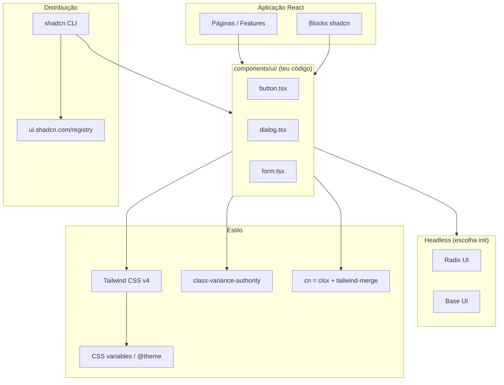
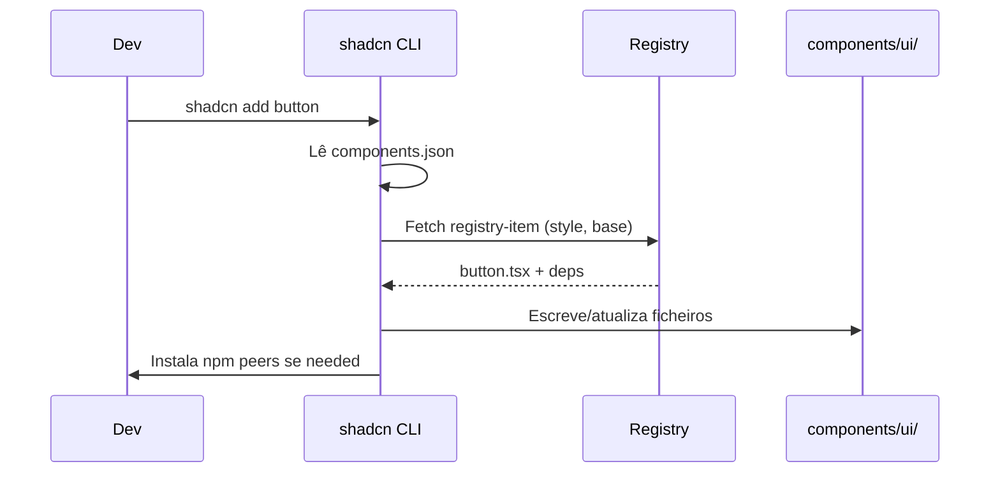

# Dossiê Técnico — shadcn/ui (Componentes)

> Documento de referência permanente. Não é tutorial introdutório.  
> **Escopo:** **shadcn/ui** — sistema de **componentes React** copy-paste, **Tailwind CSS v4**, primitivos **Radix UI** ou **Base UI**, CLI de distribuição e ecossistema registry.

---

## 1. Visão Geral

### O que é shadcn/ui

**shadcn/ui** é um conjunto de componentes acessíveis, bem desenhados, e uma **plataforma de distribuição de código** — **não** uma biblioteca npm tradicional de componentes fechada.

Citação oficial:

> *"This is not a component library. It is how you build your component library."*

Fonte: [Introduction — ui.shadcn.com/docs](https://ui.shadcn.com/docs)

### Problema que resolve

| Problema de libs clássicas | Solução shadcn/ui |
|----------------------------|-------------------|
| Override de estilos frágil | **Código fonte no teu repo** — editas directamente |
| APIs incompatíveis entre libs | Stack coerente (Tailwind + headless) |
| Bundle opaco | Só instalas componentes que usas |
| Customização profunda impossível | Open Code — variantes, props, comportamento |
| Design system divergente | Theme tokens CSS variables partilhados |

### História / origem

| Data | Marco |
|------|-------|
| Jan 2023 | Lançamento — built on **Radix UI** + Tailwind |
| 2023–24 | CLI `npx shadcn@latest`, registry schema, `components.json` |
| 2024–25 | Tailwind v4, oklch tokens, Sidebar, Blocks, Charts |
| Dez 2025 | Suporte dual **Radix + Base UI** |
| Jul 2026 | **Base UI default** em novos projectos; Radix mantido |

Criador: **shadcn** (Vercel ecosystem). Repo: [github.com/shadcn-ui/ui](https://github.com/shadcn-ui/ui) — MIT License.

### Filosofia (4 pilares oficiais)

1. **Open Code** — código real no projecto; LLMs e devs leem/editam
2. **Composition** — primitivos headless + composição React
3. **Distribution** — schema registry + CLI `add`
4. **Beautiful Defaults** — design tokens + variantes CVA prontas

### Casos de uso

- Dashboards, admin panels, SaaS
- Marketing sites com forms/dialogs
- Design systems internos
- Protótipos rápidos com **Blocks**
- Apps AI/chat (Message, Bubble, Attachment — 2026)

### Público-alvo

- Equipas React/Next.js com Tailwind
- Devs que querem **ownership** do UI code
- Projectos que valorizam a11y (Radix/Base UI)

### Contexto Portifolio

Repo actual: **sem React/Tailwind/shadcn** — stack DOM + GSAP. Este dossiê prepara adopção futura (ex.: admin, blog, área cliente).

---

## 2. Arquitetura

### Stack em camadas



### Fluxo `npx shadcn add button`



### Abstrações principais

| Peça | Função |
|------|--------|
| `components.json` | Config projecto (paths, style, RSC, base library) |
| `lib/utils.ts` | `cn()` merge classes |
| `components/ui/*` | Componentes copiados — **fonte de verdade local** |
| Registry JSON | Schema distribuição cross-framework |
| `shadcn` package | CLI only — não runtime UI |

Fonte: [Registry](https://ui.shadcn.com/docs/registry), [components.json](https://ui.shadcn.com/docs/components-json)

---

## 3. Como funciona internamente

### Copy-paste vs npm package

Componentes **não** vêm de `import { Button } from "shadcn"`. O CLI **descarrega** ficheiros `.tsx` para `@/components/ui/button`. Tu és owner — git track, code review, edits.

### Headless primitives

- **Radix UI** — `@radix-ui/react-*` — unstyled, WAI-ARIA, focus trap, portals
- **Base UI** (MUI) — `@base-ui/react/*` — default Jul 2026; API diferente mas mesma filosofia

O ficheiro `button.tsx` local wrapa o primitive com classes Tailwind via `cva`.

### class-variance-authority (CVA)

Define `variants` (default, outline, ghost…) e `sizes` (sm, lg, icon…) como mapas de classes. Type-safe via `VariantProps<typeof buttonVariants>`.

Fonte: [button.tsx registry](https://github.com/shadcn-ui/ui)

### cn() utility

```typescript
import { clsx, type ClassValue } from "clsx"
import { twMerge } from "tailwind-merge"

export function cn(...inputs: ClassValue[]) {
  return twMerge(clsx(inputs))
}
```

`twMerge` resolve conflitos Tailwind (`p-2` + `p-4` → `p-4`).

Fonte: [Manual installation](https://ui.shadcn.com/docs/installation/manual)

### Theming via CSS variables

`:root` e `.dark` definem tokens semânticos (`--background`, `--primary`, …). Tailwind v4 mapeia via `@theme inline`:

```css
:root {
  --background: hsl(0 0% 100%);
  --primary: oklch(0.5 0.2 250);
}
@theme inline {
  --color-background: var(--background);
  --color-primary: var(--primary);
}
```

Fonte: [Theming](https://ui.shadcn.com/docs/theming), [Tailwind v4](https://ui.shadcn.com/docs/tailwind-v4)

### asChild / composition

Pattern Radix `Slot`: renderizar filho único merge props — ex. `<Button asChild><Link href="/">Go</Link></Button>`.

---

## 4. Instalação

### Quick start (frameworks suportados)

```bash
npx shadcn@latest init
```

Frameworks documentados: **Next.js**, **Vite**, **Laravel**, **React Router**, **Astro**, **TanStack Start**, **Manual**.

Fonte: [Installation](https://ui.shadcn.com/docs/installation)

### Por gestor de pacotes

```bash
# init
npx shadcn@latest init
pnpm dlx shadcn@latest init
yarn dlx shadcn@latest init
bunx shadcn@latest init

# add component
npx shadcn@latest add button
pnpm dlx shadcn@latest add button card dialog
```

### Escolher base library no init

```bash
# Default Jul 2026: Base UI
npx shadcn@latest init

# Explicit Radix
npx shadcn@latest init -b radix
```

Fonte: [Changelog Jul 2026 — Base UI default](https://ui.shadcn.com/docs/changelog)

### Dependências típicas (instaladas pelo CLI)

| Package | Uso |
|---------|-----|
| `tailwindcss` | Estilos |
| `class-variance-authority` | Variantes |
| `clsx`, `tailwind-merge` | `cn()` |
| `lucide-react` | Ícones default |
| `@radix-ui/react-*` ou `@base-ui/react` | Primitives |
| `react-hook-form`, `zod` | Forms clássicos |
| `@tanstack/react-table` | Data Table |
| `sonner` | Toast |
| `next-themes` | Dark mode (Next) |

### CDN

**N/A** — shadcn requer build step React + Tailwind. Não é drop-in script tag.

---

## 5. Configuração

### components.json (schema completo)

```json
{
  "$schema": "https://ui.shadcn.com/schema.json",
  "style": "new-york",
  "rsc": true,
  "tsx": true,
  "tailwind": {
    "config": "",
    "css": "src/app/globals.css",
    "baseColor": "neutral",
    "cssVariables": true,
    "prefix": ""
  },
  "aliases": {
    "components": "@/components",
    "utils": "@/lib/utils",
    "ui": "@/components/ui",
    "lib": "@/lib",
    "hooks": "@/hooks"
  },
  "iconLibrary": "lucide"
}
```

| Campo | Descrição |
|-------|-----------|
| `style` | `new-york`, `base-nova`, etc. — aesthetic preset |
| `rsc` | React Server Components compatibility |
| `tsx` | TypeScript vs JavaScript output |
| `tailwind.cssVariables` | `true` = theme tokens; `false` = utility classes hardcoded |
| `tailwind.baseColor` | slate, neutral, zinc, stone, gray… |
| `tailwind.prefix` | Prefix Tailwind classes |
| `aliases.*` | Paths para CLI resolver imports |
| `iconLibrary` | lucide (default) |

Fonte: [components.json](https://ui.shadcn.com/docs/components-json)

### Registry namespaces (custom)

```json
{
  "registries": {
    "@acme": "https://acme.com/r/{name}.json"
  }
}
```

```bash
npx shadcn@latest add @acme/login-form
```

Fonte: [Registry — Namespaces](https://ui.shadcn.com/docs/registry)

---

## 6. Estrutura recomendada de projecto

```
src/
├── app/                    # Next.js App Router
│   ├── globals.css         # @import "tailwindcss" + theme tokens
│   └── layout.tsx          # ThemeProvider
├── components/
│   ├── ui/                 # shadcn components (CLI)
│   │   ├── button.tsx
│   │   ├── dialog.tsx
│   │   └── sidebar.tsx
│   ├── app-sidebar.tsx     # Composição feature-level
│   └── login-form.tsx
├── hooks/
│   └── use-mobile.tsx      # shadcn hooks (sidebar)
├── lib/
│   └── utils.ts            # cn()
└── components.json
```

**Regras:**

- **Não editar** `components/ui` num fork separado — é o design system
- Features compõem em `components/` fora de `ui/`
- Variantes de negócio → wrap `<Button>` em `<SubmitButton>`, não duplicar primitive

---

## 7. API completa

### CLI commands

| Comando | Descrição |
|---------|-----------|
| `shadcn init` | Setup projecto + components.json |
| `shadcn init -b radix` | Forçar Radix |
| `shadcn add [component]` | Adicionar componente(s) |
| `shadcn add button card` | Múltiplos |
| `shadcn add @ns/item` | Registry externo |
| `shadcn diff` | Lista updates disponíveis |
| `shadcn diff button` | Diff upstream vs local |
| `shadcn add button --diff` | Preview changes |
| `shadcn add button --dry-run` | Simular sem escrever |
| `shadcn add button --overwrite` | Sobrescrever local |
| `shadcn mcp init --client cursor` | Setup MCP server |
| `shadcn search` | Pesquisar registry |

Fonte: [CLI](https://ui.shadcn.com/docs/cli), [Changelog CLI v4](https://github.com/shadcn-ui/ui/blob/main/apps/v4/content/docs/changelog/2026-03-cli-v4.mdx)

### Componentes catalog (2026 — parcial)

| Categoria | Componentes |
|-----------|---------------|
| **Layout** | Sidebar, Separator, Resizable, Scroll Area, Aspect Ratio |
| **Navigation** | Navigation Menu, Menubar, Breadcrumb, Pagination, Tabs |
| **Forms** | Input, Textarea, Select, Checkbox, Radio, Switch, Field, Label, Form |
| **Feedback** | Alert, Toast/Sonner, Progress, Skeleton, Spinner |
| **Overlay** | Dialog, Sheet, Drawer, Popover, Hover Card, Tooltip |
| **Data** | Table, Data Table, Chart |
| **Display** | Card, Badge, Avatar, Calendar, Carousel |
| **Command** | Command, Combobox |
| **Chat (2026)** | Message, Bubble, Attachment, Marker, Message Scroller |
| **Misc** | Button, Button Group, Kbd, Empty, Item |

Fonte: [Components index](https://ui.shadcn.com/docs/components)

### Button API (padrão representativo)

```tsx
<Button variant="default" | "destructive" | "outline" | "secondary" | "ghost" | "link"
        size="default" | "xs" | "sm" | "lg" | "icon"
        asChild={boolean}
        className={string}
        {...ButtonPrimitive.Props}
/>
```

### Form API (react-hook-form)

| Export | Função |
|--------|--------|
| `Form` | `FormProvider` wrapper |
| `FormField` | `Controller` + context |
| `FormItem` | Layout field |
| `FormLabel` | Label a11y |
| `FormControl` | Slot para input |
| `FormDescription` | Texto ajuda |
| `FormMessage` | Erros validation |
| `useFormField` | ids aria + fieldState |

Fonte: [form.tsx registry](https://github.com/shadcn-ui/ui)

### Field API (novo — Base UI forward)

Abstração unificada: `Field`, `FieldLabel`, `FieldDescription`, `FieldError` — integra React Hook Form, TanStack Form, Formisch.

Fonte: [Field docs](https://ui.shadcn.com/docs/components/base/field)

### Sidebar API

| Concept | Descrição |
|---------|-----------|
| `SidebarProvider` | Context + cookie state |
| `Sidebar` | Desktop + mobile Sheet |
| `SidebarTrigger` | Toggle |
| `collapsible` | offcanvas \| icon \| none |
| `useSidebar()` | state, isMobile |

Mobile: converte automaticamente para **Sheet**.

Fonte: [sidebar.tsx](https://github.com/shadcn-ui/ui)

---

## 8. Conceitos fundamentais

### Open Code ownership

Actualizar upstream: `shadcn diff` → review → merge manual ou `--overwrite` (perde custom edits).

### Dois estilos visuais

- **new-york** — radius menor, estética clássica shadcn
- **base-nova** — evolução com Base UI default

Escolhido no `init`; difícil mudar depois sem re-add.

### RSC (React Server Components)

`"use client"` nos componentes interactivos (Dialog, Sheet). Server Components importam UI estática (Card layout) com cuidado.

`components.json` `"rsc": true` ajusta output CLI.

### Data Table ≠ Table

- **Table** — markup HTML estilizado
- **Data Table** — **TanStack Table** + sorting, filtering, pagination

Fonte: [Data Table](https://ui.shadcn.com/docs/components/data-table)

### Blocks vs Components

- **Components** — primitivos (`button`, `input`)
- **Blocks** — secções completas (login, dashboard, sidebar layouts) copy-paste

Fonte: [Blocks](https://ui.shadcn.com/blocks)

### Registry item schema

`registry-item.json` define files, dependencies, tailwind config fragments — permite registries terceiros e MCP browse.

---

## 9. Fluxo de desenvolvimento

1. `shadcn init` — framework + base library + theme
2. Configurar tokens CSS / dark mode
3. `shadcn add` componentes necessários (incremental)
4. Compor features em `components/`
5. Customizar variantes CVA localmente
6. `shadcn diff` periodicamente para security/a11y fixes upstream
7. Tests + Storybook opcional
8. Publicar registry interno se multi-app

---

## 10. Recursos avançados

| Recurso | Descrição |
|---------|-----------|
| **Charts** | recharts + shadcn Chart wrapper |
| **Sidebar** | App shell completo |
| **MCP Server** | AI install/browse components |
| **Custom registry** | Distribuir design system empresa |
| **GitHub Registry** | Repo → registry (Jun 2026) |
| **shadcn eject** | Shared Tailwind utilities Radix+Base (May 2026) |
| **RTL** | Direction docs + logical properties |
| **Skills migrate** | `skills add shadcn/ui` — Radix→Base progressivo |
| **Create** | shadcn/create scaffolding |
| **Formisch / TanStack Form** | Alternativas RHF |

Fontes: [MCP](https://ui.shadcn.com/docs/mcp), [Changelog](https://ui.shadcn.com/docs/changelog)

---

## 11. Performance

### Vantagens

- **Tree-shaking natural** — só código que adicionaste
- Sem runtime de "component library" monolítica
- Tailwind purge — classes não usadas removidas build

### Custos

| Factor | Nota |
|--------|------|
| Radix/Base portals | Dialog/Popover — DOM extra OK |
| Data Table grande | Virtualização manual se 10k+ rows |
| Charts | recharts bundle — lazy load |
| Sidebar | CSS variables + transitions leves |
| Lucide icons | Import named icons only |

### Boas práticas

- `import { ChevronRight } from "lucide-react"` — não import *
- Dynamic import routes pesadas (Chart, Calendar)
- Server Components onde possível

---

## 12. Escalabilidade

- **Design tokens** centralizados em `globals.css`
- **Registry interno** `@company/ui` para multi-produto
- **Wrappers** feature-level; `ui/` stays canonical
- **Codemods/skills** para migrations Base UI
- **Storybook** por componente em `ui/`
- Documentar overrides vs upstream em README interno

---

## 13. Integrações

| Integração | Pattern |
|------------|---------|
| **Next.js App Router** | First-class; `rsc: true` |
| **Vite + React** | [Installation Vite](https://ui.shadcn.com/docs/installation/vite) |
| **Laravel + Inertia** | Suportado |
| **Astro** | React islands |
| **Tailwind v4** | `@import "tailwindcss"` |
| **react-hook-form + zod** | Form component |
| **TanStack Table** | Data Table |
| **next-themes** | Dark mode toggle |
| **Framer Motion / Motion** | Animações wrap shadcn (sem conflito) |
| **GSAP** | DOM fora de Radix portals — OK |
| **tRPC / Server Actions** | Forms + mutations |
| **Playwright** | E2E com roles Radix |

### Portfólio actual

Sem React — adopção implicaria migrar/adicionar stack Next/Vite. shadcn encaixa em futura área admin ou rebuild React.

---

## 14. TypeScript

### VariantProps

```tsx
import { type VariantProps } from "class-variance-authority"
import { buttonVariants } from "@/components/ui/button"

type ButtonProps = React.ComponentProps<"button"> &
  VariantProps<typeof buttonVariants> & { asChild?: boolean }
```

### Form generics

```tsx
const form = useForm<z.infer<typeof formSchema>>({
  resolver: zodResolver(formSchema),
})
```

### ISourceOptions / registry types

CLI gera `components.json` com `$schema` — IntelliSense VS Code.

---

## 15. Customização

### Níveis

| Nível | Acção |
|-------|-------|
| Tokens | Editar CSS variables |
| Variantes CVA | Adicionar `variant: { brand: "..." }` |
| Component source | Editar `button.tsx` directamente |
| New component | `shadcn add` + fork pattern |
| Global style | `@theme`, `@layer components` |

### Theming visual

[ui.shadcn.com/themes](https://ui.shadcn.com/themes) — gerador tokens copy-paste.

### Sem CSS variables

`tailwind.cssVariables: false` — classes utilitárias directas nos componentes (menos flexível dark mode).

---

## 16. Plugins / registries

| Registry | Uso |
|----------|-----|
| `@shadcn` (default) | ui.shadcn.com |
| `@acme/*` custom | Design system empresa |
| GitHub repo registry | Jun 2026 feature |
| Community [Directory](https://ui.shadcn.com/docs/directory) | Terceiros curados |

### MCP como "plugin" AI

```bash
pnpm dlx shadcn@latest mcp init --client cursor
```

Permite: browse, search, install via linguagem natural.

Fonte: [MCP Server](https://ui.shadcn.com/docs/mcp)

---

## 17. Ecossistema

| Recurso | URL |
|---------|-----|
| Docs | ui.shadcn.com |
| GitHub | github.com/shadcn-ui/ui |
| Radix UI | radix-ui.com |
| Base UI | base-ui.com |
| Tailwind CSS | tailwindcss.com |
| Awesome shadcn | community registries |
| shadcnblocks | blocos marketing |
| v0 (Vercel) | gera UI compatible |

---

## 18. Casos reais

- Startups SaaS (Linear-style dashboards)
- Vercel ecosystem products
- Open-source admin templates (shadcn-admin forks)
- AI chat UIs (2026 Message/Bubble components)
- Enterprise design systems via private registry

---

## 19. Exemplos completos

### Hello World — init + button

```bash
npx shadcn@latest init
npx shadcn@latest add button
```

```tsx
import { Button } from "@/components/ui/button"

export function Page() {
  return <Button>Click me</Button>
}
```

### Básico — Card + Dialog

```bash
npx shadcn@latest add card dialog
```

```tsx
"use client"
import { Button } from "@/components/ui/button"
import {
  Dialog, DialogContent, DialogHeader, DialogTitle, DialogTrigger,
} from "@/components/ui/dialog"

export function ProjectDialog() {
  return (
    <Dialog>
      <DialogTrigger asChild>
        <Button variant="outline">Ver projecto</Button>
      </DialogTrigger>
      <DialogContent>
        <DialogHeader>
          <DialogTitle>Portfolio GSAP</DialogTitle>
        </DialogHeader>
        <p>Scroll storytelling com DOM.</p>
      </DialogContent>
    </Dialog>
  )
}
```

### Intermediário — Form + Zod

```tsx
"use client"
import { zodResolver } from "@hookform/resolvers/zod"
import { useForm } from "react-hook-form"
import { z } from "zod"
import { Button } from "@/components/ui/button"
import {
  Form, FormControl, FormField, FormItem, FormLabel, FormMessage,
} from "@/components/ui/form"
import { Input } from "@/components/ui/input"

const schema = z.object({
  email: z.string().email(),
})

export function ContactForm() {
  const form = useForm<z.infer<typeof schema>>({
    resolver: zodResolver(schema),
    defaultValues: { email: "" },
  })

  return (
    <Form {...form}>
      <form onSubmit={form.handleSubmit(console.log)} className="space-y-4">
        <FormField
          control={form.control}
          name="email"
          render={({ field }) => (
            <FormItem>
              <FormLabel>Email</FormLabel>
              <FormControl>
                <Input placeholder="you@example.com" {...field} />
              </FormControl>
              <FormMessage />
            </FormItem>
          )}
        />
        <Button type="submit">Enviar</Button>
      </form>
    </Form>
  )
}
```

Fonte: [Forms](https://ui.shadcn.com/docs/forms)

### Avançado — Sidebar app shell

```bash
npx shadcn@latest add sidebar sheet button separator
```

Compor `AppSidebar`, `SidebarProvider`, `SidebarInset` — ver docs Sidebar + Blocks dashboard.

### Arquitectura profissional — theme + dark mode (Next.js)

```tsx
// app/layout.tsx
import { ThemeProvider } from "@/components/theme-provider"

export default function RootLayout({ children }: { children: React.ReactNode }) {
  return (
    <html lang="pt" suppressHydrationWarning>
      <body>
        <ThemeProvider attribute="class" defaultTheme="system" enableSystem>
          {children}
        </ThemeProvider>
      </body>
    </html>
  )
}
```

```css
/* globals.css */
@import "tailwindcss";
@import "tw-animate-css";

@custom-variant dark (&:is(.dark *));

:root {
  --background: oklch(1 0 0);
  --foreground: oklch(0.145 0 0);
  --primary: oklch(0.5 0.2 250);
}
.dark {
  --background: oklch(0.145 0 0);
  --foreground: oklch(0.985 0 0);
}
@theme inline {
  --color-background: var(--background);
  --color-foreground: var(--foreground);
  --color-primary: var(--primary);
}
```

Fonte: [Theming](https://ui.shadcn.com/docs/theming), [Dark Mode](https://ui.shadcn.com/docs/dark-mode)

---

## 20. Erros comuns

| Erro | Causa | Solução |
|------|-------|---------|
| `Module not found @/components/ui/button` | Aliases | Configurar `paths` tsconfig + components.json |
| Hydration mismatch dark mode | Theme flash | `suppressHydrationWarning` + next-themes |
| Dialog não abre | Missing `"use client"` | Client component |
| Styles não aplicam | Tailwind content paths | Incluir `./components/**/*` |
| `cn is not defined` | Falta utils | `shadcn init` ou copiar `lib/utils.ts` |
| FormField context error | Fora de `<Form>` | Wrap FormProvider |
| Duplicate Tailwind classes | Sem cn() | Usar `cn()` sempre |
| `shadcn add` overwrite custom | `--overwrite` acidental | Git diff antes; manual merge |
| Radix/Base mix | Init errado | `-b radix` ou migrate skill |
| Portal z-index | Stacking context | Ajustar `z-50` modals |

---

## 21. Limitações

| Limitação | Detalhe |
|-----------|---------|
| Requer React + Tailwind | Não serve vanilla HTML portfólio actual |
| Manutenção manual updates | `diff` + merge — não npm bump automático |
| Dois bases Radix/Base | Migração não trivial se customizado |
| Data Table não virtualizado | TanStack manual |
| Opinionated aesthetics | Precisa editar para brand único |
| Sem componentes nativos mobile | React web only |

### Quando NÃO usar

- Site estático DOM-only (caso portfólio GSAP actual)
- Equipa sem React
- Projeto sem Tailwind (adicionar TW só para shadcn = overhead)
- Precisas 100% npm semver sem fork code

---

## 22. Comparação

| Critério | shadcn/ui | MUI | Chakra UI | Radix Themes | daisyUI |
|----------|-----------|-----|-----------|--------------|---------|
| Modelo | Copy-paste | npm package | npm package | npm package | Tailwind plugin |
| Customização | Total (source) | Theme overrides | Theme | CSS props | Classes |
| Bundle | Só o que adds | Grande | Médio-grande | Médio | Pequeno |
| a11y | Radix/Base | MUI a11y | Boa | Radix | Variable |
| Tailwind native | Sim | Não (sx) | Não | Parcial | Sim |
| Design uniqueness | Alta com edit | Look MUI | Look Chakra | Minimal | Look daisy |
| Updates | Manual diff | semver | semver | semver | semver |
| TypeScript | Excelente | Excelente | Boa | Boa | Limitada |
| RSC Next | First-class | Client-heavy | Client | Client | N/A |

**Escolher shadcn/ui:** React + Tailwind, ownership código, design system próprio, dashboards/forms.  
**Escolher MUI/Chakra:** velocidade com theme API npm, equipa familiar Material.  
**Escolher daisyUI:** prototipo ultra-rápido sem primitives complexos.

---

## 23. Roadmap

| Direcção (oficial changelog 2026) |
|-----------------------------------|
| **Base UI default** — novos projectos |
| Radix maintained — dual ship componentes |
| Chat/AI components (Message, Bubble…) |
| GitHub registries |
| MCP + Skills migration |
| `@shadcn/react` package exploration |
| Field abstraction multi-form-library |
| RTL first-class |

Fonte: [Changelog](https://ui.shadcn.com/docs/changelog)

---

## 24. Breaking Changes

| Mudança | Impacto |
|---------|---------|
| Tailwind v3 → v4 | `@theme inline`, import CSS-first |
| oklch tokens | Migrar `:root` variables |
| Base UI default Jul 2026 | Novos inits diferem de Radix |
| CLI v4 | `--diff`, registry namespaces |
| Style renames | `base-nova` vs `new-york` |
| Form → Field | Novos projectos preferem Field |

**Radix existente:** changelog explicit — *"You do not need to migrate."*

---

## 25. Changelog resumido

| Período | Marco |
|---------|-------|
| 2023 | Launch Radix + CLI |
| 2023-06 | New CLI, `cssVariables`, `diff` |
| 2024 | Sidebar, Blocks, Charts |
| 2025 | Tailwind v4 docs, dual Base UI preview |
| Mai 2026 | shadcn eject shared utilities |
| Jun 2026 | GitHub registries, chat components |
| Jul 2026 | Base UI default, migration skills |

---

## 26. Melhores práticas

1. `shadcn add` incremental — só o necessário
2. Editar `ui/` consciente — documentar overrides
3. `shadcn diff` antes de `--overwrite`
4. `cn()` para todas classes condicionais
5. Tokens semânticos (`bg-background`) não cores raw
6. `asChild` para links/buttons sem nested buttons
7. Form: sempre `FormMessage` + `aria-invalid`
8. Icons: imports individuais lucide
9. Dark mode: CSS variables + `class` strategy
10. Feature components fora de `ui/`
11. Pin base library init (`-b radix`) CI non-interactive
12. MCP para onboarding equipa AI-assisted

---

## 27. Anti-patterns

| Anti-pattern | Porquê |
|--------------|--------|
| Wrapper library sobre shadcn sem edit | Perde benefício open code |
| `--overwrite` cego | Apaga customizações |
| Cores hex em componentes | Quebra theming |
| Instalar todos componentes day 1 | Repo bloat |
| Ignorar `diff` security fixes | Vulnerabilidades upstream |
| Nested `<button>` | HTML inválido — usar asChild |
| Global CSS !important vs Tailwind | Specificity wars |
| Mix Radix + Base same component | APIs incompatíveis |
| Data table sem pagination 50k rows | Browser freeze |

---

## 28. Segurança

- **Registry externo** — validar origem `@namespace` (supply chain)
- **Authentication** registry docs — tokens CI
- Componentes locais — auditar como código próprio
- Dialog/Sheet — não colocar secrets em client components
- MCP server — seguir hardening Cursor/Claude docs
- Dependências Radix/Base — npm audit regular

Fonte: [Registry Authentication](https://ui.shadcn.com/docs/registry/authentication)

---

## 29. SEO

**Impacto indirecto positivo** se SSR/React:

- Server Components renderizam HTML semântico (Card, headings)
- Dialog content hidden até open — OK para crawl se conteúdo crítico **não** só em modal
- Button asChild `<a href>` — links crawlable

**Neutro/negativo:**

- Heavy client JS vs static HTML portfólio
- Para SEO máximo landing marketing: HTML estático pode superar SPA shadcn

---

## 30. Acessibilidade

### Built-in via Radix/Base UI

| Feature | Componentes |
|---------|-------------|
| Focus trap | Dialog, Sheet |
| Escape close | Popover, Dialog |
| aria-expanded | Collapsible, Accordion |
| Keyboard nav | Menu, Command, Tabs |
| Screen reader labels | FormLabel, sr-only SheetTitle |

### Responsabilidades do dev

- `aria-label` em icon buttons
- `FormMessage` ligado via ids (`useFormField`)
- Não remover `SheetTitle`/`DialogTitle` (visually hidden se needed)
- Bubble chat: `asChild` + button nativo para conteúdo clickable

Fonte: [Bubble a11y](https://github.com/shadcn-ui/ui/blob/main/apps/v4/content/docs/components/radix/bubble.mdx)

### Reduced motion

Respeitar `prefers-reduced-motion` em animações custom; shadcn defaults subtis.

---

## 31. Testes

| Estratégia | Ferramenta |
|------------|------------|
| Unit | Vitest + RTL — render Button variants |
| Form validation | RTL + userEvent + zod cases |
| E2E | Playwright — `getByRole('dialog')` |
| Visual | Chromatic / Percy |
| a11y | axe-playwright em pages |

Testar dark mode toggle e mobile Sidebar Sheet.

---

## 32. Debug

- React DevTools — props variant/size
- Radix DevTools (community)
- Tailwind IntelliSense — classes resolvidas?
- `shadcn diff button` — drift upstream
- Verificar portal target `document.body`
- Theme: inspect `.dark` class html element

---

## 33. DevTools

| Ferramenta | Uso |
|------------|-----|
| shadcn CLI `--dry-run` | Preview install |
| shadcn MCP | AI component search |
| Tailwind CSS IntelliSense | Autocomplete |
| ui.shadcn.com/themes | Token generator |
| Storybook | Catalog ui/ |

---

## 34. FAQ

**shadcn é npm library?**  
Não — CLI + código local.

**Radix ou Base UI?**  
Default Jul 2026: Base UI. Radix: `init -b radix`. Migração opcional.

**Posso usar sem Next.js?**  
Sim — Vite, Astro, Laravel, etc.

**Como actualizo Button?**  
`shadcn diff button` → merge manual.

**Funciona com Tailwind v4?**  
Sim — `@import "tailwindcss"`, `@theme inline`.

**Substitui GSAP no portfólio?**  
Não — shadcn é UI components; GSAP é animação scroll. Complementares em rebuild React.

**MCP Cursor setup?**  
`pnpm dlx shadcn@latest mcp init --client cursor`

---

## 35. Glossário

| Termo | Definição |
|-------|-----------|
| **Open Code** | Component source no teu repo |
| **Registry** | Schema distribuição componentes |
| **cn()** | clsx + tailwind-merge helper |
| **CVA** | class-variance-authority variants |
| **asChild** | Composition via Radix Slot |
| **Primitive** | Unstyled headless component |
| **RSC** | React Server Components |
| **Block** | UI section pre-built |
| **Token** | CSS variable semântica (--primary) |
| **Base UI** | Headless MUI library |
| **Field** | Form field abstraction 2026 |

---

## 36. Cheatsheet

```bash
# Setup
npx shadcn@latest init
npx shadcn@latest init -b radix

# Add
npx shadcn@latest add button card dialog form sidebar
npx shadcn@latest add @acme/login-form

# Updates
npx shadcn diff
npx shadcn diff button
npx shadcn add button --diff --dry-run

# MCP
pnpm dlx shadcn@latest mcp init --client cursor
```

```tsx
import { cn } from "@/lib/utils"
import { Button } from "@/components/ui/button"

<Button variant="outline" size="sm" className={cn("w-full", active && "ring-2")} />
<Button asChild><a href="/docs">Docs</a></Button>
```

---

## 37. Guia de aprendizado

| Fase | Tópico | Recurso |
|------|--------|---------|
| 1 | Filosofia Open Code | ui.shadcn.com/docs |
| 2 | init + Button + Card | Installation |
| 3 | cn + CVA + tokens | Theming |
| 4 | Dialog/Sheet/Form | Components |
| 5 | Dark mode | dark-mode docs |
| 6 | Data Table | TanStack integration |
| 7 | Sidebar shell | Blocks dashboard |
| 8 | diff/update workflow | CLI docs |
| 9 | Registry custom / MCP | Registry + MCP |
| 10 | Base UI vs Radix | Changelog Jul 2026 |

---

## 38. Referências

### Documentação oficial

1. https://ui.shadcn.com/docs — Introduction, filosofia (2026-07-05)
2. https://ui.shadcn.com/docs/installation — Frameworks suportados
3. https://ui.shadcn.com/docs/installation/manual — Manual + cn()
4. https://ui.shadcn.com/docs/components-json — Schema config
5. https://ui.shadcn.com/docs/theming — CSS variables, oklch, @theme
6. https://ui.shadcn.com/docs/dark-mode — Theme provider
7. https://ui.shadcn.com/docs/cli — CLI + Base UI default
8. https://ui.shadcn.com/docs/changelog — Jul 2026 Base UI, chat, registries
9. https://ui.shadcn.com/docs/forms — React Hook Form, Field
10. https://ui.shadcn.com/docs/components/base/field — Field component
11. https://ui.shadcn.com/docs/registry — Custom registry
12. https://ui.shadcn.com/docs/mcp — MCP Server Cursor/Claude
13. https://ui.shadcn.com/docs/tailwind-v4 — Migration Tailwind v4

### GitHub

14. https://github.com/shadcn-ui/ui — Monorepo MIT
15. https://github.com/shadcn-ui/ui/blob/main/apps/v4/content/docs/changelog/2023-06-new-cli.mdx — CLI cssVariables, diff
16. https://github.com/shadcn-ui/ui/blob/main/apps/v4/content/docs/changelog/2026-03-cli-v4.mdx — CLI v4 --diff
17. https://github.com/shadcn-ui/ui/blob/main/apps/v4/content/docs/changelog/2026-07-base-ui-default.mdx — Base UI default
18. https://github.com/shadcn-ui/ui/blob/main/skills/shadcn/SKILL.md — CLI --dry-run, --diff, styling rules
19. https://github.com/shadcn-ui/ui/blob/main/apps/v4/registry/new-york-v4/ui/form.tsx — Form source
20. https://github.com/shadcn-ui/ui/blob/main/apps/v4/registry/bases/base/ui/sidebar.tsx — Sidebar mobile Sheet

### npm (versões consultadas)

21. `shadcn@4.13.0`
22. `tailwindcss@4.3.2`
23. `@radix-ui/react-dialog@1.1.18`

### Ferramentas pesquisa

24. agent-browser — ui.shadcn.com/docs, installation, theming, changelog, MCP, Field
25. Context7 `/shadcn-ui/ui` — architecture, forms, CLI, theming
26. MCP Puppeteer — ui.shadcn.com/docs (screenshot timeout nesta sessão)

### Dossiers relacionados (projecto)

27. `docs/dossiers/hover-effects.md` — Tailwind hover + componentes
28. `docs/dossiers/gsap.md` — animação scroll (stack actual)

---

## Lacunas documentais

| Tópico | Estado |
|--------|--------|
| Benchmark bundle shadcn vs MUI | Qualitativo |
| Screenshot Puppeteer docs | Timeout — agent-browser OK |
| `@shadcn/react` package API | Emergente (GitHub PR #11022) |
| Lista completa props por componente | Ver docs individuais — catálogo >60 |

---

*Gerado via `/library-dossier` — skill technical-library-dossier v1.0.0*
