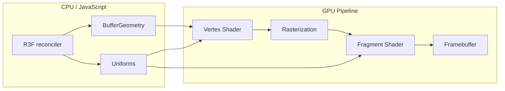
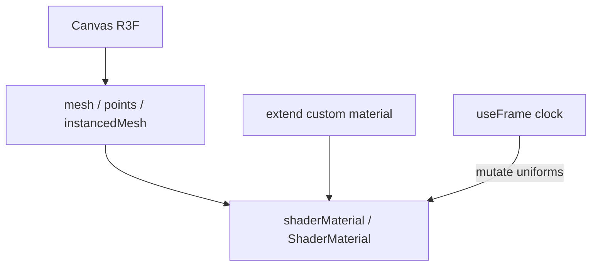
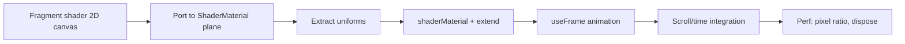

# Dossiê Técnico — GLSL & Shaders (React Three Fiber)

> Documento de referência permanente. Não é tutorial introdutório.  
> **Escopo:** linguagem **GLSL**, pipeline GPU, **Three.js** materials, **React Three Fiber (R3F)** + **drei** `shaderMaterial`. Opcional para efeitos avançados em portfolios WebGL.

---

## 1. Visão Geral

### O que é GLSL

**GLSL** (OpenGL Shading Language) é a linguagem C-like para programar **shaders** — programas que correm na **GPU**, em paralelo, por vértice ou por pixel (fragmento). Standard mantido pela **Khronos Group** (OpenGL/WebGL).

Fonte: [GLSL Spec 4.60.8](https://registry.khronos.org/OpenGL/specs/gl/GLSLangSpec.4.60.pdf), [Book of Shaders](https://thebookofshaders.com/01/)

### O que são shaders no contexto web

| Tipo | Stage | Função |
|------|-------|--------|
| **Vertex shader** | Por vértice | Posição, UV, normais, varyings |
| **Fragment shader** | Por pixel | Cor, texturas, efeitos, lighting custom |
| **Compute** (WebGPU) | Workgroups | Geral-purpose GPU (fora WebGL clássico) |

No stack **Three.js + R3F**, shaders customizam aparência via `ShaderMaterial`, `RawShaderMaterial`, `onBeforeCompile`, ou **drei** `shaderMaterial`.

### Problema que resolve

- Efeitos impossíveis com materiais built-in (distortion, dissolve, holographic, fluid sim 2D)
- Controlo pixel-a-pixel (post-processing, noise, FBM)
- Performance: milhões de operações paralelas na GPU vs CPU
- Integração declarativa em React via R3F

### História

- GLSL ~2002 (OpenGL 2.0)
- WebGL traz subset GLSL ES para browsers
- Three.js abstrai WebGL + injeta **ShaderChunks** nos materiais PBR
- R3F (pmndrs) torna materiais/shaders declarativos em JSX
- Three.js r150+ evolui **TSL/Node Materials** (alternativa moderna a GLSL raw)

### Filosofia R3F para shaders

- **Declarativo** — `<shaderMaterial uniforms={...} />`
- **Mutate uniforms in-place** via ref + `useFrame` (não recriar object cada render)
- **extend()** — materiais custom como JSX elements
- **Auto-dispose** — menos leaks vs vanilla Three.js

Fonte: [R3F objects.mdx](https://github.com/pmndrs/react-three-fiber/blob/master/docs/API/objects.mdx)

### Casos de uso

- Hero WebGL backgrounds (noise, gradient meshes)
- Distortion hover em imagens 3D/planes
- Particles custom (point sprites GLSL)
- Scroll-sync uniforms (tempo, scroll progress) — combina com Lenis/GSAP do portfólio
- Post-processing (`@react-three/postprocessing`)

### Público-alvo

- Devs com base React que querem efeitos GPU
- Creative developers além de CSS/GSAP 2D
- **Não** necessário para portfolios só DOM + ScrollTrigger

---

## 2. Arquitetura

### Pipeline WebGL (simplificado)



### Stack R3F + Shaders



### Três abordagens em Three.js/R3F

| Abordagem | Quando |
|-----------|--------|
| **Built-in material + onBeforeCompile** | Tweaks PBR (fog, vertex displacement leve) |
| **ShaderMaterial** | Shader completo; Three.js injects chunks/uniforms |
| **RawShaderMaterial** | Controlo total; sem prepend automático |
| **drei shaderMaterial** | DX React + setters + extend |
| **TSL / NodeMaterial** | Futuro Three.js; menos GLSL string |

Fonte: [ShaderMaterial docs](https://github.com/mrdoob/three.js/blob/dev/docs/pages/ShaderMaterial.html)

---

## 3. Como funciona internamente

### Compilação shader (Three.js)

1. Concatena **ShaderChunks** (`#include <common>`) se `ShaderMaterial`
2. Preprocessor `#define` from `material.defines`
3. Compila vertex + fragment para WebGL program
4. Cache por `customProgramCacheKey()` + `onBeforeCompile` signature
5. `material.needsUpdate = true` força recompile

### R3F uniform merge

Quando props `uniforms` mudam, R3F **merge in-place** no object uniforms existente — preserva cache Three.js. Animar via:

```javascript
ref.current.uniforms.time.value = clock.elapsedTime;
```

**Anti-pattern:** recriar `{ time: { value: t } }` cada frame sem ref merge.

Fonte: [R3F Shader uniforms](https://github.com/pmndrs/react-three-fiber/blob/master/docs/API/objects.mdx)

### Fragment shader parallel model

Cada pixel executa **independentemente** — sem leitura de resultados de outros pixels (excepto via texturas/framebuffers). Threads "blind" e "memoryless" entre invocações.

Fonte: [Book of Shaders — Why painful](https://thebookofshaders.com/01/)

### Precision

WebGL: `precision mediump float` often required in fragment shaders on mobile. Three.js sets via material `precision: 'highp'|'mediump'|'lowp'`.

---

## 4. Instalação

### Stack recomendado

```bash
npm install three @react-three/fiber @react-three/drei
# opcional post-processing / glsl imports
npm install @react-three/postprocessing
npm install vite-plugin-glsl  # dev — import .glsl files
```

**Versões consultadas (2026-07-05):** `three@0.185.1`, `@react-three/fiber@9.6.1`, `@react-three/drei@10.7.7`

### Vite + GLSL imports

```typescript
// vite.config.ts
import glsl from 'vite-plugin-glsl';
export default { plugins: [glsl()] };

// shader.ts
import fragment from './effect.frag';
import vertex from './effect.vert';
```

### CDN (não recomendado produção R3F)

Three.js via CDN possível; R3F requer bundler React.

---

## 5. Configuração

### ShaderMaterial options (Three.js)

| Opção | Descrição |
|-------|-----------|
| `uniforms` | `{ name: { value } }` — atualizados every frame |
| `vertexShader` / `fragmentShader` | Strings GLSL |
| `defines` | `#define FOO 1` injected |
| `glslVersion` | `THREE.GLSL3` para WebGL2 features |
| `lights` | `true` → uniforms lighting (needs chunks) |
| `fog` | `true` → fog uniforms |
| `transparent` | Alpha blending |
| `depthWrite` / `depthTest` | Ordem render |
| `extensions` | `{ clipCullDistance, multiDraw }` WebGL2 |
| `wireframe` | Debug |

Fonte: [ShaderMaterial](https://github.com/mrdoob/three.js/blob/dev/docs/pages/ShaderMaterial.html)

### RawShaderMaterial vs ShaderMaterial

| | ShaderMaterial | RawShaderMaterial |
|---|----------------|-------------------|
| Auto attributes/uniforms | Sim | **Não** |
| ShaderChunks `#include` | Sim | **Não** |
| Boilerplate | Menor | Completo (matrices, attributes) |
| Uso R3F | Comum | Portabilidade/total control |

Fonte: [RawShaderMaterial](https://github.com/mrdoob/three.js/blob/dev/docs/pages/RawShaderMaterial.html)

### drei shaderMaterial

Factory que cria classe extending `ShaderMaterial` com **getters/setters** por uniform + `extend()` JSX.

Fonte: [drei shaderMaterial](https://pmndrs.github.io/drei/shaders/shader-material)

---

## 6. Estrutura recomendada de projeto

```
src/
├── components/
│   └── canvas/
│       ├── Scene.tsx
│       └── EffectsCanvas.tsx      # "use client"
├── shaders/
│   ├── lib/
│   │   └── uniforms.ts            # tipos + defaults
│   ├── materials/
│   │   └── WaveMaterial.tsx       # shaderMaterial + extend
│   ├── chunks/                    # #include custom (via vite-glsl)
│   │   └── noise.glsl
│   ├── wave.vert
│   └── wave.frag
└── hooks/
    └── useShaderTime.ts           # useFrame uniform update
```

### Integração com portfólio actual

O repo usa **GSAP ScrollTrigger** (`scroll-sections.ts`) sem R3F ainda. Path híbrido:

- DOM sections: ScrollTrigger batch
- Hero WebGL optional: `<Canvas>` com uniform `uScroll` ligado a `scrollYProgress` ou Lenis event

---

## 7. API completa

### GLSL — tipos fundamentais

| Tipo | Descrição |
|------|-----------|
| `float`, `int`, `bool` | Escalares |
| `vec2`, `vec3`, `vec4` | Vetores |
| `mat2`, `mat3`, `mat4` | Matrizes |
| `sampler2D`, `samplerCube` | Texturas |
| `void` | Funções |

Qualifiers: `attribute`/`in` (vertex in), `varying`/`out`+`in` (between stages), `uniform` (CPU→GPU).

Fonte: GLSL Spec §4 Variables and Types

### GLSL — built-ins essenciais (fragment)

```glsl
gl_FragColor = vec4(1.0);  // GLSL1 / WebGL1 compat
// WebGL2 / GLSL3:
out vec4 fragColor;
fragColor = vec4(1.0);
```

Vertex:

```glsl
gl_Position = projectionMatrix * modelViewMatrix * vec4(position, 1.0);
```

Three.js `ShaderMaterial` injects: `position`, `uv`, `normal`, `modelViewMatrix`, `projectionMatrix`, `modelMatrix`, etc.

### Three.js ShaderMaterial

```javascript
new THREE.ShaderMaterial({
  uniforms: {
    time: { value: 0 },
    uTexture: { value: null },
    uResolution: { value: new THREE.Vector2() },
  },
  vertexShader: `...`,
  fragmentShader: `...`,
  transparent: true,
});
```

### Material.onBeforeCompile

```javascript
material.onBeforeCompile = (shader) => {
  shader.uniforms.time = { value: 0 };
  shader.vertexShader = shader.vertexShader.replace(
    '#include <begin_vertex>',
    `#include <begin_vertex>\n transformed.y += sin(time) * 0.1;`
  );
};
material.customProgramCacheKey = () => 'my-key';
```

Fonte: [Material.onBeforeCompile](https://github.com/mrdoob/three.js/blob/dev/docs/pages/Material.html)

### drei shaderMaterial

```javascript
import { shaderMaterial } from '@react-three/drei';
import { extend } from '@react-three/fiber';
import * as THREE from 'three';

const WaveMaterial = shaderMaterial(
  { time: 0, color: new THREE.Color('hotpink') },
  /* glsl */ `varying vec2 vUv; void main() { vUv = uv; gl_Position = projectionMatrix * modelViewMatrix * vec4(position,1.0); }`,
  /* glsl */ `uniform float time; uniform vec3 color; varying vec2 vUv; void main() { gl_FragColor = vec4(color * (0.5+0.5*sin(vUv.y*10.0+time)), 1.0); }`
);

extend({ WaveMaterial });

// JSX
<waveMaterial time={1} color="hotpink" />
```

### R3F JSX — shaderMaterial nativo

```jsx
<shaderMaterial
  ref={matRef}
  uniforms={uniforms}
  vertexShader={vert}
  fragmentShader={frag}
  transparent
/>
```

Piercing nested uniforms:

```jsx
<mesh material-uniforms-uTime-value={t} />
```

### Hooks R3F relevantes

| Hook | Uso shader |
|------|------------|
| `useFrame` | Update uniforms cada frame |
| `useThree` | gl, size, viewport → resolution uniform |
| `useLoader` | Textures para samplers |

---

## 8. Conceitos fundamentais

### Uniform vs Attribute vs Varying

| | Quem seta | Frequência | Exemplo |
|---|-----------|------------|---------|
| **attribute/in** | Geometry buffer | per vertex | position, uv |
| **uniform** | JS | global draw call | time, texture |
| **varying** | VS output → FS input | interpolated per pixel | vUv, vNormal |

### UV coordinates

`(0,0)`–`(1,1)` sobre superfície — base para texturas e 2D effects em 3D meshes.

### Samplers

```glsl
uniform sampler2D uMap;
vec4 tex = texture2D(uMap, vUv); // GLSL1
// texture(uMap, vUv) GLSL3
```

### ShaderChunks (Three.js)

Biblioteca `#include <common>`, `<fog_pars_fragment>`, etc. — reuse PBR math. Ver `three/src/renderers/shaders/ShaderChunk/`.

Fonte: [common.glsl.js](https://github.com/mrdoob/three.js/blob/dev/src/renderers/shaders/ShaderChunk/common.glsl.js)

### extend pattern

Regista classe Three.js no catálogo JSX R3F — lifecycle + dispose automático.

---

## 9. Fluxo de desenvolvimento



1. Prototipar fragment shader (Book of Shaders / ShaderToy logic)
2. Vertex minimal pass-through
3. Testar em `<mesh><planeGeometry /></mesh>`
4. Wrap drei `shaderMaterial`
5. Ligar scroll/time
6. Optimizar mobile precision + DPR

---

## 10. Recursos avançados

| Recurso | Descrição |
|---------|-----------|
| **InstancedMesh** + custom shader | Milhares particles GPU |
| **Render targets (FBO)** | Multi-pass, ping-pong buffers |
| **@react-three/postprocessing** | EffectComposer + passes GLSL |
| **Derivatives `dFdx/dFdy`** | Wireframe, smooth AA custom |
| **#pragma unroll_loop** | Three.js loop unroll in shaders |
| **GLSL3 / WebGL2** | `in`/`out`, `texture()`, MRT |
| **TSL Node Materials** | Three.js r170+ node graph (alternativa) |
| **Compute shaders** | WebGPU via Three.js WebGPU renderer |

---

## 11. Performance

### GPU strengths

- Parallel fragment execution (milhões pixels/frame)
- Hardware trig/matrix on GPU

### Gargalos

- **Texture reads** excessivas em fragment shader
- **Branch divergence** (`if` per pixel) em mobile GPU
- **Overdraw** transparent meshes
- **Shader recompile** frequente (`needsUpdate` / changing onBeforeCompile key)
- **High DPR** × fullscreen shader = fill-rate bound
- **CPU uniform upload** — prefer mutate `.value` vs new objects

### Optimizações

- `powerPreference: 'high-performance'` no Canvas
- Limit `dpr={[1, 2]}`
- Reuse single ShaderMaterial instance
- `precision mediump` em mobile fragment
- Instancing vs thousands draw calls

---

## 12. Escalabilidade

- **Shader library** — materiais como modules exportados
- **Hot reload** — `key={Material.key}` drei pattern
- **Code splitting** — Canvas lazy `dynamic()` Next.js
- **Design tokens** — uniforms driven by CSS vars / theme
- Teams: separar `.glsl` files + review visual via Storybook Canvas

---

## 13. Integrações

| Stack | Integração |
|-------|------------|
| **React Three Fiber** | Declarative shaders |
| **drei** | `shaderMaterial`, `MeshDistortMaterial`, helpers |
| **GSAP** | Uniforms via gsap ticker → material ref |
| **Lenis** | `uScroll` from scroll event |
| **Motion** | `useMotionValue` → uniform |
| **Next.js** | `"use client"` + dynamic Canvas |
| **Vite** | `vite-plugin-glsl` |
| **TypeScript** | `extend` module augmentation ThreeElements |
| **Blender → glTF** | Materials standard; custom shaders separate |

### GSAP + shader uniform

```javascript
gsap.to(materialRef.current.uniforms.uReveal, {
  value: 1,
  duration: 1.2,
});
```

---

## 14. TypeScript

### extend module augmentation

```typescript
import { type ThreeElement } from '@react-three/fiber';
import { WaveMaterial } from './WaveMaterial';

declare module '@react-three/fiber' {
  interface ThreeElements {
    waveMaterial: ThreeElement<typeof WaveMaterial>;
  }
}
```

### Uniform typing

```typescript
type WaveUniforms = {
  time: number;
  color: THREE.ColorRepresentation;
};
```

---

## 15. Customização

- **defines** — compile-time `#ifdef`
- **onBeforeCompile** — inject sem fork material completo
- **ShaderChunk overrides** — advanced Three.js
- **Multi-pass** — postprocessing chain
- **Custom buffer attributes** — vertex colors, per-instance data

---

## 16. Plugins / Helpers

| Package | Uso |
|---------|-----|
| `@react-three/drei` | `shaderMaterial`, helpers |
| `@react-three/postprocessing` | Bloom, glitch, custom passes |
| `vite-plugin-glsl` | Import .glsl |
| `glsl-noise` / `glslify` | Noise functions |
| `three-custom-shader-material` (community) | CSM — layer on MeshPhysicalMaterial |
| `r3f-scroll-rig` | Scroll + WebGL sync |

---

## 17. Ecossistema

| Recurso | URL |
|---------|-----|
| Book of Shaders | thebookofshaders.com |
| ShaderToy | shadertoy.com |
| Three.js docs | threejs.org/docs |
| R3F docs | docs.pmnd.rs |
| drei shaderMaterial | pmndrs.github.io/drei/shaders/shader-material |
| GLSL Spec | registry.khronos.org |
| Discover three.js shaders | discoverthreejs.com |

---

## 18. Casos reais

- Sites Awwwards com WebGL heroes (distortion, fluid)
- **Framer** / **Figma**-tier product marketing 3D
- **Mapzen/Patricio Gonzalez Vivo** — tooling shaders/maps
- Portfolios creative dev: optional Canvas section + DOM scroll GSAP

---

## 19. Exemplos completos

### Hello World — fragment color

```glsl
// fragment.glsl
void main() {
  gl_FragColor = vec4(1.0, 0.0, 0.5, 1.0);
}
```

```glsl
// vertex.glsl
void main() {
  gl_Position = projectionMatrix * modelViewMatrix * vec4(position, 1.0);
}
```

### Básico — R3F shaderMaterial

```tsx
"use client";
import { Canvas, extend, useFrame } from "@react-three/fiber";
import { shaderMaterial } from "@react-three/drei";
import { useRef } from "react";
import * as THREE from "three";

const PulseMaterial = shaderMaterial(
  { uTime: 0 },
  /* glsl */ `
    varying vec2 vUv;
    void main() {
      vUv = uv;
      gl_Position = projectionMatrix * modelViewMatrix * vec4(position, 1.0);
    }
  `,
  /* glsl */ `
    uniform float uTime;
    varying vec2 vUv;
    void main() {
      float wave = 0.5 + 0.5 * sin(vUv.x * 20.0 + uTime * 2.0);
      gl_FragColor = vec4(vec3(wave), 1.0);
    }
  `
);

extend({ PulseMaterial });

function Plane() {
  const ref = useRef<THREE.ShaderMaterial>(null!);
  useFrame(({ clock }) => {
    if (ref.current) ref.current.uniforms.uTime.value = clock.elapsedTime;
  });
  return (
    <mesh scale={[4, 2, 1]}>
      <planeGeometry args={[1, 1, 32, 32]} />
      <pulseMaterial ref={ref} />
    </mesh>
  );
}

export function ShaderHero() {
  return (
    <Canvas camera={{ position: [0, 0, 3] }} dpr={[1, 2]}>
      <Plane />
    </Canvas>
  );
}
```

### Intermediário — extend ShaderMaterial class (points)

Padrão oficial R3F demo: class extends `ShaderMaterial` + `ShaderLib.points` + custom fragment.

Fonte: [R3F Pointcloud demo](https://github.com/pmndrs/react-three-fiber/blob/master/react-three-fiber/example/src/demos/Pointcloud.tsx)

### Avançado — scroll-linked uniform

```tsx
useFrame(() => {
  materialRef.current.uniforms.uScroll.value = scrollProgress; // 0-1 from Lenis/GSAP
});
```

### Arquitectura profissional — material module

```tsx
// materials/DissolveMaterial.tsx
export const DissolveMaterial = shaderMaterial(
  { uTime: 0, uProgress: 0, uNoise: null },
  vertex,
  fragment
);
extend({ DissolveMaterial });

// Hot reload
<dissolveMaterial key={DissolveMaterial.key} uProgress={progress} />
```

---

## 20. Erros comuns

| Erro | Causa | Solução |
|------|-------|---------|
| Preto / nada render | Missing matrices (RawShader) | Use ShaderMaterial ou boilerplate completo |
| `undeclared identifier` | Typo / missing uniform | Declarar uniform GLSL + JS |
| Uniform não anima | New object each render | Mutate `ref.current.uniforms.x.value` |
| Shader compile fail | GLSL syntax; precision | Check console; add `precision mediump float` |
| Rosa/preto WebGL1/2 | Version mismatch | Set `glslVersion: THREE.GLSL3` |
| Recompile thrashing | `onBeforeCompile` sem cache key | `customProgramCacheKey` |
| Textura preta | async load before render | useLoader + suspense |
| `extend` unknown element | Missing extend/ types | extend + ThreeElements |
| Mobile banding | low precision | Dithering; higher precision where supported |
| Performance collapse | Fullscreen 4K shader mobile | Cap DPR; simplify ALU |

---

## 21. Limitações

| Limitação | Detalhe |
|-----------|---------|
| WebGL1 vs WebGL2 | Feature set differs; iOS older devices |
| No arbitrary FS read neighbors | Except via FBO/texture |
| Shader debugging hard | No breakpoints; printf extensions limited |
| Accessibility | WebGL canvas often decorative — provide alt content |
| SEO | Canvas content not indexed |
| SSR | Shaders client-only |
| Learning curve | GLSL + 3D pipeline + R3F |
| TSL migration | Three.js pushing node materials long-term |

### Quando NÃO usar

- Site só 2D DOM — CSS/GSAP suficiente
- Equipa sem maintainer WebGL
- Budget/mobile first sem fallback
- Efeito achievable com CSS `filter`/gradients

---

## 22. Comparação

| Critério | Custom GLSL R3F | CSS/SVG | GSAP DOM | Node Material TSL |
|----------|-----------------|---------|----------|-------------------|
| Pixel control | Total | Limitada | N/A | Alta (node graph) |
| 3D integration | Nativa | Não | Não | Nativa |
| Learning curve | Alta | Baixa | Média | Média-alta |
| React DX | Excelente (R3F) | Excelente | Excelente | Bom (emerging) |
| Bundle | three + r3f | 0 | gsap | three |
| Mobile perf | Variable | Ótimo | Ótimo | Variable |
| Debug | Difícil | Fácil | Fácil | Melhor tooling futuro |

**Escolher GLSL+R3F:** hero WebGL, 3D + shader art, particles GPU.  
**Escolher CSS/GSAP:** portfólio scroll storytelling (caso actual).  
**Escolher TSL:** greenfield Three r185+ sem strings GLSL.

---

## 23. Roadmap

- **Three.js** — Node Materials / TSL como path principal; WebGPU renderer
- **R3F v9+** — `extend()` factory signature simplificado
- **WebGPU** — WGSL substitui GLSL long-term (não imediato R3F stack)
- **drei** — mais materiais shader pré-built

Sem roadmap GLSL/R3F unificado público — seguir releases pmndrs + three.js.

---

## 24. Breaking Changes

| Área | Mudança |
|------|---------|
| R3F v9 | extend factory; ThreeElements types |
| Three r150+ | Node material focus; API WebGLRenderer stable |
| GLSL3 migration | `texture2D` → `texture`, `attribute` → `in` |
| `@react-three/fiber` v8→v9 | React 19 compat, import paths |
| `inverseTransformDirection` | deprecated r185 → `transformNormalByInverseViewMatrix` |

Fonte: [R3F v9 migration](https://github.com/pmndrs/react-three-fiber/blob/master/docs/tutorials/v9-migration-guide.md)

---

## 25. Changelog resumido

| Era | Marco |
|-----|-------|
| 2000s | GLSL standardized Khronos |
| WebGL era | Shaders in browser |
| Three.js | ShaderMaterial + ShaderLib |
| 2019+ | R3F declarative Three |
| drei | shaderMaterial helper |
| 2020s | Postprocessing ecosystem pmndrs |
| 2024–2026 | TSL/NodeMaterials maturation three r170–185 |

---

## 26. Melhores práticas

1. Prototipar fragment 2D antes de 3D
2. `useMemo` uniforms initial; mutate in `useFrame`
3. Material ref para animation
4. Import `lenis.css`-equivalent: three não precisa; usar `dpr` cap
5. `extend` + TypeScript ThreeElements
6. Separar `.glsl` files
7. Fallback static image `prefers-reduced-motion`
8. Dispose textures/materials on unmount (R3F default)
9. Test mobile GPUs early
10. Comment uniforms and units (time: seconds vs ms)

---

## 27. Anti-patterns

| Anti-pattern | Problema |
|--------------|----------|
| ShaderToy paste sem matrices | Won't compile in Three |
| Recreate ShaderMaterial per render | Recompile + GC |
| Giant monolithic shader string in JSX | Unmaintainable |
| ignore `precision` mobile | Black shader |
| WebGL sem reduced-motion fallback | A11y |
| Multiple Canvas full viewport | GPU memory |
| onBeforeCompile without cache key | Shader compile storm |
| RawShader when ShaderMaterial suffices | Boilerplate bugs |

---

## 28. Segurança

- Shaders run GPU — no filesystem access
- User-supplied GLSL in apps = DoS risk (long compile loops) — sandbox/limit length
- Textures from untrusted URLs — CORS WebGL taint
- No secrets in shader source (visible in devtools)
- Supply chain: npm three/drei pinned versions

---

## 29. SEO

**Aplicável — canvas decorativo.**

- WebGL content **não indexável** como DOM text
- Fornecer conteúdo HTML equivalente / `aria-hidden` on canvas
- Lazy-load Canvas abaixo fold
- LCP: não bloquear hero DOM com heavy Canvas

---

## 30. Acessibilidade

**Crítico para portfolios.**

```tsx
<section aria-label="Visualização decorativa">
  <Canvas aria-hidden role="presentation" />
  <p className="sr-only">Descrição do efeito para screen readers</p>
</section>
```

- Respeitar `prefers-reduced-motion` — hide Canvas ou static poster
- Não depender de shader-only information
- Keyboard: Canvas não focusável unless UI 3D interactive

---

## 31. Testes

| Tipo | Abordagem |
|------|-----------|
| Visual regression | Chromatic + WebGL snapshot ( flaky — threshold ) |
| Shader compile | Unit test material compile in headless gl (limited) |
| E2E | Playwright screenshot Canvas |
| Manual | GPU inspect; Safari iOS matrix |

Shader unit testing puro difícil — priorizar integration + visual.

---

## 32. Debug

- Browser **WebGL inspector** extensions (Spector.js)
- `renderer.debug.checkShaderErrors = true` (three)
- Console compile logs — line numbers in shader source
- `mesh.material.onBeforeCompile` log shader.vertexShader
- Solid color fragment debug `#ff00ff`
- `useThree` log `gl.capabilities`

---

## 33. DevTools

| Ferramenta | Uso |
|------------|-----|
| Spector.js | Capture WebGL frames |
| Chrome Performance | GPU track |
| Three.js DevTools | Scene inspect (community) |
| R3F `leva` | Live uniform tweaking |
| ShaderToy | Algorithm prototype |

---

## 34. FAQ

**Preciso GLSL para portfólio com GSAP?**  
Não. Opcional para hero WebGL.

**ShaderMaterial vs RawShaderMaterial?**  
ShaderMaterial na maioria dos casos R3F.

**Como animar uniform?**  
`useFrame` + mutate `ref.current.uniforms.x.value`.

**drei shaderMaterial vs `<shaderMaterial>`?**  
drei = less boilerplate + JSX props as uniforms.

**GLSL vs TSL?**  
GLSL strings hoje; TSL emerging in Three.js.

**Funciona com ScrollTrigger?**  
Sim — pass scroll progress como uniform ou via GSAP tween.

---

## 35. Glossário

| Termo | Definição |
|-------|-----------|
| **GLSL** | OpenGL Shading Language |
| **Vertex shader** | Stage por vértice |
| **Fragment shader** | Stage por pixel |
| **Uniform** | Global GPU variable from CPU |
| **Varying** | Interpolated VS→FS |
| **UV** | Texture coordinates |
| **Sampler** | Texture binding |
| **ShaderMaterial** | Three.js custom material |
| **ShaderChunk** | Three.js GLSL include library |
| **onBeforeCompile** | Hook modify built-in shaders |
| **extend** | R3F register JSX element |
| **useFrame** | R3F per-frame callback |
| **FBO** | Framebuffer object multi-pass |
| **TSL** | Three Shading Language (nodes) |

---

## 36. Cheatsheet

```tsx
// Install
// npm i three @react-three/fiber @react-three/drei

import { Canvas, extend, useFrame } from "@react-three/fiber";
import { shaderMaterial } from "@react-three/drei";
import * as THREE from "three";

// Minimal vertex (Three.js ShaderMaterial)
const vert = `
  varying vec2 vUv;
  void main() {
    vUv = uv;
    gl_Position = projectionMatrix * modelViewMatrix * vec4(position, 1.0);
  }
`;

// Fragment with time
const frag = `
  uniform float uTime;
  varying vec2 vUv;
  void main() {
    gl_FragColor = vec4(0.5 + 0.5 * cos(uTime + vUv.xyx + vec3(0,2,4)), 1.0);
  }
`;

// drei material
const Mat = shaderMaterial({ uTime: 0 }, vert, frag);
extend({ Mat });

// Animate
useFrame(({ clock }) => {
  matRef.current.uniforms.uTime.value = clock.elapsedTime;
});

// JSX
<mesh>
  <planeGeometry />
  <mat ref={matRef} />
</mesh>
```

---

## 37. Guia de aprendizado

| Fase | Tópicos | Recursos |
|------|---------|----------|
| 1 | O que é shader / GPU | Book of Shaders cap 1 |
| 2 | GLSL basics, UV, uniforms | Book of Shaders 2–5 |
| 3 | Three.js ShaderMaterial | three.js docs |
| 4 | R3F Canvas + mesh | docs.pmnd.rs |
| 5 | shaderMaterial + extend | drei docs |
| 6 | useFrame + uniforms | R3F objects.mdx |
| 7 | Textures useLoader | R3F loaders |
| 8 | Postprocessing | react-postprocessing |
| 9 | Scroll/time integration | Lenis/GSAP dossiers |
| 10 | Mobile perf + a11y | Production checklist |

---

## 38. Referências

### Especificações

1. https://registry.khronos.org/OpenGL/specs/gl/GLSLangSpec.4.60.pdf — GLSL 4.60.8 (Khronos)

### Documentação Three.js / R3F

2. https://github.com/mrdoob/three.js/blob/dev/docs/pages/ShaderMaterial.html — ShaderMaterial
3. https://github.com/mrdoob/three.js/blob/dev/docs/pages/RawShaderMaterial.html — RawShaderMaterial
4. https://github.com/mrdoob/three.js/blob/dev/docs/pages/Material.html — onBeforeCompile
5. https://github.com/pmndrs/react-three-fiber/blob/master/docs/API/objects.mdx — Uniforms R3F
6. https://pmndrs.github.io/drei/shaders/shader-material — drei shaderMaterial
7. https://github.com/pmndrs/react-three-fiber/blob/master/react-three-fiber/example/src/demos/Pointcloud.tsx — Points shader demo

### Tutoriais

8. https://thebookofshaders.com/ — Book of Shaders (Gonzalez Vivo & Lowe)
9. https://thebookofshaders.com/01/ — What is a shader

### GitHub

10. https://github.com/motiondivision/motion — (cross-ref scroll)
11. https://github.com/darkroomengineering/lenis — scroll sync WebGL
12. https://github.com/pmndrs/drei — helpers
13. https://github.com/pmndrs/react-three-fiber — R3F

### npm (versões consultadas)

14. three@0.185.1
15. @react-three/fiber@9.6.1
16. @react-three/drei@10.7.7

### Ferramentas pesquisa

17. Context7 `/darkroomengineering/lenis` + `/pmndrs/react-three-fiber`
18. agent-browser — github.com/pmndrs/drei (2026-07-05)
19. MCP Puppeteer — thebookofshaders.com (navigate; screenshot timeout)
20. WebFetch — three.js docs pages raw GitHub

### Projecto local

21. `src/animations/scroll-sections.ts` — GSAP ScrollTrigger (integração futura uniforms)
22. `docs/dossiers/gsap.md`, `docs/dossiers/lenis.md` — stack scroll relacionado

---

## Lacunas documentais

| Tópico | Estado |
|--------|--------|
| TSL/NodeMaterial dossier depth | Fora scope GLSL; docs Three em fluxo |
| WebGPU/WGSL path R3F | Emergente; não production-default |
| Shader compile test automation | Sem standard industry |
| R3F official long-form shader tutorial URL | DNS fail pmndrs durante pesquisa; GitHub sources used |

---

*Gerado via `/library-dossier` — skill technical-library-dossier v1.0.0*
